# InDesign 重置首选项

> 原文：<https://www.educba.com/indesign-reset-preferences/>

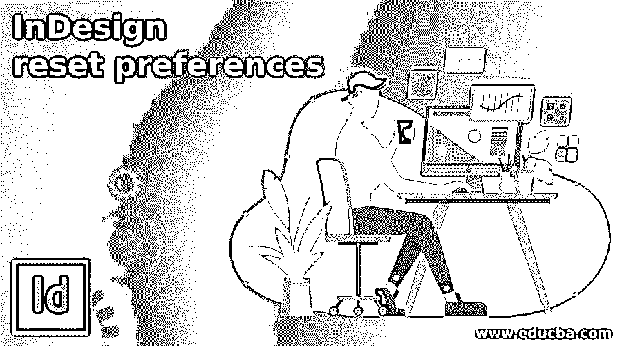

## InDesign 重置首选项介绍

InDesign Reset Preferences 帮助我们根据我们的要求在该软件中设置用户界面的不同参数，并且通过设置该软件的 Preferences 面板的不同选项的参数，我们可以根据我们的要求设置用户界面及其功能，使我们的工作顺利进行。InDesign 在菜单栏的“编辑”菜单下为我们提供了一个完整的首选项面板，其中包含许多选项，用于处理该软件用户界面的多种设置。一般来说，我们只改变这些选项的一些参数，而将 rest 选项保留为缺省值，因为这些缺省参数足以给出有效的结果。

### 如何在 InDesign 中重置首选项？

很多时候，我们需要根据我们的适用性重新设置首选参数，以便拥有该软件的工作环境。所以今天我要告诉你如何重置这个面板的一些参数。

<small>3D 动画、建模、仿真、游戏开发&其他</small>

这是这个软件的欢迎屏幕。

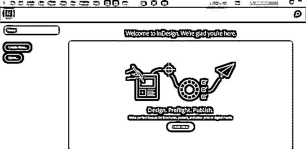

InDesign 用户界面的顶部有一个菜单栏。因此，我将单击“编辑”菜单，以获得它的下拉列表。在此列表的底部，我们有首选项选项，一旦我们转到此选项，我们会在面板中找到一个选项列表。您可以单击这里列出的任何选项，在工作屏幕上显示首选项面板，或者按键盘上的 Ctrl + K。

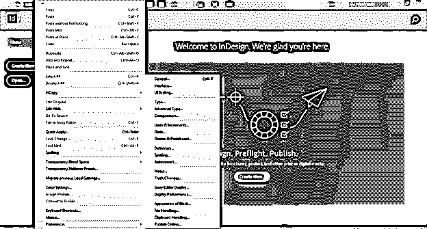

一旦我们点击任何选项，我们将有这个首选项面板。您可以看到在这个面板中有一个与 Preferences 下的 Edit 菜单中相同的列表。

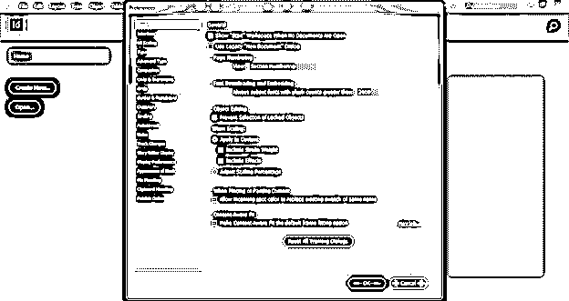

一般来说，我们不需要对 General 选项的参数和设置进行任何更改，所以我会让它保持原样。

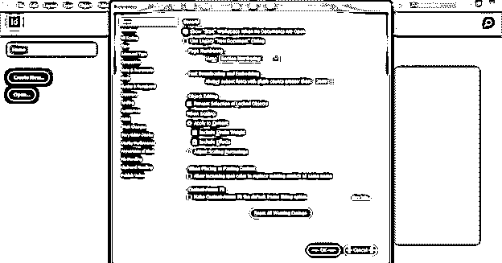

现在点击此选项进入界面设置和参数。在这个选项中，我们可以更改用户界面的主题，例如默认情况下，它是深灰色，我们可以更改它的其他三色主题。一旦我们点击任何主题，你会发现界面的颜色会自动改变。例如，如果我选择这个中等亮度的主题，那么我的用户界面的颜色就会变成这样。

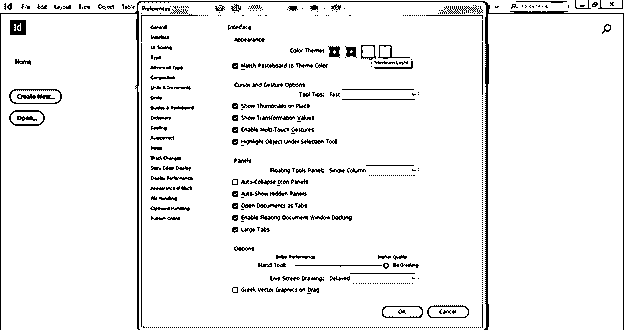

现在，为了解释该选项的其他设置，我将创建一个文档，为此，我将单击该软件欢迎屏幕上的“新建”按钮。

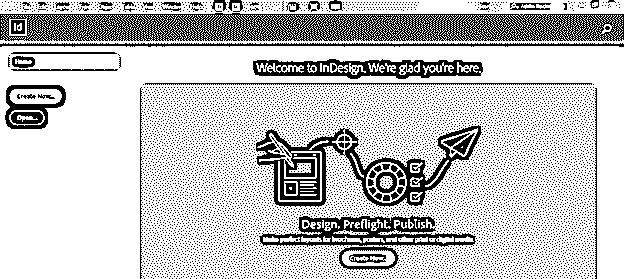

我将使用默认设置。

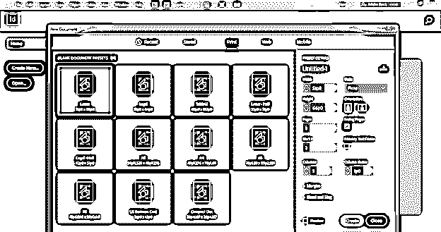

这是浮动工具面板的设置，下面有一些选项。如果我们选择“双栏”选项并点击“确定”按钮。

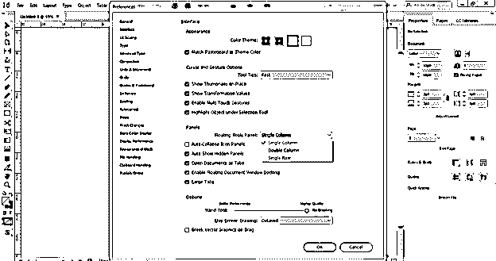

然后，您会注意到工具面板的整个工具排列在两列中。

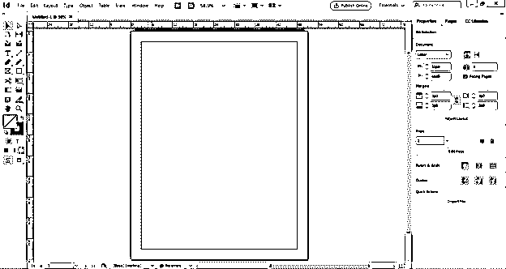

现在让我们看看如果我们从这个列表中选择单行选项会发生什么。

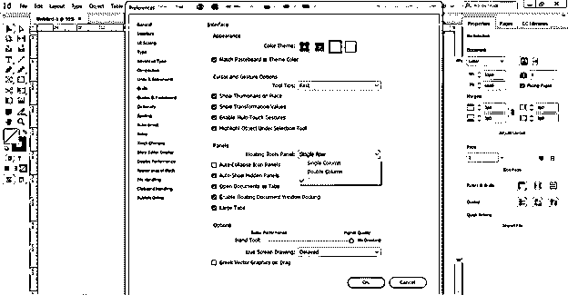

您可以看到工具面板在用户界面的顶部发生了移动。所以根据你的适合度，可以在用户界面设置。

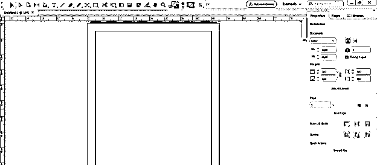

我想告诉你的下一个选项是单位和增量。我们根据项目要求设置单位。标尺单位中有一个原点选项，表示标尺刻度单位将从哪里开始。如果我们选择扩展，那么它将扩展到整个文档区域，但如果您的文档有两页，即左侧和右侧页面，那么您可以选择页面选项，这样您将在两侧分别有标尺。

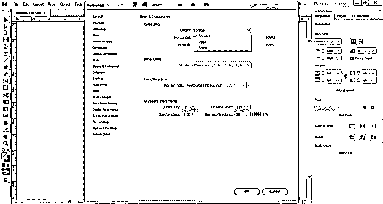

我们也可以在这里设置水平和垂直刻度的单位。

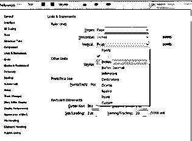

您可以选择笔画宽度的单位。我建议你使用笔画的点单位或者默认设置。这个选项中有更多的参数，您可以根据自己的需要进行更改。

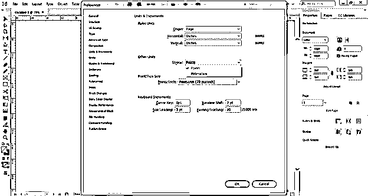

您还可以在此处更改文本上下文中的行距值，这意味着如果我们用快捷键更改行距值，那么它会因为更改值而增加多少点。在这里，你可以是 2 磅，这意味着当我们改变文本的领导，然后它会自动跳转 2 磅。

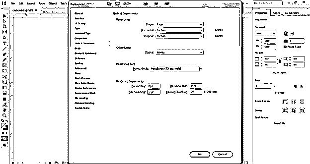

接下来是网格，我们使用它来正确对齐文本内容和图像。因此，这个选项中也有许多设置。

您可以更改网格线的颜色。

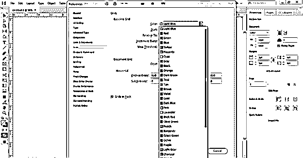

你可以选择网格从哪里开始，这意味着它将与页面顶部或文档页面的页边距顶部对齐。

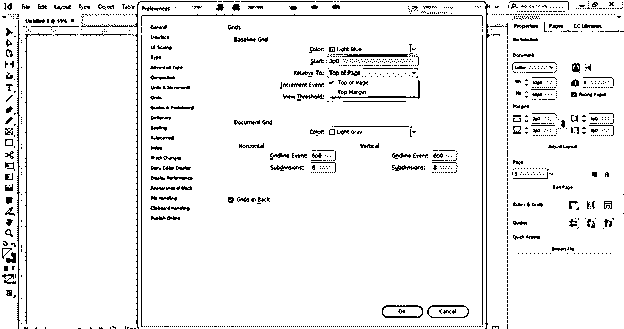

我们在这个软件中有两种类型的网格，所以我们可以在文档网格中进行更改，如颜色和其他参数。

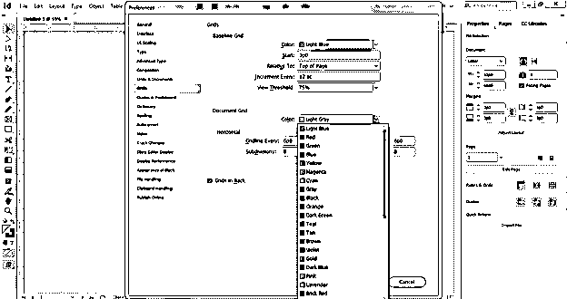

虽然我们在首选项面板中有许多选项，但我想告诉您的另一个选项是显示性能。这很重要，因为它可以调整我们从任何外部来源获取的光栅和矢量图像的显示设置。

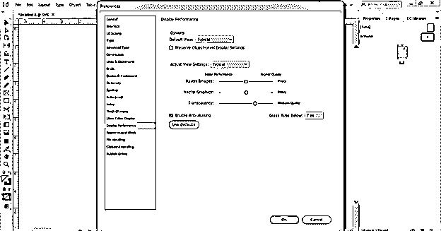

当我们将任何图像放入该软件时，默认情况下，我将以像素化质量显示，因为在该显示性能选项中，我们将默认视图设置为典型，但我们应该从该列表中选择高质量选项，以便当我们放置它时，它将显示图像的原始像素。

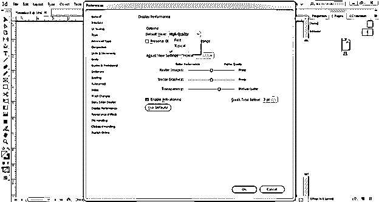

不仅是默认视图选项，我们还应该在调整视图设置选项中选择高质量，这样我们就可以在视图模式中看到原始图像质量。

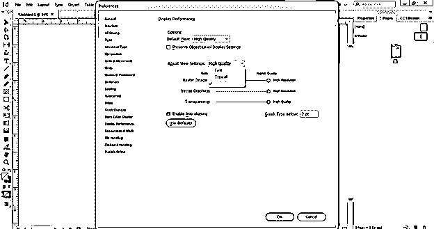

以上是关于如何在 InDesign 中重置首选项的一些重要信息，这完全取决于您要在首选项参数中进行哪种类型的更改。

**结论**

现在，在这篇文章之后，你可以用这个软件的用户界面的你想要的特性为你自己的工作空间做设置。我会建议你用默认设置来设置首选项面板的一些选项，因为它们都是非常需要的设置，可以给你想要的结果。

### 推荐文章

这是 InDesign 重置首选项的指南。在这里，我们将讨论如何使用该软件用户界面的所需功能来设置您自己的工作空间。您也可以看看以下文章，了解更多信息–

1.  [Indesign 版本](https://www.educba.com/indesign-version/)
2.  [什么是 Adobe InDesign](https://www.educba.com/what-is-adobe-indesign/)
3.  [Indesign 的替代方案](https://www.educba.com/alternative-to-indesign/)
4.  [InDesign 文档设置](https://www.educba.com/indesign-document-setup/)

