# InDesign 母版页

> 原文：<https://www.educba.com/indesign-master-pages/>

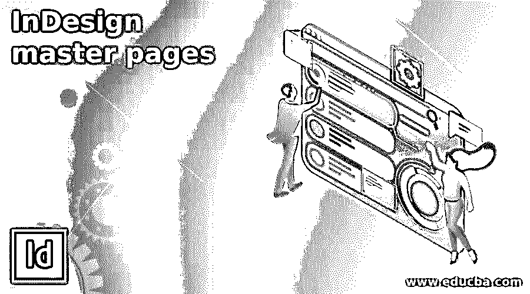

## InDesign 母版页介绍

InDesign 母版页可以被称为父页面，这意味着如果您希望在文档布局设计的每个页面上有某种类型的元素，那么您可以创建该元素或仅在母版页上粘贴该元素，它将应用于文档的所有选定页面。尽管我们使用母版页在所有页面上应用了我们想要的元素，但我们还可以做一些其他的事情来获得不同的变化。我们在母版页上使用的元素不能直接在文档的普通页面上编辑，但是有一些方法可以让我们只为特定页面编辑它们。因此，让我们分析母版页的所有可能方面，以便我们能够理解其工作方法。

### 如何在 InDesign 中创建和使用母版页？

默认情况下，该软件的页面面板上有一个母版页，我们可以使用它来创建母版元素，但如果您愿意，您可以根据设计布局的需要以及设计布局工作的适当组织来添加多个母版页。今天在这篇文章中，我将告诉您如何在 InDesign 中使用母版页并添加新的母版页。

<small>3D 动画、建模、仿真、游戏开发&其他</small>

首先，我将创建一个 Letter 大小的新文档页面，为此，我将从这个新文档对话框中选择 Letter 页面大小。

在该软件的用户屏幕右侧，我们有不同的面板，在这一部分，如果工作区处于排版模式，您会发现页面面板。

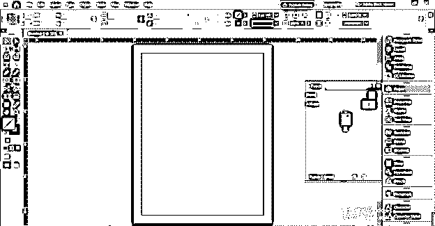

如果没有这样的面板，那么不要担心，只需进入窗口菜单，在它的向下滚动列表中，您可以找到页面选项，或者您可以按键盘的 F12 功能键，在您的软件用户屏幕上显示该面板。

让我们首先在文档中插入一些页面，单击页面面板右上角按钮，然后单击向下滚动列表中的插入页面选项。

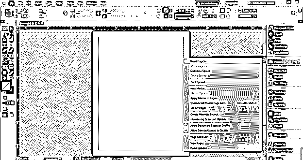

我会插入 10 页。

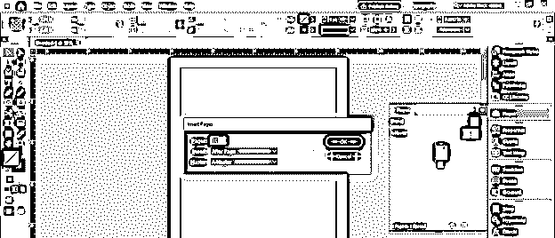

在此框中，您可以选择 A-Master 作为插入页面的母版页。我目前只有母版页 A，所以我会用它。

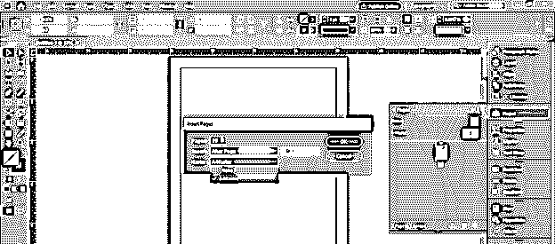

您可以看到所有插入的页面上都写有字母 A，这意味着所有页面都与母版页 A 链接。

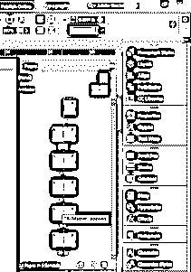

让我们在文档的任何一页都有一些内容。为此，我选择了 EDUCBA 徽标，并希望它出现在本文档的所有页面上。

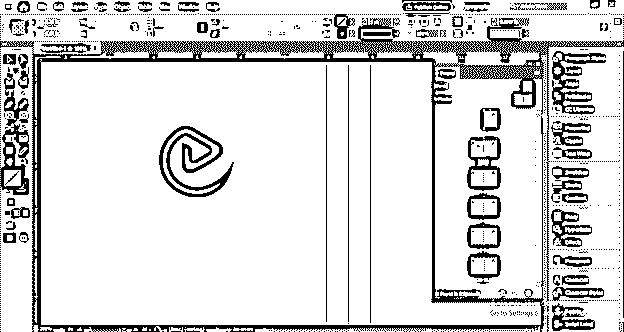

因此，要在所有页面上显示它，请转到页面面板，双击 A-Master 的页面来选择它。

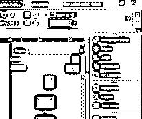

现在，我将把这个徽标粘贴到 A-Master 的左侧页面，您可以看到，当我把它粘贴到这里时，它会自动出现在其他页面上。

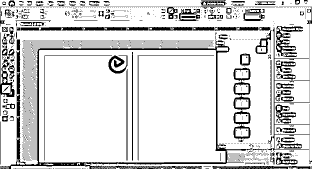

你可以看到它没有应用在第 1 页。所以让我告诉你一个原因。

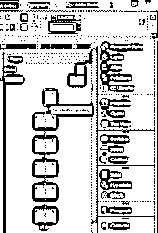

我将首先采取一个矩形工具。

并在母版页的右侧顶部创建一个矩形。现在你可以看到它也在第 1 页上。所以你应该记住你想在页面的哪一面使用你想要的元素。

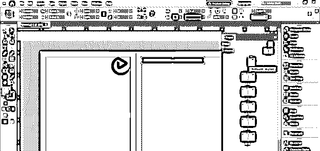

现在我在第 2 页，想对这个标志做一些修改，但你可以看到我无法选择它，因为它是母版页的一个元素，只能从母版页编辑。

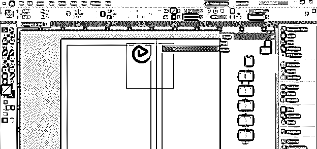

但是有一个快捷键，通过它我们可以只为选中的页面修改这个元素。快捷方式是，按住键盘上的 Ctrl + Shift 键，然后单击所选页面的母版页的某个元素。一旦你点击，你将有一个围绕你的对象的变换框，现在它是可编辑的。

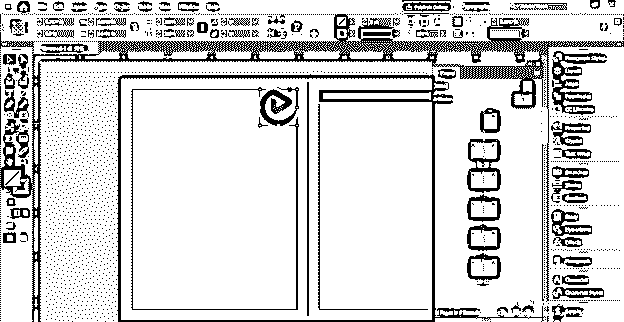

如果我水平翻转它。

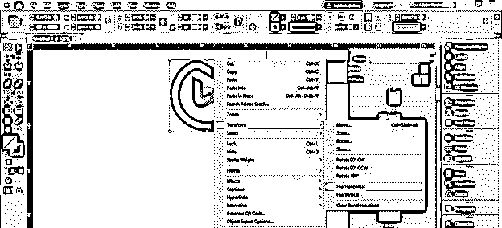

然后，您可以看到此更改应用于当前页面，而不是所有包含母版页元素的页面。

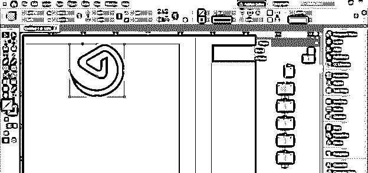

如果您对您的编辑不满意，并希望使它再次成为母版页元素，那么只需从母版页层中选择具有此元素的母版页，并借助鼠标按钮将其拖放到此页面上。

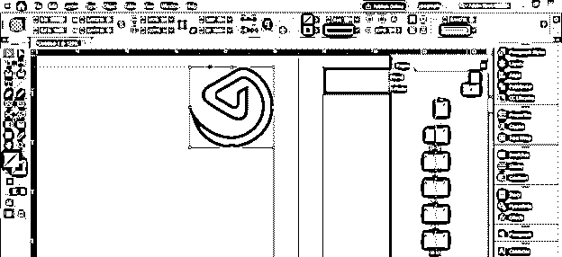

并且它将再次成为母版页元素。您还可以通过一次单击和单击页面面板右上角的按钮来检索主元素的所有更改。转到此列表的“母版页”选项，并选择“删除选定的本地覆盖”

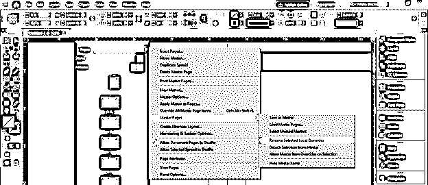

所有编辑都将从正常页面中删除。

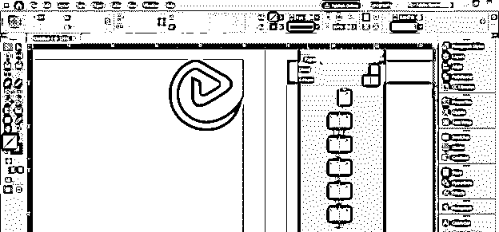

不仅只有一个母版页，还可以有多个母版页。要获得更多母版页，请单击页面面板右上角的按钮，并从列表中选择“新母版”选项。

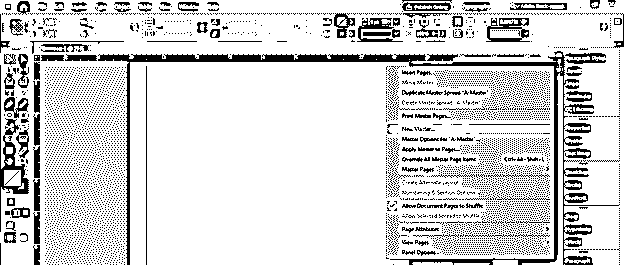

一旦你点击它，一个新的母版页对话框就会出现。在这里你可以根据你给它命名，设置它的大小等等。这次我将使用这个对话框的默认设置。

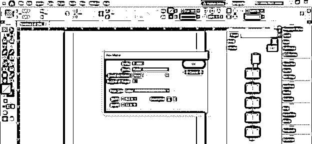

在母版页部分，我们有一个新的母版页，名为 B-Master。我将在它上面创建一个圆，但是你可以看到它被应用在文档的页面上。

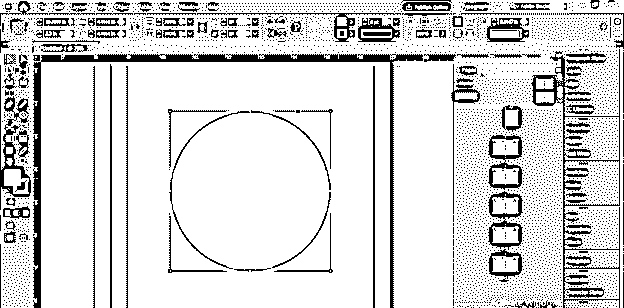

要应用此元素，您必须使用 B-Master 链接页面。选择你想与 B-Master 链接页面，点击右键，然后选择“将母版应用于页面”选项。

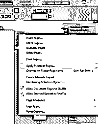

“应用母版”对话框将打开，并显示所选页面的数量。

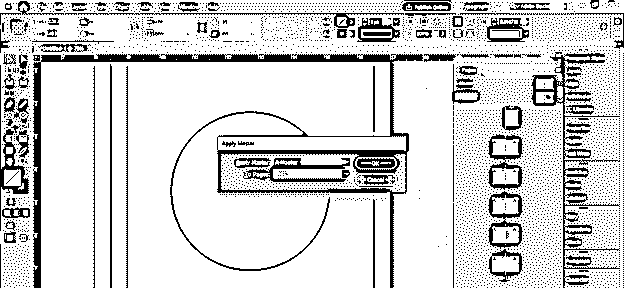

从应用主列表中选择 B-Master 选项，然后单击确定按钮。

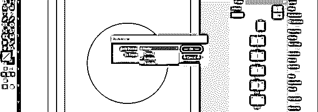

现在这个元素将出现在我们选择的页面上。

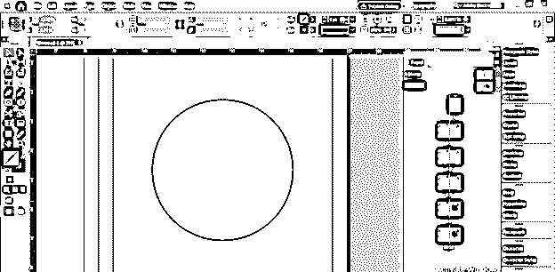

### 结论

通过这种方式，您可以创建多个母版页，并将它们分配给文档的不同页面，以便很好地组织您设计的布局中的几个元素。您可以探索母版页部分的其他参数，以便对其有更多的了解和更多的控制。

### 推荐文章

这是 InDesign 母版页指南。在这里，我们将一步一步地详细讨论如何在 InDesign 中创建和使用母版页。您也可以看看以下文章，了解更多信息–

1.  [Indesign 版本](https://www.educba.com/indesign-version/)
2.  [什么是 Adobe InDesign](https://www.educba.com/what-is-adobe-indesign/)
3.  [InDesign 文档设置](https://www.educba.com/indesign-document-setup/)
4.  [喷墨替代](https://www.educba.com/inkscape-alternative/)

