# InDesign 版面

> 原文：<https://www.educba.com/indesign-layout/>

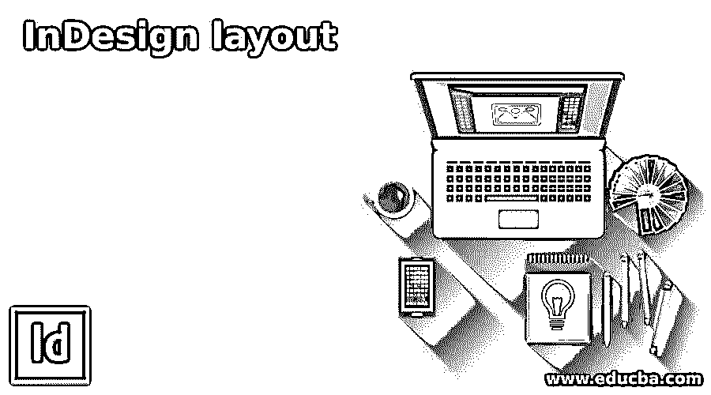

## InDesign 版面简介

InDesign Layout 是该软件的基础，这意味着我们可以为该软件中的任何设计创建布局。布局可能包含不同类型的设计元素以及文本内容。我们以一种有效且有意义的方式安排所有的文本内容和设计元素，来表达这些内容的目的，我们通过创建一个布局来做到这一点。布局取决于他们在 InDesign 中使用的平台。所以有很多东西都包含了这个软件的这个特性，我会告诉你它最重要的方面。

### 版面在 InDesign 中如何工作？

有一个好的设计是非常必要的，以创建一个布局来表达客户给定内容的主要目的。所以你先分析一下它的内容和目的。

<small>3D 动画、建模、仿真、游戏开发&其他</small>

现在我先告诉你如何选择版式设计的文档类型。一旦我们单击该软件欢迎屏幕的“新建”按钮，我们将看到这个新文档对话框。在此对话框中，我们预设了不同平台的文档尺寸。

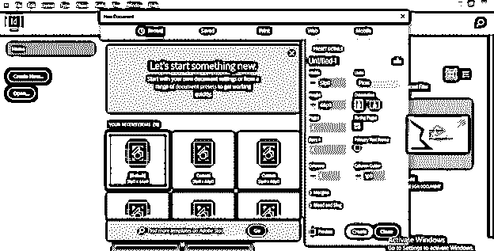

例如，如果我们从事任何与印刷媒体相关的项目，我们就会使用印刷媒体。

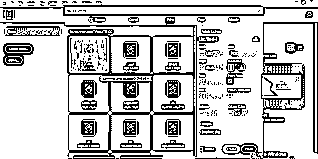

如果我们使用印刷媒体，那么我们必须设置对齐和出血区域，这样当文档进行印刷时，就不会剪切页面边缘的主要设计或文本内容。如果我们为印刷媒体设计版面，我们必须记住更多事情。

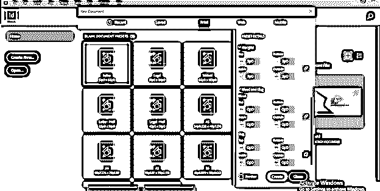

第二个预设是 web，这意味着如果你要为 Web 平台设计任何东西，那么我们必须使用 web size doucment。

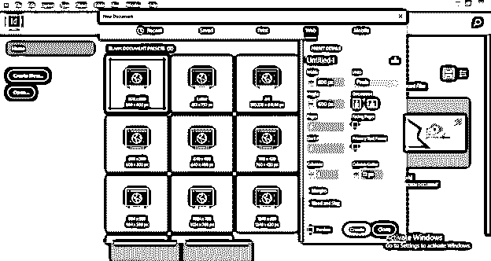

这次我们不用担心出血和渣区。

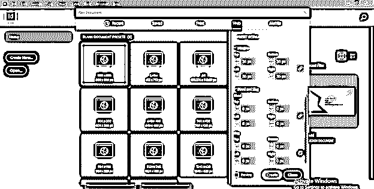

在开始设计布局之前，我们应该选择单位，以便我们可以根据项目要求工作。

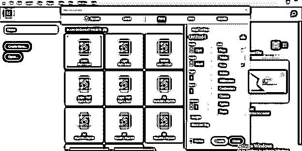

这一次，我将使用预设的打印文档的信纸大小，并将该文档的方向设为横向。

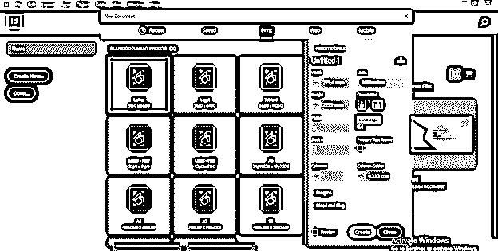

如果您的设计中有页数，那么您可以从这里选择页数。我的设计只有一页，因为这只是对这个主题的概述。

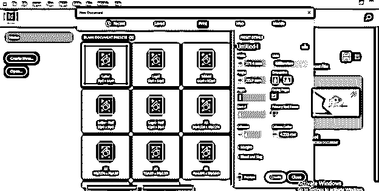

现在我将从工具面板中选择文字工具，画一个像这样的文本框，因为我想先在这里添加一个文本内容。

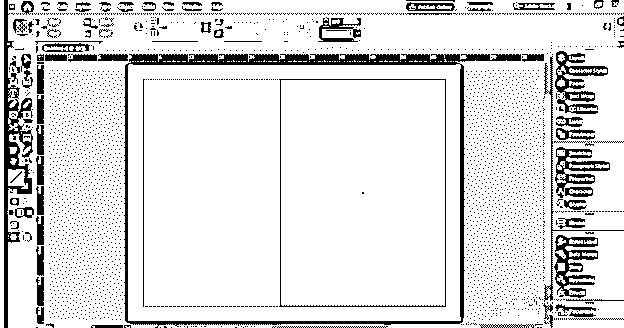

我把这个内容贴在这里了。现在，我们首先要做的是对文本内容进行格式化。

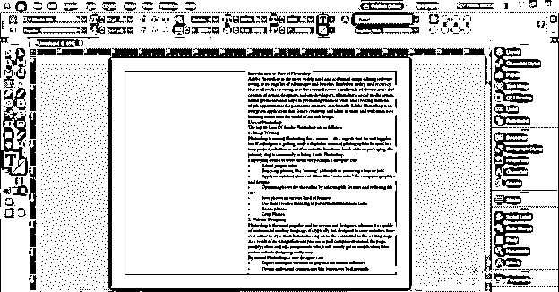

现在我将在这里为我的文本内容选择这种好的字体。

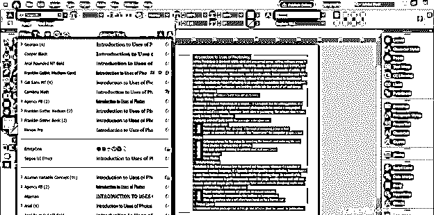

我还对这篇文章的标题和正文做了一些改动。在你的设计布局中设置文本内容完全取决于你对给定内容的创造性。

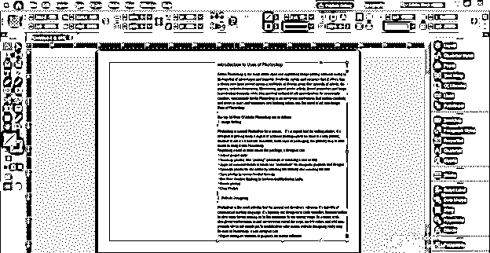

在这里我想告诉你一些关于 Photoshop 的知识和使用方法。所以我接下来要用一张图片来表达一些关于 Photoshop 的东西。为了有一个图像，我会去文件菜单，并点击它。在它的下拉列表中，我将单击放置选项，或者您可以按 Ctrl + D 作为快捷键。

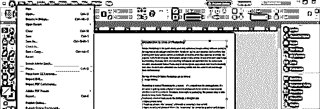

为此我会选择这个美丽的形象。我从 unsplash.com 下载了这张图片。你可以为此拍摄自己的图像。

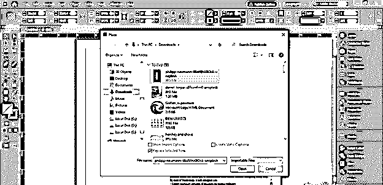

像这样摆放这张图片。我们可以根据自己的选择在 Photoshop 中给这张图片添加一些效果和其他变化，但这次我会保持原样。

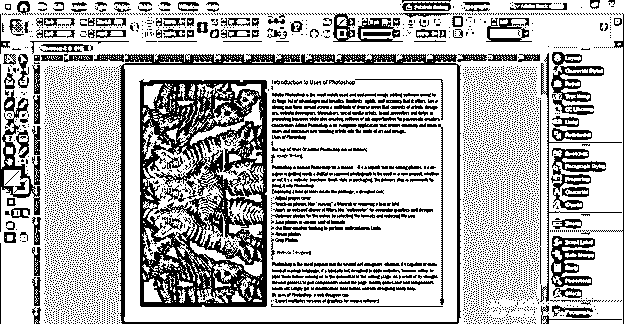

现在，我将再次使用文字工具，将 P 作为一个文本输入到这个文本框架中。

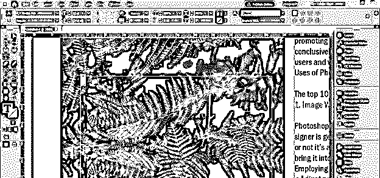

我将在工具面板的填充颜色中选择文本颜色框。

并将文本颜色改为这种绿色。

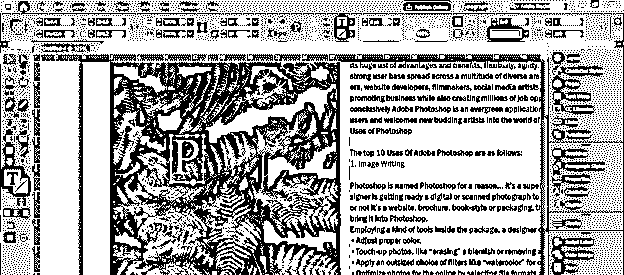

现在按住键盘的 Ctrl + Alt 键，我将像这样增加字母 P 的大小。这个字母 P 是在说明 Photoshop 在这个版面设计中的重要性。

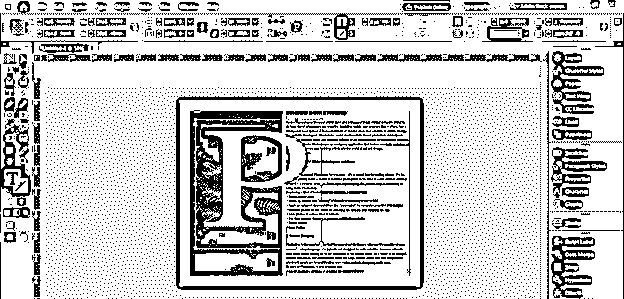

现在选择了这个文本，我将进入菜单栏的类型菜单并点击它。在这里，从它的下拉列表中，我将选择创建轮廓选项，或者您可以按 Ctrl + Shift + O 快速访问该选项。

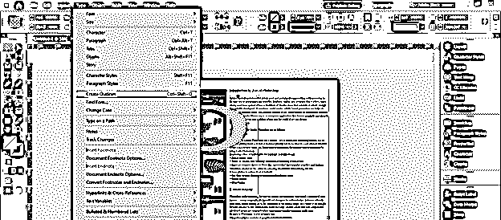

一旦我们点击这个选项，它会将文本转换成形状。

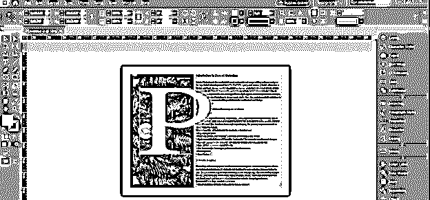

我将在这封信的文本内容旁边创建一个路径。

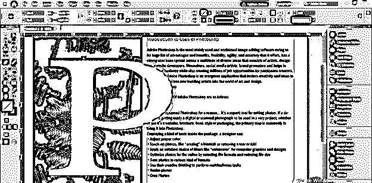

现在从工具面板中选择工具，选择文本内容和路径。

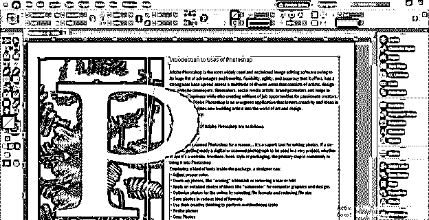

现在我将打开文本扭曲面板，你可以在窗口菜单的下拉列表中找到它，点击这个面板的“围绕物体形状扭曲”选项。

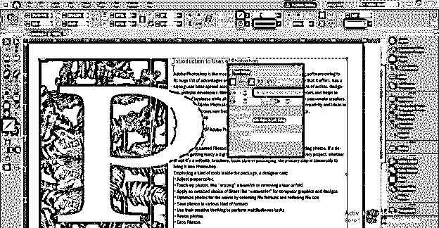

现在文本会像这样绕过这条路径。

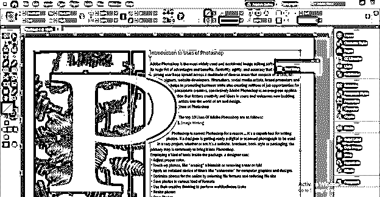

我将选择这条路径，并添加一些偏移距离，以便我们有这个字母 P 和文本内容之间的良好差距。

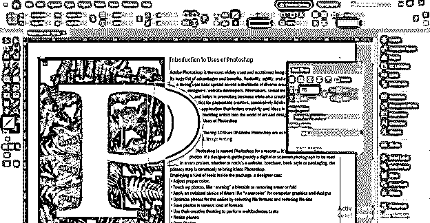

现在，我将打开色板面板，选择它的纸层来改变这个文档页面的颜色。有一件事我想告诉你，我要添加到这个文档页面的背景颜色只是为了美观，如果我们保存它，它不会和我们的文档一起保存。文档页面有另一种背景颜色。你也可以看看我的这篇文章。

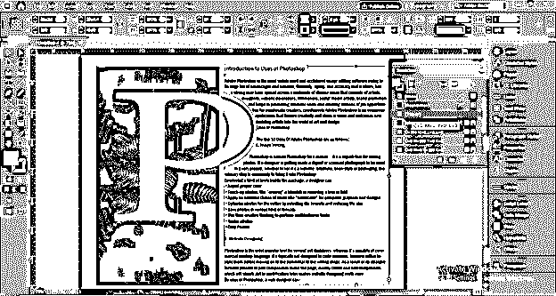

我将设置 CMYK 颜色的值，用这种黄色和绿色来创建文档的背景色。

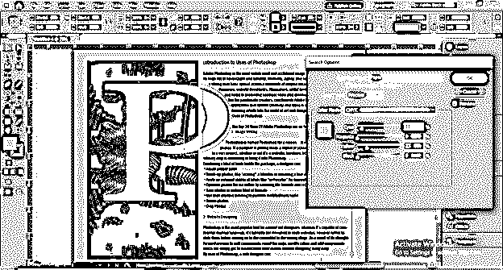

现在，如果我们通过按键盘的 W 按钮切换到预览模式，你可以看到这是一个很好的布局设计。

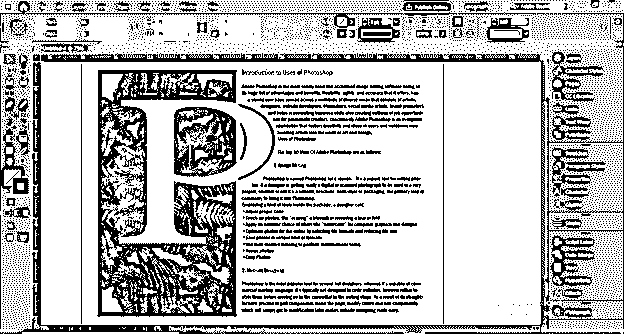

### 结论

在这篇文章中，我只是给了你一个概述，告诉你如何在你布局设计中加入不同的元素以获得有效的效果。你也可以从其他图形设计软件，如 Photoshop，Illustrator 等，获取不同的设计元素，为你的设计创造良好的构图。

### 推荐文章

这是 InDesign 布局指南。在这里，我们讨论如何在你的布局设计中加入不同的元素，以获得有效的效果。您也可以看看以下文章，了解更多信息–

1.  [Indesign 版本](https://www.educba.com/indesign-version/)
2.  [什么是 Adobe InDesign](https://www.educba.com/what-is-adobe-indesign/)
3.  [Indesign 的替代方案](https://www.educba.com/alternative-to-indesign/)
4.  [InDesign CS6](https://www.educba.com/indesign-cs6-top-ten-new-features/)

