# InDesign 文件夹模板

> 原文：<https://www.educba.com/indesign-portfolio-template/>

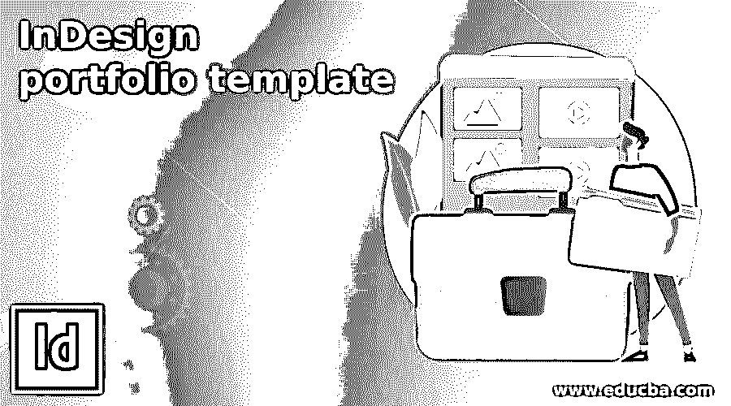

## InDesign 文件夹模板简介

InDesign Portfolio Template 可以理解为设计包含所有重要细节的作品集布局，这些细节提供了为该作品集设计的特定专业人士的所有信息。在该软件中，我们为设计作品集模板使用了许多元素，这些元素包括该作品集所属的专业人员所做的不同类型工作的图像、提供工作细节以便正确理解该工作的文本内容。在这个软件中，我将告诉你一些基本的技术，通过这些技术，我们可以用自己的想法创建自己的投资组合模板。

### 如何在 InDesign 中创建作品集模板？

为了设计一个投资组合模板，我们必须了解该投资组合将为之工作的专业人士，根据这一点，我们应该包括设计元素以及文本内容。在这里，我将创建一个图形设计的投资组合布局设计。投资组合不一定只属于任何人，它也可以为任何公司创建，用于广告等目的。

<small>3D 动画、建模、仿真、游戏开发&其他</small>

这里，我将从该软件的“新建文档”对话框中取出一个 A4 大小的 Web 部分文档。

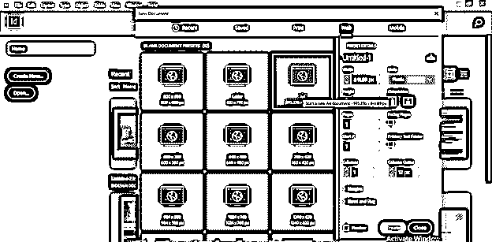

我将采取横向创建这个布局。

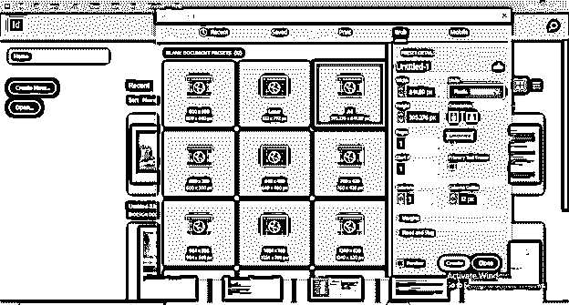

我现在要 5 页，但是你可以根据你想要在你的文件夹中展示多少细节和你的作品来决定你的文件的页码。

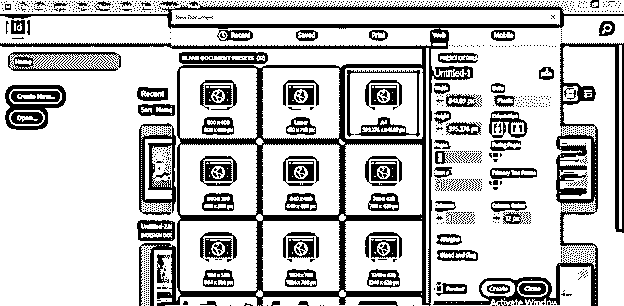

我将启用此对话框的对页选项，因为我想在此文件夹中并排放置页面。

现在我们将拥有这种类型的文档页面。第一页将是我们作品集的封面。所以让我们先设计一下。

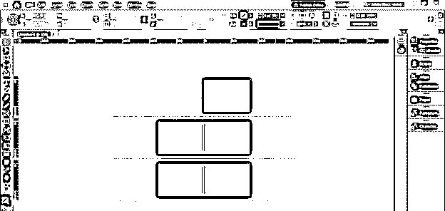

我将把它分成两个部分，为此，我将从这个软件的用户屏幕的垂直标尺上拖动一条指导线。你可以在展示窗口的左边找到这把尺子。拖动指引线后，您可以将其放在页面上的任何位置。

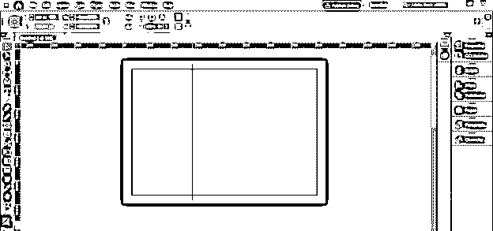

之后，我将转到位于使用屏幕右侧的属性面板。

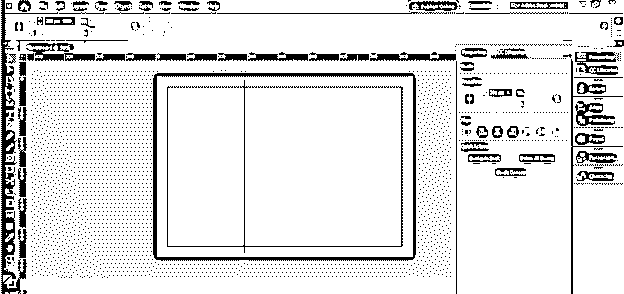

您也可以在“窗口”菜单的下拉列表中找到此面板。

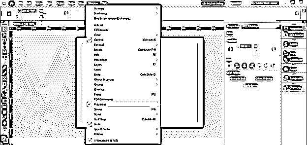

在这里，我将在变换选项的 x 距离中输入值 300 px，它会将我的引导线放置在 300 px。

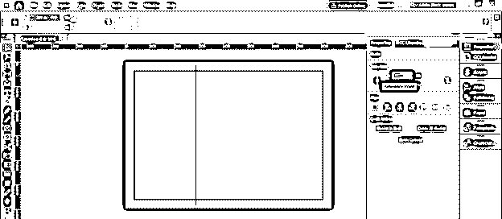

现在在这一页的右侧部分，我将创建一个矩形，并选择这种颜色作为它的填充颜色。

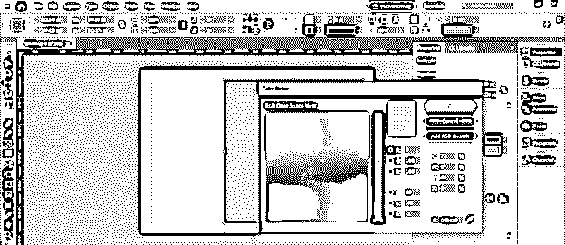

之后，我会用文字工具画一个文本框，然后输入作品集的标题。例如，我正在为一个图形设计师创建这个作品集，所以我将它命名为图形设计师作品集。

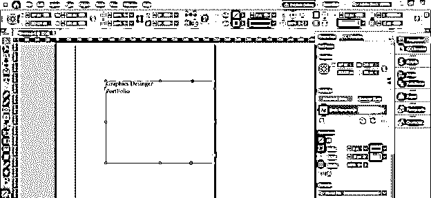

现在我将做一些格式化，以便它将创建一个有效的外观。您还可以在封面上添加一些其他设计元素。例如，我将创建一些形状在这一页的左侧，使其具有吸引力。您也可以在此添加您专业领域的详细信息。

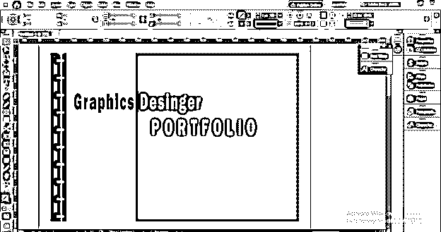

一旦你对你的封面设计感到满意，跳转到其他页面。我将只设计一页供您参考，这样您就可以知道我们应该在接下来的页面中添加什么内容。我将把这个页面分成四个部分，就像我们在前面的使用指南中所划分的那样。

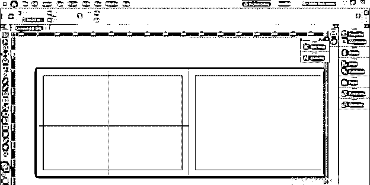

现在我将使用框架工具创建两个这样的框架。我创造了这两个框架来放置我创作的作品图片。你应该把表达你的工作和创造技能的图片展示给观众。

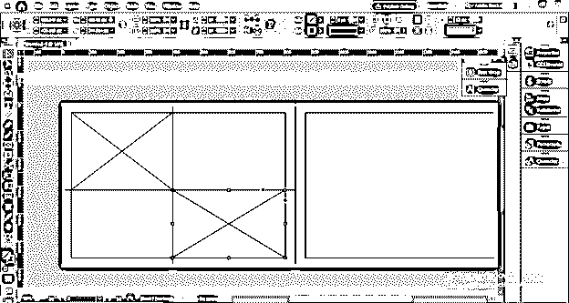

为了将图像放入第一帧，我将进入文件菜单并点击它。从下拉列表中选择放置选项，或者按 Ctrl + D 作为快捷命令。

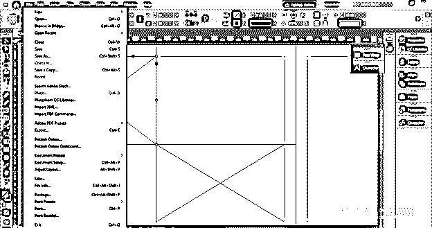

现在我要去我保存作品的地方，选择一件我想放入这个作品集的作品。

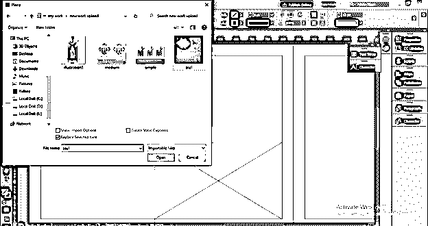

现在它将进入选定的框架，我将把它放入这个框架。为此，我将右键单击它并转到“调整”选项，然后从新的下拉列表中选择“调整内容以适合框架”选项。

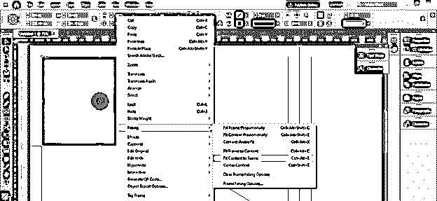

所以这样我放了两张我的作品，一张是广告海报，另一张是插图海报。

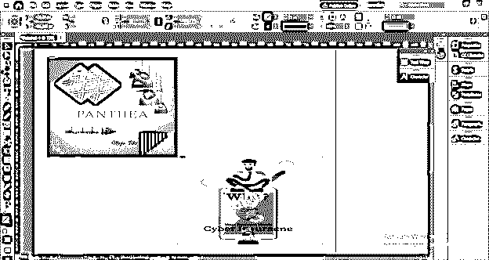

我将创建这个页面的背景，为此，我将创建一个这样大小的矩形，并在其上设置渐变。

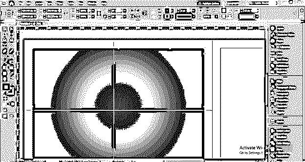

现在，我将在选择此背景矩形后单击右键，转到向下滚动列表的“排列”选项，然后单击新向下滚动列表的“置于底层”选项，或者您可以按键盘的 Ctrl + Shift + [按钮。

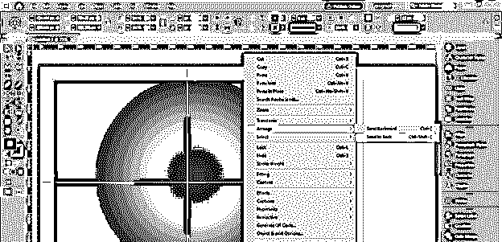

现在，我将从用户屏幕顶部的不透明度选项中将这个矩形的不透明度值降低到 40%。

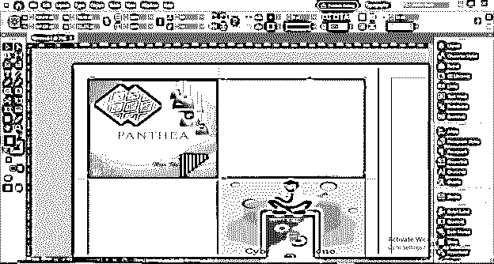

现在，我将在这里添加与此图像相关的项目名称。如果你没有做过任何项目，那么你可以简单地添加你的作品类型，与放置的图像相关。

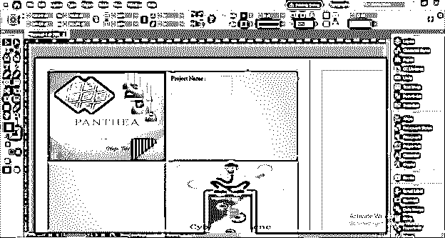

现在，我将为这段文字选择一个好的字体样式，并将它的颜色改为深蓝色。

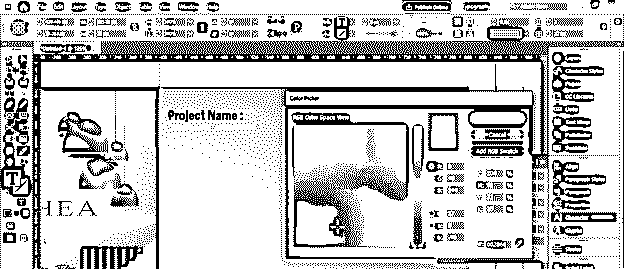

然后我会添加项目的名称，并改变其颜色为白色。

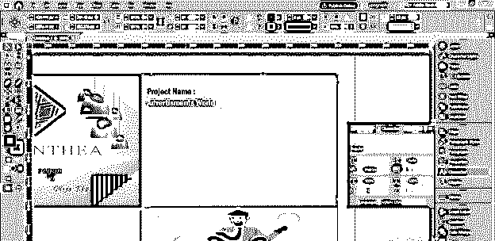

现在我们应该给出一个关于我们在这个分离的文本框架中的位置的图像的工作的解释。

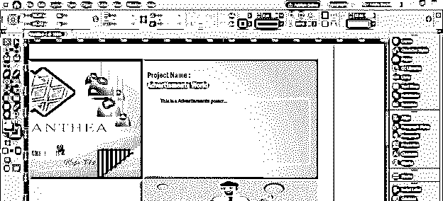

同样，我们可以提供其他放置工作的细节，您可以在整个投资组合中遵循一个布局模式设计。

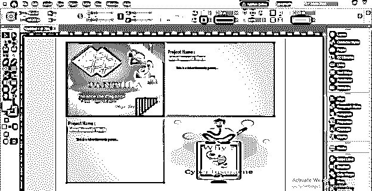

### 结论

在这里，我只是给你一个想法，关于你如何使用这个软件的元素和功能来创建一个投资组合模板，并把你的工作附加到它上面。创建作品集完全取决于你如何创造性地向他人展示你的作品，以便给他们留下好的影响。

### 推荐文章

这是 InDesign 文件夹模板指南。在这里，我们讨论如何使用该软件的元素和功能来创建投资组合模板。您也可以看看以下文章，了解更多信息–

1.  [InDesign 网格](https://www.educba.com/indesign-grid/)
2.  [Indesign 的替代方案](https://www.educba.com/alternative-to-indesign/)
3.  [InDesign 快捷键](https://www.educba.com/indesign-shortcuts/)
4.  [InDesign CS6](https://www.educba.com/indesign-cs6-top-ten-new-features/)

