# InDesign 发票模板

> 原文：<https://www.educba.com/indesign-invoice-template/>

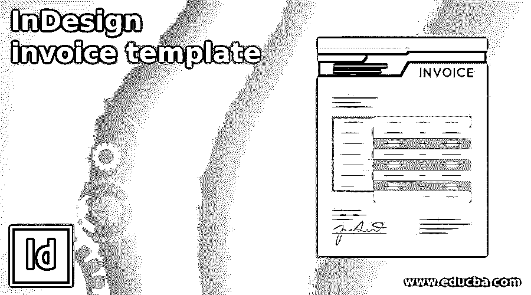

## 设计发票模板简介

InDesign 发票模板可以理解为通过使用不同的设计元素以及该软件的类型设置，在该软件中设计发票模板。不仅是这个软件的元素，我们还可以使用其他软件的外部设计元素来创建发票模板。一般来说，在发票模板中，我们有一些东西，如公司名称和标志，材料细节，数量，价格，等等。因此，我们可以漂亮地排列这些包含在这个软件中的文本，因为它为我们提供了不同的文本格式特征以及设计元素。发票模板的布局完全取决于客户端需要什么类型的内容。所以让我们来看看这个话题的基础。

### 如何在 InDesign 中创建发票模板？

你可以自由地运用你自己的创造力来设计一个好的发票模板的布局，但是在模板的布局设计中有一些要点是必须提及的。让我给你解释一下这些是什么。

<small>3D 动画、建模、仿真、游戏开发&其他</small>

为了创建发票模板，我们通常采用 A4 尺寸的文档。因此，我将转到“新建文档”对话框的“打印”选项卡&选择文档的 A4 尺寸。

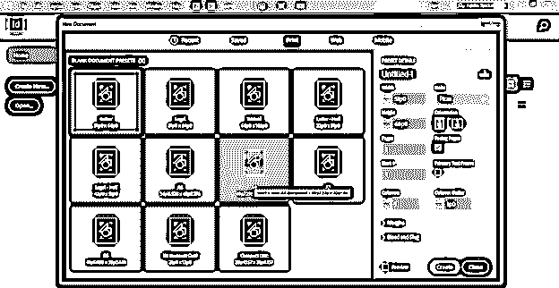

我们将使用英寸，因此我将选择此对话框的“英寸单位”选项。

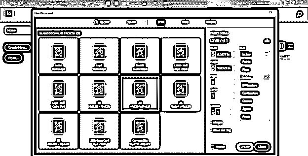

我还将为文档页面的所有边添加 0.5 英寸的边距，然后单击该对话框的“创建”按钮。

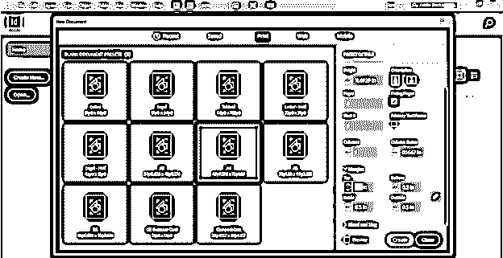

我们应该在发票中添加的第一件事是公司名称或徽标空间。你可以选择一个合适的地方作为公司名称或标志。我将把它添加到文档页面的右上角。我将首先使用工具面板的矩形工具在这里创建一个矩形。

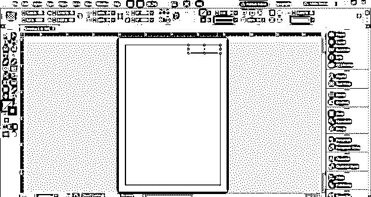

并将这个绿色阴影添加到矩形。

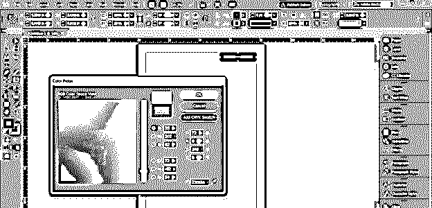

现在，我想将这个形状的一个角变圆，因此我将转到位于工作屏幕右侧的属性栏，这里我们有角选项，因此我将单击它。

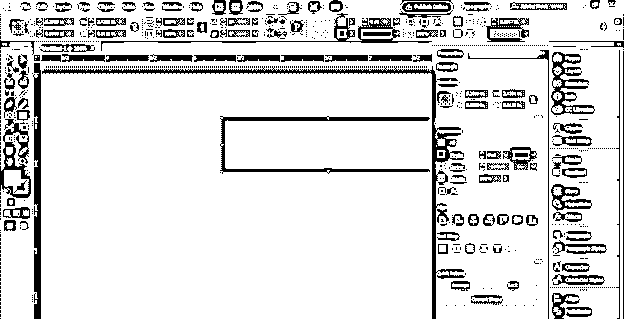

如果没有属性面板，那么你可以转到菜单栏的窗口菜单，在它的下拉列表中找到它。

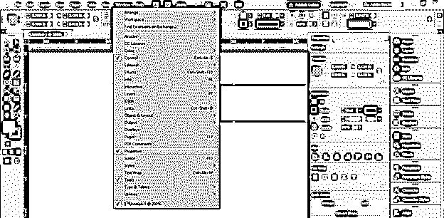

现在我将从这个形状的按钮左角列表中选择圆角选项。

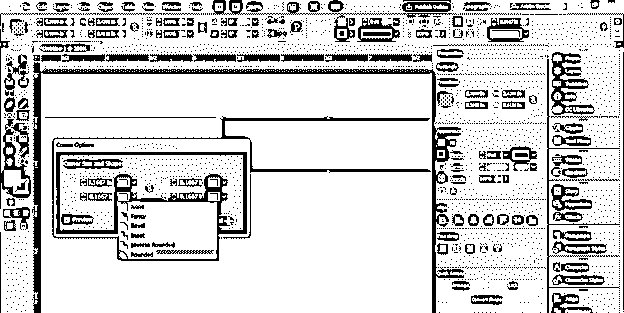

在这里，我将从工具面板中选择文字工具，输入公司名称的文本。我们可以在这里输入公司的名称。

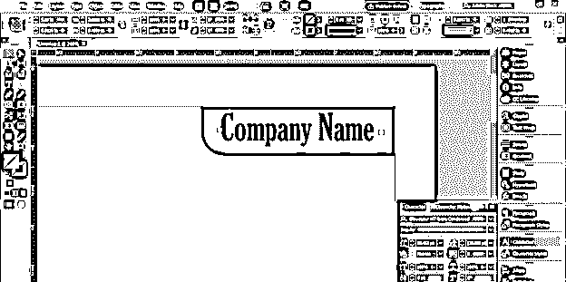

我将点击文本颜色框，并将其颜色改为白色，以便在文本和背景之间形成良好的对比。你可以用你自己的想法来达到这个目的。

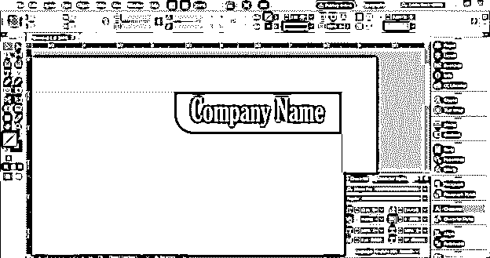

现在我将在这里创建一个矩形来提及一些细节，并把它的颜色设置为黄色。然后我用打字工具在这里打出了这段文字。这是发票的日期。

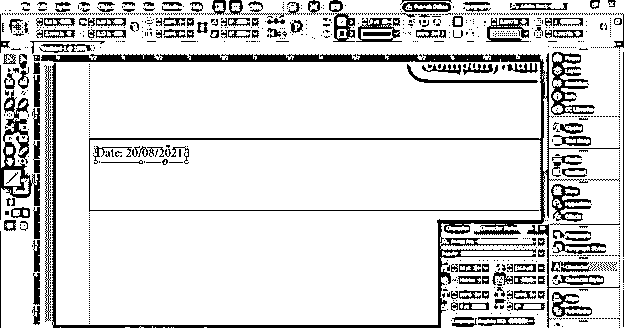

我将把这段文字的颜色改成这种蓝色。如果客户端需要，您也可以选择黑色。

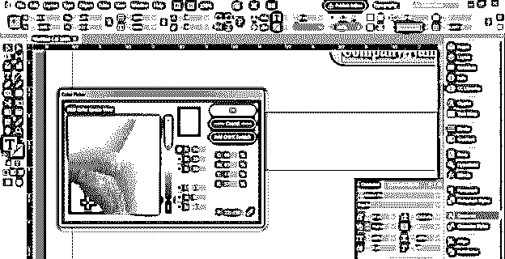

现在，我将选择日期文本，并通过按住键盘的 Alt 键使用选择工具拖动它，然后复制它。在复制的文本中，我将添加发票号码的详细信息。如果您遇到背景矩形的问题，并且不想在处理文本时移动它。

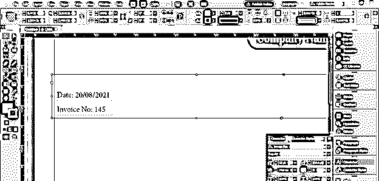

你可以锁定它，选择你想要锁定的对象，进入对象菜单，选择锁定选项，或者你可以按 Ctrl + L 作为快捷键。

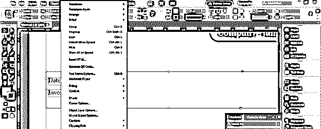

现在，我将把发票号放在这个矩形的右侧，为了正确对齐两个文本，选择两个文本并按住 shift 键。我将再次单击发票文本，因为我想将其他文本与发票文本对齐。

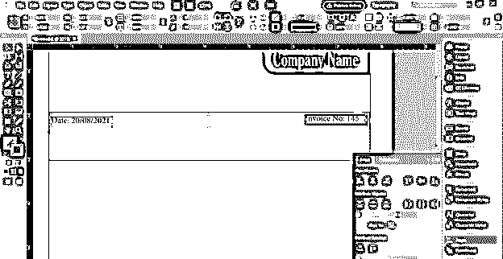

并单击对齐面板底部的对齐按钮。

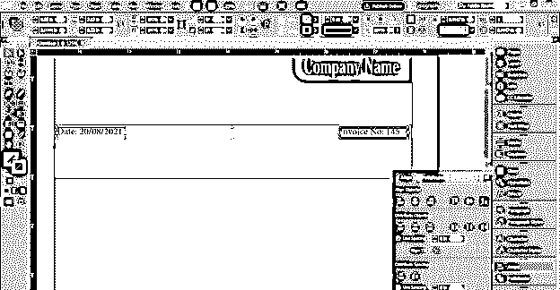

您可以在此添加客户提供的其他文本详细信息。

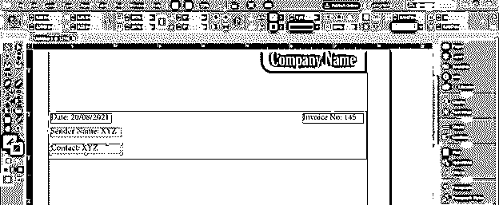

您可以通过同一个对齐面板平均分布此文本。所以选择它们，然后点击这个面板的分布垂直中心选项。

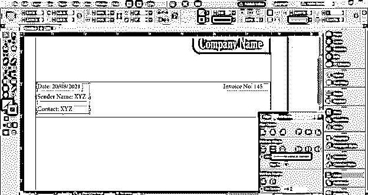

你也可以添加一些设计元素，比如我将在这里添加这两行。

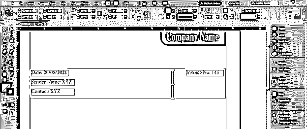

你可以在这里改变笔画的风格，比如我会把它改成细-粗。

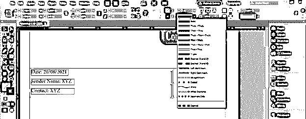

把这条线的颜色改成白色。

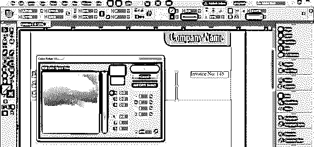

我们应该在这里添加与该发票相关的地址。因此，我将在此处添加“账单”文本。

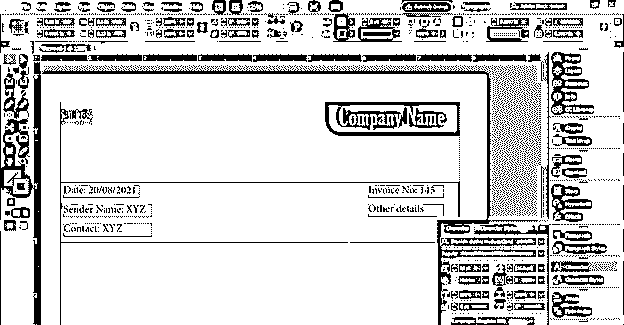

您还可以在此处添加一个文本框，其中将包含相关公司的详细信息。

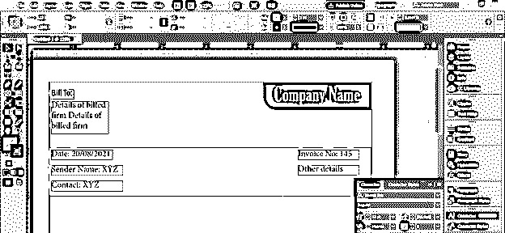

现在下一步是为发票中的材料细节创建一个表。所以我将从工具面板中选择线条工具来创建这种类型的表格。我已经将第一行的笔画宽度增加了 2 磅。垂直线宽度为 1 磅。你可以按照你的想法去创造。

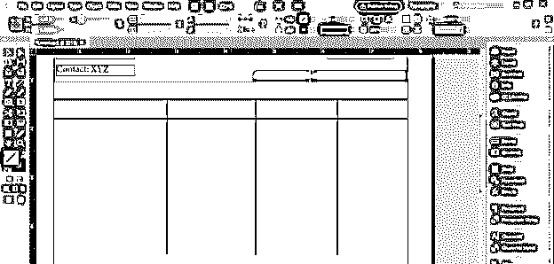

在表格的第一行，我将添加表格的标题，如材料的详细信息、数量、价格和金额。我将为这些标题使用粗体字体。

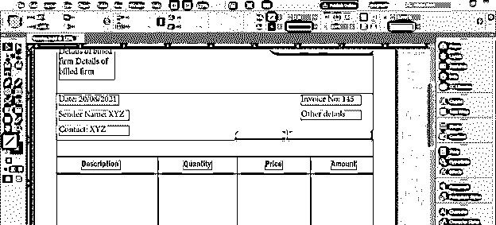

在下一行中，我们可以像这样添加购买物品的详细信息。您可以根据给定的详细信息在此添加一些条目。

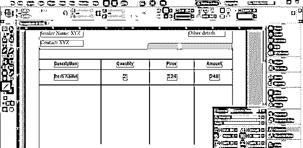

在表的末尾，我们应该添加其他细节，如小计、总计等。

并且在发票的末尾，应该有被授权人的签名。

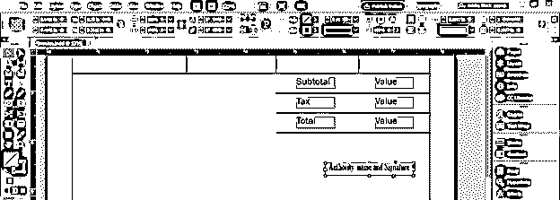

这样你就可以为你的客户创建一个发票模板。

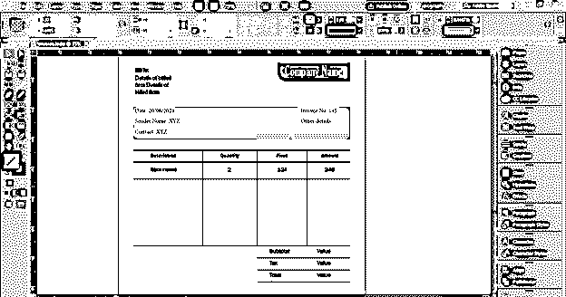

### 结论–InDesign 发票模板

在这里，我已经给了你这个发票的基本功能的想法，涉及在这个软件的发票模板的布局设计。现在，在了解了这个主题的基础知识后，你可以根据自己的想法，创建任何公司的专业发票模板。

### 推荐文章

这是 InDesign 发票模板指南。这里我们讨论该发票的基本特征，涉及该软件中发票模板的布局设计。您也可以看看以下文章，了解更多信息–

1.  [InDesign 网格](https://www.educba.com/indesign-grid/)
2.  [Indesign 的替代方案](https://www.educba.com/alternative-to-indesign/)
3.  [InDesign gap 工具](https://www.educba.com/indesign-gap-tool/)
4.  [InDesign 段落样式](https://www.educba.com/indesign-paragraph-styles/)

