# InDesign 字数

> 原文：<https://www.educba.com/indesign-word-count/>

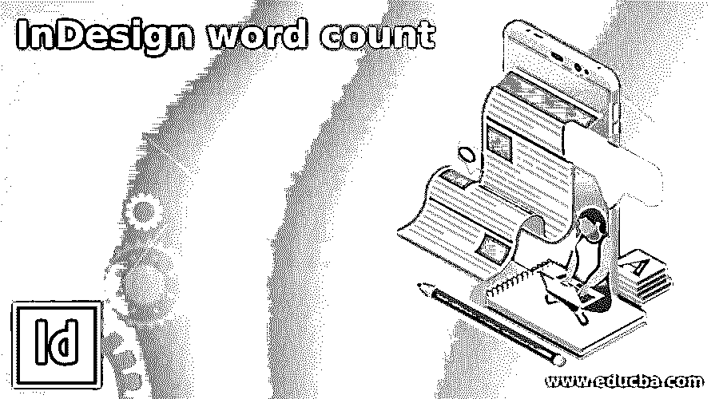

## InDesign 字数介绍

InDesign Word Count 是用于不同目的的文档字数统计，因为很多时候我们有客户的严格指导，在本软件设计的布局中，我们的文本内容的字数有限。例如，如果我们正在创建任何需要有限的文本内容来解释其细节的拉床，那么我们必须限制字数，在这个软件中，我们可以很容易地计算文本内容的字数，并据此增加或减少文本主要内容中的单词。所以在这里，我会告诉你如何做到这一点。

### 如何在 InDesign 中进行字数统计？

字数统计对于了解我们的文档或特定段落或选定文本内容中有多少单词是必要的，您可以通过几个简单的步骤来了解它。

<small>3D 动画、建模、仿真、游戏开发&其他</small>

首先，我将创建一个新的文件，我将有我的文本内容，为此，我将点击该软件的欢迎屏幕的创建新按钮。

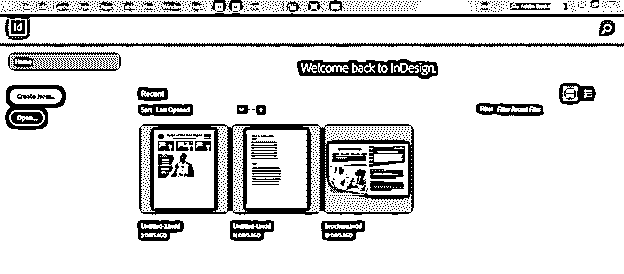

我将转到这个新文档对话框的打印选项卡，并选择文档页面的信纸大小。

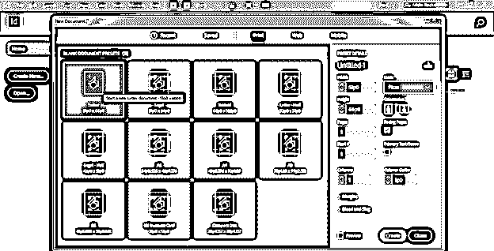

我将在此对话框的单位选项中选择英寸单位，并保留其他设置，然后单击此对话框的创建按钮。

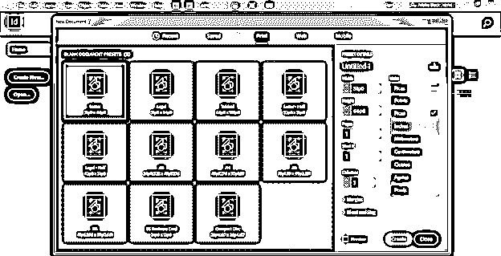

如果需要，您可以在以前保存的任何 InDesign 文档中了解这一点。因此，你可以进入文件菜单，点击打开它的选项。

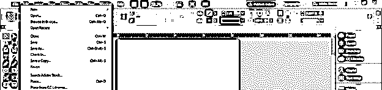

现在，我将在此文档页面中放置一些文本内容，为此，我将转到“文件”菜单，单击“放置”选项，或者您可以按 Ctrl + D 作为快捷键。

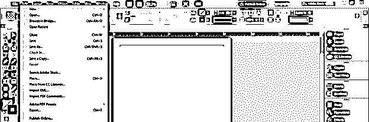

现在将打开一个位置对话框。我将从它的保存位置选择我想要的内容，然后在选择它之后，我将单击这个框的打开按钮。

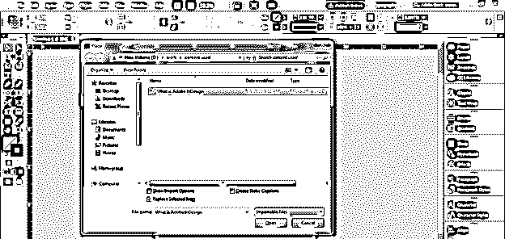

我将画一个文本框来放置我选择的文本，就像这样。

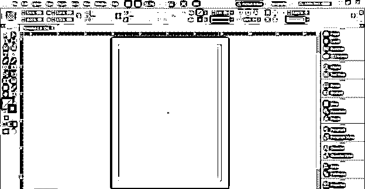

如果需要，您可以在置入文本内容之前为汇整文字工具创建一个文本框。

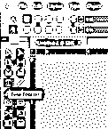

并绘制所需大小的文本框。

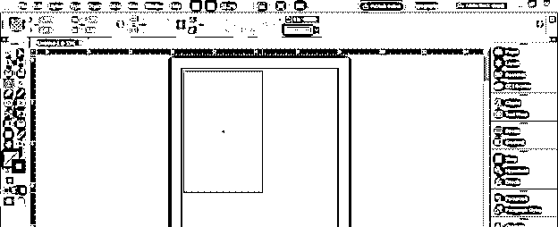

然后重复与上一步相同的步骤放置文本，您选择的文本将自动出现在绘制的文本框区域。

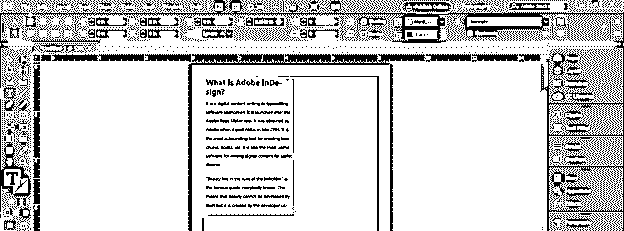

现在我会把我的文字放入整个页面，然后选择这些行来计算字数。

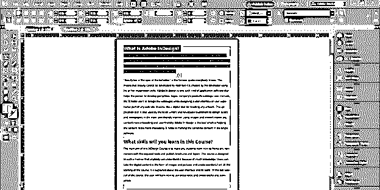

为了查看选中文本的字数，我们必须启用信息面板。你可以在窗口菜单中找到它，所以去窗口菜单并点击它。从它的下拉列表中我们可以找到信息选项，或者你可以按键盘的 F8 功能键作为它的快捷命令。

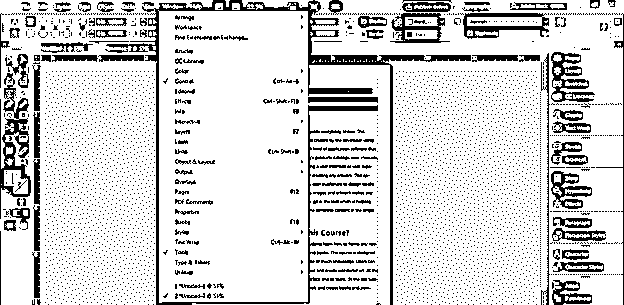

一旦你点击它，这种类型的信息面板将打开。

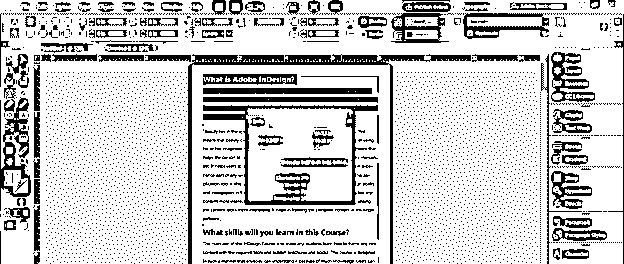

这是一个可移动的面板，所以你可以把它放在工作区的任何地方。我会把它放在这个软件的面板部分，在工作屏幕的右边。

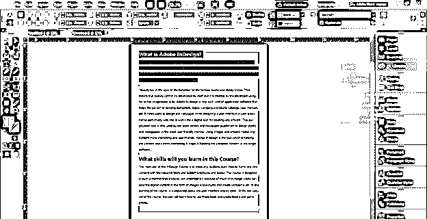

现在，当我打开它时，您可以看到所选文本的一些详细信息，如字符、单词、行、段落，这意味着当您选择任何文本内容以查看其字数时，您还可以从该面板获得有关该文本的字符、单词、行和段落的信息。在我们选择的文本中，我们有 349 个字符，60 个单词，5 行和 2 个段落。

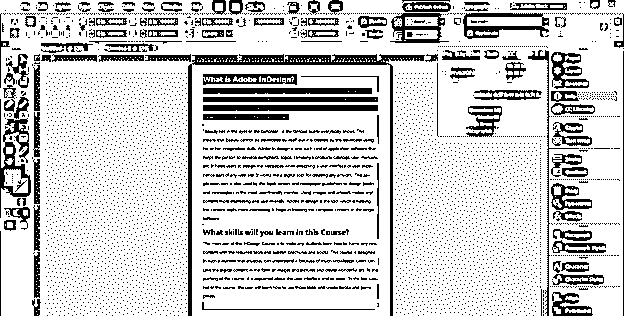

如果您从文本中删除任何行，那么信息面板中关于文本内容的信息也将改变。例如，我将选择这条线。

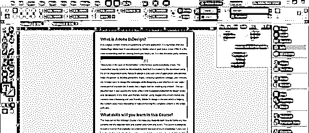

并删除它。你可以看到文本内容的细节有一些变化。我们没有选择此文本的任何行，因此它显示了此文档页面的整个文本内容的详细信息。

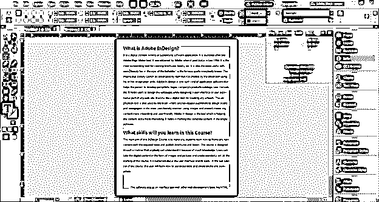

我将撤消删除的行，您可以看到字数是 316 + 2120。我来给你解释一下这种类型的字计数值是什么意思。

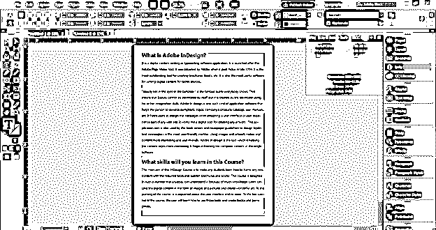

现在我选择这个页面的整个文本，你可以看到它的字数是 316，这个文本框架也有溢出的文本，所以我们上面看到的值 2120 是溢出的。所以不用担心这种类型的字数数值。

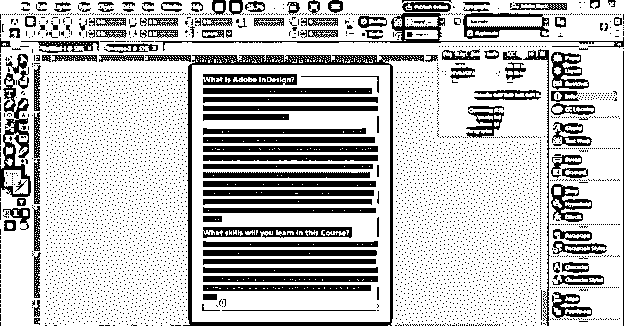

现在我将把这个溢出的文本填充到其他页面，为此我将进入这个软件的页面面板，它位于工作窗口的右侧。

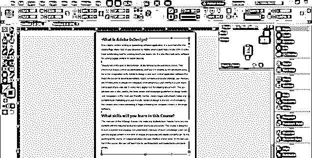

如果没有 Pages 面板，那么您可以在窗口菜单的下拉列表中找到它，或者您可以按键盘的 F12 功能键作为其快捷命令。

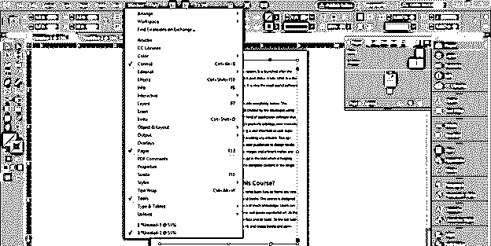

插入一页后，我将点击溢出文本的红色按钮。

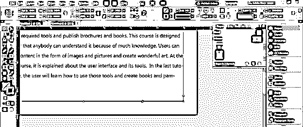

现在按住键盘的 shift 键，我将点击下一页，它会自动将整个溢出文本填充到所需的页面。

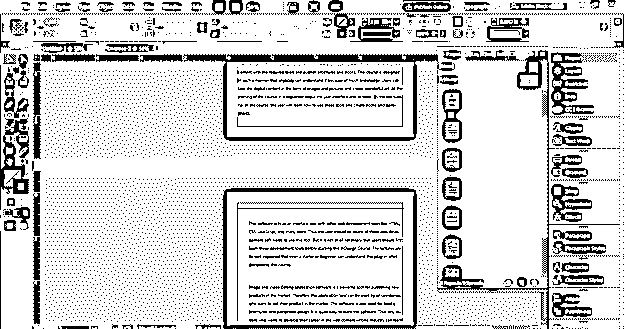

现在我将谈到文件的第二页。

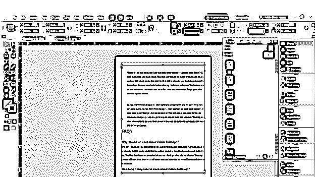

从这个软件的面板部分打开信息面板，但是你可以看到它没有显示这个页面字数的细节，因为我们没有从工具面板中选择类型工具或者选择任何文本。

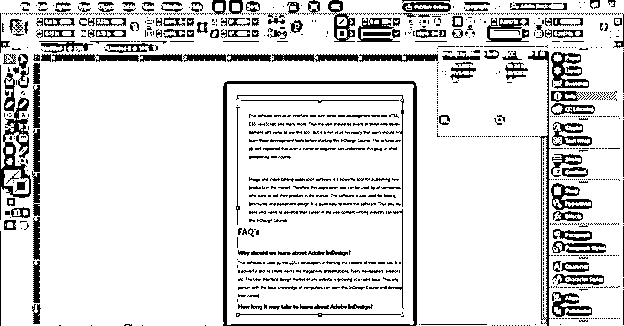

因此，从工具面板中选择文字工具，并在文本框内单击，现在它会显示该文档全部文本内容的所有字数，因为这里不再有溢出的文本。

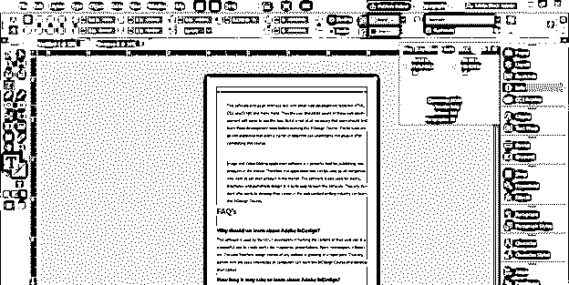

### 结论

我敢肯定，现在对你来说，计算你的文档页面或选定的文本或段落的字数不会有任何问题，你可以根据项目工作的要求轻松地增加或减少字数。不仅仅是单词，你还可以通过这个软件的信息面板获得关于文字内容的字符、行和段落的信息。

### 推荐文章

这是 InDesign 字数统计指南。在这里，我们将讨论如何在 InDesign 中执行字数统计以及相关步骤。您也可以看看以下文章，了解更多信息–

1.  [InDesign 快捷键](https://www.educba.com/indesign-shortcuts/)
2.  [Indesign 的替代方案](https://www.educba.com/alternative-to-indesign/)
3.  [InDesign 段落样式](https://www.educba.com/indesign-paragraph-styles/)
4.  [什么是 Adobe InDesign](https://www.educba.com/what-is-adobe-indesign/)

