# InDesign 下划线

> 原文：<https://www.educba.com/indesign-underline/>

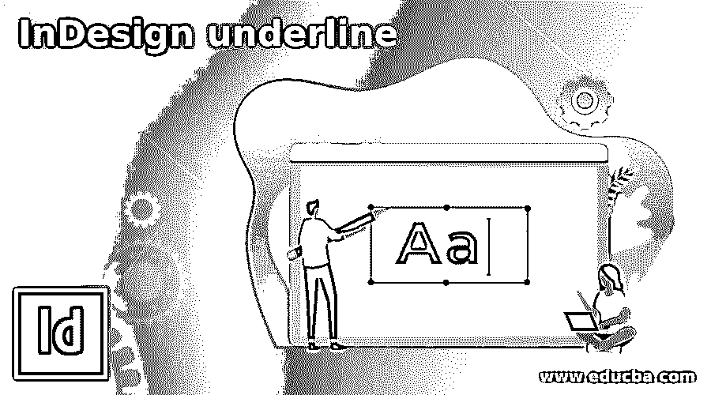

## InDesign 下划线简介

Adobe InDesign 是一个强大的工具和功能库。这些工具和功能通常被理解为文本/字符格式化、布局格式化、图像格式化和页面格式化。InDesign 下划线选项属于文本和字符格式的子类别。与任何其他矢量图形程序不同，Adobe InDesign 包含一系列下划线和删除线选项，在使用文字工具时可以考虑这些选项。

### 如何在 Indesign 中创建和使用下划线？

给文本加下划线有助于突出段落中的特定单词或句子。内容创作者、编辑、书籍设计者和图形设计者通常使用下划线工具来突出标题、小标题、说明或文本。

<small>3D 动画、建模、仿真、游戏开发&其他</small>

用户可以使用 Adobe InDesign 中的两种不同方法来创建下划线和删除线效果。这些功能可能很小，可以忽略不计，但它们对于在书籍和杂志的多页中创建突出的文本具有足够的重要性。

对于初学者来说，使用文字工具和下划线选项比用钢笔或线条工具手动创建下划线更容易。同样，对软件有很好了解的用户可能会发现使用钢笔工具或线条工具更容易和更有创造性。

**方法 1**

在这种方法中，我们将学习在文本上使用和应用下划线和删除线的最基本的技巧。此外，我们将学习软件中关于下划线和删除线效果的详细选项。

以下是我们应该遵循的步骤

1.  启动 Adobe InDesign

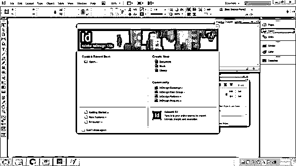

2.  创建一个新文档，如下图所示

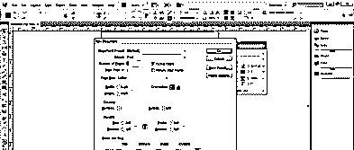

3.  现在，转到文字工具

4.  创建一个文本框并编写一个示例文本，如下图所示。

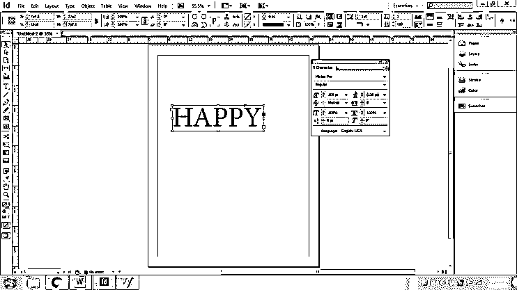

5.  接下来，转到菜单栏上的类型功能，并点击字符

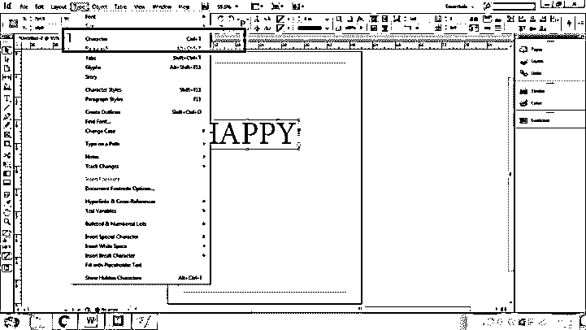

6.  将出现一个新的对话框，用于编辑和修改字符。

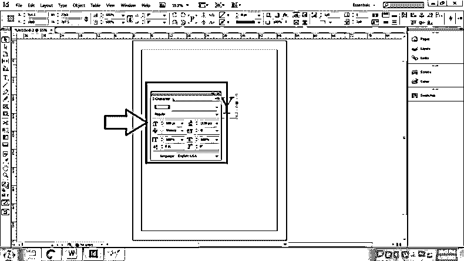

7.  现在，单击示例文本，并单击对话框右上角给出的三个箭头

8.  单击列表中的下划线选项

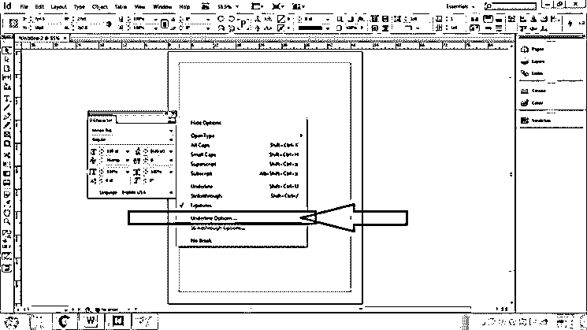

9.  在这之后，我们将得到一个新的下划线选项对话框。

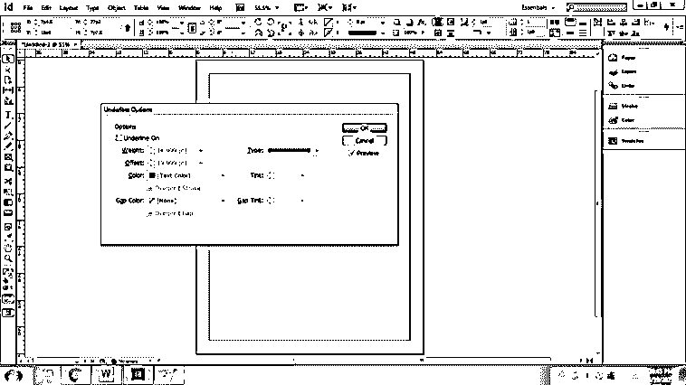

10.  在此面板中，我们可以更改/编辑特定文本的下划线设置。请记住选择该文本。
11.  点击下划线选项。

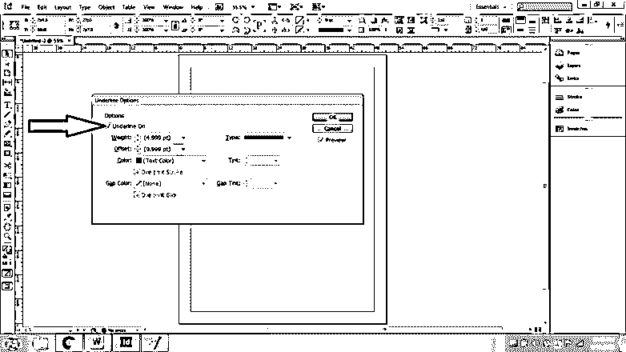

12.  接下来，单击 preview 查看同时进行的更改。

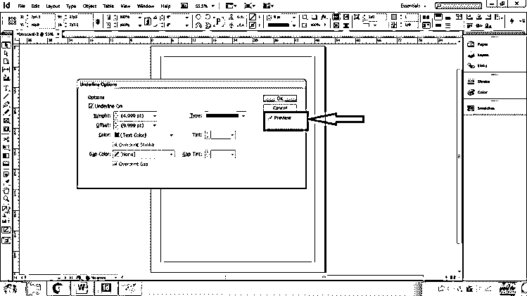

13.  现在，在这个面板中，我们可以更改下划线的粗细(笔画的粗细)、偏移量(文本和笔画之间的间距)、笔画的颜色、笔画的间距颜色。

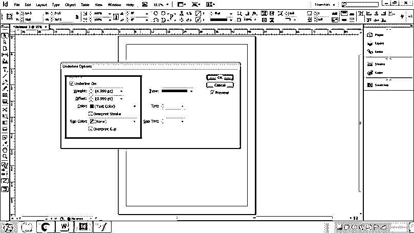

14.  我们也可以改变我们需要的笔画类型。单击“文字”以查看 InDesign 中可用的笔触样式列表。

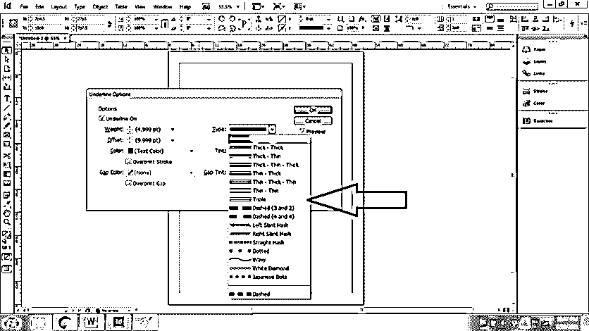

15.  接下来，我们还可以编辑笔画的色调颜色和间隙色调颜色。

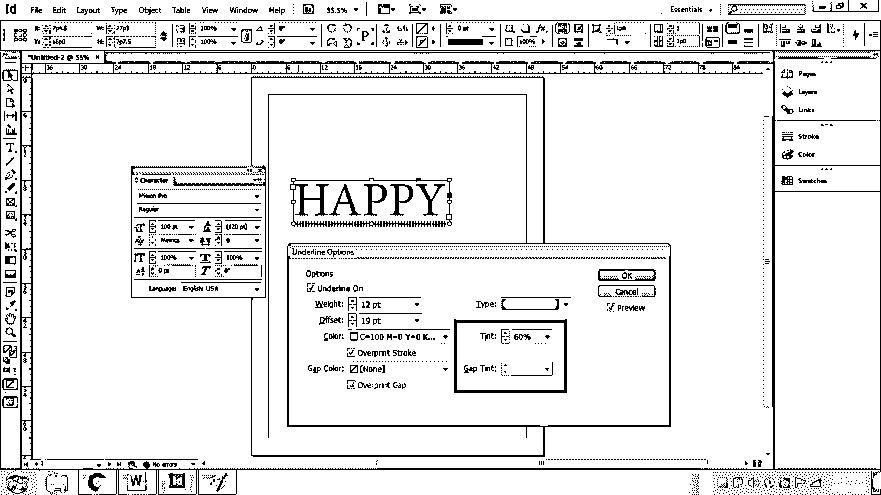

16.  现在，要保存更改，请单击 OK。

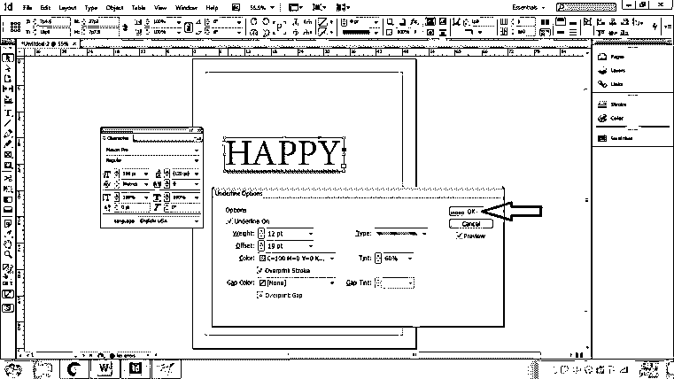

17.  接下来，对于删除线选项，用户需要再次单击字符对话框中的三个箭头，并选择删除线选项。

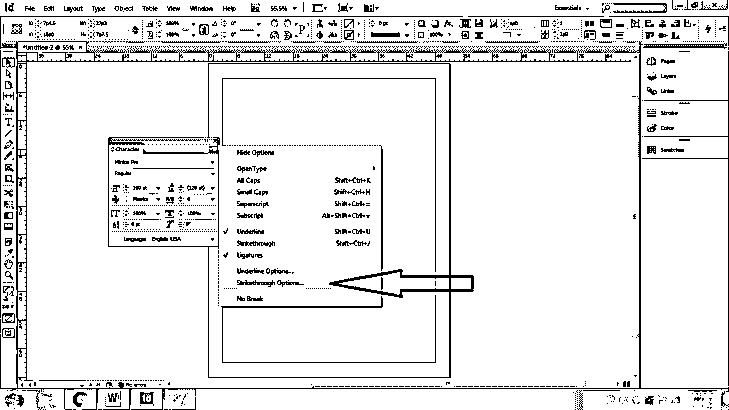

18.  删除线选项和设置类似于字符面板中给出的下划线选项。

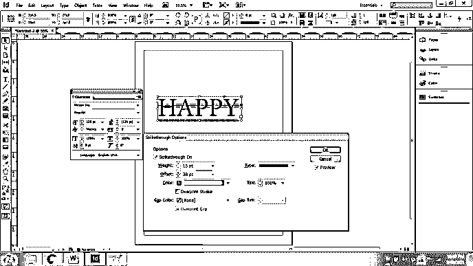

19.  最后，通过使用上面的过程，我们可以改变文本的下划线和删除线。

**方法二**

因此，如上所述，在这个方法中，我们将使用线条工具和钢笔工具在示例文本下创建一个笔画。使用这些工具将帮助用户创建具有一些真实效果的创造性笔画。

以下是我们应该遵循的步骤

1.  启动 InDesign 并创建新文档

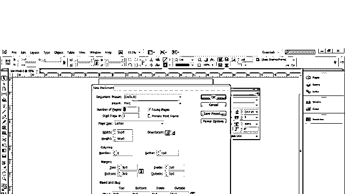

2.  点击文字工具，创建如下所示的示例文本

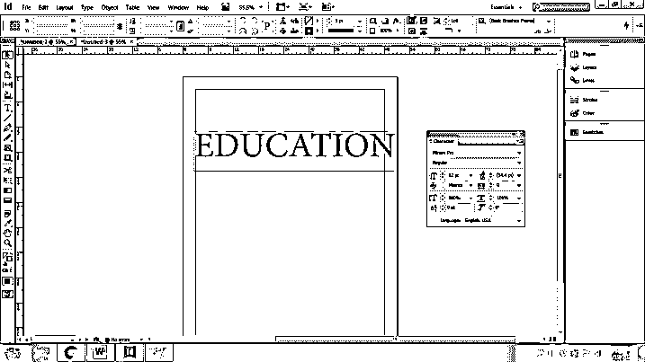

3.  点击线条工具/钢笔工具，创建一条线，如下图所示。

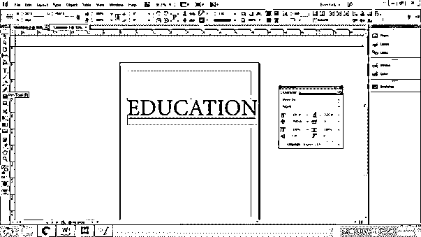

4.  现在，要增加笔画的粗细，选择线条并点击控制面板，如下图所示。

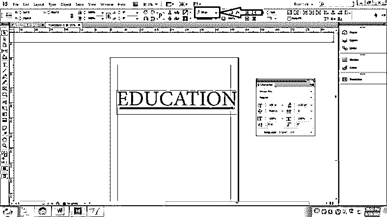

5.  接下来，我们也可以改变如下所示的颜色

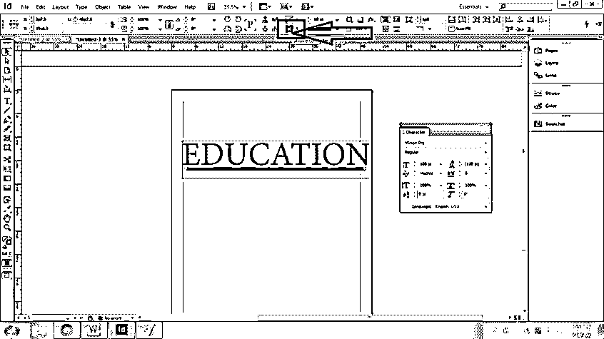

6.  要更改笔画样式，单击控制面板右上角的三个箭头，然后单击“笔画样式”

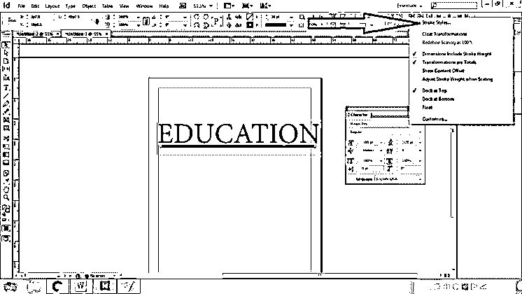

7.  将出现一个新的对话框，我们可以在其中更改和选择笔画样式。我们也可以根据自己的需要添加笔画样式。

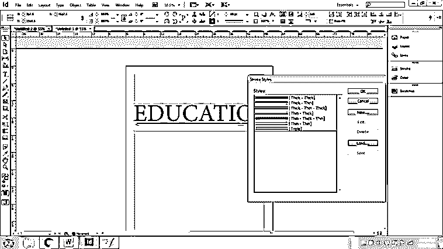

8.  接下来，我们可以使用控件中的 effects 选项添加效果。我们有许多选项，如阴影，内发光，斜面和更多可以应用于中风。

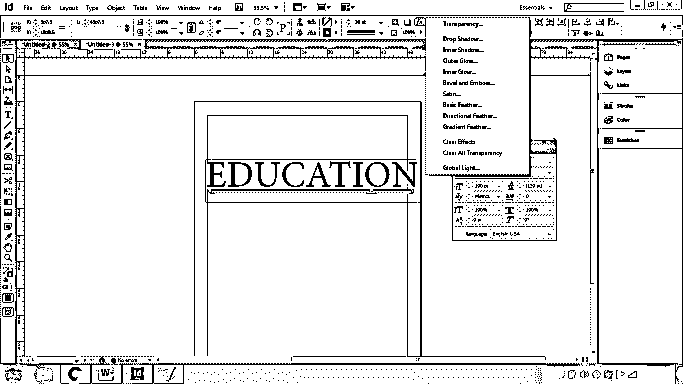

9.  用户还可以根据需要控制笔画的不透明度。

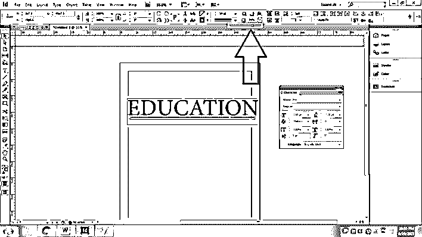

这种方法为用户提供了大量的创造性选项，这些选项是文字工具中的直接下划线选项所不具备的。只是我们创建另一个对象作为笔画，放在我们需要的文字下面。

### 结论

总结这篇文章，我们可以说 InDesign 有许多机制来创造一种特殊的效果。它为初学者和专业人士都提供了工具和功能。Adobe InDesign 嵌入了多种下划线工具选项。

### 推荐文章

这是 InDesign 下划线指南。在这里，我们讨论了 InDesign 有许多机制来创建特定的效果。您也可以看看以下文章，了解更多信息–

1.  [InDesign 网格](https://www.educba.com/indesign-grid/)
2.  [InDesign 段落样式](https://www.educba.com/indesign-paragraph-styles/)
3.  [Indesign 的替代方案](https://www.educba.com/alternative-to-indesign/)
4.  [InDesign CS6](https://www.educba.com/indesign-cs6-top-ten-new-features/)

