# InDesign 演示模板

> 原文：<https://www.educba.com/indesign-presentation-templates/>

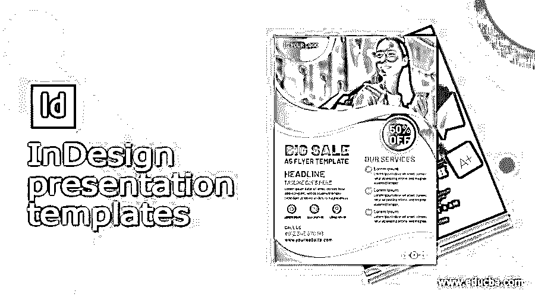

## InDesign 演示模板简介

在 Adobe InDesign 上创建演示模板是该程序的独特功能之一。以前，大多数设计师更喜欢使用 Microsoft PowerPoint 演示程序来制作 PPT 和幻灯片。如今，演示在工业和合作技术领域都很突出。

演示已经成为宣传特定系统核心要素的一种方式。此外，大量的工作机会也浮出水面，为展示设计师和创作者。Adobe InDesign 拥有独特的工具和功能来设计创意和创新的演示文稿。

<small>3D 动画、建模、仿真、游戏开发&其他</small>

### 如何在 Indesign 中创建和使用演示模板？

在本文中，我们将了解在 InDesign 上创建演示文稿的目的和工作。Adobe InDesign 是一个出版程序，用于创建多页书籍和杂志。这是一个庞大的程序，有一个界面，专门为专业设计师和内容创作者创建。

Adobe InDesign 能够导入图像、视频和 Photoshop 文件。一旦我们为演示文稿创建了一个好的背景，我们就可以创建页面，这些页面可以用作演示文稿的幻灯片。我们还可以使用 Adobe InDesign 将视频和图像放入幻灯片中。

当我们在 InDesign 上创建模板(如新闻稿或书籍模板)时，我们将它们保存为 InDesign 模板格式，但演示模板会以 Adobe PDF 交互式格式导出和保存，以便以演示形式查看设计。

有时，PPT 设计者发现 Microsoft PowerPoint 程序很有限，功能和工具都很有限。这就是 Adobe InDesign 发挥其无限工具集和丰富界面用户体验的时候。我们可以像使用其他演示文稿一样使用在 InDesign 上创建的演示文稿。

对于专业人士和有经验的艺术家来说，在 InDesign 上创建合适的演示文稿的方法更容易。初学者可能会发现这个过程复杂而广泛。尽管如此，技术和媒介对所有人来说都是一样的。

**以下是在 Adobe InDesign 上创建演示模板的步骤:**

1.  启动 Adobe InDesign

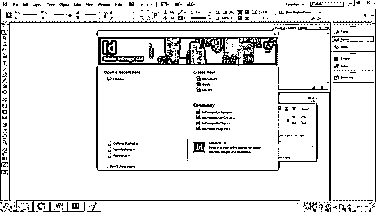

2.  创建一个 6 页对开的新文档，方向应该是纵向，选择页边距为 1cm

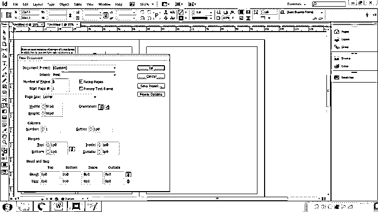

3.  点击确定
4.  现在，我们正在创建一个主题为健康和饮食的演示样本。
5.  现在，转到菜单栏中的窗口，并选择层。

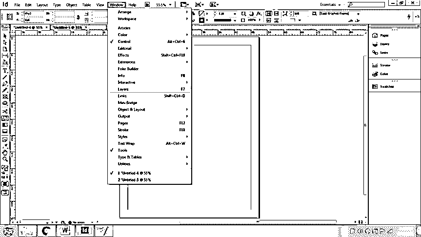

6.  现在我们需要 2 层作为背景和照片。如下所示重命名图层

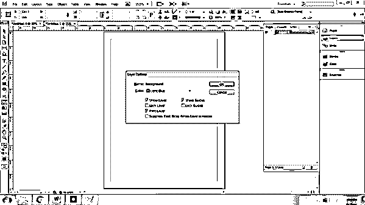

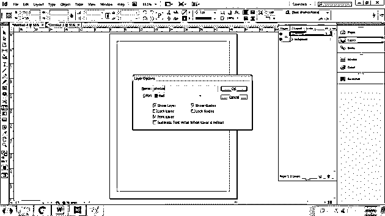

7.  现在，转到母版页，根据演示文稿的主题设计页面。这里，我们先写一个样本文本。

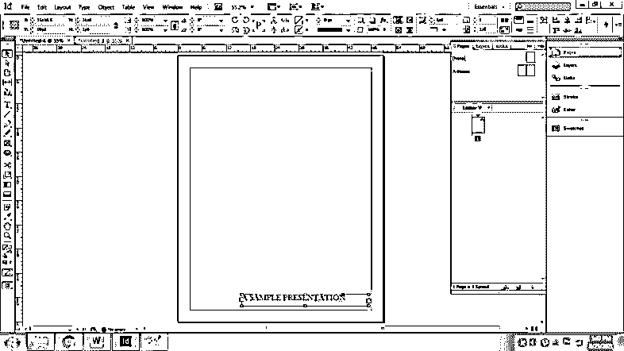

8.  创建一个文本框架，右键单击并选择插入特殊字符>标记>当前页码。这将有助于给每一页提供一个页码。

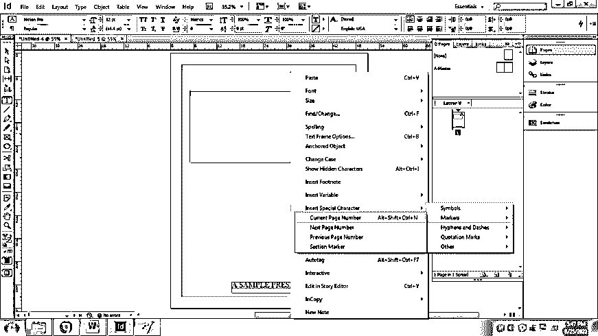

9.  接下来，在页面上写完文本后，只在母版页上创建封面。为了制作封面，我们需要图片和一个好的设计来表达演讲的主题。
10.  从互联网上下载一个图像，并为要放置的图像设计一个布局。记住；保留照片图层中的所有图像。

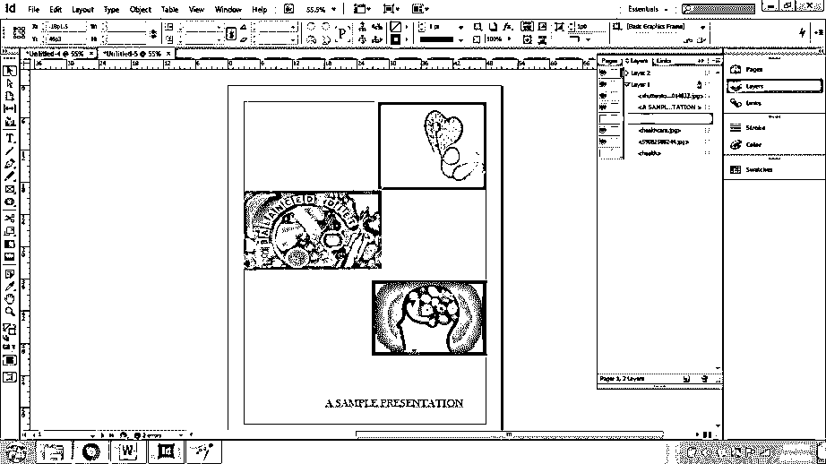

11.  在右上角的封面上写一段文字作为健康和饮食。转到色板面板，改变文字的颜色。要更改文本的字体和样式，请转到“字符”面板。

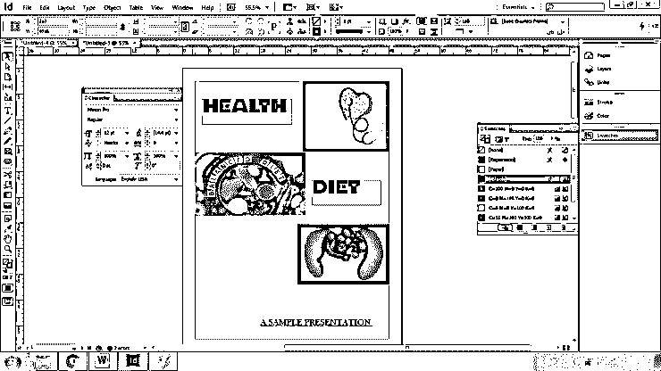

12.  现在，类似地，我们设计第 2 页和第 3 页。

13.  为此，请从“页面”面板转到第 2 页。如果您看不到“页面”面板，请转到“窗口”>“页面”

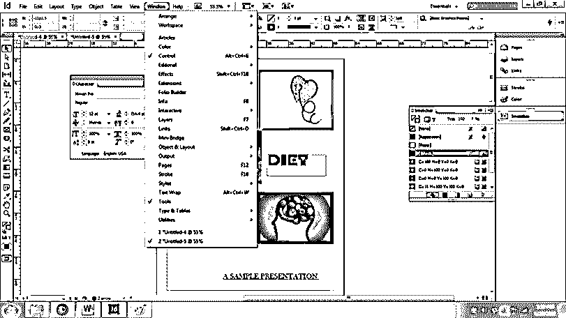

14.  现在，进入布局>页边距和分栏

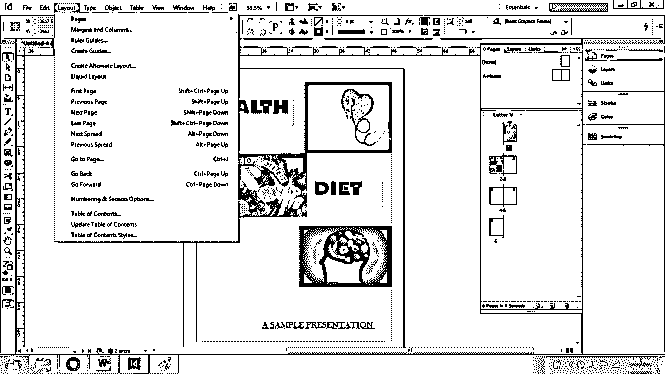

15.  我们在第 2 页创建一个专栏，并用与主题相关的图像编写示例文本。

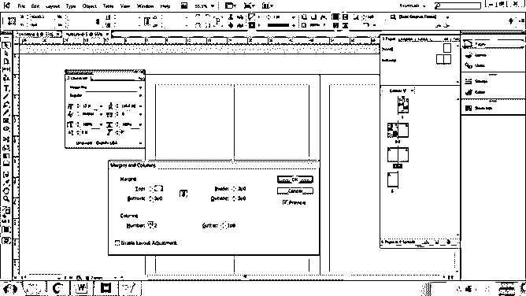

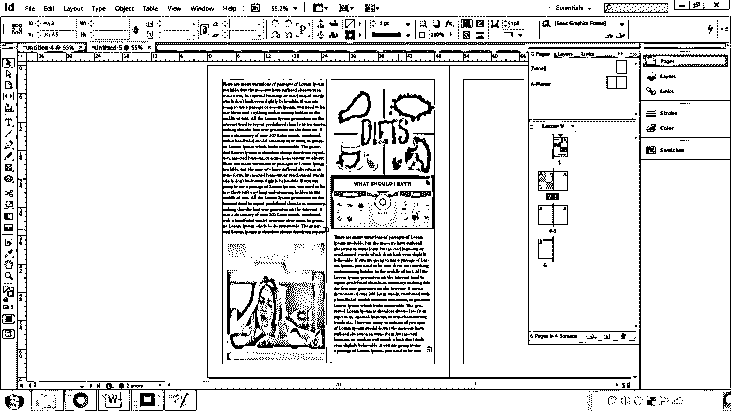

16.  同样，使用第 3 页上的图像创建并编写示例文本，如下图所示

17.  继续此过程，根据需要完成演示。

18.  我们还可以在页面上链接视频和图形图像或 Photoshop、PDF 文件。

19.  要保存文件，请转到“文件”>“导出”>“PDF 交互式格式”,如下图所示。

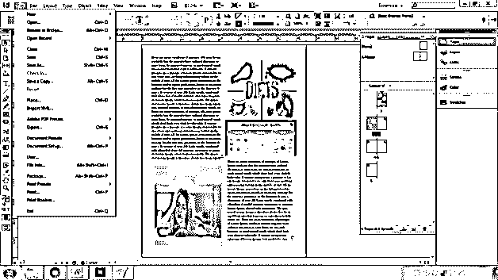

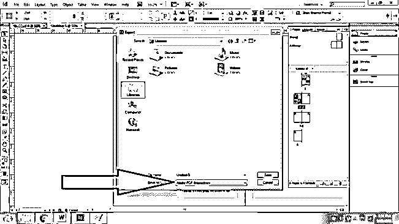

用户还可以在程序上创建布局和艺术作品，然后将其导出到 PowerPoint 程序中，根据需要编辑或修改幻灯片。

是否在 Adobe InDesign 上创建演示模板取决于项目的要求。此外，人们使用 InDesign 是为了获得新的外观和客户体验。各行业在 InDesign 上创建演示模板，为其幻灯片提供清晰灵活的外观。Adobe InDesign 具有大多数 presentation maker 程序所缺乏的动态品质。

### 结论

总结这篇文章，我想建议我们绝对应该使用 Adobe InDesign 来创建创新和动态的幻灯片和演示文稿。

此外，InDesign 有一些最独特的功能，与大多数同类程序不同。用户能够在 InDesign 上创建真实的、更加非传统的内容。

### 推荐文章

这是 InDesign 演示模板指南。这里我们讨论如何在 Indesign 中创建和使用演示模板。您也可以看看以下文章，了解更多信息–

1.  [InDesign 段落样式](https://www.educba.com/indesign-paragraph-styles/)
2.  [Indesign 版本](https://www.educba.com/indesign-version/)
3.  [InDesign CS6](https://www.educba.com/indesign-cs6-top-ten-new-features/)
4.  [什么是 Adobe InDesign](https://www.educba.com/what-is-adobe-indesign/)

