# InDesign 首字下沉

> 原文：<https://www.educba.com/indesign-drop-cap/>

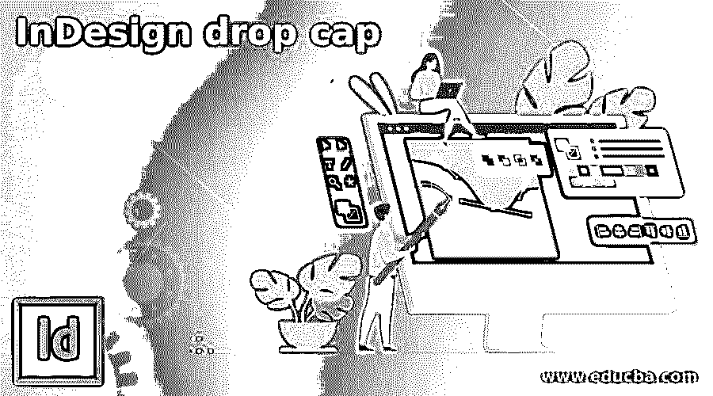

## InDesign 首字下沉简介

InDesign 首字下沉是文本格式的一种类型，我们可以将其理解为使段落的第一个字母不同于该段落的其他文本内容，以便设计的内容对其查看者来说看起来很醒目。在这个软件的段落面板中有一些参数，通过它们我们可以创建首字下沉。我们不仅可以使用段落面板创建首字下沉，还可以使用带有一些设计元素的单独字母作为首字下沉。创建首字下沉以使你的内容吸引人取决于你的创意方式。因此，在本文中，我将通过一个示例来解释首字下沉。

### 如何在 InDesign 中创建首字下沉？

我们根据设计布局的主题创建首字下沉，所以在这里我将向您解释首字下沉的基础知识，这样您可以对它有一个基本的想法，然后您可以根据自己的选择使用设计元素。

<small>3D 动画、建模、仿真、游戏开发&其他</small>

因此，让我们先创建一个新文档，然后单击该软件欢迎屏幕上的“创建新文档”按钮，我将采用 Letter 大小的文档页面，并保留此新文档对话框的其他设置。

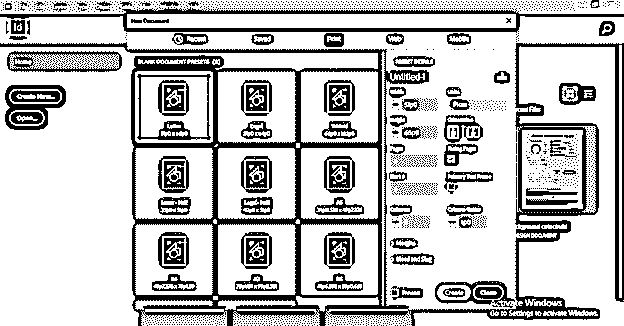

首先，我将在这里放置一个用于创建设计布局的图像。所以去菜单栏的文件菜单，点击它。在这个下拉列表中，我们会找到位置选项，所以单击它，或者我们可以按 Ctrl + D 作为快捷键。

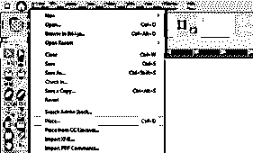

一旦我们点击它，一个位置对话框将被打开。我将从图像的保存位置中选择一个图像。我从 unsplash.com 下载了这张美丽的图片。

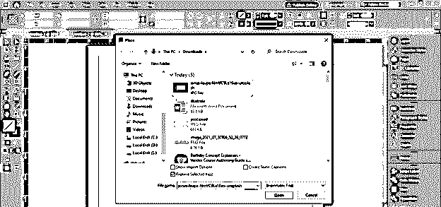

现在，我将拖动鼠标光标，将该图像放置在文档区域，如下所示。

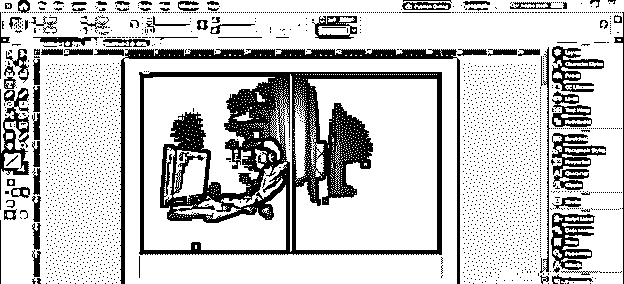

接下来，我将从工具面板中选择文字工具，绘制一个文本框，然后将文本粘贴到这里。我会选择这段文字。

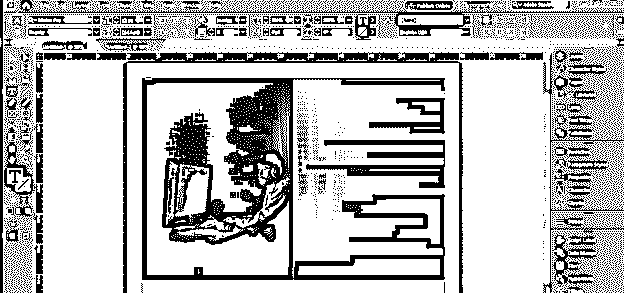

并将其颜色改为白色，以便与背景形成对比。

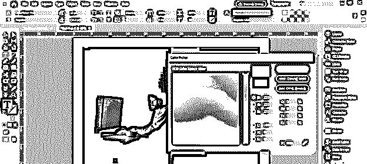

现在让我告诉你这个软件的首字下沉功能。我想把这个内容的第一个字母设为首字下沉字母，这里是 h。所以要制作首字下沉字母，我们必须用文字工具选择它，然后打开段落面板。我在这个软件的用户界面右侧的面板部分有一个段落面板。

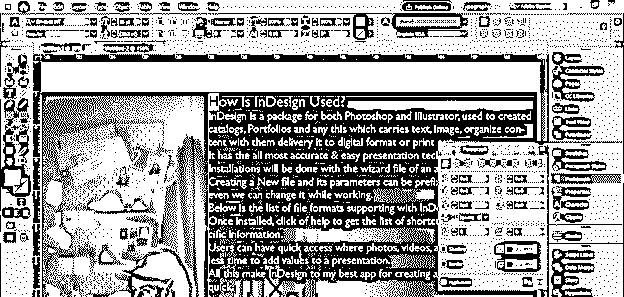

您可以在窗口菜单的下拉列表中找到此面板。因此，进入窗口菜单，在类型和表格选项中，我们有 Paragaphs 面板选项，或者您可以按 Ctrl + Atl + T 快速访问它。

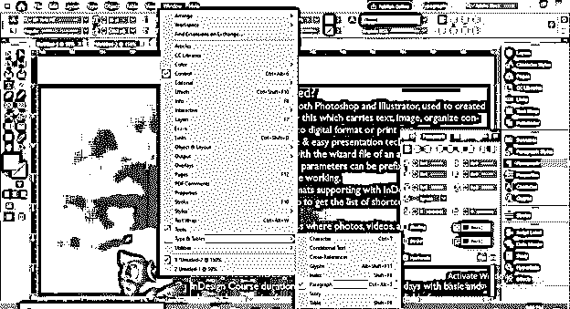

这里我们在段落面板中有“首字下沉行数”选项。这个选项根据我们取值的行数改变字母的高度。

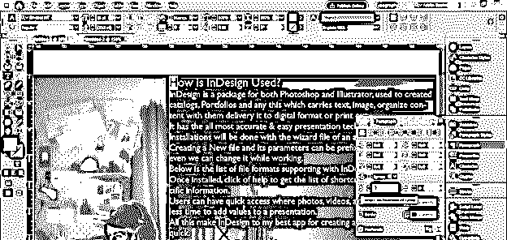

例如，如果我们有 4 作为这个选项的值，那么它将设置第一个字母的高度以及段落的四行。

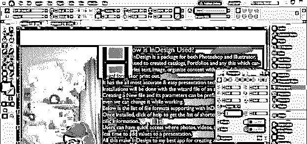

现在让我们打开字符面板，了解创建首字下沉时需要设置的其他设置。

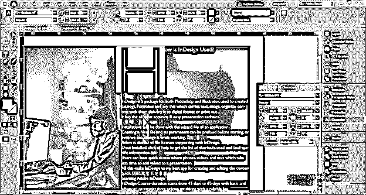

你可以在窗口菜单的同一个选项中找到这个字符面板，你也可以简单的按 Ctrl + T 作为快捷键。

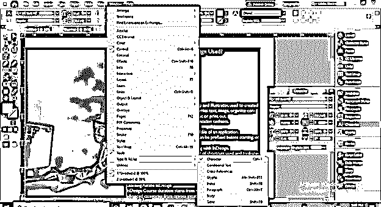

我已经将段落从标题部分中分离出来，我们可以改变字符面板中行距选项的值，以保持字母和段落行之间的间隙，这样看起来更好。在这里，我想把这个标题的其他文本放在这封信的底部，所以我也要改变它的前导值。

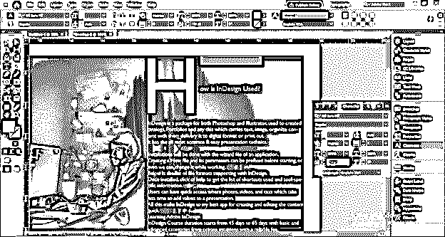

现在，我将进入字体风格，并将其更改为像这样的时尚字体，以便使我的文本内容有吸引力。首字下沉的字体样式不必与段落中其他文本内容的字体样式相同。

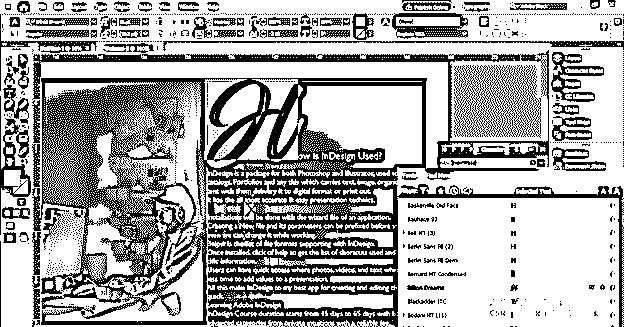

您可以看到，对于此文本内容，首字下沉看起来很不错。

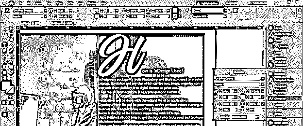

通过改变字距值，我们可以调整字母和该行其他文本之间的间距。因此，您可以对其他文本的首字下沉进行一些调整。

如果需要，您可以保存首字下沉样式，以便在整个文档的其他段落中使用。为此，我们必须打开段落样式面板。

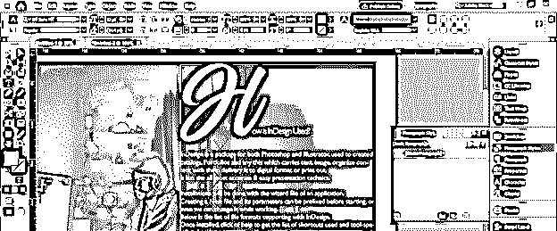

如果你的工作屏幕上没有段落样式面板，那么你可以进入菜单栏的窗口菜单，在样式选项的下拉列表中，你可以找到段落样式选项。您可以使用键盘的 F11 功能键作为其快捷键。

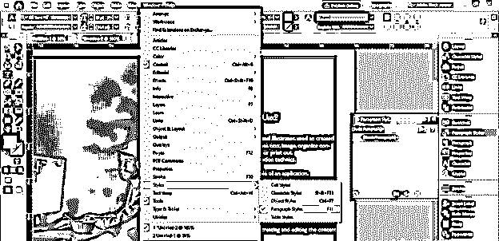

现在转到段落面板，点击创建新样式按钮。你可以在这个面板的底部找到这个按钮。

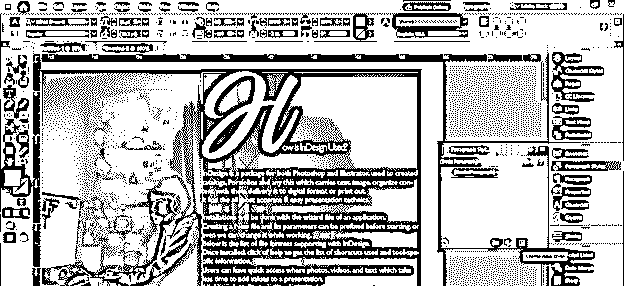

我将把它命名为首字下沉。

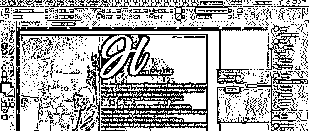

现在让我们选择这篇课文的其他字母内容。

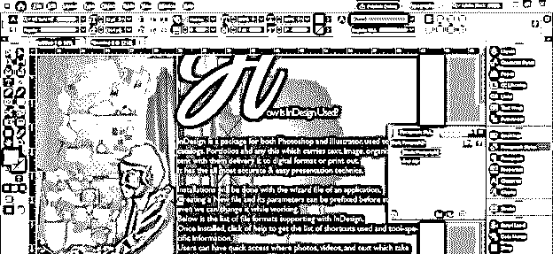

选择它后，我将单击段落样式面板的首字下沉图层，您可以看到它将变为首字下沉，就像我们在文本内容顶部看到的一样。这样，您可以保存创建的首字下沉，并在不同的文本中进一步使用。

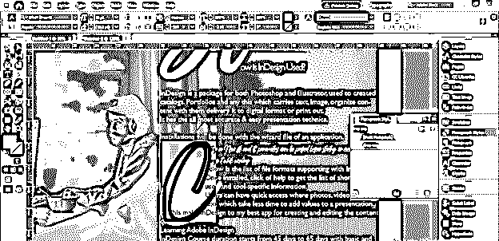

如果需要，您可以更改首字下沉的颜色，使其不同于其他文本的颜色，并且不必对文本内容和首字下沉使用相同的颜色。

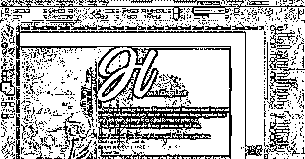

你可以看到它对文本内容产生了很好的影响。

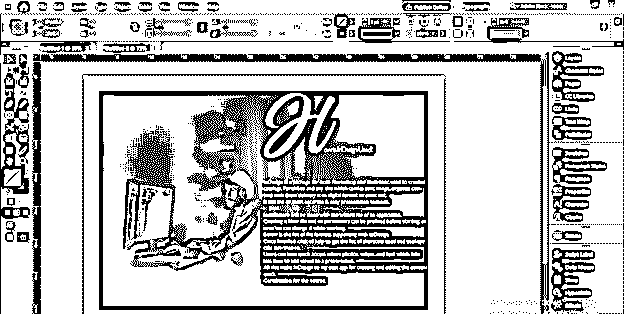

### 结论

我向您解释了该软件首字下沉功能的所有重要方面，以便您可以很好地理解它，并开始在您的设计布局中使用它，使它越来越有效。您可以用不同的方式练习，以获得首字下沉样式的良好变化。

### 推荐文章

这是 InDesign 首字下沉指南。在这里，我们讨论了该软件首字下沉功能的所有重要方面，以便您可以很好地理解它。您也可以看看以下文章，了解更多信息–

1.  [Indesign 的替代方案](https://www.educba.com/alternative-to-indesign/)
2.  [InDesign CS6](https://www.educba.com/indesign-cs6-top-ten-new-features/)
3.  [Indesign 版本](https://www.educba.com/indesign-version/)
4.  [用户界面设计](https://www.educba.com/user-interface-design/)

