# InDesign 如何添加页码

> 原文：<https://www.educba.com/indesign-how-to-add-page-numbers/>

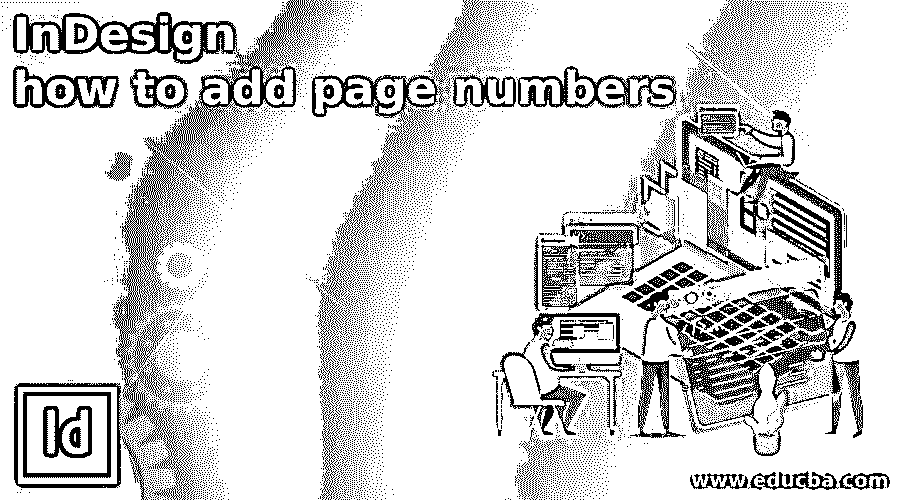

## InDesign 简介如何添加页码

InDesign 如何添加页码属于这个软件的技术，通过它我们可以在这个软件中给文档的页面添加页码。在设计杂志或书籍的版面时，我们需要在每一页的底部添加页码，因此在 InDesign 中，我们不需要手动为每一页添加页码。事实上，InDesign 为我们提供了一些功能和设置，通过这些功能和设置，我们可以为文档的页面分配页码。不仅仅是页码，我们还可以在每个页面页码上添加一些设计元素。让我解释一下你是如何做到的？

### 如何在 InDesign 中添加页码？

我们可以通过几个简单的步骤给文档的页面添加页码，并且我们必须了解一些参数，以获得我们想要的页码方法类型。因此，让我们从“新建文档”对话框中创建一个新文档。

<small>3D 动画、建模、仿真、游戏开发&其他</small>

在此对话框中，我将采用文档页面的 Letter 大小，并通过输入页数选项中的页数值来取 7 页。这次我将禁用对页选项，因为我只想要一个页面，而不是并排页面。

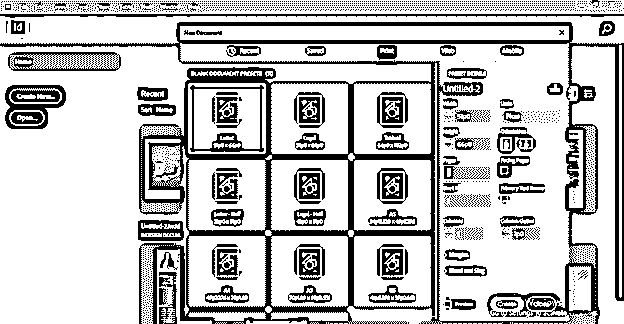

你可以在这个软件的页面面板中看到我们的文档有 7 页。您可以在用户屏幕的右侧找到此面板。

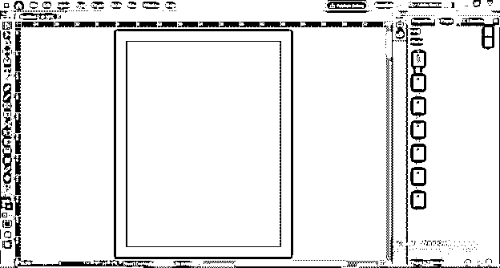

如果您的用户屏幕上没有这个面板，那么您可以转到窗口菜单，在它的下拉列表中找到它，或者您可以按键盘的 F12 功能键。

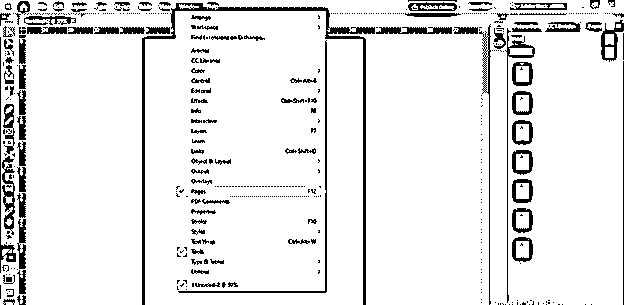

要添加页码，我们必须选择主页，它位于页面面板的顶部。双击母版页进行选择。

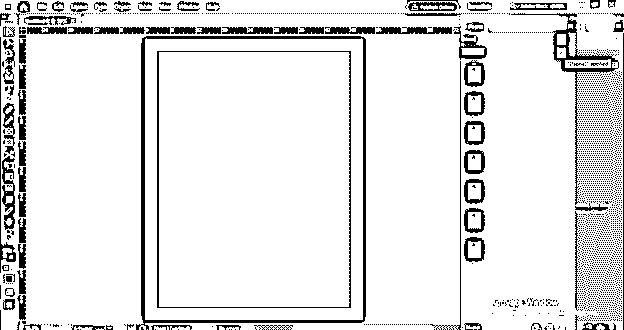

现在我将使用文字工具在这里画一个文本框，就像这样。

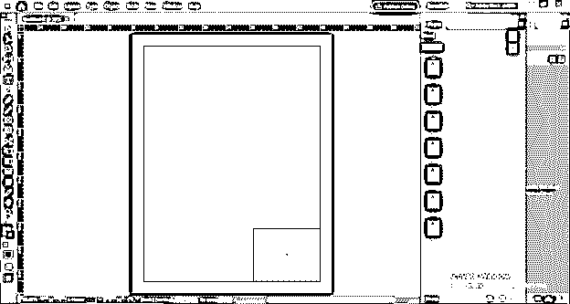

被选中的文本进入类型菜单并点击它。转到“插入特殊字符”选项，然后在其下拉列表的“标记”选项。现在点击新的向下滚动列表的当前页码选项，或者你可以简单地按下键盘的 Ctrl + Alt + Shift + N 键。

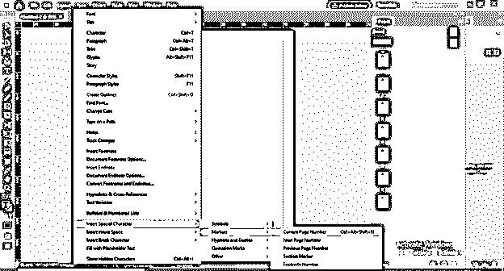

一旦您选择了此选项，一个字母将自动插入到您选择的文本框中。

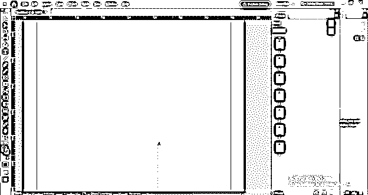

如果我增加文字的大小，你就能看得很清楚。

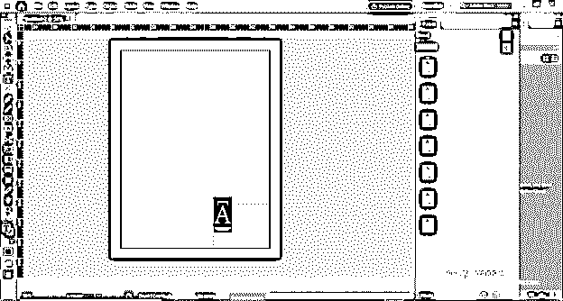

您可以看到文本与该文本框架的左上角对齐，但我们需要将它放在本页边缘的右下角。

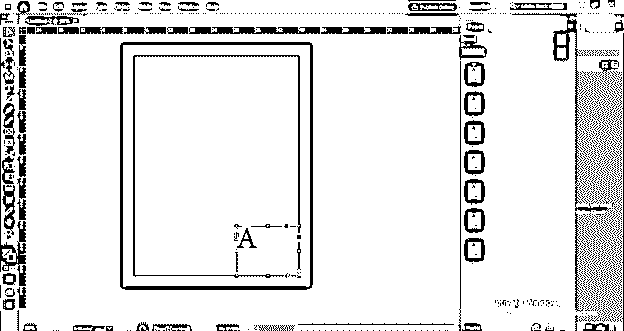

所以去对象菜单，从列表中选择“文本框选项”。

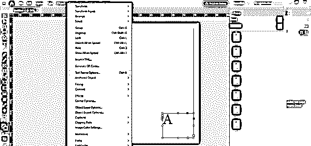

一旦我们点击这个选项，一个“文本框选项”将被打开。在此框中，选择对齐选项中的底部选项，一旦我们选择此选项，我们的文本将在文本框的底部对齐。

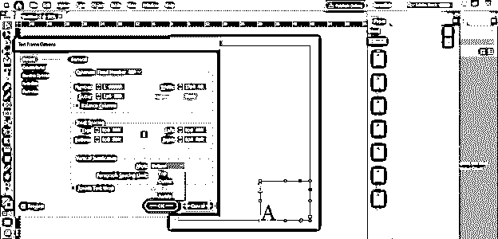

现在我将从窗口菜单的下拉列表中启用控制面板，这样我们就有了一个段落格式面板。

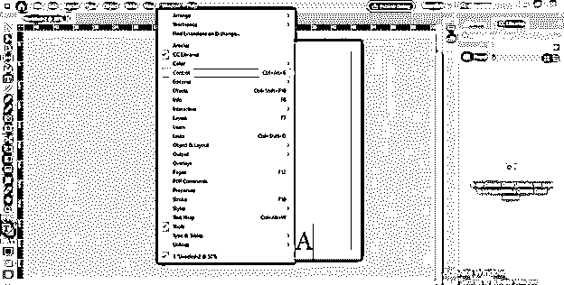

在此面板中，我将为此文本选择右对齐选项，它将与此文本框架的右侧对齐。

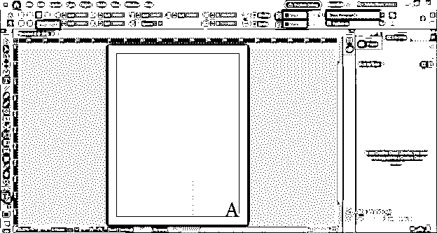

现在双击第 1 页将其选中。你可以看到第一页。

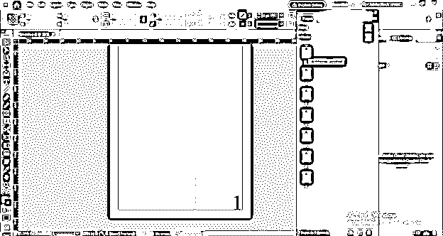

现在，如果你向下滚动，你可以看到序列中有一个页码。

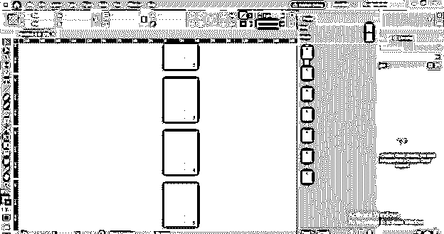

现在，如果您愿意，您可以从任何页面开始在文档页面中进行页码编排。例如，我想从第 3 页开始编页码，因此我将选择该页并在其上单击鼠标右键。在这个列表中，我们有“编号和章节选项”。所以点击它。

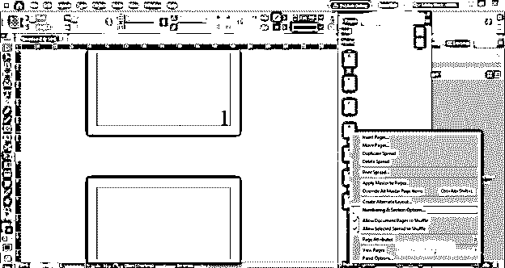

单击此选项后，我们会看到此对话框。

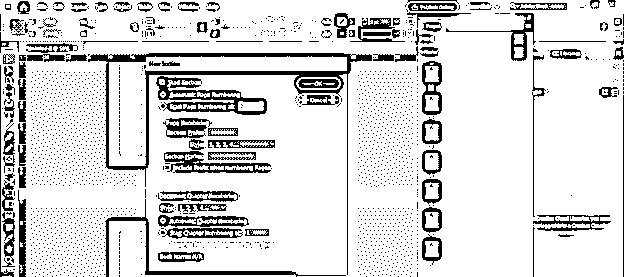

在此对话框中，通过点击单选按钮启用“起始页码”选项，并点击“确定”按钮。

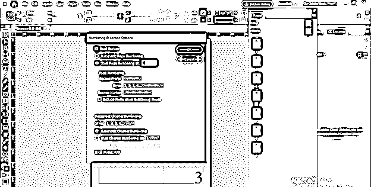

一旦我们点击这个警告信息，InDesign 软件就会显示出来，但是你不用担心，只要点击 Ok 按钮就可以了。

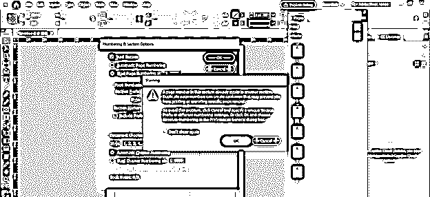

您可以看到页码从第 3 页开始，从第 1 页开始。

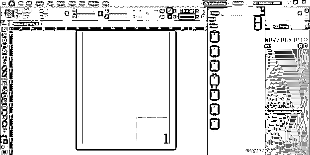

现在，如果我们想改变上层页面的页码样式，我们也可以这样做。为此，我将选择第 1 页，右键单击它，然后选择相同的“编号和章节选项”。

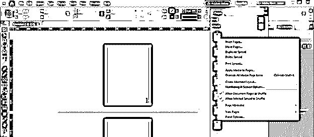

这次在对话框中从样式选项列表中选择 A、B、C 样式。

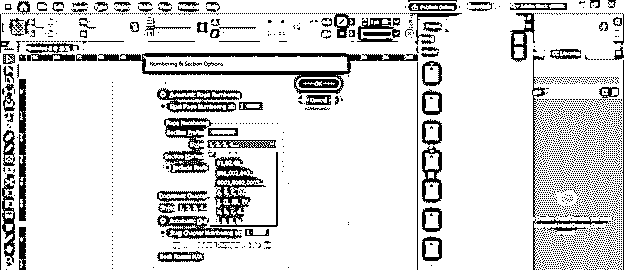

我们有一个 B . C . D 作为我们页面的页码。

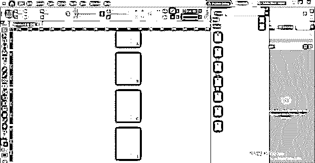

您也可以将一些设计元素添加到页码中，首先选择母版页，然后在页码区域创建或添加设计元素。例如，我在这里添加了这两个矩形作为设计元素。

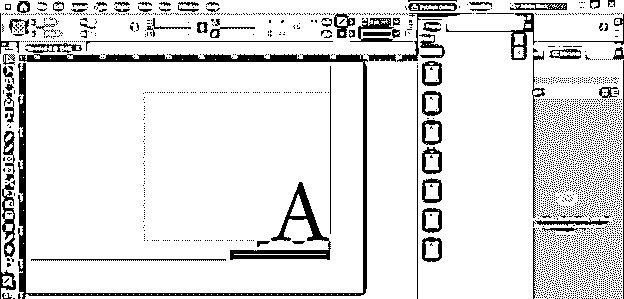

它将应用于所有页面。

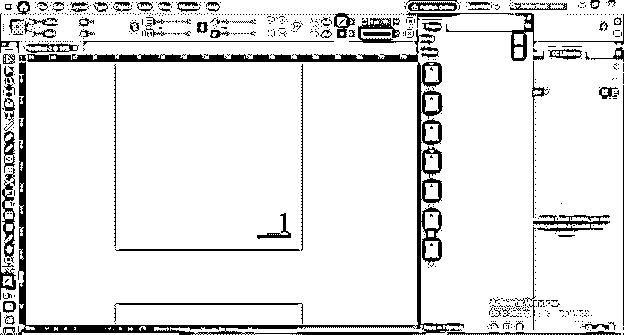

现在让我们再次创建一个新文档，这次我将在这个新文档对话框中启用对开页面选项。

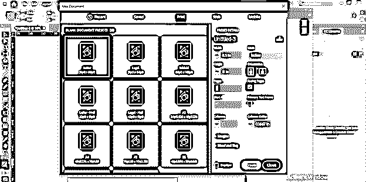

您可以看到，现在我们的文档页面上有并排的页面。

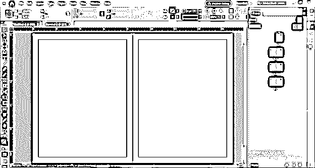

现在，我将用同样的方法再一次给主页添加页码。

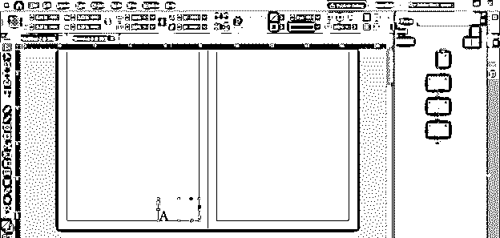

但是我们需要在这一页的两面都有页码。因此，我将复制第一份文本。

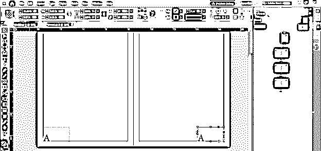

并将右侧页面的文本与文本框架的右侧对齐。

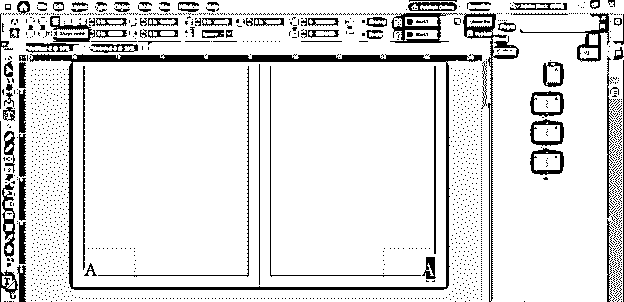

我们将页码应用于所有页面。

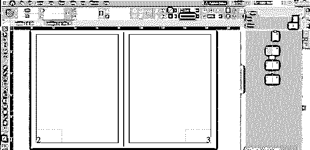

如果你不想要第一页的页码，那么你可以从页面面板的顶部选择“无”页，并将其放在第 1 页。

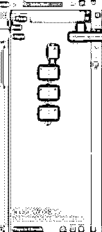

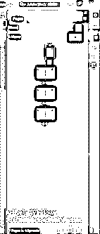

### 结论

现在，为你的文档页面添加页码对你来说不再是一件困难的事情，你可以很容易地用它们来设计不同的页码。您可以根据需要调整页码顺序，也可以删除文档中不需要的页码。

### 推荐文章

这是 InDesign 如何添加页码的指南。在这里，我们将讨论如何在 InDesign 中添加页码及其步骤。您也可以看看以下文章，了解更多信息–

1.  [Indesign 的替代方案](https://www.educba.com/alternative-to-indesign/)
2.  [InDesign CS6](https://www.educba.com/indesign-cs6-top-ten-new-features/)
3.  [用户界面设计](https://www.educba.com/user-interface-design/)
4.  [InDesign 文档设置](https://www.educba.com/indesign-document-setup/)

