# InDesign 读入 pdf

> 原文：<https://www.educba.com/indesign-import-pdf/>

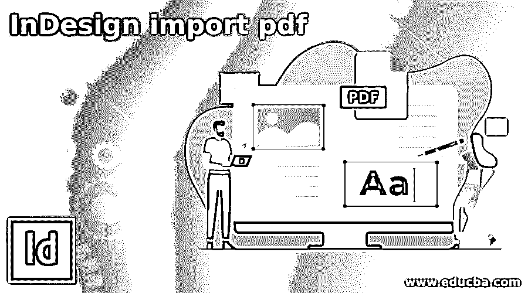

## InDesign 导入 pdf 简介

InDesign Import PDF 是一种方法，通过它我们可以将任何 PDF 文件导入到该软件中以用于不同类型的目的。我们不能直接将任何 PDF 文件导入该软件进行编辑。我们也可以使用“文件”菜单中的“放置”选项以及导入 pdf 脚本来完成此操作。在 InDesing 中，我们有一个内置的脚本来完成这项工作，我将在本文中告诉您位置选项和脚本选项。您可以使用此脚本或置入选项导入单页 pdf 以及多页 pdf。不仅是一个内置的脚本，你也可以下载和安装任何外部来源导入 pdf 脚本。

### 如何在 InDesign 中导入 PDF？

在 InDesign 中导入 pdf 并不是一件大事，我们只需遵循正确的步骤即可，最简单的方法就是使用“脚本和置入”选项。让我告诉你使用导入 pdf 脚本和置入选项的所有步骤。

<small>3D 动画、建模、仿真、游戏开发&其他</small>

我正在创建一个我在 Adobe illustrator 中创建的这个简单插图的 PDF 文件。为此，您可以使用任何 PDF 文件。在 illustrator 的这幅插图中，我们有 15 个画板。

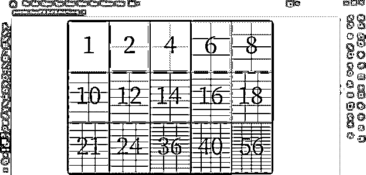

现在我会去这个软件菜单栏的文件菜单，点击它。在下拉列表中，我将从列表中选择“另存为”选项，或者您可以按 Ctrl + Shift + S 作为快捷键。

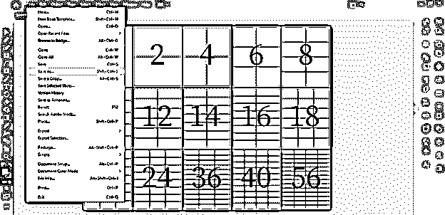

我将选择一个 pdf 文件格式保存为 PDF，并命名为纸张大小 1。

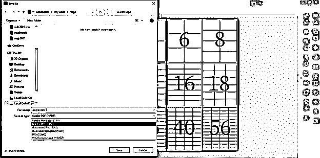

我将保留 pdf 对话框的设置，并单击保存 PDF 按钮。

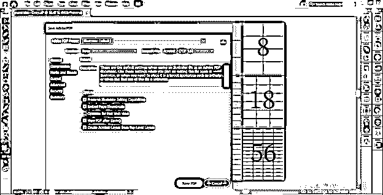

现在，我将从该软件的新建文档对话框中取出任意大小的文档，并保留所有其他设置。

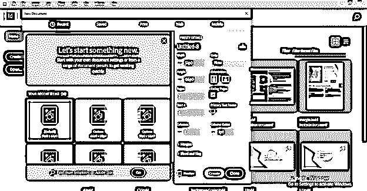

现在，我将转到菜单栏的文件菜单下拉列表的位置选项。或者我们可以使用它的快捷键，即键盘的 Ctrl + D 键。

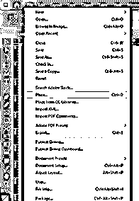

现在，我将转到计算机上保存我的 illustrator 作品的 pdf 文件的位置。我将通过点击来选择它。

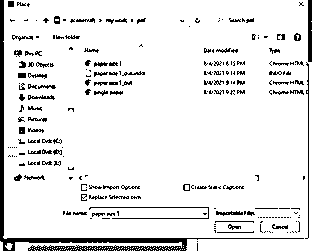

鼠标光标上会出现一个 pdf 图标，一旦我们单击文档页面，它就会像这样出现在所选的文档页面上。你可以看到这不是一个完美的地方，因为我们最初有。我将在本文的后面告诉您解决方案。

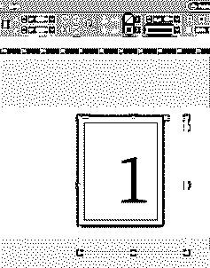

现在，我将再次打开一个位置对话框，这一次我将通过单击复选框来启用“显示导入选项”,然后单击该对话框的“打开”按钮。

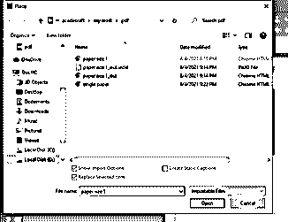

在导入我们的 pdf 之前，我们有这种类型的放置 PDF 框。在此对话框中我们有许多选项，例如我们可以选择要放置的 pdf 页面范围，我们可以通过启用此对话框的“透明背景”选项来放置具有透明背景的 pdf，等等。

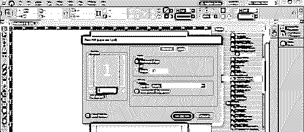

现在我将告诉你如何通过使用这个软件的脚本来做到这一点。这次我不会带走任何文件。

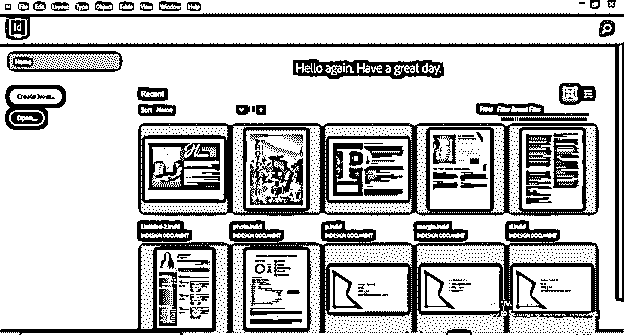

我将转到菜单栏的窗口菜单，并转到其下拉列表的实用程序选项。在新的下拉列表中，我将选择脚本选项。可以按 Ctrl + Alt + F11 作为快捷键。

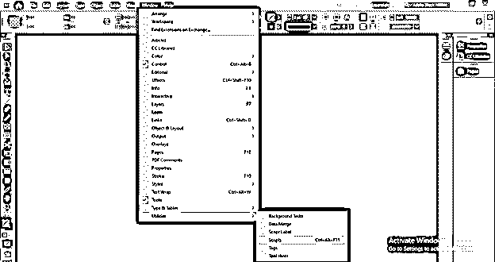

一旦我们单击脚本选项和脚本面板，我将在用户屏幕上打开，如下所示。

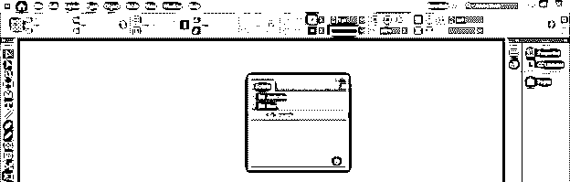

单击应用程序文件夹的下拉按钮，然后单击示例文件夹和 JavaScript 文件夹。

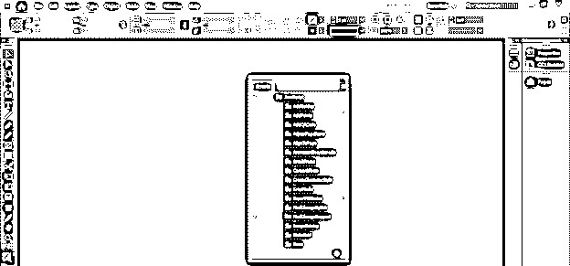

这里我们在这个文件夹的列表中有“PlaceMultiplepagePDF”脚本。

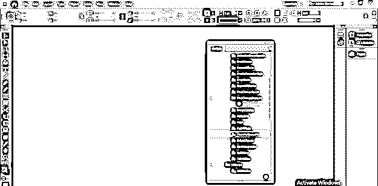

双击它，一旦我们点击我们有'选择 PDF 文件'对话框。因此，我将选择这个 pdf 文件，然后单击“Ok”按钮。

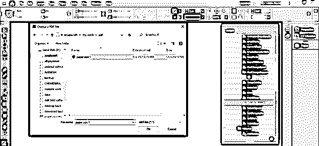

单击“确定”后，我们会看到这个消息框，因此再次单击“确定”按钮。

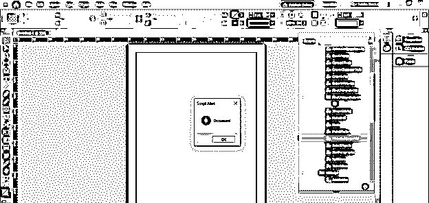

它将询问您是否要将选择的 pdf 放入此文档。例如，这里我只有一个未命名的文档选项卡-1，所以它向我显示了它的名称。

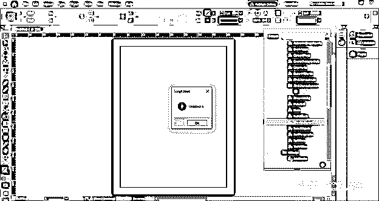

现在它会问你要把这个 pdf 放在文档的哪一页。目前，我只有 1 页，所以它只给我一个选项。所以点击确定。

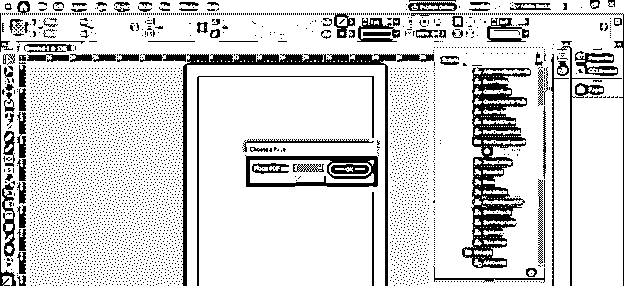

现在它会像这样放置 pdf 的页面。

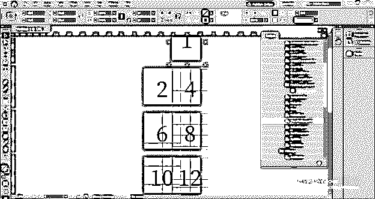

你可以注意到和我们之前的问题一样，pdf 页面和文档页面没有完全对齐。原因是两者的页面大小不同。

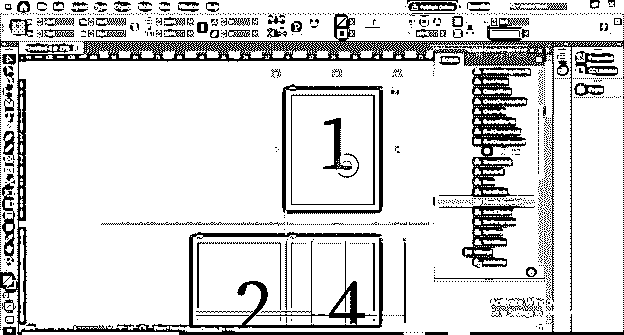

所以我会去 illustrator 那里检查我的插图的画板的大小。如果您有来自客户端的 pdf 文件，那么您可以在 Adobe acrobat 的帮助下检查 PDF 页面大小。

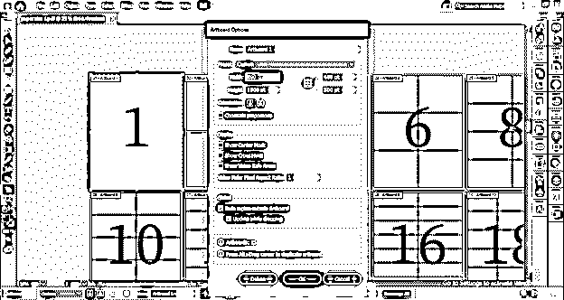

现在让我们切换到 InDesign，这次我将为它的文档页面采用相同的大小(pdf 页面的大小)。

并再次重复导入脚本 pdf 的过程。现在，我们在软件中打开了两个选项卡，您可以看到它在询问您要将 pdf 放在哪个文档中。

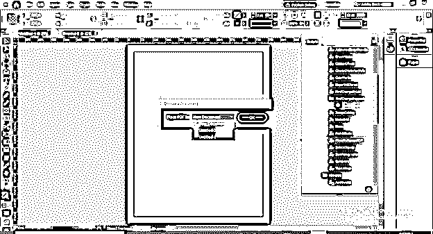

在浏览完之前看到的所有消息选项后，我们的 pdf 页面完全适合该软件的文档页面，因为这一次我们的两个页面大小相同。

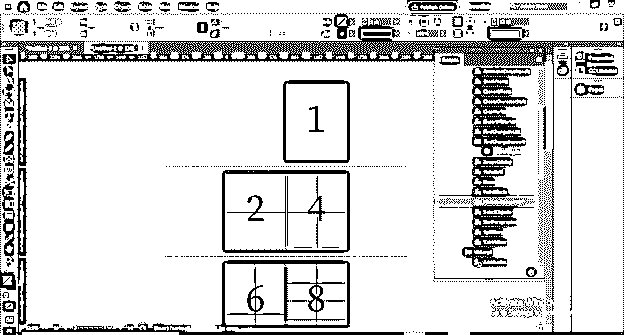

### 结论–InDesign 导入 pdf

现在看完这篇文章后，你将不会面临任何类型的困难，把 pdf 文件放在这个软件的不同目的。您也可以在 InDesing 中安装任何用于导入 pdf 的外部脚本，因为该软件允许您安装外部脚本并像使用内置脚本一样使用它们。

### 推荐文章

这是 InDesign 导入 pdf 的指南。在这里，我们将详细讨论如何在 InDesign 中导入 PDF 以及相关步骤。您也可以看看以下文章，了解更多信息–

1.  [Indesign 版本](https://www.educba.com/indesign-version/)
2.  [什么是 Adobe InDesign](https://www.educba.com/what-is-adobe-indesign/)
3.  [InDesign CS6](https://www.educba.com/indesign-cs6-top-ten-new-features/)
4.  [InDesign 文档设置](https://www.educba.com/indesign-document-setup/)

