# InDesign 目录

> 原文：<https://www.educba.com/indesign-table-of-contents/>

## InDesign 目录简介

当我们准备设计大量内容时，InDesign 目录是设计布局的重要组成部分，对于这些文本内容，我们需要用页码或任何其他指示来提及每一页的内容细节，以便我们可以轻松识别哪些内容在哪个页面上。如果你的文档设计中有目录，那么读者可以很容易地通过你的布局设计来访问，这将是一个有效的布局设计。如果需要，您可以手动创建目录，但是 InDesign 中有一些选项和设置，我们可以通过它们自动创建目录。

### 如何在 InDesign 中创建目录？

为了根据我们每页的文本内容在该软件中创建目录，我们必须浏览该软件的一些选项，并使用它们的参数和设置。因此，让我们开始讨论这些选项。

<small>3D 动画、建模、仿真、游戏开发&其他</small>

我的文档中有这些文本内容。

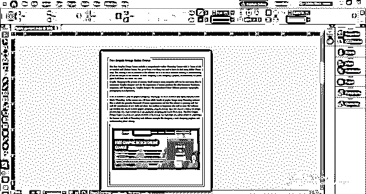

现在，我将打开该软件的段落面板，它位于用户屏幕右侧的不同面板部分。

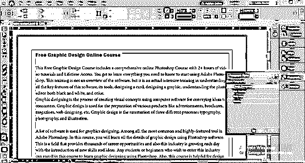

如果你的工作屏幕上没有这样的面板，那么你可以进入菜单栏的窗口菜单，然后进入下拉列表的样式选项。在新的向下滚动样式列表选项中，我们可以找到段落样式面板，或者您可以按 F11 作为快捷键。

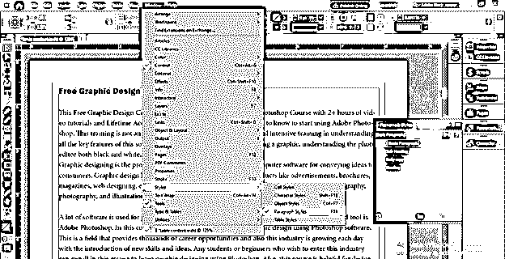

在这个段落面板中，我创建了三层，如标题、副标题和正文，每一层都有不同的文本格式。如果我选择这个顶部的文本，你可以看到它在段落样式面板的“标题”层。

现在，我将为这些图层创建图层组，因此我将单击该面板按钮上的“创建新样式组”按钮。

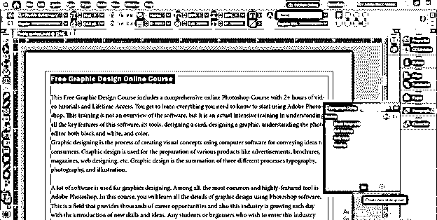

一旦我点击这个按钮，一个对话框将在这里打开，你可以根据你的选择来命名，我会把它命名为主要内容。

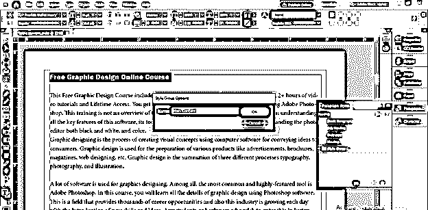

现在，我将这些层移动到主内容组文件夹。

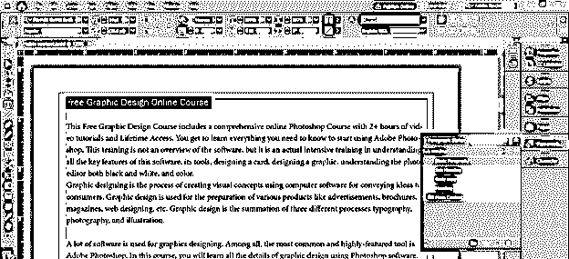

现在，我将创建另一个组，即目录。

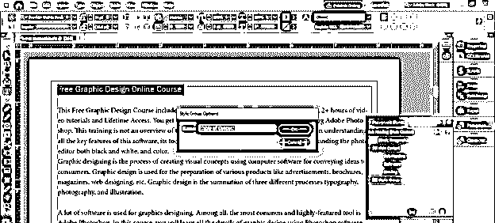

现在我将为目录创建三层，分别为目录标题、目录副标题和目录正文。

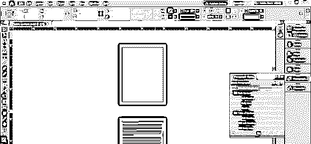

我选择了主要内容组的标题层作为 TOC 标题的基础层，我也为 TOC 组的其他两层做了同样的工作。(suc 作为目录子标题的子标题和目录正文的正文)。

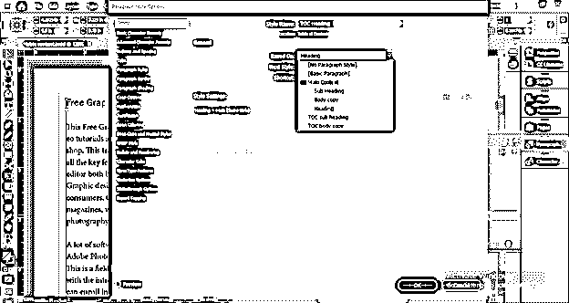

现在，我将选择这个标题，并点击 TOC 标题层，将其分配给 TOC 标题层，我将对所有标题进行同样的操作。

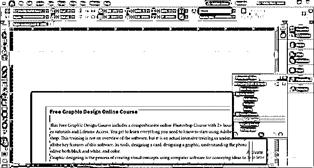

如果你想把它添加到你的内容中，现在为副标题做这件事。

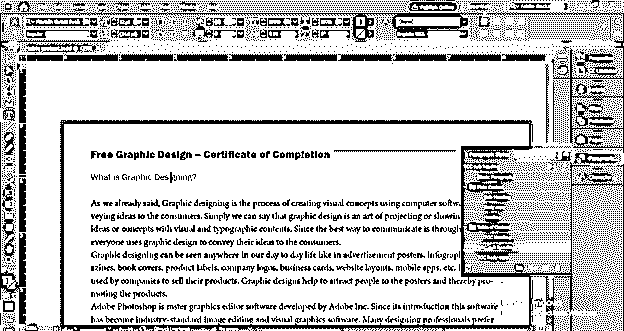

现在进入布局菜单，点击下拉列表中的目录选项。

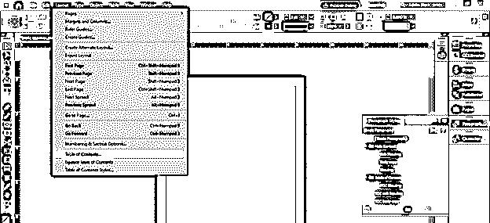

单击此选项后，我们会看到目录对话框。这里我们可以在这个框的标题选项中给出内容表的平铺。

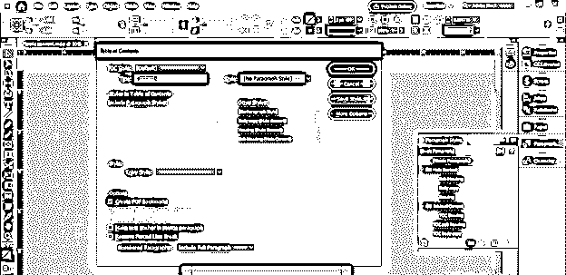

我将把它命名为目录。

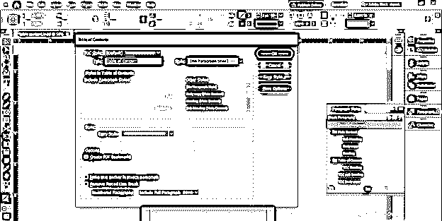

我将选择标题样式作为目录标题段落样式。

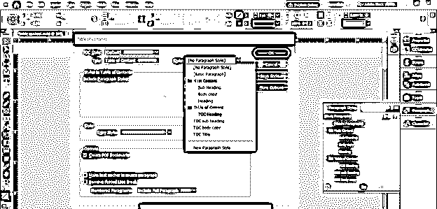

现在转到此对话框的下一部分，在这里您可以选择要在目录下添加的内容。

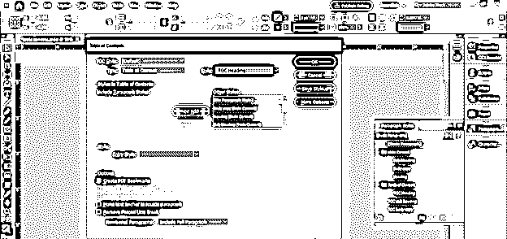

我将选择目录标题段落样式，然后单击“添加”按钮将其移动到目录中。

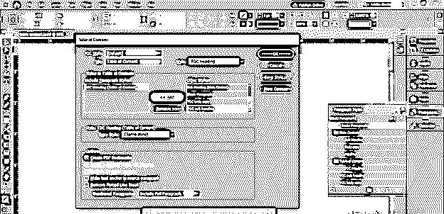

你可以在这里添加列表数量，但我在这里只添加了列表。

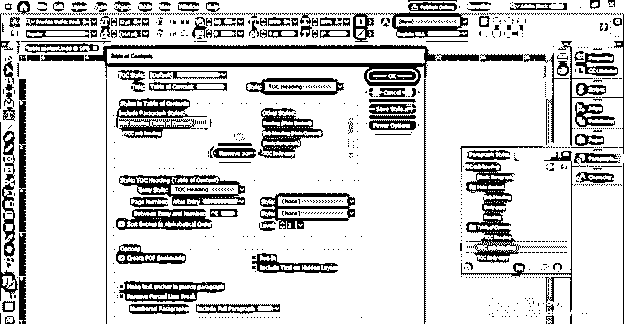

在“包括段落样式”选项中选择目录标题，并从“条目样式”选项的下拉列表中选择目录标题选项。

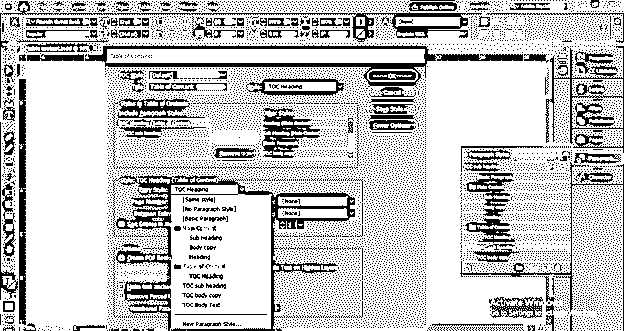

现在在同一个选项中选择 TOC 副标题层，然后我将在条目样式中选择 TOC 副标题。

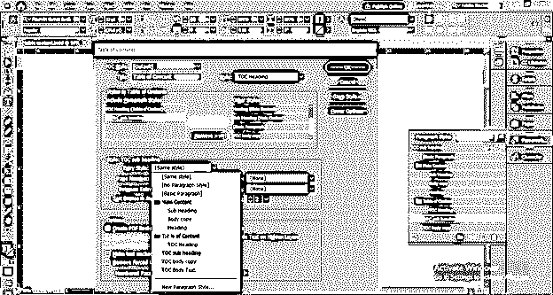

您可以点击此对话框的保存样式按钮，保存当前数据以备将来使用。

有一个“较少选项”标签，你可以点击它来减少这个对话框的选项。

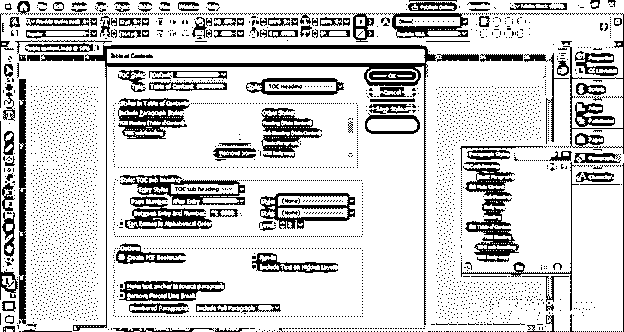

现在点击对话框中的确定按钮。

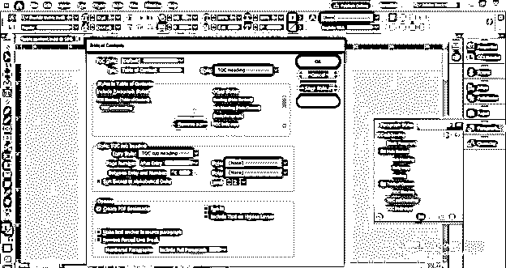

单击“确定”按钮后，鼠标光标上会出现表格内容的详细信息，我们可以用鼠标光标绘制一个文本框。

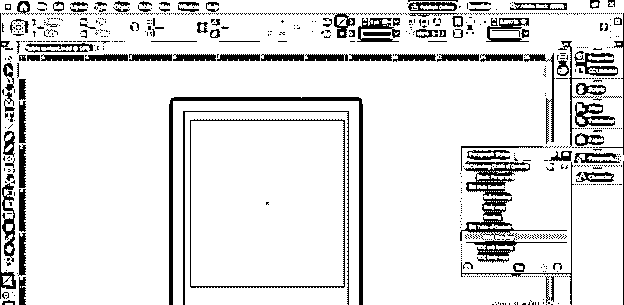

一旦我们释放鼠标按钮，我们选择的内容将进入表格的内容，就像这样。

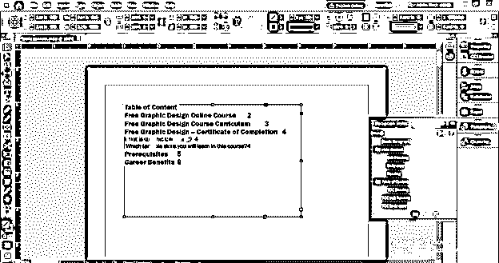

如果我们再次打开目录对话框，您可以看到有“按字母顺序排列条目”选项，所以这次我将通过单击其复选框来启用该选项。

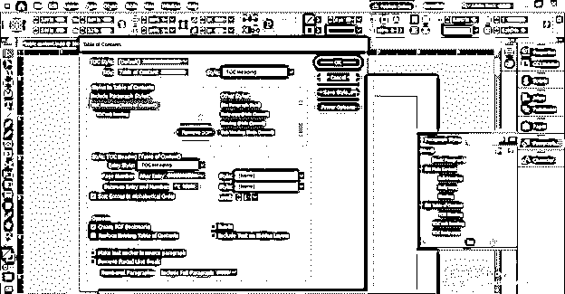

你可以看到它会按照字母顺序排列内容。

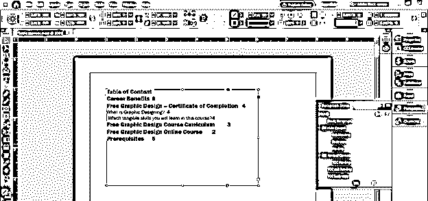

现在，如果我们想在页面右侧设置页码，我们可以为此做一些设置。我们在目录标题层有这些数字，所以在段落样式框中双击这一层。

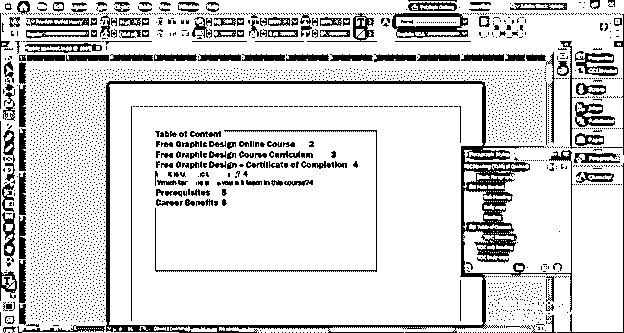

这里将打开一个对话框。在此对话框中，转到缩进和间距选项。

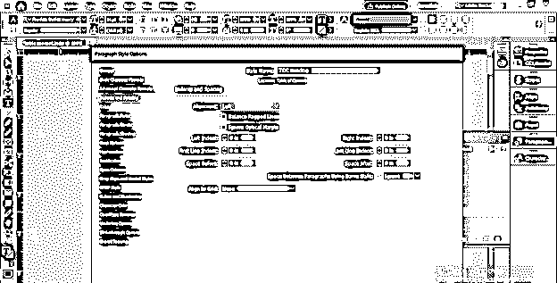

确保您已启用此对话框的预览选项。

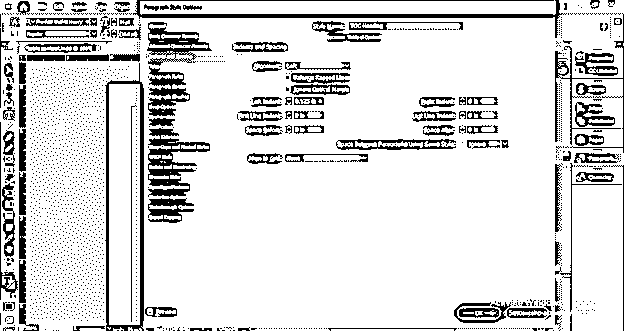

在这里，我们可以通过改变空间选项的值来调整行的间距。

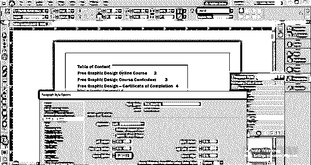

现在选择制表符选项，并在此输入制表符值。我将在此处添加右制表符值，并在 Leader 选项中输入一个点字符。你可以看到我们的目录没有更新。

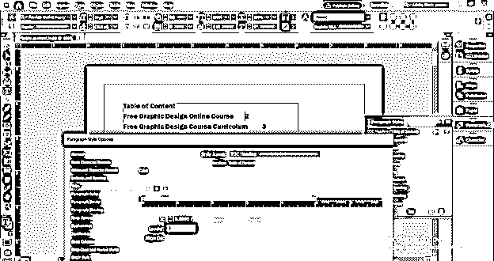

要查看更新，请再次转到目录对话框，并在此选项中选择右缩进制表符。

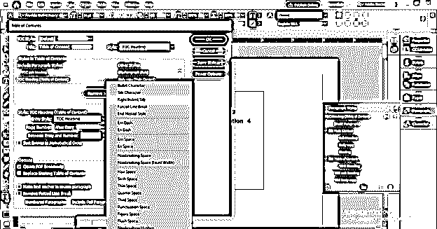

一旦你点击确定按钮，它就会像这样更新。

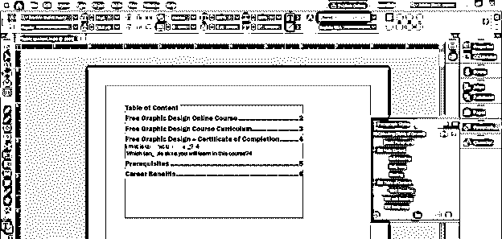

你可以根据你的页面来调整。

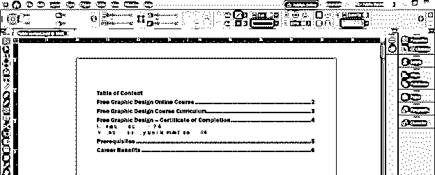

### 结论

这样，您可以在文档中创建一个目录，以便对内容进行更详细的解释。您可以分析“目录”对话框中的其他选项，以便在您的目录中有不同的变化，并且您可以用自己的创意来创建它。

### 推荐文章

这是 InDesign 目录指南。在这里，我们将讨论如何在 InDesign 中创建目录以及相关步骤。您也可以看看以下文章，了解更多信息–

1.  [什么是 Adobe InDesign](https://www.educba.com/what-is-adobe-indesign/)
2.  [InDesign CS6](https://www.educba.com/indesign-cs6-top-ten-new-features/)
3.  [Indesign 版本](https://www.educba.com/indesign-version/)
4.  [Indesign 的替代方案](https://www.educba.com/alternative-to-indesign/)

