# InDesign 更改页面大小

> 原文：<https://www.educba.com/indesign-change-page-size/>

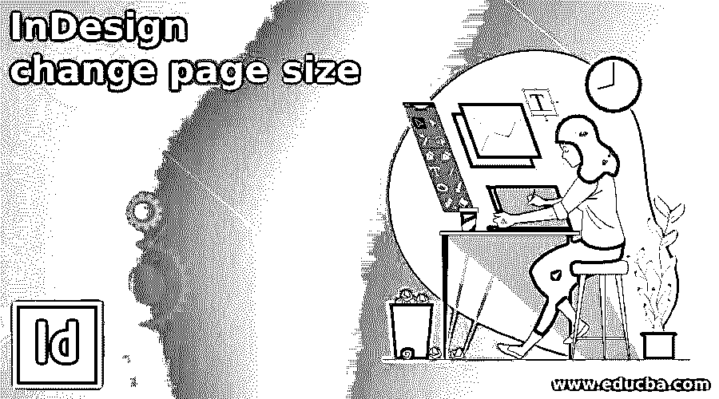

## InDesign 简介更改页面尺寸

InDesign 更改页面大小是该软件的一个非常有用的功能，因为在处理大型项目时，我们必须根据项目的要求来调整页面大小，有时您可能需要更改文档中某些页面或某一页面的大小，以达到不同的目的。InDesign 为我们提供了一些选项，通过这些选项，我们可以根据您的要求调整页面的大小，我们不仅可以更改页面的大小，还可以按相同的比例调整页面内容和文本的大小。所以让我们好好讨论一下这个话题。

### 如何在设计中更改页面尺寸？

有许多方法可以根据我们的要求改变文档页面的大小，为此，我们必须经历菜单栏菜单的不同选项的一些设置。让我告诉你这个。

<small>3D 动画、建模、仿真、游戏开发&其他</small>

我将创建一个 8.5 英寸 x 11 英寸的信纸大小的文档。

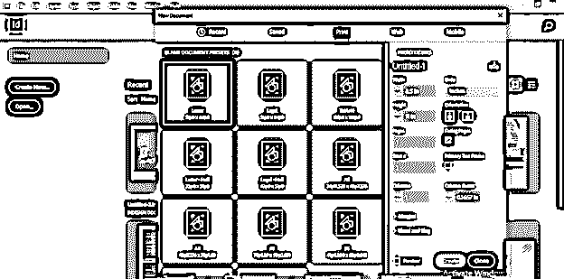

我在这个文档页面上创建了一些带有文本的设计元素。

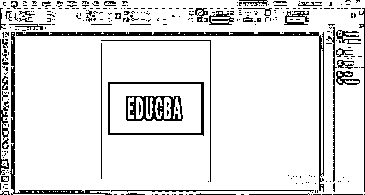

现在要调整这个页面的大小，我们必须转到这个软件用户界面顶部的文件菜单，从它的下拉列表中选择“文档设置”选项，或者你可以按 Ctrl + Alt + P 作为快捷键。

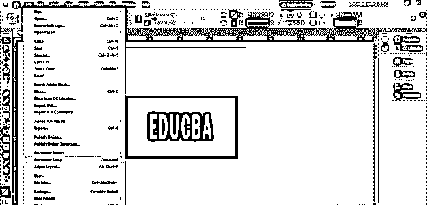

一旦我们点击这个选项，一个文档设置框就会像这样打开。我们在这个对话框中有许多参数和设置，例如我们可以增加文档中的页数，改变页面大小，设置边距以及出血和嵌条等。

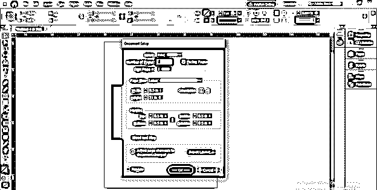

在此对话框的页面尺寸选项中，我们有一个页面尺寸预设列表，因此您可以选择其中任何一个。

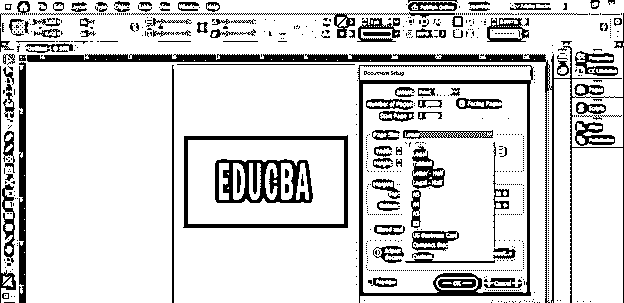

您也可以从这些方向选项中更改页面的方向。

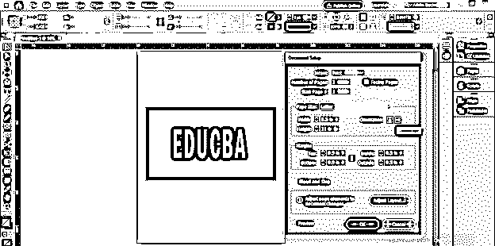

现在，我将通过更改此对话框的页面大小列的宽度和高度值来更改此页面的大小。请确保此对话框中有一个预览按钮，您可以看到页面的大小已经更改，但设计元素和文本没有更改。

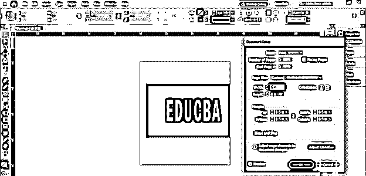

如果您切换到布局模式，您可以看到我们的设计元素已不在此页面区域内，并且页边距也没有变化。

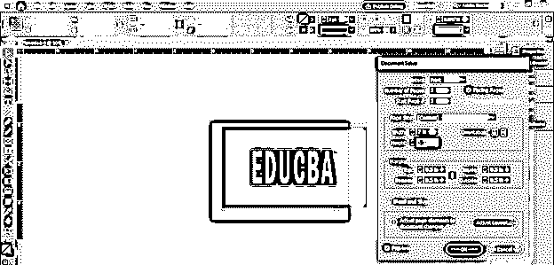

如果您还想调整设计元素和文本的大小，请单击此对话框的调整布局按钮。

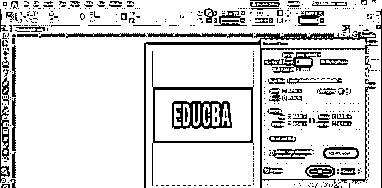

一旦我们点击这个选项，一个调整布局的新对话框将会像这样打开。

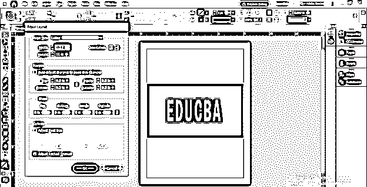

在这里我们可以改变这个页面的宽度和高度。我还将通过单击复选框来启用边距参数的自动调整选项。此对话框中没有预览选项，因此单击确定按钮查看调整参数的结果。

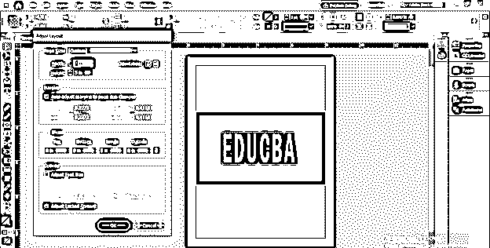

你可以看到页面的大小一直在变化，但是文本大小没有任何影响。此文本框的右上角有一个红色加号，表示文本不适合此文本框。

现在我将再次打开调整布局框。如果需要，您还可以在更改页面大小时调整出血大小。

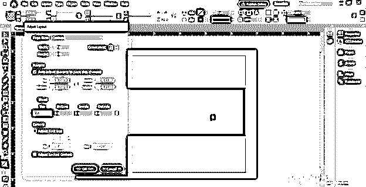

在这个对话框中有“调整字体大小”选项，所以这次我将通过点击它的复选框来启用它。

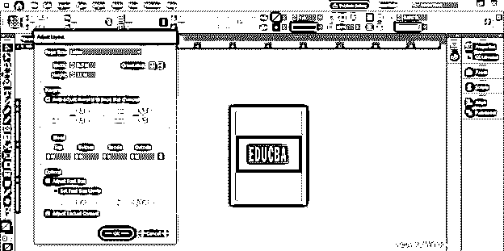

和调整页面大小，然后单击此对话框的“确定”按钮。

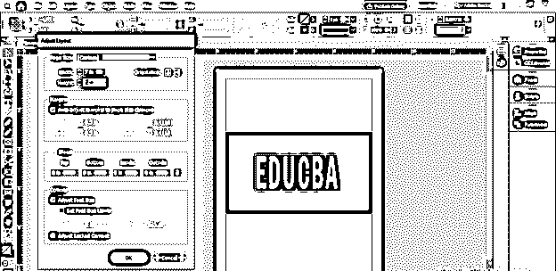

你可以看到这一次我们的文本也随着页面大小的调整而调整了大小。

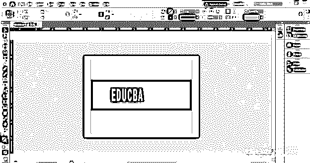

让我告诉你如果你的文档中有很多页会发生什么。为此，将转到文档设置对话框，并从此处增加页码。

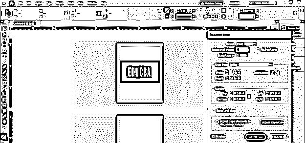

并在所有页面上显示设计内容和文本。

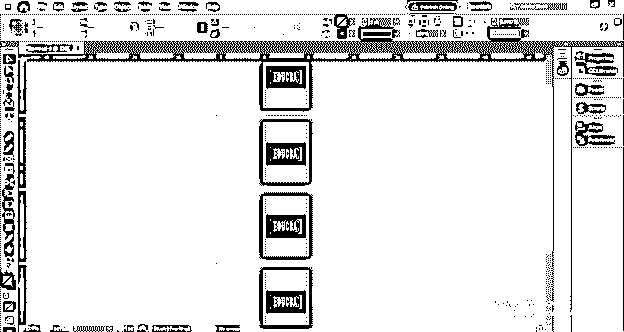

现在我将打开调整布局对话框。您可以直接从“文件”菜单的下拉列表中打开它。您也可以使用快捷键，即键盘的 Alt + Shift + P 组合键。

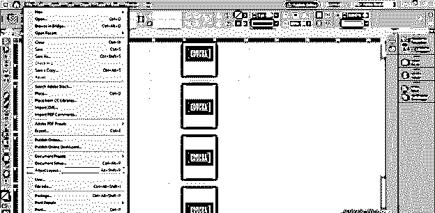

现在，在这个对话框中，我将进行与本文前面步骤相同的设置。我将把它的大小调整为同样的 7 英寸 x 5 英寸。

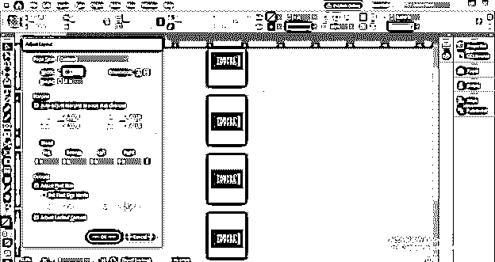

而且你可以看到文档的所有页面的所有页面大小都被改变了。所以如果你想改变整页文档的大小，你可以选择这个选项。

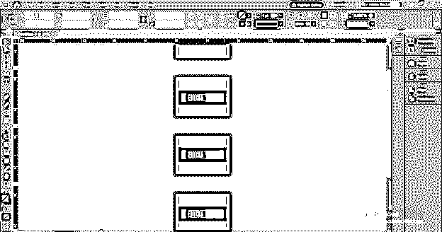

现在让我们打开页面面板，了解调整页面大小的另一种方法。

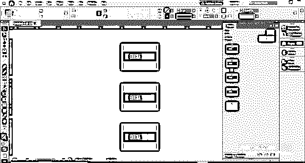

您可以在“窗口”菜单的下拉列表中找到此页面面板，或者按键盘上的 F12 功能键作为快捷键。

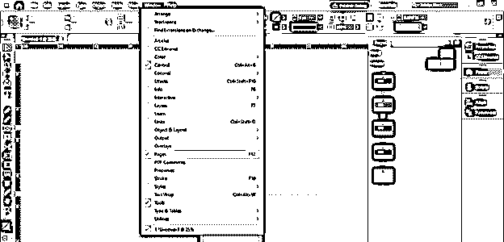

使用这种方法，我们只能改变我们所选页面的大小。我想更改第 2 页的大小，因此我将选择它并转到此页面面板的底部。在底部，我们有一个编辑页面大小的选项。

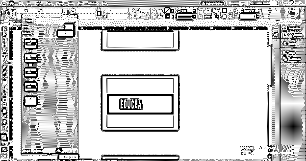

一旦我们点击一个列表将被打开，所以点击自定义选项，或者你可以从打开的列表中选择任何大小。

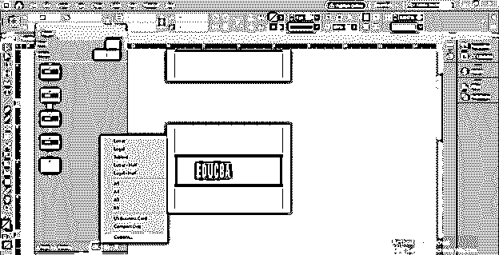

在此对话框中，我们可以保存将要创建的页面。

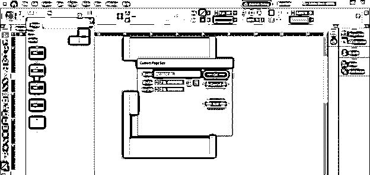

现在我将改变它的大小，然后点击这个对话框的添加按钮。

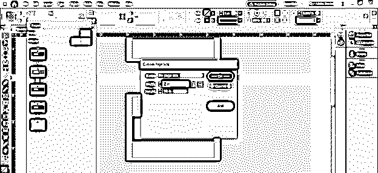

我选择的尺寸将保存在这个对话框中，我们以后也可以使用。

一旦我用选择的尺寸点击确定按钮，我选择的页面将像这样调整大小，但是用这种方法，我们不能调整设计元素的大小。

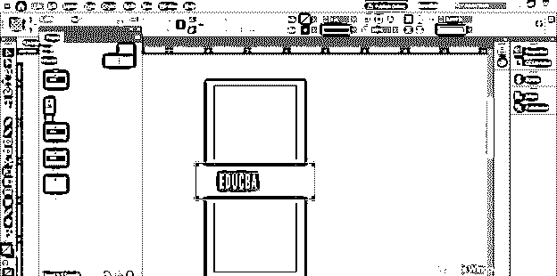

### 结论

在本文中，我告诉了您一些方法，通过这些方法您可以根据自己的需要调整文档页面的大小，现在您已经了解了调整单个页面和多个页面大小的两种方法。您可以分析上面讨论的选项的参数，以便对它们有更多的了解。

### 推荐文章

这是 InDesign 更改页面大小的指南。在这里，我们将讨论如何在 Design 中更改页面大小及其步骤。您也可以看看以下文章，了解更多信息–

1.  [Indesign 版本](https://www.educba.com/indesign-version/)
2.  [Indesign 的替代方案](https://www.educba.com/alternative-to-indesign/)
3.  [InDesign CS6](https://www.educba.com/indesign-cs6-top-ten-new-features/)
4.  [用户界面设计](https://www.educba.com/user-interface-design/)

