# InDesign 相册模板

> 原文：<https://www.educba.com/indesign-book-templates/>

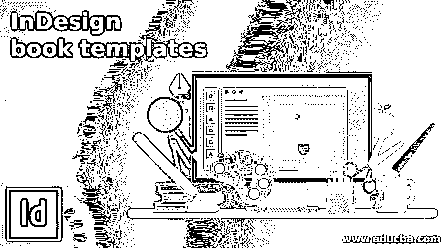

## InDesign 相册模板简介

Adobe InDesign 是设计师中最受欢迎的创建书籍模板和多文档页面的软件。该计划具有创建和设计创造性的书籍和杂志所需的所有功能和工具。在本文中，我们将学习如何设计书籍模板并在 Adobe InDesign 中使用它们。此外，我们还将学习管理和引导文档的详细流程&页面设置、文本、页边距、标尺、指南以及用于创建合适书籍模板的所有工具。

### 如何在 Indesign 中创建和使用书籍模板？

创建一本书是一个复杂的过程，涉及到多个文档中的页面设置、边距、参考线、标尺和文本。要在 InDesign 中创建一本书，我们首先创建需要为该书设计的文档和页面。然后我们将这些页面添加到我们需要出版的书中。

<small>3D 动画、建模、仿真、游戏开发&其他</small>

为一本书创建文档时要记住的一些要点是:-

*   页边距:页边距是在特定页面上创建的，用于按照适当的顺序调整文本、图像、符号和其他艺术品。此外，它还有助于文档打印的不当管理。
*   出血:这是一个重要的页面设置工具，帮助用户根据大小和布局设计页面。出血区域是打印时将被裁剪的部分。用户可以在处理较大的图像和照片时使用该功能。
*   装订线:这是用于双面页面的重要设置。页面之间的空间称为装订线。
*   行距:行与行之间的间距是行距。该功能用于文本段落。行距应该与页面布局互补。

### 如何在 InDesign 中创建多页文档？

要在 Adobe InDesign 中创建文档，第一步是计划和执行文档设置。大部分工作都依赖于我们在创建页面文档之初所做的设置。剩下的工作是在文档中调整和创建文本、图形和图像。

以下是创建文档的步骤

1.  打开并启动 Adobe InDesign

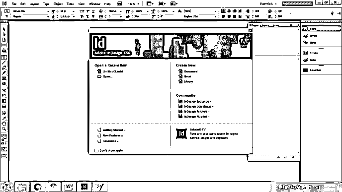

2.  如下所示创建一个新文档。这里，我们正在创建一个新文档，而不是一本新书。
3.  现在，一个新的对话框将作为文档设置出现。大多数页面设置都在此窗口中设置。

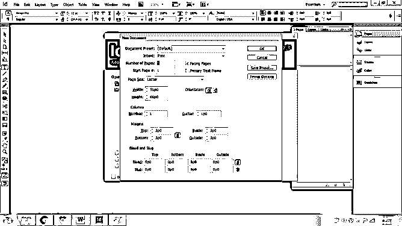

4.  正如我们在图像中看到的。我们可以调整页面的高度和宽度。

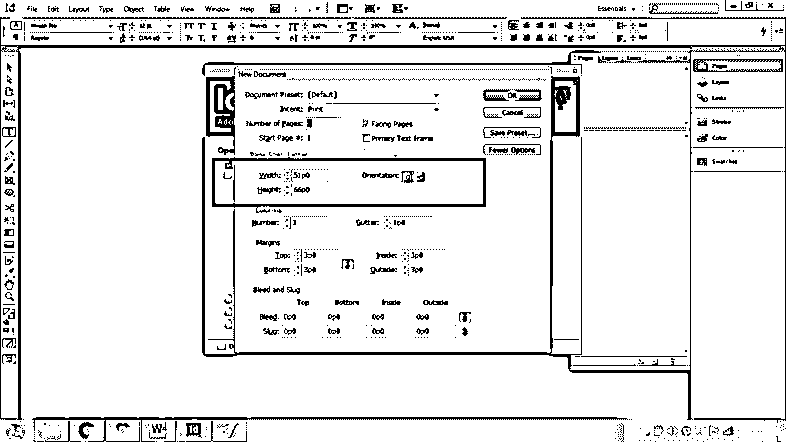

5.  我们有选择页数和添加双面页面的选项。

6.  我们还可以选择页面的方向。肖像或风景。

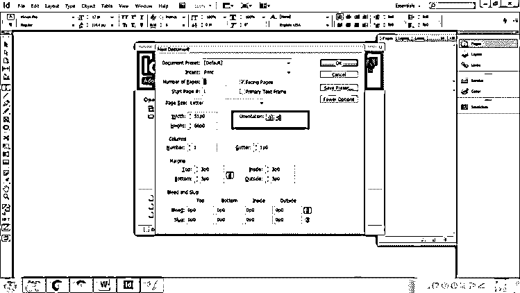

7.  接下来，我们可以根据需要调整页面的边距。

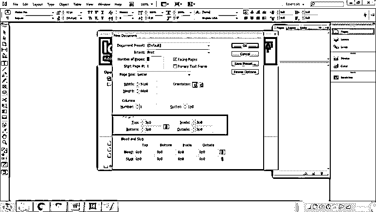

8.  要设置出血和嵌条，请在同一个窗口中前往“更多选项”。

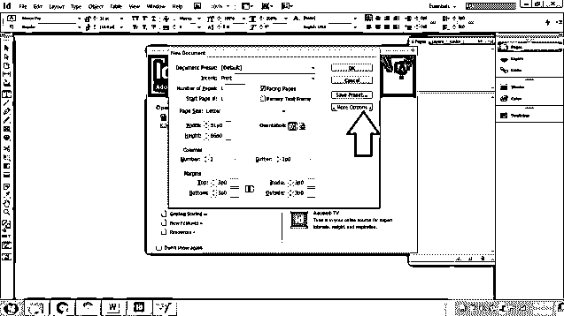

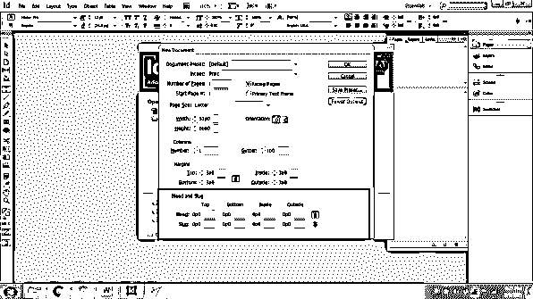

9.  接下来，单击“确定”创建文档。

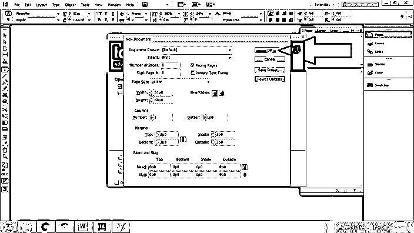

10.  转到“窗口”并选择“页面”以查看“页面”窗口。

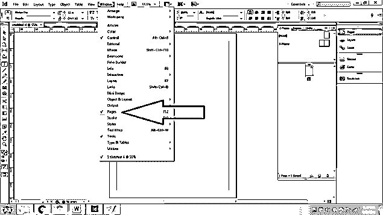

11.  我们还可以使用此窗口向当前文档添加页面，然后单击“创建新页面”。

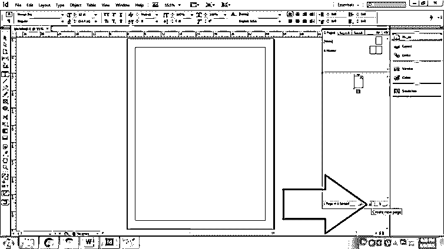

12.  现在，我们可以在页面上添加文本和图形艺术作品来创建文档。

### 如何应用母版页？

母版页是不打印的页面，但用于为文档中创建的其他页面创建一组条例。用户可以创建多个母版页，并相应地将在母版页上创建的格式应用于活动页面。

**以下是创建母版页并将其应用到活动页面的步骤:-**

1.  启动 InDesign

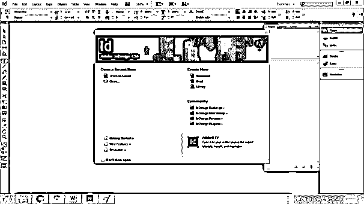

2.  创建一个有十页的新文档，打开双面页面选项和主文本框架，然后单击确定

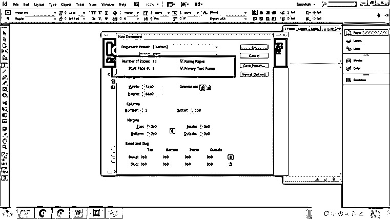

3.  现在，我们将在母版页上添加文本。确保双击母版页来处理相同的内容。您还可以通过查看显示活动页面的文档底部面板来仔细检查。

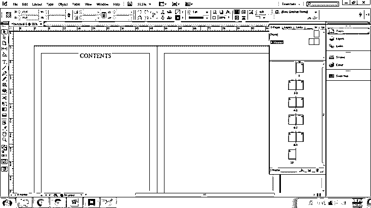

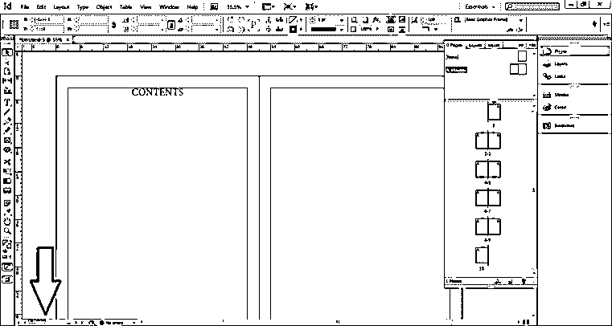

4.  接下来，您还可以添加新的母版页。右键单击当前母版页，并选择“新建母版页”以添加另一个母版页。

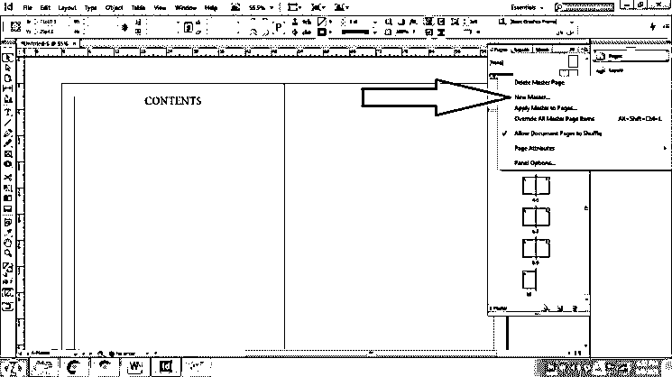

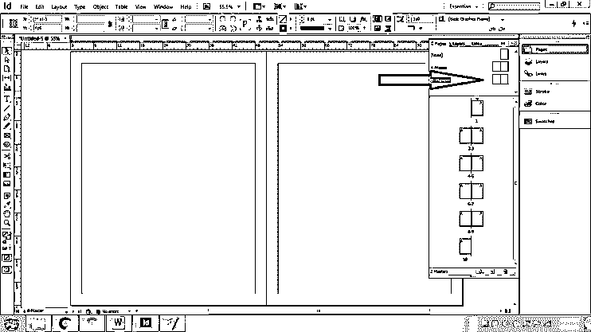

5.  在母版页上添加作品后，我们可以将母版页的格式应用到其他页面，方法是将母版页拖动到所需的页码，或者右键单击母版页并选择“将母版页应用到”。您将看到一个对话框，我们在其中输入需要应用所选母版页的页码。

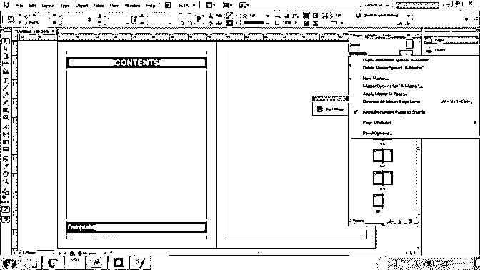

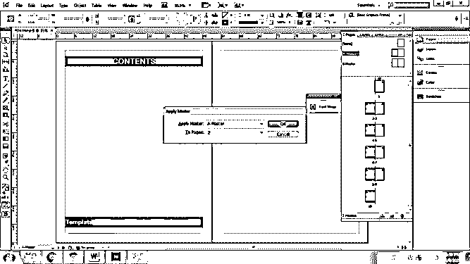

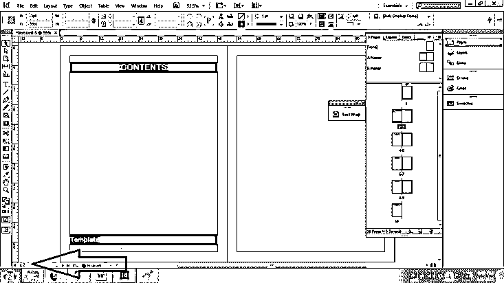

6.  示例:–

*   双击主页，然后单击文字工具。

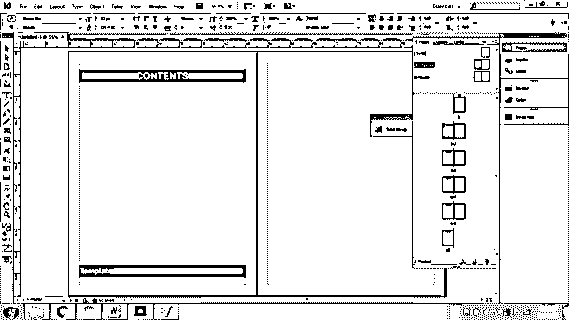

*   创建一个文本框，右键单击>插入特殊字符>标记>当前页码。

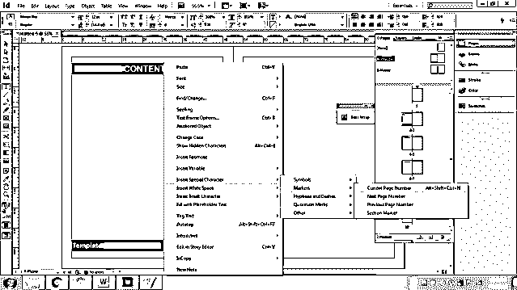

*   现在，将母版页应用于所有页面，您将看到页码已经按照指示出现在每页的底部。

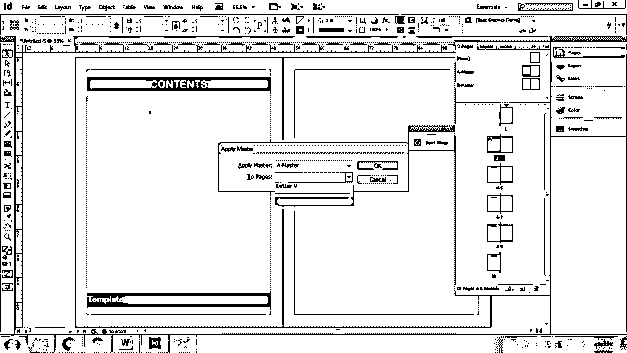

*   我们可以使用文字工具随时修改文本框。

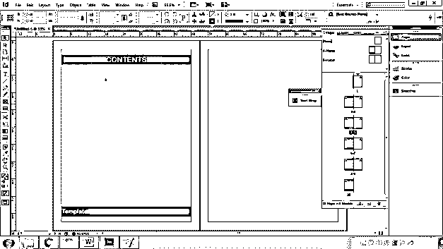

### 如何创建书籍和模板？

基本上，书籍和模板是一组具有相似文本格式、文档样式、符号和母版页的文档。当我们创建一本书时，我们首先创建文档，然后将这些文档添加到一本书中。这样做有助于用户更快更准确地修改页面及其设置。

以下是使用 InDesign 创建书籍的步骤

1.  启动 InDesign

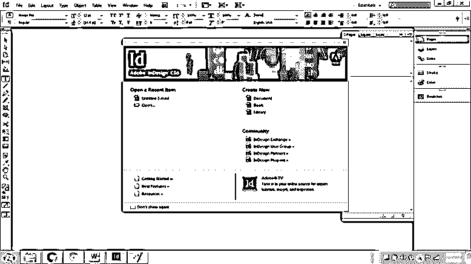

2.  转到文件>新建>图书

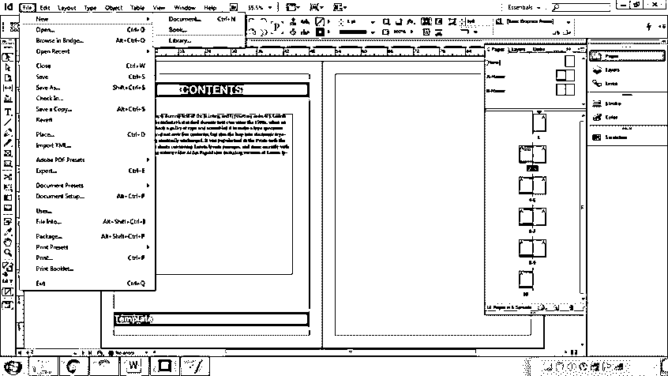

3.  将出现一个对话框来保存这本书

4.  现在，保存这本书后，一个新的对话会以书的形式出现。

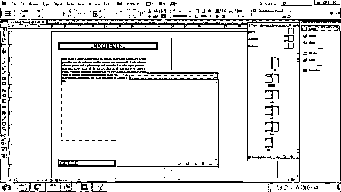

5.  我们可以添加/删除书本中保存的 InDesign 文档，如下所示。

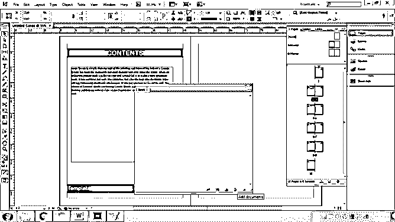

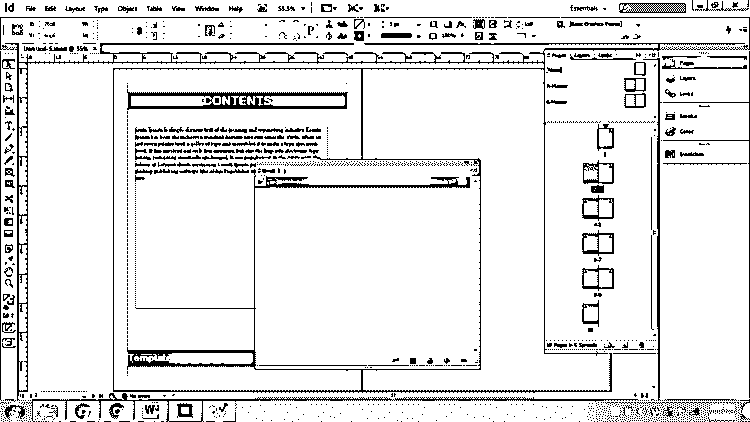

### 结论–InDesign 书籍模板

文章的结论是，Adobe InDesign 是一个不可思议的程序，可以用来创建书籍和模板。它使工作变得更容易和按时间顺序进行。用户可以轻松地学习在 InDesign 中制作创意书籍和杂志的技巧和方法。

### 推荐文章

这是 InDesign 书籍模板指南。这里我们讨论如何设计书籍模板并在 Adobe InDesign 中使用它们。您也可以看看以下文章，了解更多信息–

1.  [Indesign 版本](https://www.educba.com/indesign-version/)
2.  [Indesign 的替代方案](https://www.educba.com/alternative-to-indesign/)
3.  [什么是 Adobe InDesign](https://www.educba.com/what-is-adobe-indesign/)
4.  [InDesign CS6](https://www.educba.com/indesign-cs6-top-ten-new-features/)

