# InDesign 竖排文本

> 原文：<https://www.educba.com/indesign-vertical-text/>

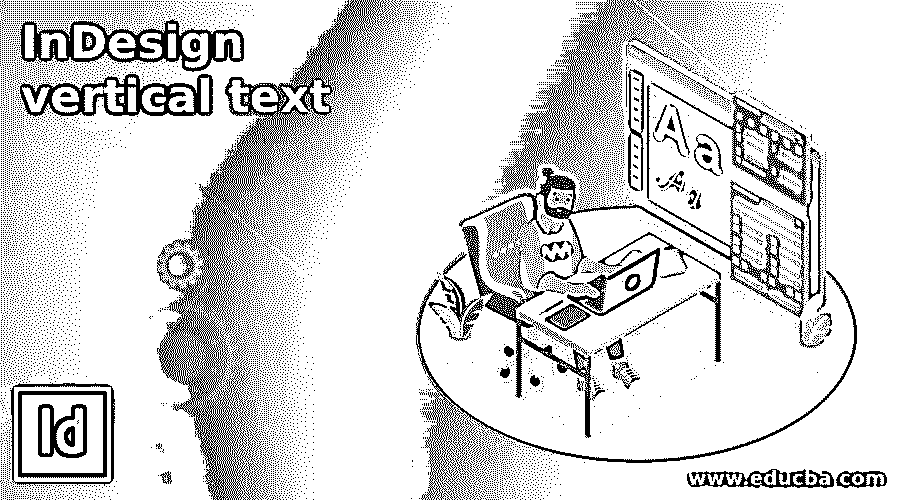

## InDesign 竖排文本简介

InDesign 垂直文本是一种文本格式，我们可以在垂直位置排列文本。根据我的观点，我们可以用两种方式理解垂直文本，第一种方式是改变文本在垂直位置的旋转，第二种方式是垂直键入文本。我将在这篇文章中解释这两者，我们将使用工具面板的一些工具，菜单栏的一些选项，以及该软件的一些其他重要功能来创建不同用途的垂直文本。我还会向你解释如何在设计这个软件的几个项目工作布局时使用它。

### 如何在 InDesign 中使用和创建竖排文字？

我们可以在 InDesign 中创建竖排文本，以便进行有效的设计布局和管理给定文本框架中的文本，或者创建竖排文本的原因有很多，这完全取决于您的工作要求。

<small>3D 动画、建模、仿真、游戏开发&其他</small>

首先，让我们创建一个新文档，为此，我将在该软件的欢迎屏幕上单击“新建”按钮，并使用“新建文档”对话框的默认设置。

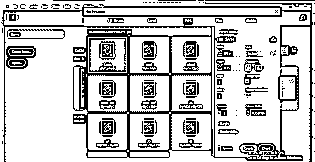

我现在将从工具面板中选择文字工具。

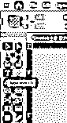

我在这个软件的文档页面上有这个文本内容，我将首先在这个文本的帮助下向你解释垂直文本。

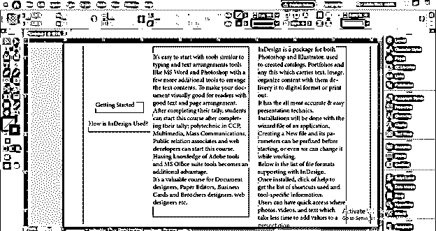

我会改变这两个文本的文本样式和字体大小。

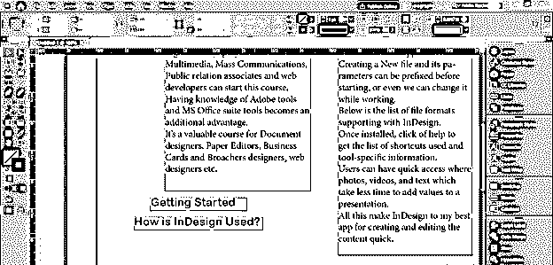

现在有了选择工具，我们可以像这样旋转它。如果我们按住键盘的 shift 键，然后旋转它，那么它将旋转 45 度。

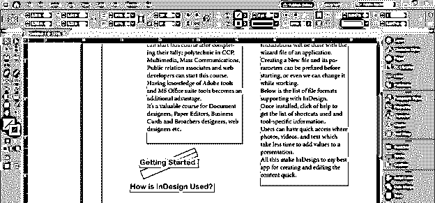

我将对其他同样的文本采取同样的做法。

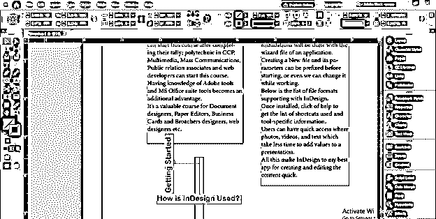

现在你可以看到两者都处于垂直位置。所以这是第一种方法，我们可以在垂直方向上旋转文本，并将它们与其他文本一起设置，以获得良好的排版效果。

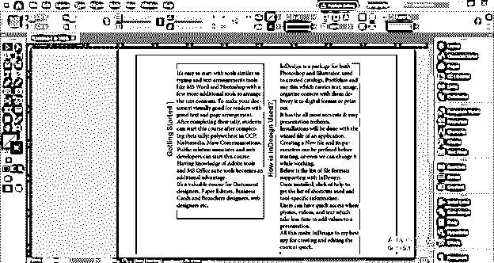

现在让我告诉你如何垂直输入文本。为此，我们必须从工具面板中选择线条工具或按键盘上的\按钮作为快捷键。

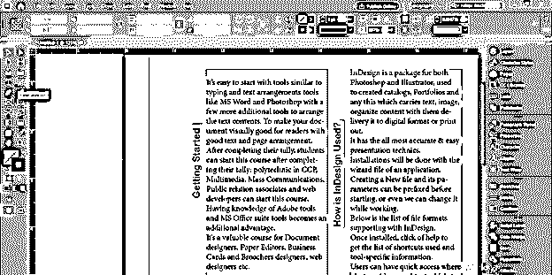

现在像这样画一条垂直线。如果我们按住 shift 键，那么绘制的线将是垂直的直线。

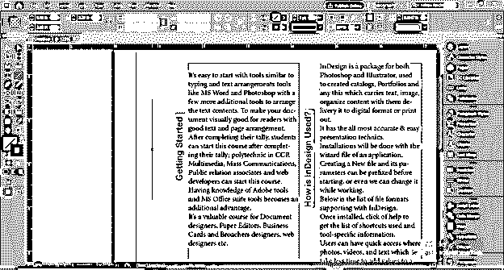

现在转到工具面板，点击文字工具的下拉箭头按钮。在这个箭头中，我们输入了一个路径工具，所以选择它。您可以使用键盘的 Shift + T 按钮作为快捷键。

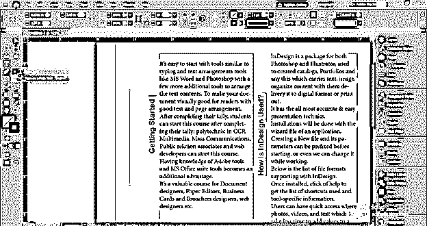

用路径类型工具点击画好的线，一旦你点击一个闪烁的书写光标，线上就会出现一个文本。

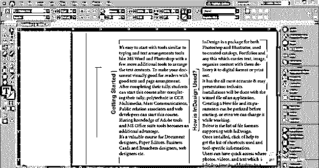

我将输入 InDesign 作为这一行的文本。您可以在这里键入您想要的文本。

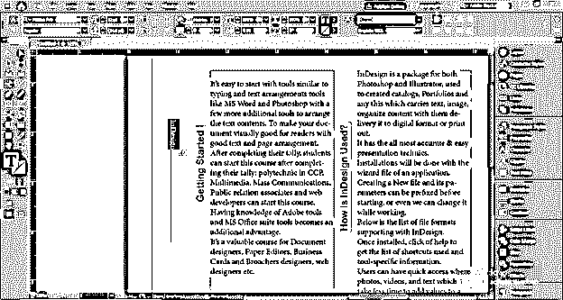

我将增加它的字体大小，并改变字体风格，然后改变它的颜色。

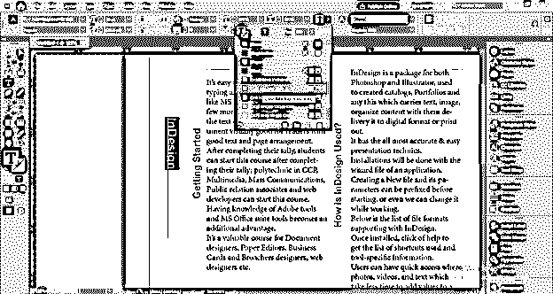

现在，为了使文本垂直，请转到菜单栏的类型菜单并点击它。从“在路径上键入”选项的新下拉列表或“类型”菜单的下拉列表中选择“选项”。

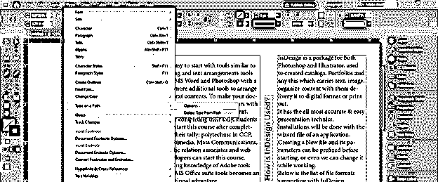

这里将打开一个“路径输入”对话框。点击此对话框效果选项的下拉箭头按钮。

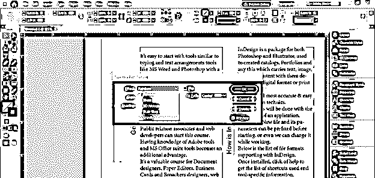

并选择楼梯台阶选项。一旦你选择它，你可以看到文本将转换成垂直文本。

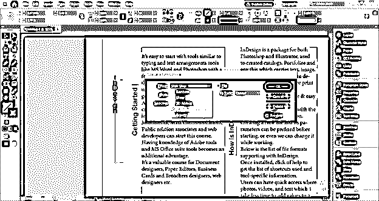

您也可以调整其他参数来将此文本与路径对齐。完成所需的设置后，单击该对话框的“确定”按钮。

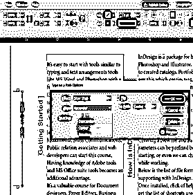

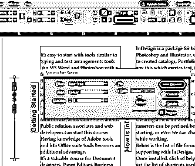

如果你想像这样垂直翻转文本，可以点击翻转选项。

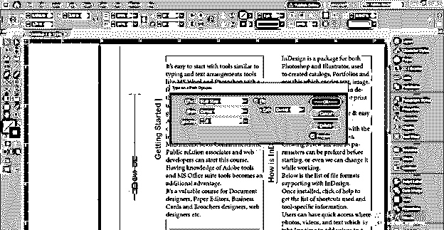

现在如果我们按 W 键转到预览模式。

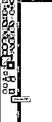

你可以看到这条竖排文字的可见路径。

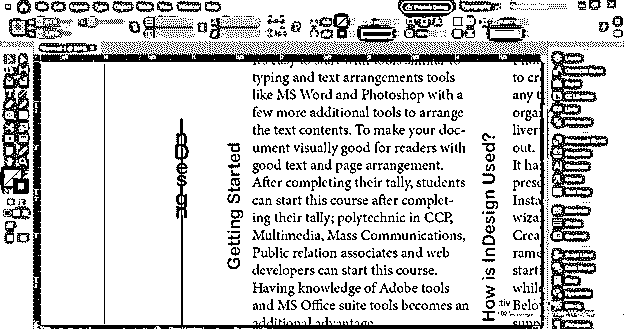

这是因为线上有一个笔画，所以请到“笔画颜色”框中关闭笔画。现在你可以看到他们唯一的道路。

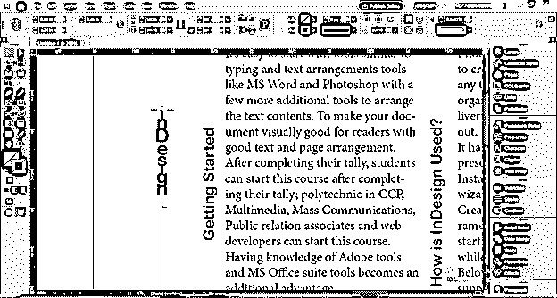

当您取消选择它时，您可以清楚地看到垂直文本。

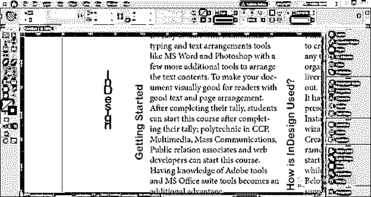

您也可以在将文本格式转换为竖排文本后对其进行更改。

现在让我通过一个例子告诉你如何使用这种竖排文字。为此，我将再次获取一个新文档，并在此放置一个图像。为了放置图像，我将转到菜单栏的文件菜单的放置选项，或者你可以按 Ctrl + D 作为它的快捷键。

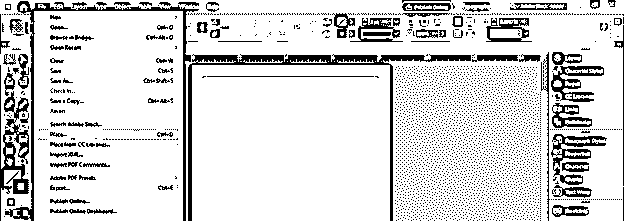

我将从打开的对话框中选择此图像。

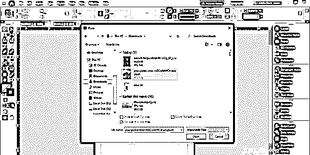

我从 Unsplash.com 下载了这张美丽的图片。

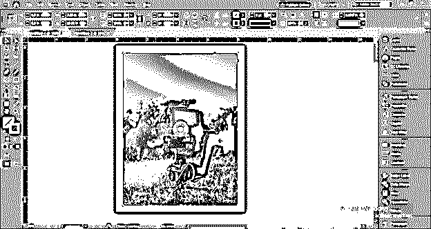

现在我会像这样在这里画一条垂直线。

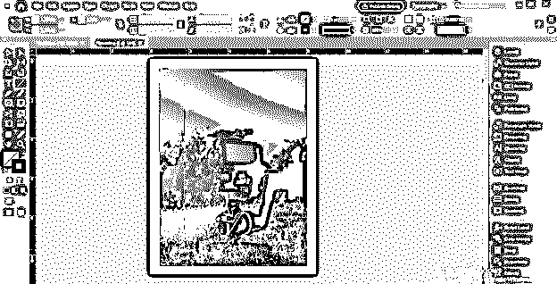

并在此输入摄影文字。

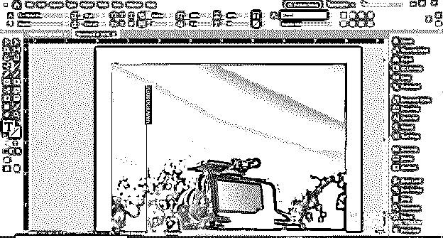

现在，我将再次打开“键入路径选项”对话框，并选择与上一步相同的台阶选项。

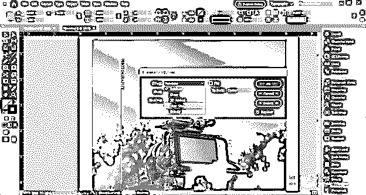

现在变成这样的竖排文字。

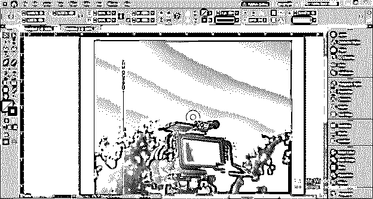

我现在就把线划下来。

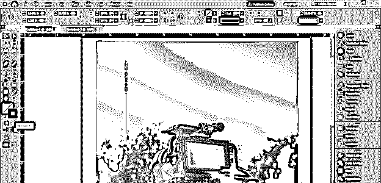

现在我将改变这个文本的字体大小。

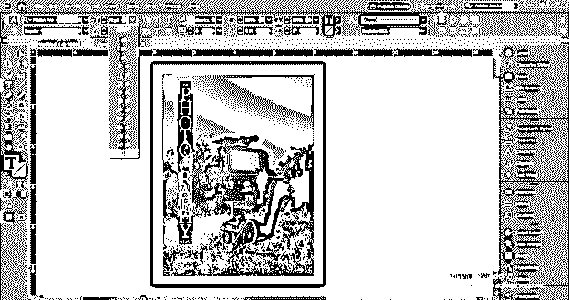

并从字体样式中选择这种衬线字体的字样。

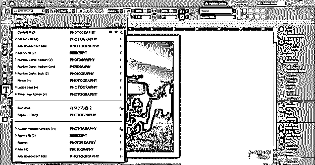

现在，我将从字符格式面板中调整这段文字的字母间距，你可以在工作屏幕的顶部找到这个面板。

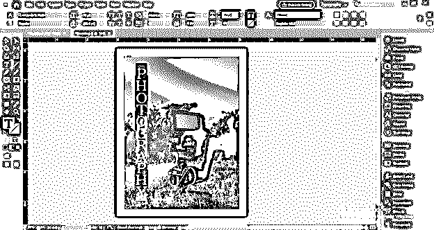

现在，我将在颜色框部分选择一个文本颜色框。

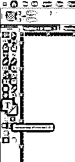

并将文本的颜色改为蓝色。

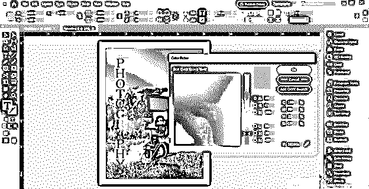

您也可以复制此竖排文本。要制作副本，你只需选择文本的路径，按住键盘上的 Alt 键拖动它。

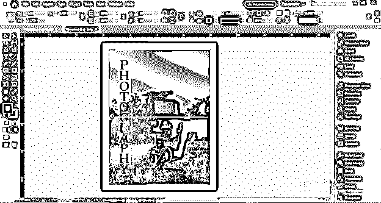

现在，我将添加一个渐变到复制的文本，为它添加一些效果。

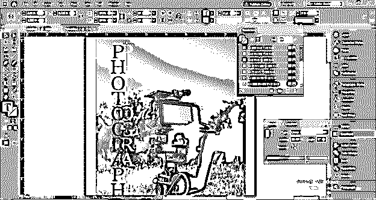

像这样设置这个梯度。你可以看到，这样我们就可以设置一个垂直的文本，来制作一个好的设计，我们可以使用文本内容。

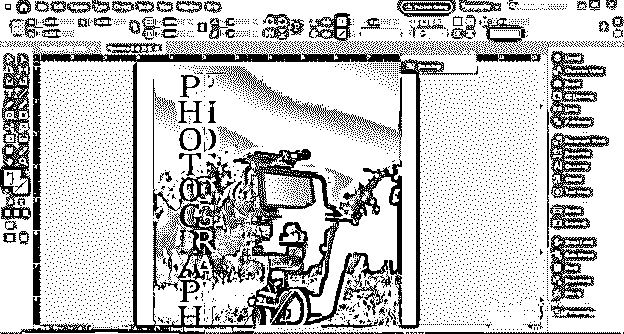

### 结论

我相信你一定会在你的设计布局中使用竖排文字 f，让你的设计越来越有效。您可以调整“路径文字”工具的参数，以便在竖排文本中获得不同类型的结果，因此开始练习它，以便更好地掌握它。

### 推荐文章

这是 InDesign 竖排文本指南。在这里，我们讨论这个软件的重要功能，为不同的目的创建垂直文本。您也可以看看以下文章，了解更多信息–

1.  [InDesign 网格](https://www.educba.com/indesign-grid/)
2.  [Indesign 版本](https://www.educba.com/indesign-version/)
3.  [Indesign 的替代方案](https://www.educba.com/alternative-to-indesign/)
4.  [什么是 Adobe InDesign](https://www.educba.com/what-is-adobe-indesign/)

