# InDesign 项目符号

> 原文：<https://www.educba.com/indesign-bullet-points/>

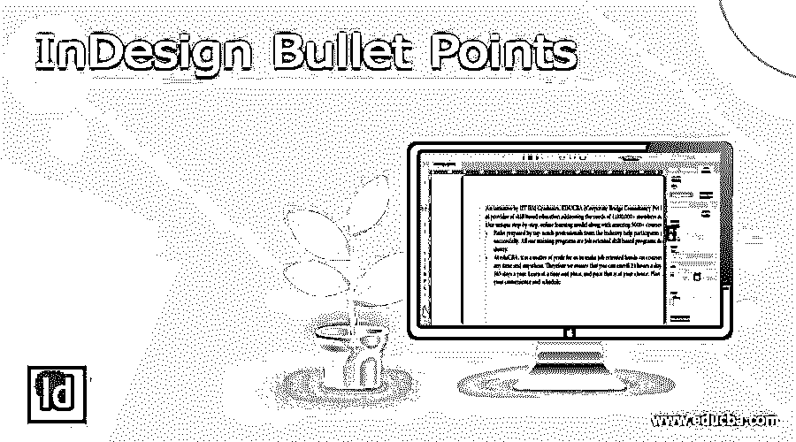

## InDesign 项目符号简介

InDesign 项目符号可以理解为在段落的句子开头添加一个特殊字符。项目符号可以是任何字符符号。在 InDesign 中，我们可以通过了解几个步骤来为文档添加项目符号。首先，我们添加一个项目符号并做一些格式化，比如改变项目符号的颜色、大小和样式。在这里，您可以从“字符样式”面板设置项目符号的样式，并在文档的任何部分进一步使用它。

### InDesign 项目符号概述

项目符号是我们文档类型设置的重要组成部分，因为它们给读者提供了良好的可读性。此外，您可以根据需要创建不同样式的项目符号，因为 InDesign 允许您创建自定义项目符号。

<small>3D 动画、建模、仿真、游戏开发&其他</small>

### 如何在 InDesign 中创建项目符号？

现在让我们完成为文档创建项目符号的步骤。为此，我将创建一个新文档，为此，请单击该软件欢迎屏幕上的“创建新文档”按钮，或者您可以按 Ctrl + N 作为快捷键。

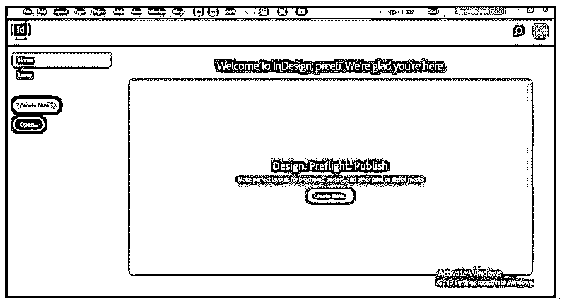

现在，我将从“新建文档”对话框中获取文档预设的 letter 大小。

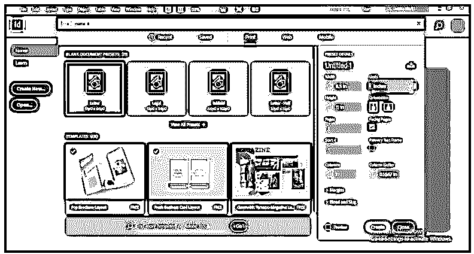

我将在文本工具的帮助下选取文本框架，并将此文本粘贴到此处。

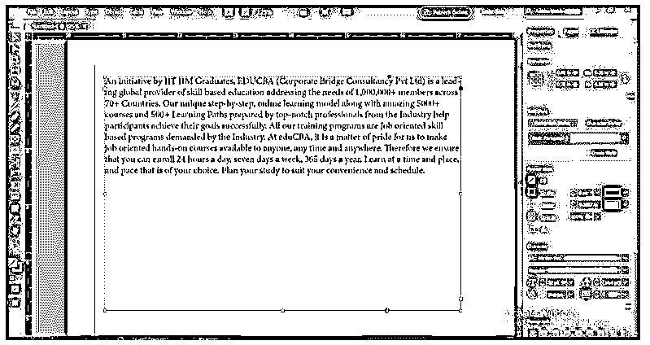

您可以在这里粘贴所需的文档内容，为此，请转到菜单栏的“文件”菜单，并从下拉列表中选择“放置”按钮。选择此选项后，将会打开一个对话框，您可以从中选择所需的文档文件，将其文本内容粘贴到此处。

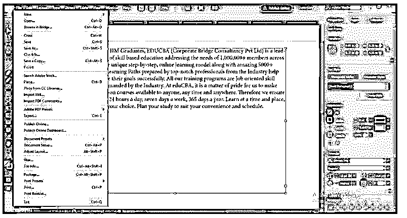

现在，为了将项目符号应用于此内容，我将首先选择一些文本，看看当我们对其应用项目符号时会发生什么。

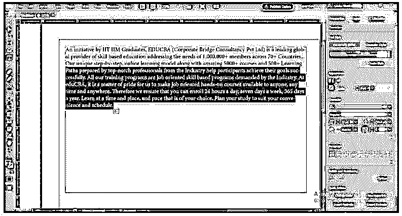

您可以转到“类型”菜单，在它的下拉列表中，您会发现“项目符号和编号列表”选项。您可以从该选项的新建下拉列表中选择应用项目符号选项。

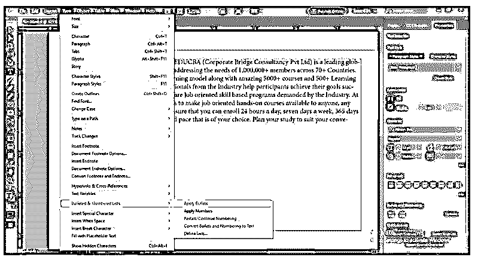

或者转到该软件的属性面板，它位于工作屏幕的右侧，在该面板的底部，您将有项目符号和编号选项，因此单击该选项的项目符号列表按钮。一旦你点击这个选项，一个项目符号将被添加在段落的开始，这意味着一个项目符号将被添加在每一段的开始。

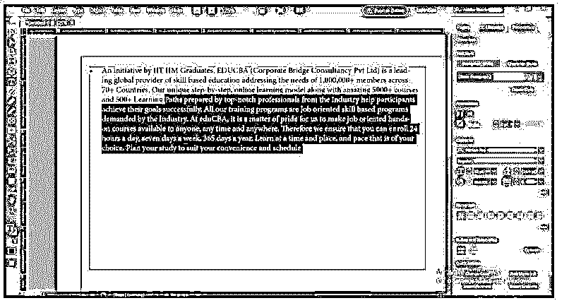

如果您没有将此面板放在此软件的工作屏幕上，请转到窗口菜单，并从下拉列表中选择属性选项。

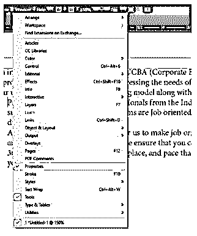

现在我已经通过按键盘上的回车键分隔了这个选中的文本，所以它是一个段落。当我重复所有步骤时，你可以看到一个项目符号将添加在这些选定段落的开头。

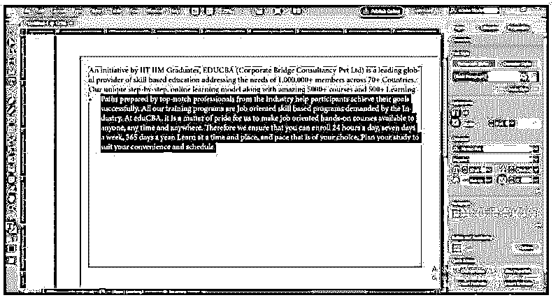

如果您想查看所选内容中有多少段落，您可以从“类型”菜单的下拉列表中启用“显示隐藏字符”选项。

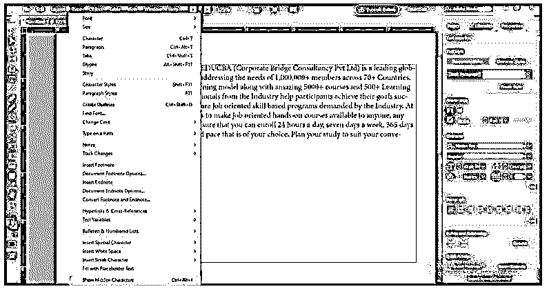

这个标志显示的是这一段的开始。

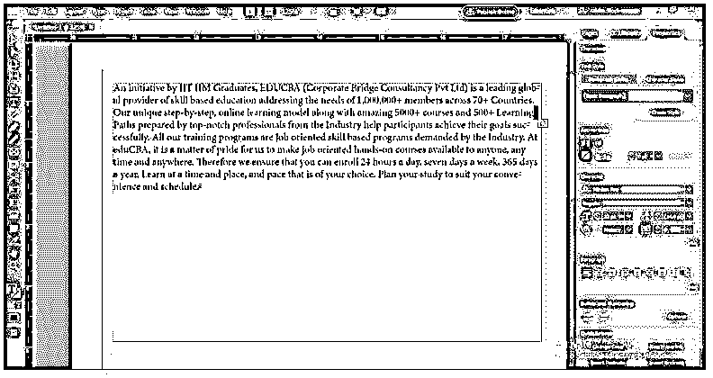

应用项目符号后，当你按下回车键时，它会将下一个项目符号添加到输入的行中。

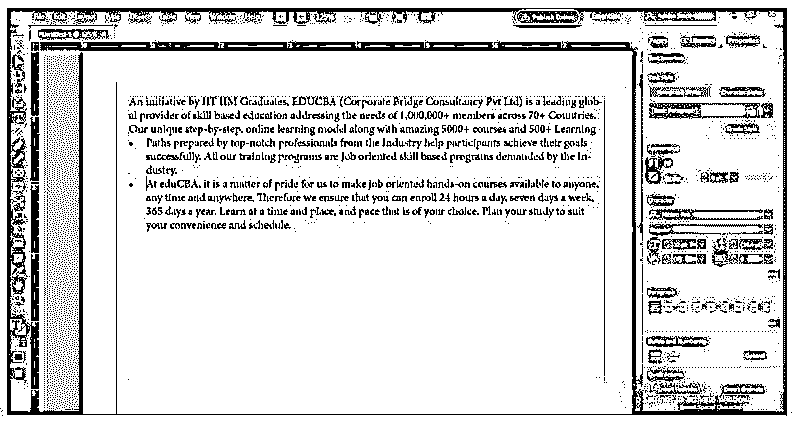

### InDesign 项目符号字符

让我告诉你要点字符，以及如何创建它们。但是，首先，去字符样式面板，你可以在窗口菜单的样式选项下找到它。

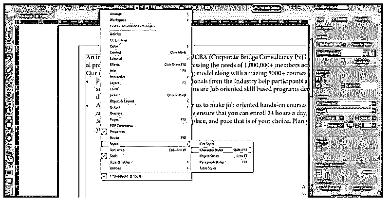

它会像这样打开。转到该面板的底部，然后单击“创建新的”按钮。

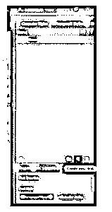

双击新的样式层，将会打开一个对话框。根据你的选择来命名。

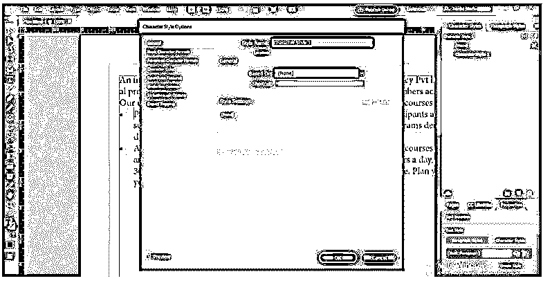

我将它命名为颜色项目符号，然后从该对话框的字符颜色选项中选择项目符号的颜色。

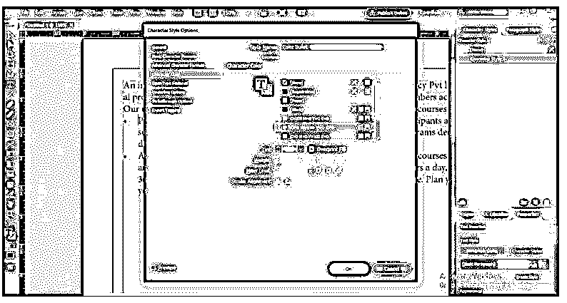

现在选择你想要改变颜色的项目符号的段落。

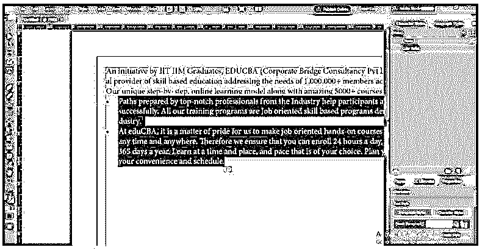

然后再次转到属性面板，然后单击项目符号和编号选项的选项按钮。

单击后，将会打开一个对话框。请选择我们在“字符样式”选项中创建的彩色项目符号字符样式，然后按“确定”按钮。

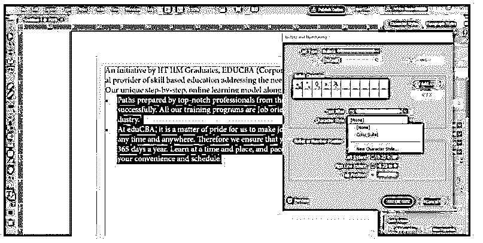

如果此对话框的预览选项被启用，您可以看到项目符号的颜色将根据我们选择的颜色而变化。

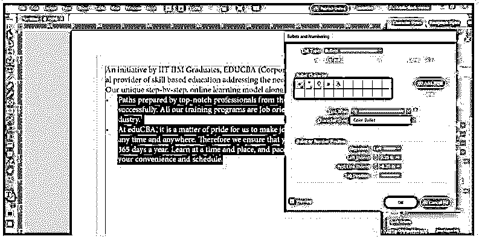

如果你想再次改变颜色，你可以去字符样式面板，更新项目符号的颜色。

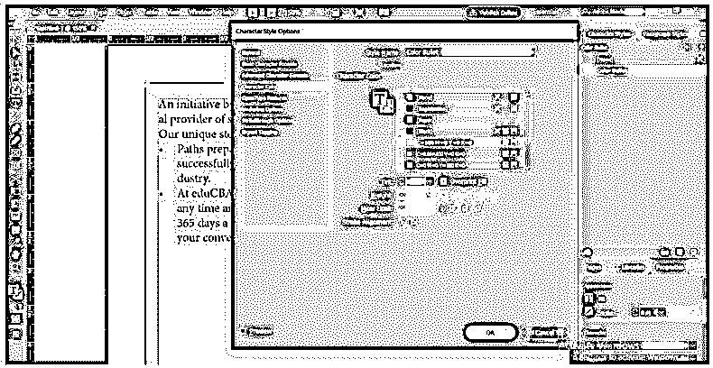

它会根据您选择的下一种颜色进行更新。

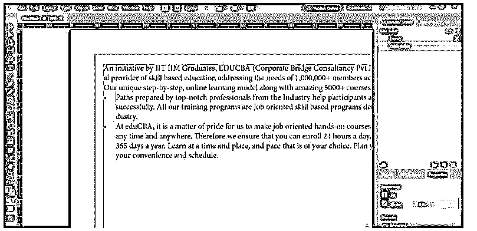

### InDesign 项目符号列表

我将单击项目符号的选项按钮和属性面板的编号选项。

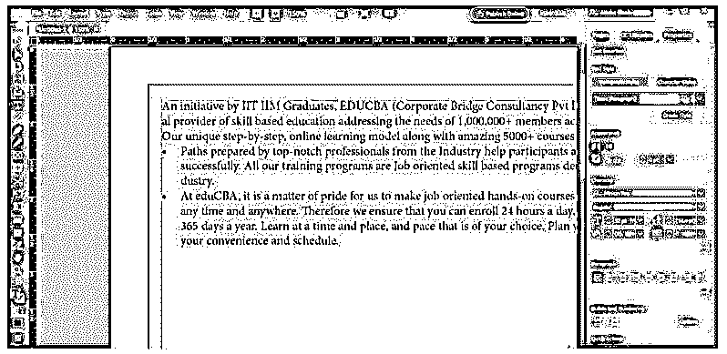

单击后，此对话框将会打开。

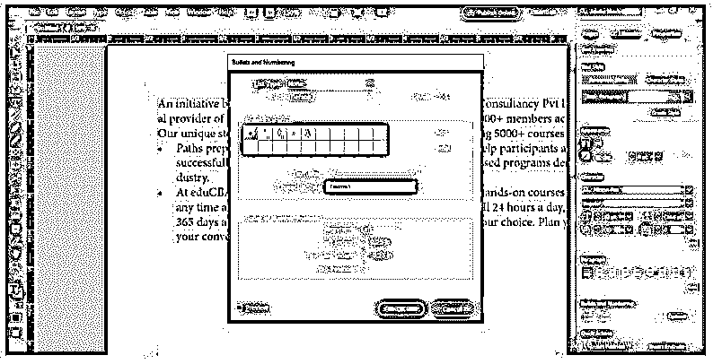

在此对话框的“列表类型”选项中选择“项目符号”选项。

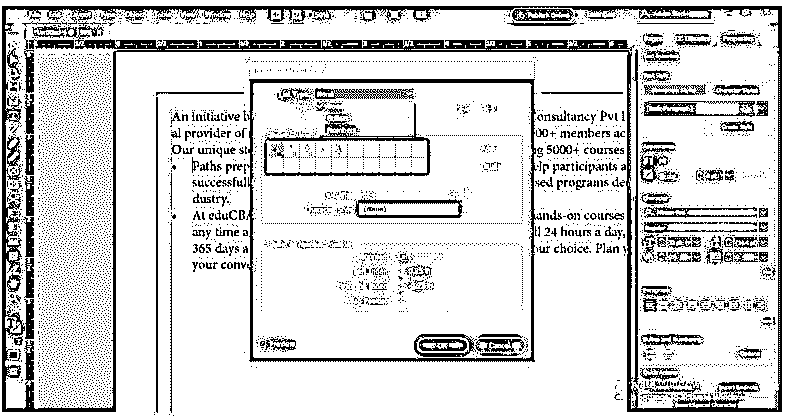

现在，单击此对话框的添加按钮，选择另一个特殊字符作为项目符号。

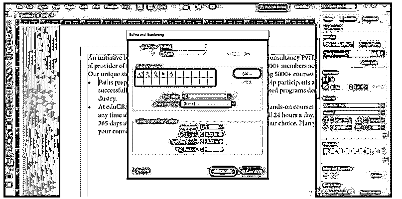

在“添加项目符号”对话框中，选择您想要的项目符号。我会选择这个。

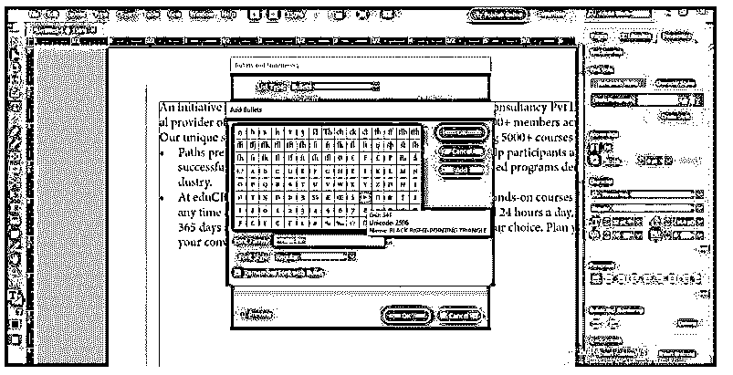

现在您可以看到，如果您选择了添加的项目符号，它将应用于您选择的段落。

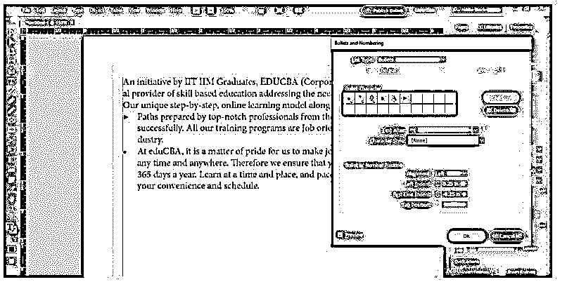

您可以在此对话框中调整项目符号的缩进，如下所示。

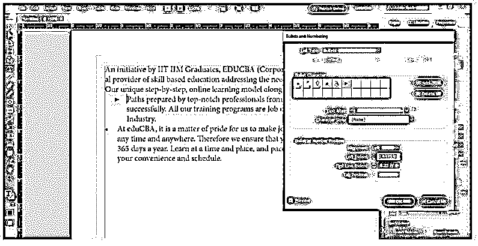

如果您想将添加的项目符号应用到页面的所有项目符号内容，那么您必须选择它们，应用方式如下。

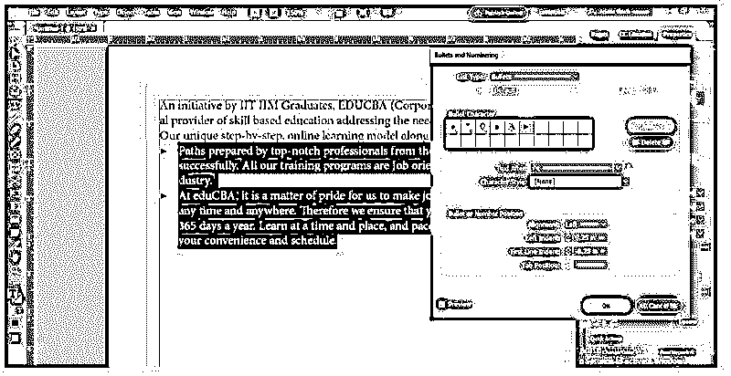

### 结论

我相信您已经从这篇文章中收集了许多关于 InDesign 要点的信息，现在您可以在您的文档中使用它们来很好地展示您的内容。此外，您可以尝试创建具有所需颜色的自定义项目符号，为项目符号赋予不同的外观。

### 推荐文章

这是 InDesign 项目符号的指南。这里我们讨论一下入门，如何在 InDesign 中创建项目符号？还有人物。您也可以看看以下文章，了解更多信息–

1.  [Adobe Indesign 使用](https://www.educba.com/adobe-indesign-uses/)
2.  [InDesign 垂直文本](https://www.educba.com/indesign-vertical-text/)
3.  [InDesign 书籍模板](https://www.educba.com/indesign-book-templates/)
4.  [InDesign 垂直居中文本](https://www.educba.com/indesign-center-text-vertically/)

