# InDesign 报纸模板

> 原文：<https://www.educba.com/indesign-newspaper-template/>

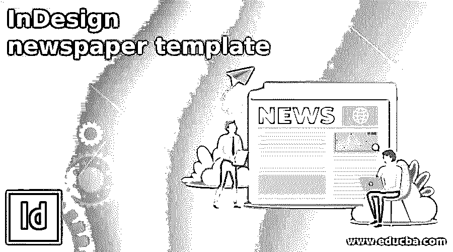

## InDesign 报纸模板介绍

InDesign 报纸模板可以理解为借助其先进和非常有用的功能在该软件中设计报纸版面。在这里，我们可以使用文本内容的设计元素，以编辑的方式安排所有的新闻内容。该软件中有许多功能涉及到报纸模板的设计，例如将文档页面的区域划分为多个栏，以便对文本内容进行适当的调整，以及使用适当的文本字体和样式的良好意识等。我们使用图像作为报纸设计的元素，使新闻吸引读者，为此我们也可以在 Photoshop 中编辑图像，然后在 InDesign 中使用它。

### 如何在 InDesign 中创建报纸模板？

为了创建一个报纸模板，我们应该分析一些著名的报纸版面设计，并了解如何在他们的设计中有不同的部分，以正确组织新闻内容。在这篇文章中，我会给你一个概述，这样你就可以了解如何使用这个软件的不同元素和功能，以你自己的方式设计报纸模板。

<small>3D 动画、建模、仿真、游戏开发&其他</small>

让我们首先有一个标准文件大小的报纸，这是小报。因此，我将单击新文档对话框的打印选项卡，并选择小报尺寸。

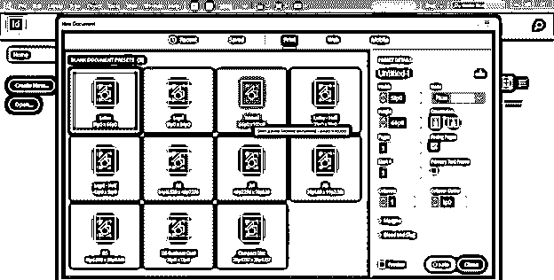

从单位选项的下拉列表中将单位更改为英寸。

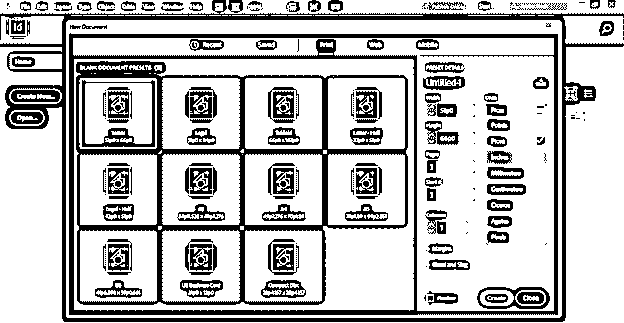

禁用此对话框的“朝向”选项，我希望我的设计布局中有 2 列，所以我将在“列”选项中输入 2 作为列值。

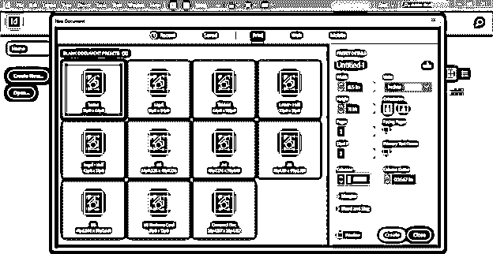

我将采用 0.25 英寸作为柱的檐槽值。

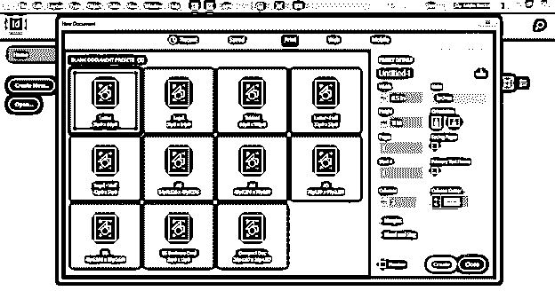

现在，我将给出 0.5 英寸的页边距。我会在页面的所有边上都留有相同的页边距，但如果你愿意，你可以根据自己的选择在所有边上都留有不同的页边距。

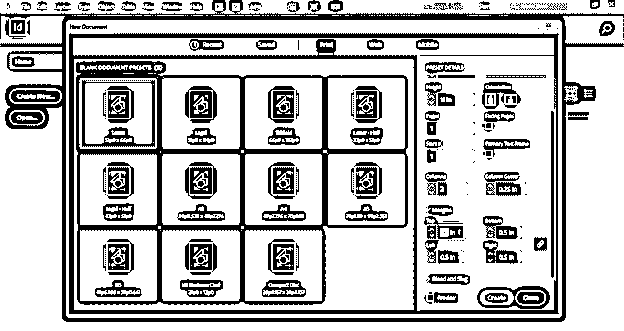

我也采用出血值，因为报纸是用于印刷的，所以我们有必要采用出血值。我将把 0.125 英寸作为出血值，然后单击此对话框的创建按钮。

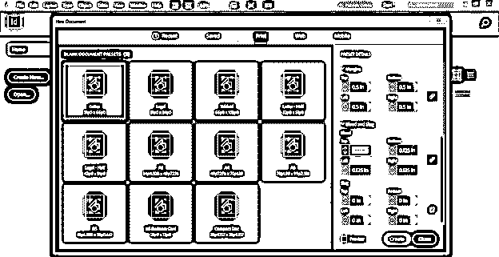

现在我们有了这种类型的文档布局。

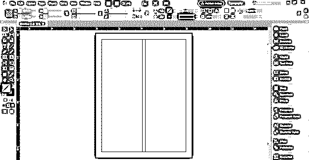

现在，我想在我的设计中有三列，所以不要担心，你可以在这个时候添加列，然后进入布局菜单，点击边距和列选项。

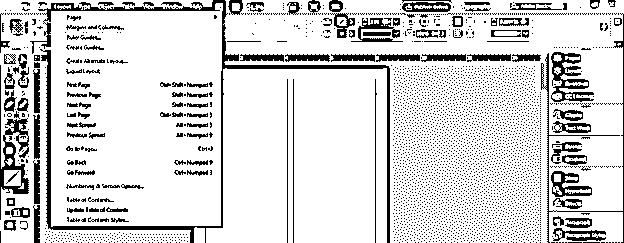

从它的对话框中，我们可以添加更多的列。

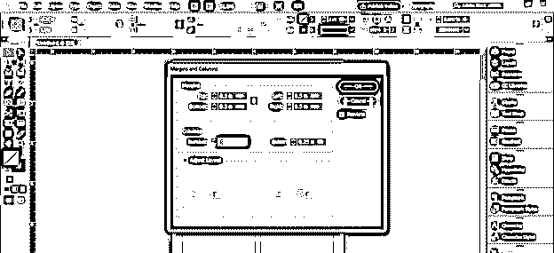

现在，我将在文件页面的顶部添加报纸的名称，因此，我选择了一条水平基准线作为本文的基础。对于这条参考线，我从文档页面顶部的水平标尺上拖动一条参考线。之后，我用文字工具在这里画了一个文本框，就像这样。

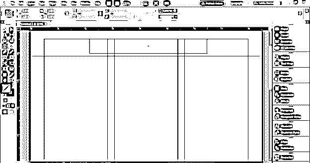

现在输入报纸的名称。所以我会在这里输入这段文字，并从这个软件的字符面板中选择这种字体。

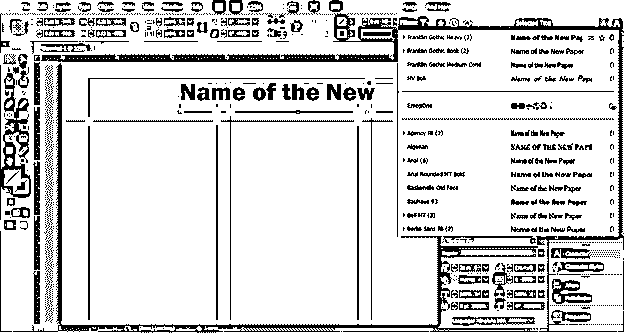

接下来，我将添加一个文本框架，你可以在这里写这份报纸的标签行。

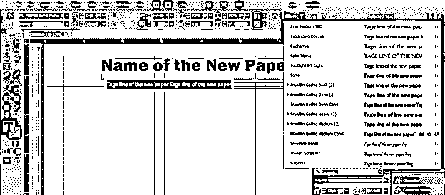

现在，我想在页面中央对齐两个文本，因此我将转到对齐面板，我们可以在窗口菜单的下拉列表中找到该面板。

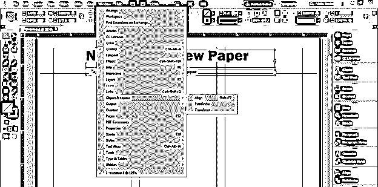

从“对齐”面板的“对齐”选项列表中选择“对齐页面”选项。

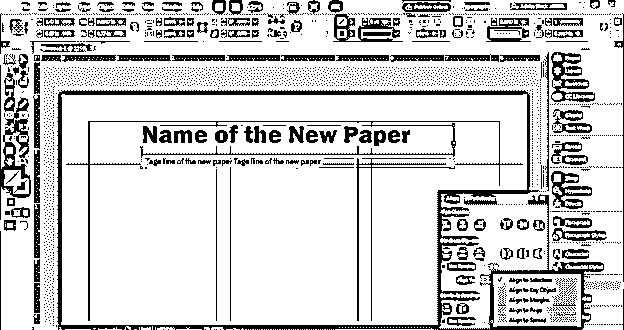

现在，我将调整文本框的大小，选择两个文本，然后对齐它们。

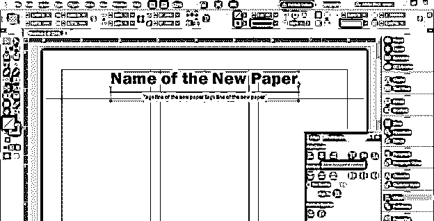

在报纸名称的左边，你可以添加报纸的价格和其他一些重要的信息。我还在文本后面添加了一个矩形，这样你就可以用文本添加设计元素。

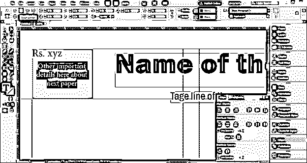

在右侧，您可以添加报纸的联系信息，如网站信息、社交媒体平台等。如果需要，您还可以更改文本的颜色。

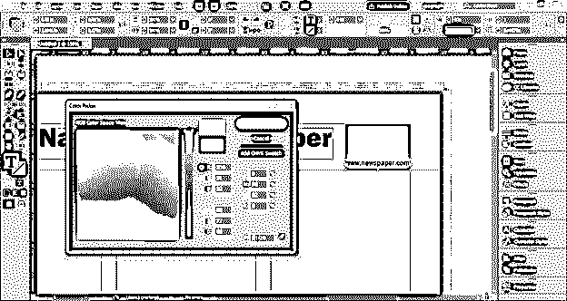

现在我将创建像这样的矩形部分，这些将成为报纸第一页标题的背景。之后，我将从工具面板中选择矩形框工具，画一个这样的框。

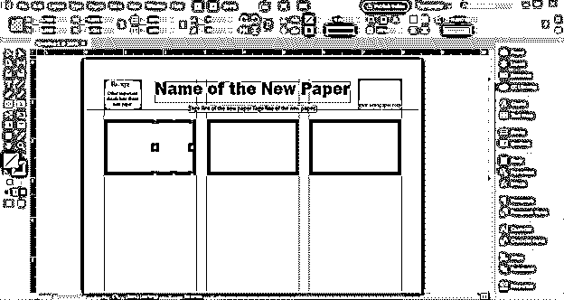

我想在这个框架中放置一个图像，所以我将进入菜单栏的文件菜单，从这个列表中选择放置选项，或者你可以按键盘上的 Ctrl + D 键。

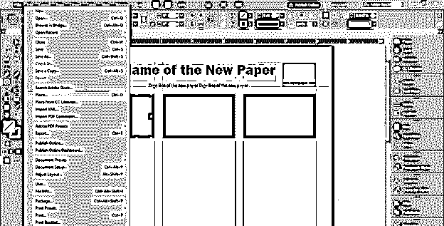

我将从保存的位置选择此图像。

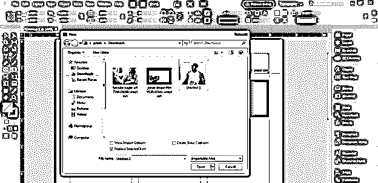

你可以看到它并不完全适合这个框架。

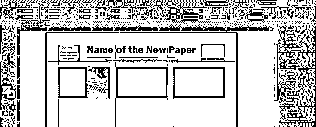

因此，要使其适合框架，请右键单击它，然后转到向下滚动列表的适合选项，并从新的向下滚动列表中选择“使内容适合框架”选项。

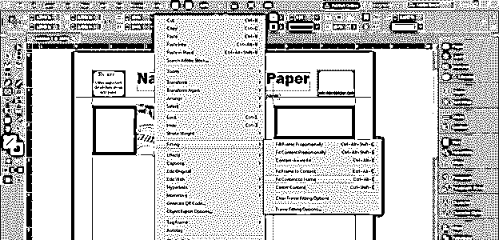

现在完全合身了。

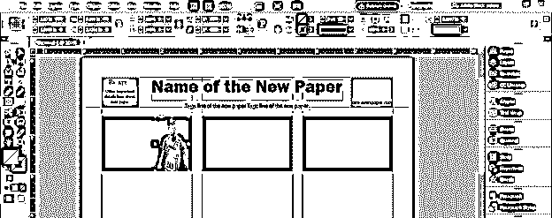

现在像这样在这里添加新闻标题，在这下面我将添加一些关于这条新闻的初始细节。

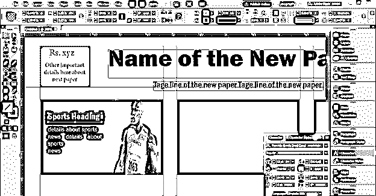

提及与该内容相关的完整新闻所在报纸的页码。

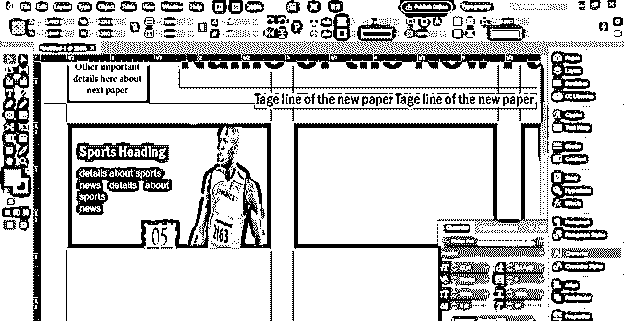

我在这个页码后面添加了一个矩形，我想把它的角弄圆，所以我将点击属性面板的角选项，然后从面板中选择这个圆角选项。

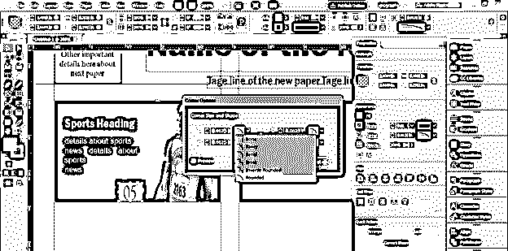

你可以这样安排新闻的标题。

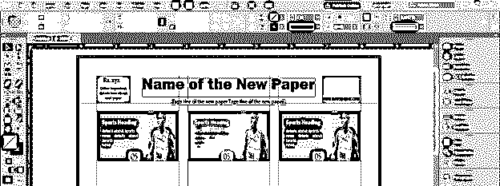

现在，如果图像中有这样的文本内容，并且您想要调整图像中的文本。

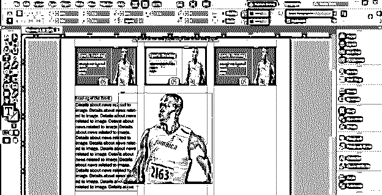

然后用钢笔工具在文本内容旁边的图片周围画一个形状。

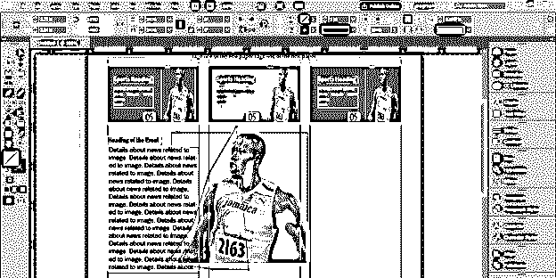

现在选择两者，并从文本扭曲面板中选择此选项。

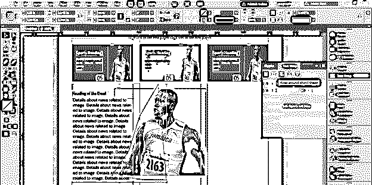

它会环绕在形状周围。

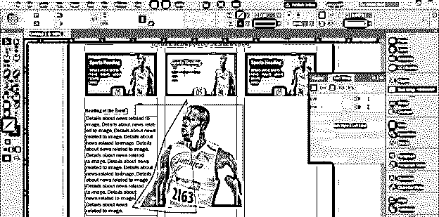

你可以离开这条路。

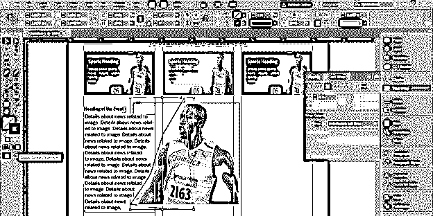

这样你就可以根据文字内容创建报纸模板。

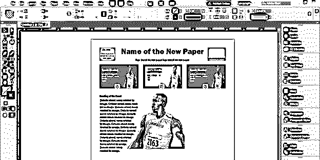

### 结论

在这里，我已经告诉了你关于创建报纸模板设计的技术中涉及的基本功能和特征。现在你对如何使用这个软件来创建报纸模板设计有了足够的了解，所以你可以在上面练习，并尝试自己的想法。

### 推荐文章

这是 InDesign 报纸模板指南。在这里，我们将讨论如何在 InDesign 中创建报纸模板及其步骤。您也可以看看以下文章，了解更多信息–

1.  [Indesign 版本](https://www.educba.com/indesign-version/)
2.  [Indesign 的替代方案](https://www.educba.com/alternative-to-indesign/)
3.  [什么是 Adobe InDesign](https://www.educba.com/what-is-adobe-indesign/)
4.  [用户界面设计](https://www.educba.com/user-interface-design/)

