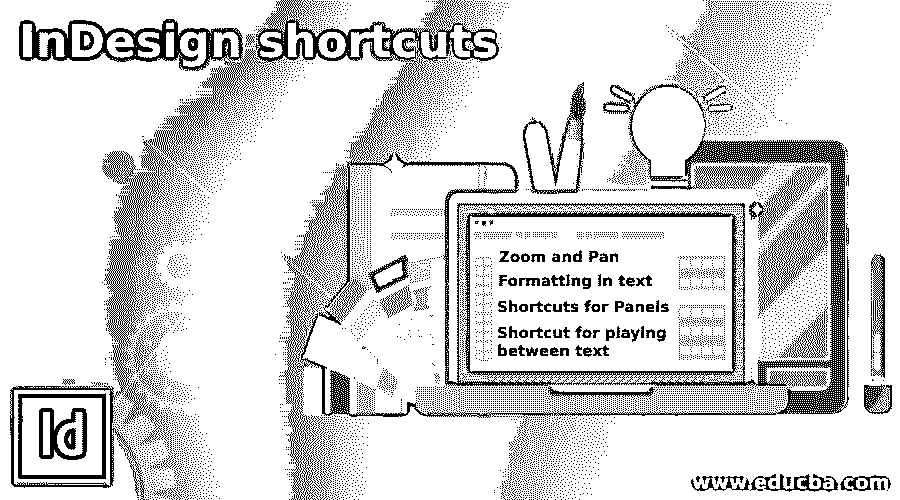

# InDesign 快捷方式

> 原文：<https://www.educba.com/indesign-shortcuts/>

## Indesign 快捷键介绍

Indesign 快捷键是键盘上不同键的组合，有助于提高工作效率，不仅如此，它还能节省我们的时间。通过快捷键，我们可以非常快速地执行 Indesign 中的任何特定命令。Indesign 中有许多文字设置，因此使用几种文字设置的快捷方式可以在最短的时间内获得高质量的作品。不仅有文字设置的快捷方式，还有另一个我们可以根据工作需要使用的命令。至于缩放，你可以按 Ctrl +空格键并拖动鼠标来放大或缩小文档区域。在本文中，您将了解 Indesign 的基本和高级快捷命令，以便在工作中获益。

### InDesign 的快捷键

下面是下面提到的快捷方式

<small>3D 动画、建模、仿真、游戏开发&其他</small>

#### 1.缩放和平移

*   **使用鼠标缩放(Ctrl +空格键):**这是一个非常快速的技术，用于缩放你选择的文档区域，为此，只需同时按下键盘的 Ctrl 和空格键，然后拖动鼠标进行缩放。
*   **使页面适合视图(Ctrl + 0):** 如果您想返回到文档区域的正常视图，这意味着您想在放大/缩小后以 100%的比例查看页面，那么您可以按键盘上的 Ctrl + 0 键。
*   **放大或缩小(Ctrl+/-):**按键盘上的 Ctrl + +键放大文档区域，按键盘上的 Ctrl+–键缩小文档区域。
*   **在视图中平移(空格键+拖动鼠标):**平移将按住文档，然后您可以在 Indesign 的工作屏幕上移动文档页面。它的快捷键是按下键盘的空格键，然后向所需方向拖动鼠标光标来移动文档页面。
*   **在文本中平移(Alt +拖动):**与普通平移一样，我们可以在处理文本时按住键盘的 Alt 键，然后拖动鼠标光标进行平移。

#### 2.文本格式

*   **增大/减小字体大小(Ctrl + Shift + < / > ):** 如果您想在不浏览字符面板的情况下增大或减小字体大小，那么您可以通过快捷方式来实现，首先选择您想要的文本或文本中您想要增大大小的任何字符，然后按住键盘上的 Ctrl 和 Shift 键，并按下键盘上的>按钮。如果您按下键盘上的大于号(>)键一次，字体大小将增加一个点。与减小尺寸相同，以同样的方式按下键盘的 Ctrl + Shift + <按钮。
*   **调整行距大小(Alt+向上箭头/向下箭头):**您可以在按住键盘 Alt 键的同时按向上或向下箭头键来调整文本字符之间的行距。若要增加行距，请使用键盘的 Alt 键按向上箭头键，若要减少字符间距，请使用 Alt 键按键盘的向下箭头键。
*   **左对齐(Ctrl + Shift + L):** 按下键盘的 Ctrl + Shift + L 键对齐左对齐。
*   **右对齐(Ctrl + Shift + R):** 与左对齐一样，我们可以调整文本在右侧的对齐，为此，按下键盘的 Ctrl + Shift + R 按钮。
*   **居中(Ctrl + Shift + C):** 按下键盘的 Ctrl + Shift + C 键，我们可以将文本调整到居中位置。
*   **加粗文本(Ctrl + Shift + B):** 按 Ctrl + Shift + B 使所选文本样式加粗。
*   **斜体文本(Ctrl + Shift + I):** 按 Ctrl + Shift + I 使所选文本样式变为斜体。
*   **给文本加下划线(Ctrl + Shift + U):** 按 Ctrl + Shift + U，为所选文本加下划线。
*   **调整文本的字距(Alt +左箭头键):**要调整文本字符之间的字距，您可以按下键盘的 Alt +左箭头键，当您按下时间左箭头键时，它会将字距调整一个点。
*   **调整文本的字距(Alt +右箭头键):**要设置文本字符的字距，请按键盘的 Alt +右箭头键。

#### 3.面板的快捷键

*   **样本(F5):** 要快速打开样本面板，请按键盘上的 F5 功能键。
*   **图层面板(F7):** 如果您按下 F7，则可以在 Indesign 的工作窗口中显示图层面板。
*   **笔画面板(F10):** 按下 F10，您可以使用笔画面板对笔画参数进行不同类型的调整。
*   **段落样式面板(F11):** 按 F11 作为快捷键，拥有段落样式面板并对段落样式进行不同的调整。
*   **字符样式面板(Shift + F11):** 要使用字符样式面板，请按 Shift + F11。
*   **文本扭曲(Ctrl + Alt + W):** 在 Indesign 中使用文字设置时，我们需要时间来沿着路径扭曲文本，因此让文本扭曲面板按下键盘的 Ctrl + Alt + W 键。
*   **链接面板(Ctrl + Shift + D):** 按下键盘上的 Ctrl + Shift + D 按钮，可以打开链接面板。

#### 4.在文本间播放的快捷方式

*   **跳转单词(Ctrl +左/右箭头键):**通过按下键盘的 Ctrl +左箭头键，您可以在单词中向左跳转，或者要在所选文本中向右移动单词，您可以按下 Ctrl +右箭头键。
*   **跳转整个段落(Ctrl +上/下箭头键):**与在单词之间移动一样，您也可以在整个段落之间跳转，为此，按键盘的 Ctrl +上箭头键向上移动段落，或按 Ctrl +下箭头键向下移动段落。

### 结论

这些都是关于 Indesign 的基本快捷键和高级快捷键，通过使用这些快捷键，您可以很好地控制您的工作。我们告诉了你这个软件的一些重要的快捷方式，但是仍然有更多的快捷方式，你可以学习更多关于这个软件的快捷方式的知识。

### 推荐文章

这是 InDesign 快捷方式指南。这里我们讨论 Indesign 的基本和高级快捷命令，以便您在工作中受益。您也可以看看以下文章，了解更多信息–

1.  [Indesign 的替代方案](https://www.educba.com/alternative-to-indesign/)
2.  [Indesign 版本](https://www.educba.com/indesign-version/)
3.  [什么是 Adobe InDesign](https://www.educba.com/what-is-adobe-indesign/)
4.  [InDesign CS6](https://www.educba.com/indesign-cs6-top-ten-new-features/)

