# InDesign 间隙工具

> 原文：<https://www.educba.com/indesign-gap-tool/>

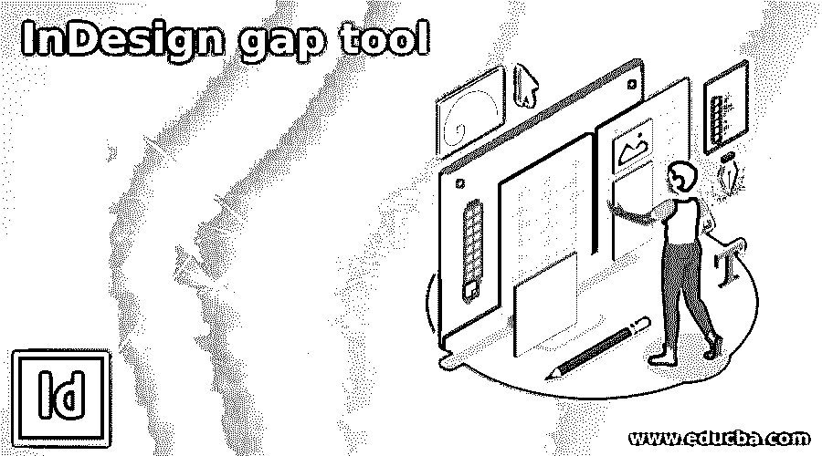

## InDesign Gap 工具简介

InDesign 间隙工具是该软件的有用工具之一，帮助我们保持 InDesign 文档不同内容之间的间隙。它提供了几种技术，用于在大量文档相关设计的设计布局过程中保持两个或更多内容之间的间隙。使用这个工具，我们可以保持页面内容的垂直和水平间隙。它不仅可以调整内容之间的间距，还可以用来保持任何特定内容与文档页面边缘之间的间距。所以使用这个工具你可以做很多事情。

### 如何在 InDesign 中使用间隙工具？

让我们看看如何在不同的项目中使用这个工具来保持任何文档页面内容的间隙。

<small>3D 动画、建模、仿真、游戏开发&其他</small>

为此，我将创建一个新文档，并在该软件的欢迎屏幕上单击“新建”按钮，或者您可以转到“文件”菜单，从那里选择“新建”选项。

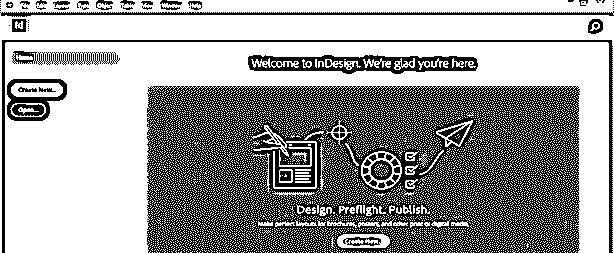

现在，我将选择打印文档类型，并从该对话框中选择文档的信纸大小。

您也可以在此对话框中设置文档页面的页边距。我将采取 0.25 页边空白，并点击该对话框的创建按钮。

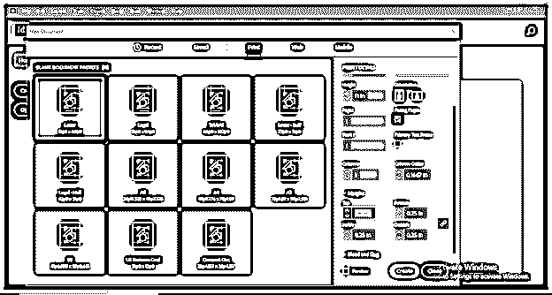

现在我们的文档页面已经准备好了。

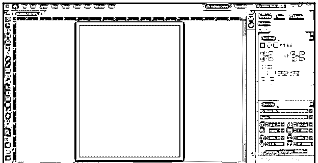

我将把一些图片放在这个文档区域，作为这个软件的 Gap 工具的例子。因此，我将转到菜单栏的文件菜单并单击它，然后从下拉列表中选择放置选项，或者您可以按 Ctrl + D 作为快捷方式。

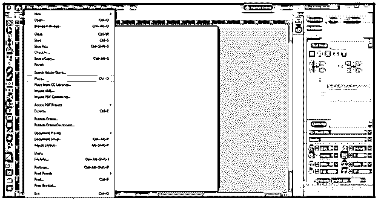

我将从它们保存的位置中选择这 6 张图片，然后点击这个对话框的打开按钮。您可以选择任何内容来了解这个 Gap 工具。

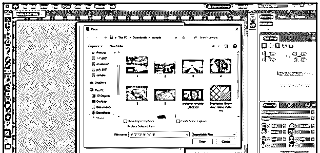

现在，我将单击文档区域的顶部并拖动鼠标光标，以绘制一个矩形空间来放置图像。我将按住键盘的 shift 键，然后按向上箭头键在这个矩形空间中添加行，我将按两次向上箭头键添加两行，然后按向右箭头键添加列。我有 6 张图片，因此我把摆放区域分成了 6 个框架。

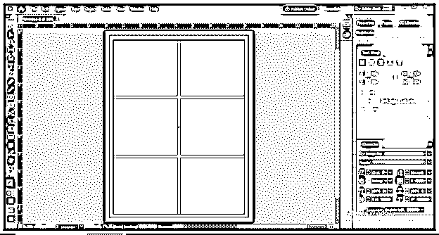

我们会把我们的图像放在像这样的相框里。

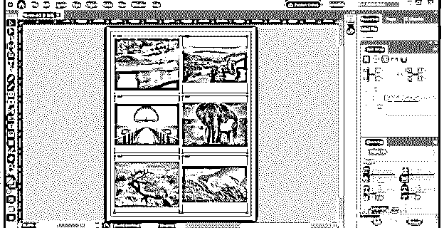

您可以看到框架并不完全适合图像，因此要根据图像的大小调整框架，请选择所有图像并单击右键，然后转到向下滚动列表的“调整”选项，并从“调整”选项列表中选择“调整框架以适应内容”选项。

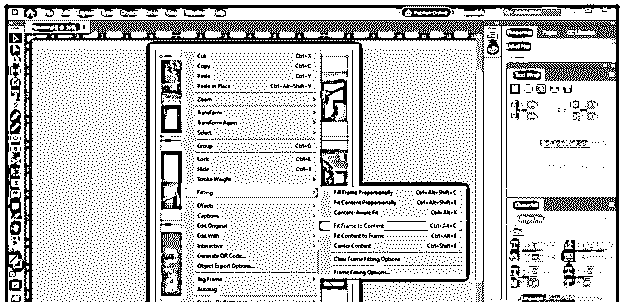

在工具面板部分，您会发现带有此图标的间隙工具。你可以用 U 作为它的快捷键。

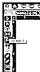

现在，当您在两个内容的间隙之间移动鼠标光标时，您将看到这种双向箭头，它显示了所选内容之间的当前间隙。

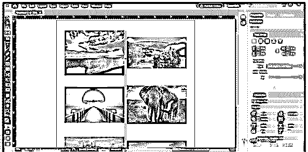

您可以拖动鼠标光标来减小或增大这两幅图像之间的间隙。如果我将鼠标光标拖到右侧，您会看到它会缩小左侧图像的尺寸，以增加这两幅图像之间的间隙。

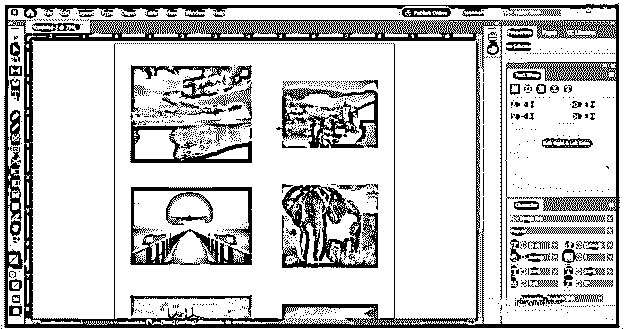

如果你向左拖动鼠标光标，它将向左移动。

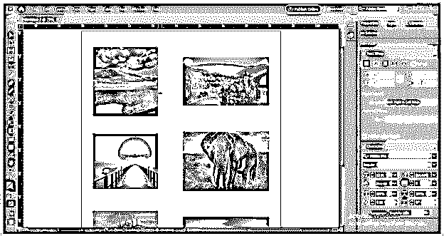

不仅在水平方向上，在垂直方向上也用同样的方法保持垂直间隙。

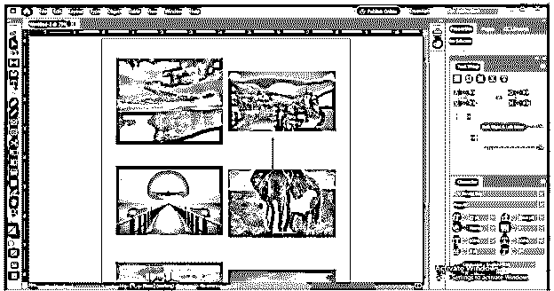

如果您按住键盘的 Ctrl 键，然后拖动鼠标光标，那么它将减少或增加双方的差距，这意味着它会影响双方的内容。

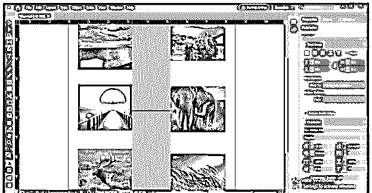

如果您按住键盘上的 shift 键，那么您可以更改您想要的两个内容之间的间隙，这与相同间隙上有其他图像没有关系，如果您同时按住键盘上的 Ctrl + Shift 键并拖动鼠标光标，那么它将保持两侧图像之间的间隙，并且仅用于您选择的图像。

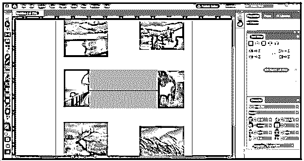

不仅是内容之间的间隙，您还可以从文档页面的边缘保持内容的间隙，就像我们保持内容之间的间隙一样。

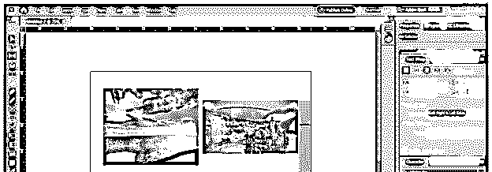

任何内容间隙都可以保持从文档页面的边缘开始，与文档页面的边缘有直接的距离。

如果您按住键盘的 Alt 键，然后拖动鼠标光标以保持内容之间的间隙，那么您实际上可以像这样在文档区域上移动选择的内容。

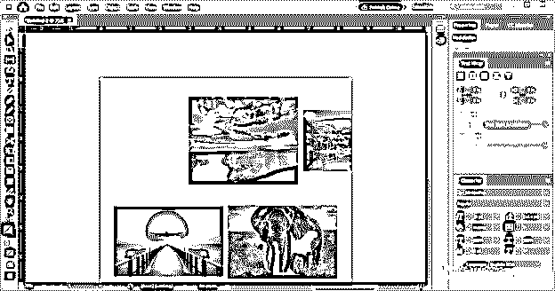

你可以注意到，在保持内容之间的差距差距工具扭曲的图像和对象的图像被裁剪成这样，但我们可以解决这个问题，在这个软件中做一个设置。

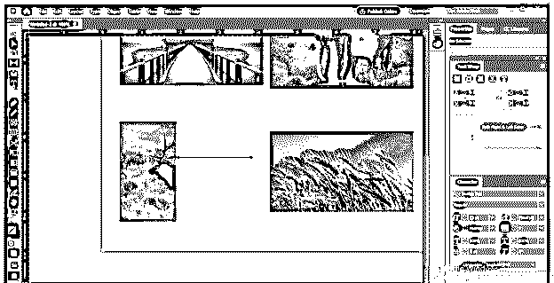

选择所有图像，再次右键单击，并在向下滚动列表的配件选项中单击“框架配件选项”。

或者您可以在菜单栏的对象菜单的下拉列表中找到相同的选项。

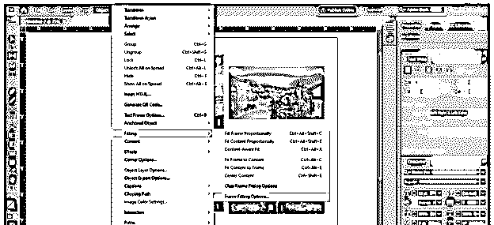

此处将打开一个“框架配件”对话框。在“框架配件”对话框中，通过单击复选框启用“自动调整”选项。

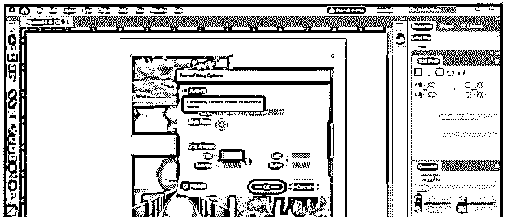

确保已从该对话框的“管件列表”选项中选择了“按比例调整内容”选项。

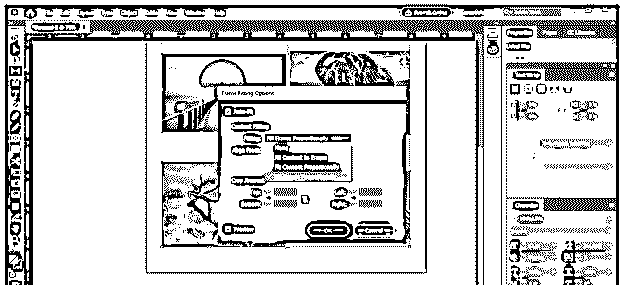

现在，当我们再次使用间隙工具来更改这些图像之间的间隙时，您可以看到它会在不扭曲图像的情况下更改间隙，因为图像的比例现在保持不变。

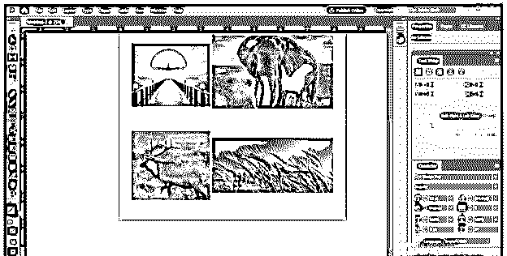

这些是您在项目工作中开始使用 gap 工具之前必须了解的一些重要方面，您可以将此 Gap 工具用于 InDesign 的任何内容。

### 结论

我相信您会发现这个工具对于在 InDesign 中很好地调整文档页面的两个或多个内容之间的间隙非常有用。您可以以不同的方式使用此间隙工具来进行有效的布局设计，如果您开始使用此工具进行练习，那么您可以轻松地为您的工作开发间隙调整技术。

### 推荐文章

这是 InDesign gap 工具的指南。在这里，我们讨论如何使用这个工具来维护任何文档页面内容中的间隙。您也可以看看以下文章，了解更多信息–

1.  [VMware 工具](https://www.educba.com/vmware-tools/)
2.  [Indesign 的替代方案](https://www.educba.com/alternative-to-indesign/)
3.  [InDesign CS6](https://www.educba.com/indesign-cs6-top-ten-new-features/)
4.  [什么是 Adobe InDesign](https://www.educba.com/what-is-adobe-indesign/)

