# InDesign 段落样式

> 原文：<https://www.educba.com/indesign-paragraph-styles/>

## InDesign 段落样式介绍

InDesign 段落样式可以理解为对文本内容的段落样式进行参数调整，我们在该软件中单独提供了一个完整的段落样式面板。这个面板有许多不同类型的功能，可以帮助我们非常快速地完成排版工作，并且在对段落面板进行设置后，我们不需要将我们想要的样式应用到段落或文本内容的每个部分。它对每种类型的文本段落内容的几个样式层起作用，并帮助我们理解段落样式的不同属性。所以今天我们要从这一段的风格面板中学习一些有效的技巧。

### 段落样式在 InDesign 中如何工作？

在 InDesign 中使用段落样式是一个非常好的功能，在我们使用它之后，我们可以非常轻松地以专业的方式组织文本内容。所以让我给你解释一下这个软件的段落样式面板。为此，我将首先创建一个新的文档页面，为此，我将单击 InDesign 欢迎屏幕上的“新建”按钮。

<small>3D 动画、建模、仿真、游戏开发&其他</small>

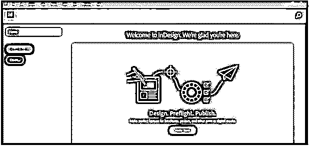

我将从这个新文档对话框中获取文档页面的默认自定义大小，然后单击“创建”按钮。

现在我将从工具面板中选择文字工具，或者你可以按 T 键作为快捷键。

现在，我将从工作区类型中选择排版选项，将工作区更改为排版模式。我将切换到这种模式，以便在工作屏幕的顶部显示所有需要的文本格式面板。你可以在任何你觉得舒适的工作空间工作。

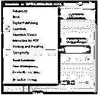

我将在绘制的文本框中粘贴一些文本内容。

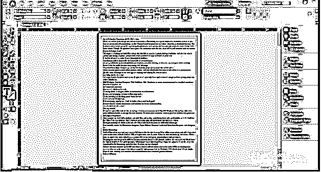

您也可以转到文件菜单下拉列表中的放置选项，将文本放置到文本框中，放置选项的快捷键是键盘的 Ctrl + D 按钮。

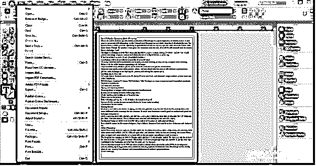

在此排版工作区布局中，工作屏幕的右侧会有一个段落样式框。

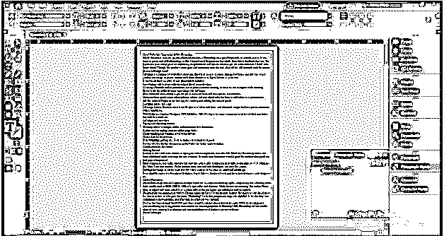

如果您的工作屏幕中没有这样的面板，那么您可以从菜单栏的类型菜单的下拉列表中选择它，或者您可以简单地按键盘的 F11 功能键在工作屏幕上选择它。

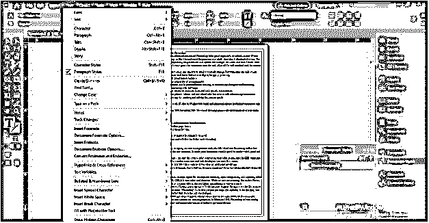

在这个工作屏幕的顶部，您会发现字符格式控制。

在它的正下方，有段落格式控件，我们将在使用段落样式面板的过程中使用这两个控件。

现在，我将选择此内容的第一行作为此文本内容的标题，并从字符格式栏的字体大小选项中增加其大小。

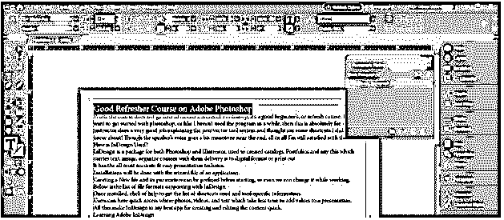

我也将从这个列表中改变它的字体样式。

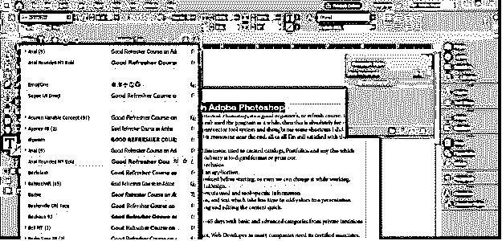

现在我将把这个颜色文本框的颜色改为绿色。

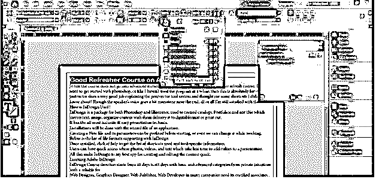

现在来到段落样式框，点击这个框底部的创建新样式按钮。确保文本被选中，你不需要选择整段文字，只要文本工具的闪烁光标在那里就可以了。

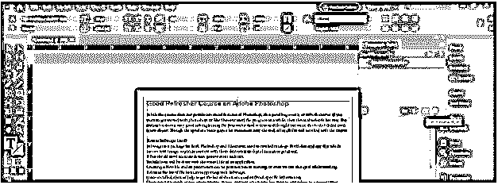

现在，我将双击这个层的名称，并命名为标题。

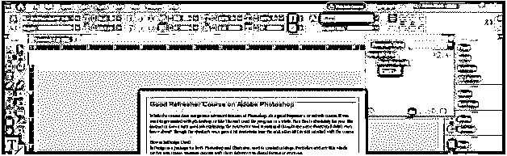

当你双击这个样式层时，它会显示你选择的段落当前的格式。

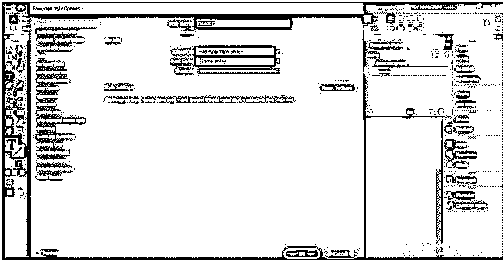

现在，这个段落样式面板的神奇之处在于，如果你想对文本内容的其他标题应用相同的格式，只需点击一下就可以做到。所以选择你想用相同格式做标题的段落，或者你可以把闪烁的光标放在那里。

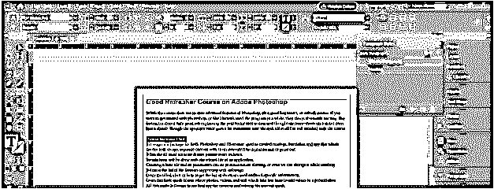

并在段落样式框中点击前一个标题的图层样式。在我的例子中，我将点击标题层，它将应用所有相同的格式与选定的段落。

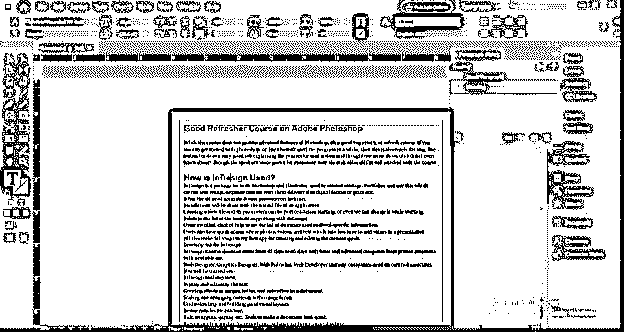

同样，我们可以制作一个副标题层，并将其应用于两个或更多的副标题。

现在，我想在这个文本内容的标题中做一些其他的格式化，让我们看看如何将这个改变的格式应用到所有相同类型的标题中？我会选择这一段。

并将其颜色变为红色。

您可以看到，当我们对某个特定的段落样式进行任何更改时，其图层中会出现一个加号，表示该特定图层有一些其他格式。

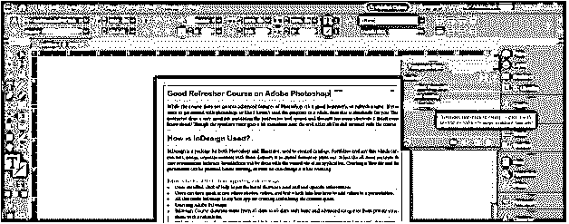

要将此应用于所有相同类型的标题，只需右键单击该层，然后单击重新定义样式选项。

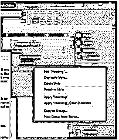

所有相同类型的标题都会随着格式的改变而自动更新。

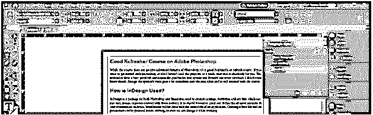

让我们做一个正文样式，为此，我将选择这一段。

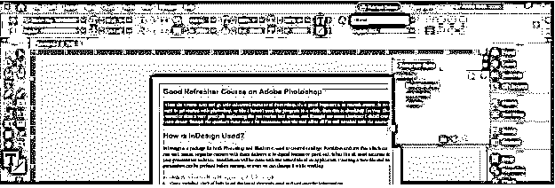

并更改其字体样式。

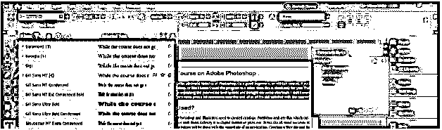

并为它创建一个新的样式层。

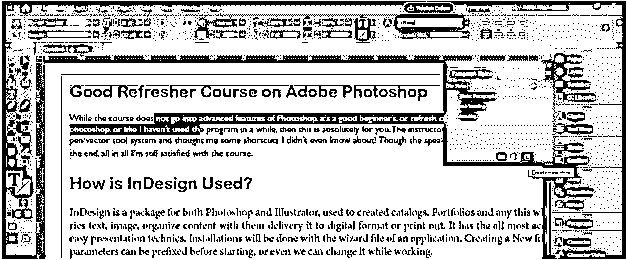

我将把它命名为身体复制。

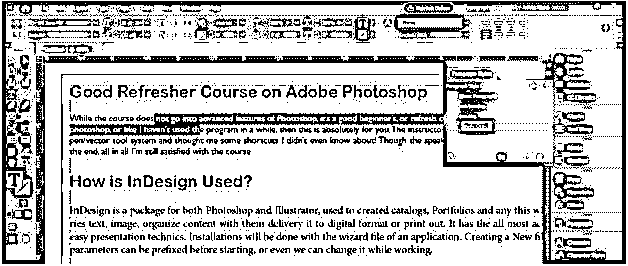

并将其应用到另一个段落，就像我们在标题情况下所做的一样。

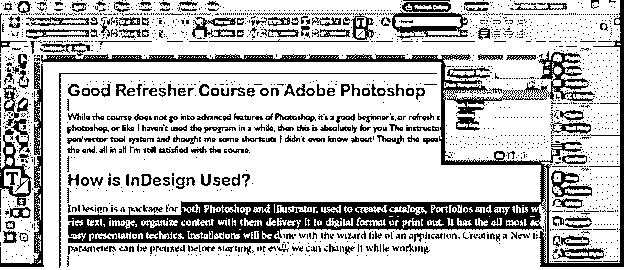

并且它根据正文的格式而变化。

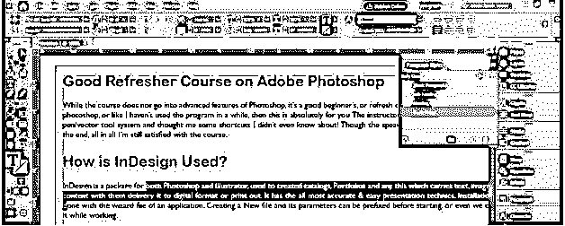

但是当我将它应用于段落的项目符号时，您可以看到它只更改了一行并删除了项目符号，因为我们的正文中没有项目符号样式，它只更改了所有项目符号段落中的一行，因为一行项目符号本身就是整个段落。

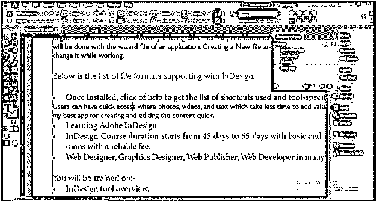

您可以通过从“类型”菜单的下拉列表中启用“显示隐藏字符”选项来检查段落，或者您可以简单地按 Ctrl + Atl + I 作为其快捷方式。

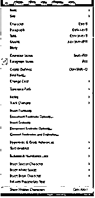

这个符号表示段落到此结束。

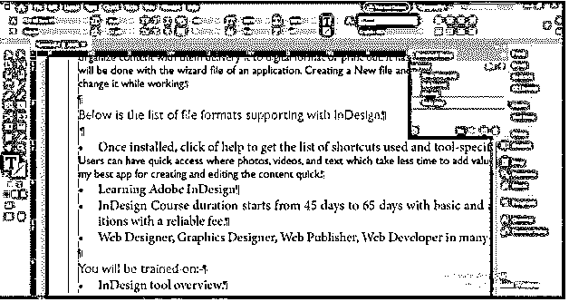

在段落样式框的帮助下，我们可以像这样对文本内容进行有效的格式设置。

### 结论

我相信现在您可以开始使用段落样式框在 InDesign 项目中制作不同类型的段落格式了。有了段落样式面板，你可以在更少的时间里做更多的工作，也可以摆脱一次又一次地对每个段落应用你想要的格式。

### 推荐文章

这是 InDesign 段落样式指南。在这里，我们一步一步地详细讨论如何在 InDesign 中使用段落样式。您也可以看看以下文章，了解更多信息–

1.  [Indesign 版本](https://www.educba.com/indesign-version/)
2.  [InDesign 文档设置](https://www.educba.com/indesign-document-setup/)
3.  [什么是 Adobe InDesign](https://www.educba.com/what-is-adobe-indesign/)
4.  [插图类型](https://www.educba.com/types-of-illustration/)

