# InDesign 网格

> 原文：<https://www.educba.com/indesign-grid/>

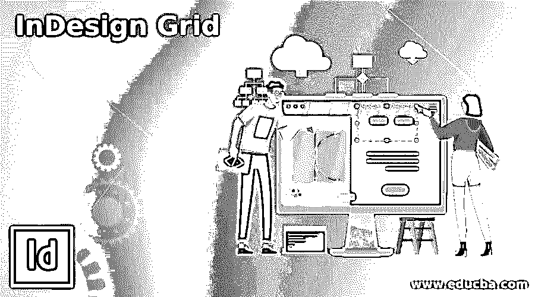

## indesign 网格简介

InDesign 网格可以理解为指导方针，通过它我们可以根据我们的要求适当地调整我们的工作，因为在 InDesign 工作期间，我们必须管理大量带有文本的图像，以使它们具有良好的组合。在这个软件中，我们有两种类型的网格，一种是文档网格，另一种是基线网格。我们将这两个网格用于不同类型的目的，这两个网格都有自己的参数面板，我们可以根据工作要求在其中进行调整。让我们一个接一个地浏览两个网格。

### 怎么用？

我们可以在 InDesign 中使用网格来完美对齐项目工作中的文本和图像。所以我要告诉你关于网格的事情，这样你就可以用它在这个软件中进行有效的布局设计。

<small>3D 动画、建模、仿真、游戏开发&其他</small>

首先，我将从该软件欢迎屏幕的“新建”按钮中获取一个默认大小的新文档。

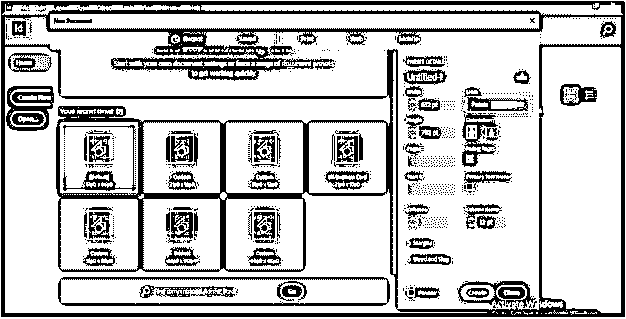

您可以从菜单栏中选择一个网格面板，转到编辑菜单，然后转到下拉列表中的首选项选项，然后在新的首选项选项下拉列表中单击网格选项。

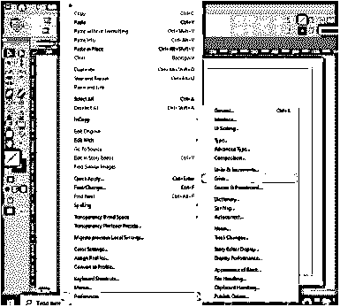

在网格的对话框中，我们有基线网格和文档网格的参数，我们可以根据自己的需要操作它们。我将立即使用两个网格的默认参数设置，并单击此对话框中的“确定”按钮。

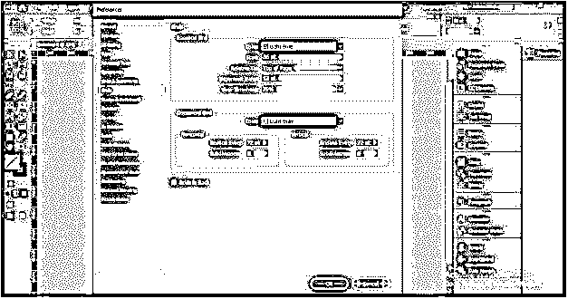

要查看文档页面上的网格，请转到“视图”菜单，然后转到下拉列表的“网格和参考线”选项，然后在新的下拉列表中，我们有“显示基线网格”和“显示文档网格”两个带有快捷键的网格选项。

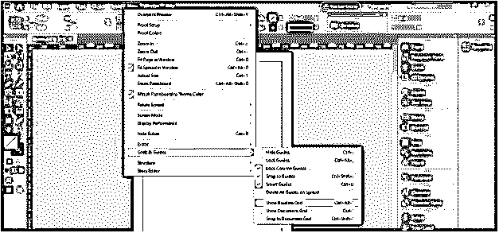

我将首先通过单击“显示文档网格”选项来启用文档网格。

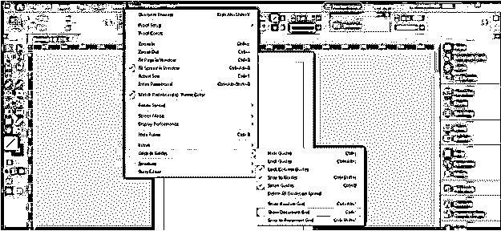

我们在文档页面上有这样的网格。

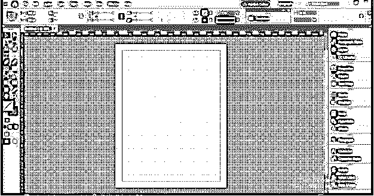

### 如何在 InDesign 中使用带有图像的网格？

现在让我们用一个图像来理解网格的目的。我将转到文件菜单，单击下拉列表中的放置选项，在该软件中放置图像。

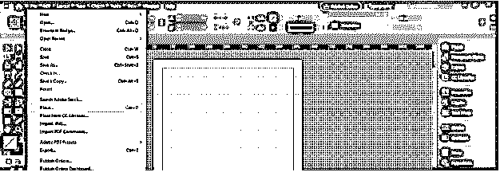

我将选择这个 EDU 证书格式的图像。

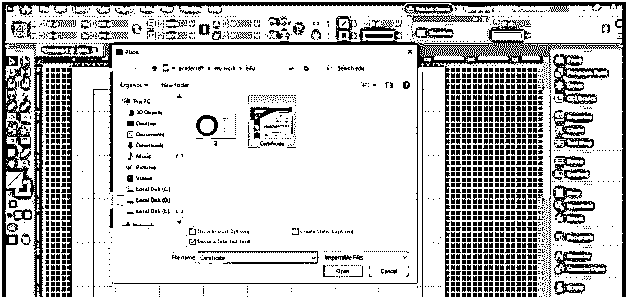

我会把它放在这里。

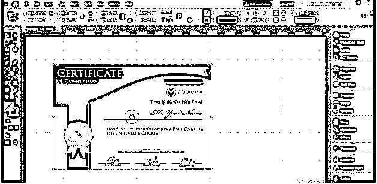

在使用网格之前，请确保您已经启用了“对齐网格”选项，要启用它，请再次转到“视图”菜单，并单击“网格和参考线”的“对齐文档网格”选项。

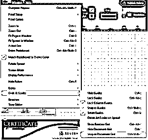

我已经做了一份证书的副本，我们可以很容易地将这个图像与网格角对齐。例如，我想将此图像的右边缘与这些网格块对齐，当我将它移动到这里时，它会自动与它们对齐。

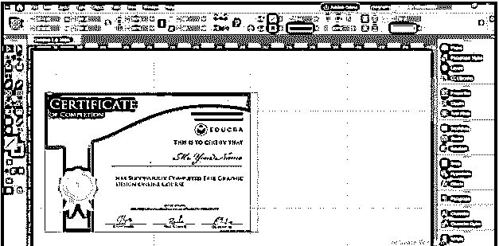

因为这个网格在它的所有块之间具有相等的距离，所以我们可以非常容易地考虑块来保持两个或更多图像之间的间距。

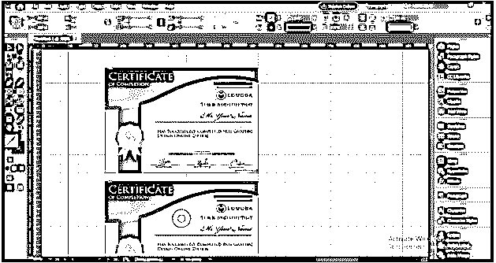

如果你愿意，你可以增加或减少网格块的大小。目前，区块为 72 x 72 磅。

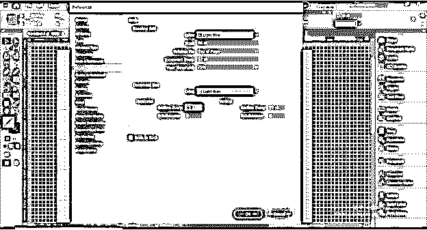

如果我把它改成 100 点 x 100 点。

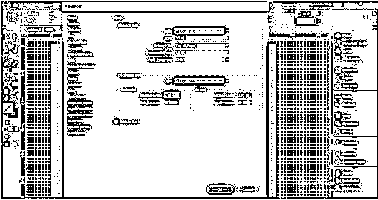

也禁用'网格在后面，对话框的一个选项，然后点击它的确定按钮。如果我们禁用此选项，那么网格将出现在文档页面所有内容的顶部。

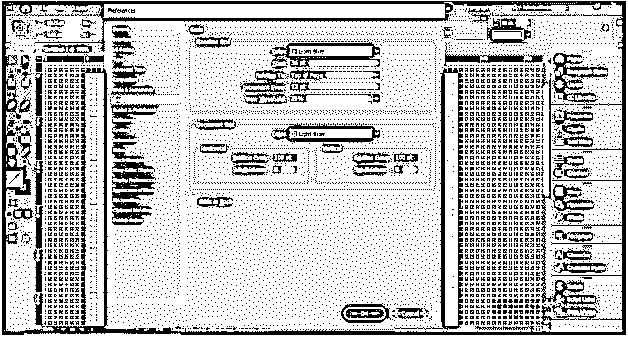

现在，您可以看到块的大小增加了，网格现在位于图像的顶部。因此，根据您的适合性，您可以将网格放在内容的上面或后面。

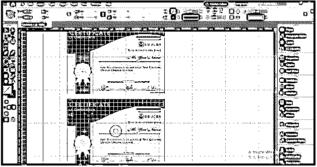

### 如何在 InDesign 中对文本使用网格？

现在我将使用文本工具创建一个文本框。现在我们明白网格是如何处理文本的了吧？

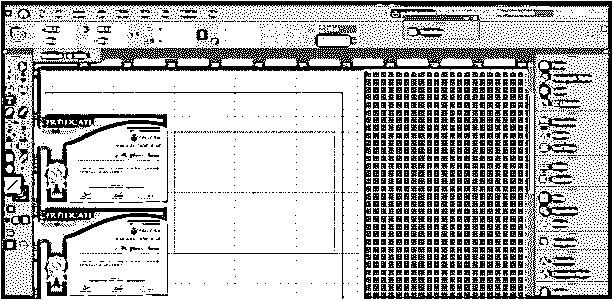

现在，我将在这个文本框中粘贴一些文本。

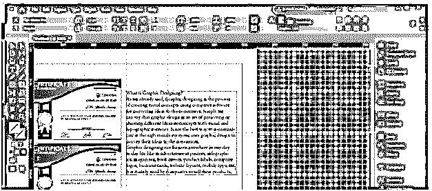

您可以沿网格线移动文本框架，使其在所需位置与图像正确对齐。

现在让我们来看看另一种类型的网格，即基线网格。我将首先通过单击“隐藏文档网格”选项，从菜单栏的同一菜单中禁用此文档网格。

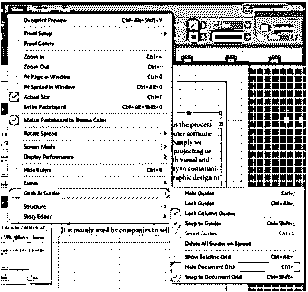

现在，在相同的选项中，我将通过单击“显示基线网格”选项来启用基线网格。

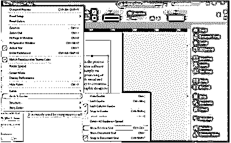

我们的文档页面上会有这种水平网格线。我们通常使用基线网格来对齐文本。

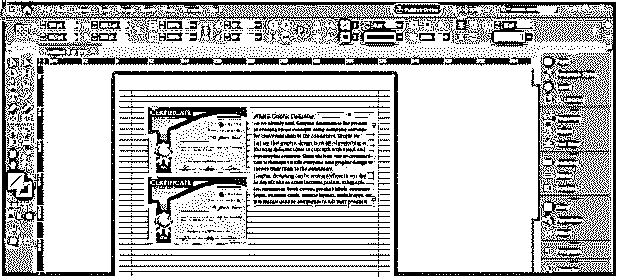

您可以看到文本没有完全与基线对齐，因此您不需要通过移动它来手动对齐它。

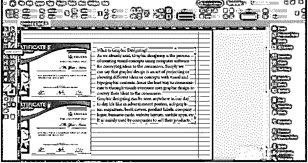

只需从工具面板中选择文本工具，并选择此文本。您不需要选择整个文本，只需单击鼠标，文本的闪烁鼠标光标就会出现在文本框中。然后转到段落格式控制面板。您可以在工作屏幕的顶部找到此面板。如果您的工作屏幕上没有这样的面板，那么您可以将该软件的工作区更改为排版模式。

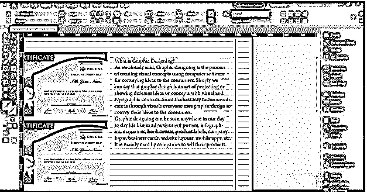

并单击该面板的“对齐基线网格”选项卡。

一旦你点击这个选项，它会自动对齐我们的文本与基线，但你可以看到它对齐我们的文本在一个基线的差异。如果您希望文本与每条基线对齐。

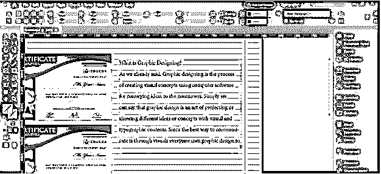

然后，您可以再次转到首选项选项的网格面板，并在此对话框中更改基线网格部分的增量间隔选项的值。我会把它换成 8 点。然后点击确定按钮。

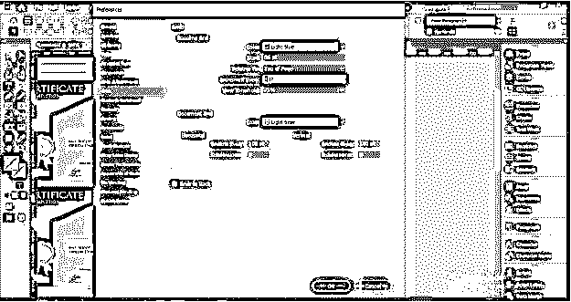

您可以看到，与之前的对齐方式相比，它更紧密地对齐了我的文本。所以你可以根据自己的选择来设置网格面板的参数。

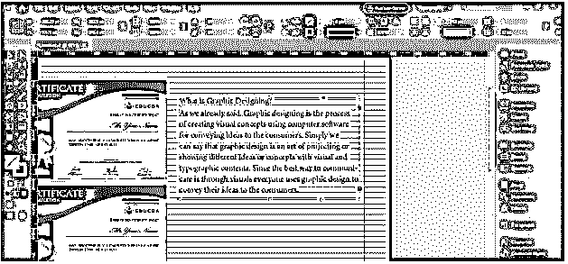

### 结论

因此，今天我们讨论了 InDesign 中的网格及其类型，您会发现它在使用该软件进行任何创造性设计布局时都很有用。该软件中网格的优点是两种类型的网格都有自己的面板，可以对它们的参数进行一些调整，以获得不同的结果。

### 推荐文章

这是 InDesign Grid 的指南。在这里，我们一步一步地详细讨论如何在 InDesign 中使用网格以及文本和图像。您也可以看看以下文章，了解更多信息–

1.  [Indesign 版本](https://www.educba.com/indesign-version/)
2.  [InDesign 文档设置](https://www.educba.com/indesign-document-setup/)
3.  [什么是 Adobe InDesign](https://www.educba.com/what-is-adobe-indesign/)
4.  [插图类型](https://www.educba.com/types-of-illustration/)

