# InDesign 边距

> 原文：<https://www.educba.com/indesign-margins/>

## InDesign 边距介绍

InDesign 边距可以解释为从文档页面边缘的任何一侧到版面设计内容的距离，这些内容可能包含文本、文本框架、图像和其他内容设计，或者边距也可以理解为定义具有适当版面设计内容的打字区域的区域。我们通常对文档页面的所有四个边使用空白区域，即页面的左侧边缘、页面的右侧边缘、页面的顶部和页面的底部。在本软件中，左边距页面边缘的距离定义为内边距，右边距页面边缘的距离定义为外边距。因此，让我们分析这些东西的利润，以获得更多的知识。在本主题中，我们将了解 InDesign 页边距。

### 如何在 InDesign 中使用边距？

我们根据布局设计的要求使用边距，它可能对所有四边都不同，也可能对所有边都相同。我要做的第一件事是创建一个新文档，为此，我将在该软件的欢迎屏幕上单击“创建新文档”按钮，或者您可以直接按 Ctrl + N 作为快捷键。

<small>3D 动画、建模、仿真、游戏开发&其他</small>

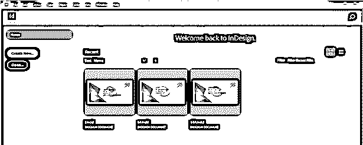

一旦我们点击这个按钮，我们将有一个新文件的对话框。在这里，我将单击打印预设选项，并选择文档页面的信纸大小。你根据你的设计选择了任何人。

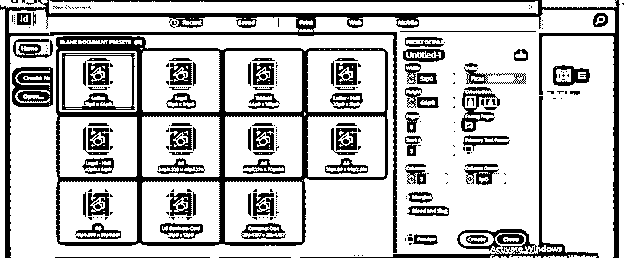

我将改变单位列表中的英寸单位，因为我想使用英寸。默认情况下是十二点活字。

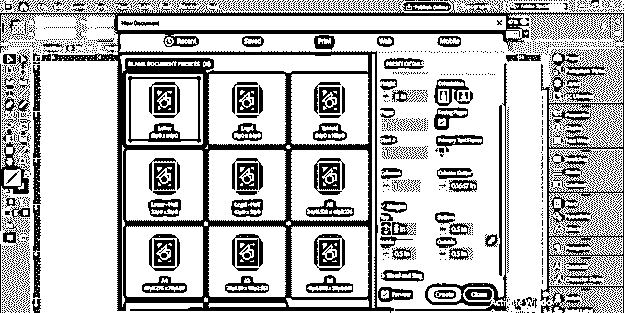

在此对话框中，我们有“边距”选项卡，因此单击此选项卡的向下箭头按钮，您可以看到有不同边距的框，如上、下、左(内)和右(外)。这次我会将 margins 值更改为 0，这样我就可以清楚地向我们解释了。

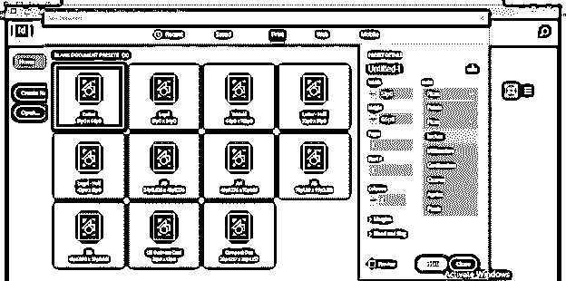

这是链接按钮，如果它被链接，那么所有四个边距值将按比例改变。现在，我将单击“创建”按钮，但不会干扰这个连锁按钮，因为我们将在后面讨论它。

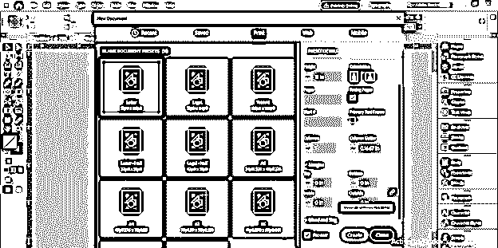

现在，您可以看到文档页面区域没有页边距。

首先，我将获取这个图像，为了让这个图像出现在文档中，我们可以使用文件菜单中的位置选项。

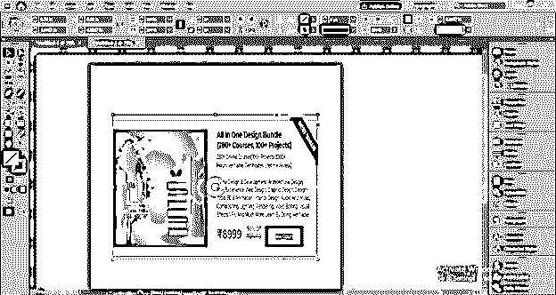

像这样放在文档页面的边缘。我不知道它离我放置图像的页面文档的边缘有多远。

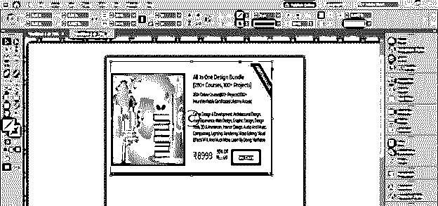

我将选取一些文本，并以一种良好的方式对它们进行调整，然后将它们放置在距离页面边缘相同的位置，就像我们之前放置图像一样。

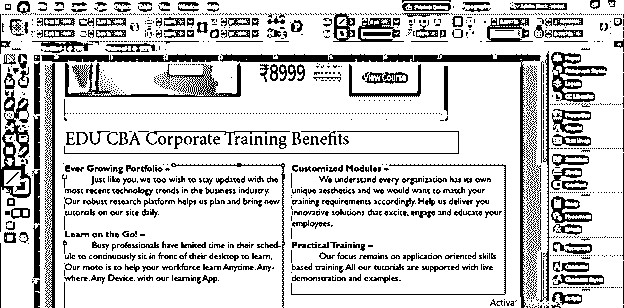

现在让我们切换到预览模式，这将显示我们的文件最终会是什么样子。所以你可以简单地按 W 键或者点击工具面板上的这个按钮。

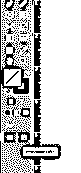

而这个从文档页面边缘到文档内容的距离可以理解为页面的边距。页面左侧蓝色标记的距离定义为内边距。

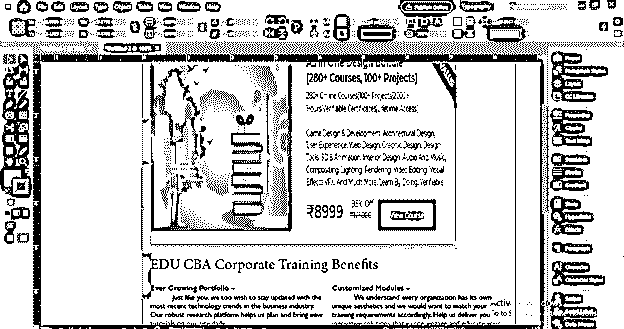

和左边一样，我们可以在页面的右边标记相同的距离，或者根据布局设计改变这个距离。右侧距离定义为外部边距。你可以对上边距和下边距做同样的操作。

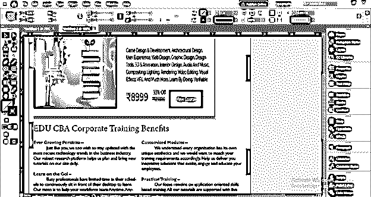

但是我们可以在边距面板的帮助下设置它，而不是手动标记边距。让我们再次创建一个新文档，要创建新文档，请转到“文件”菜单下拉列表中的“新建”选项，然后单击“新建”下拉列表中的“文档”选项。

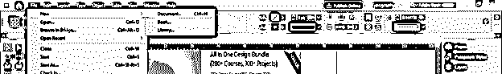

现在，在此对话框的“边距”框中创建文档之前，我将在此处设置一些边距。您可以在获取新文档时设置这些页边距，也可以稍后设置。

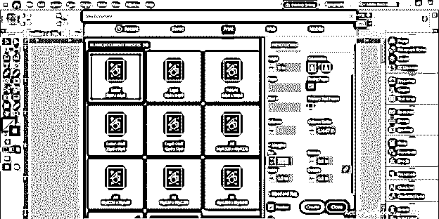

我们可以打破这个链接按钮，并根据我们的要求分别更改所有四个边距。我将赋予所有四个边的边距相同的值，即 0.8。

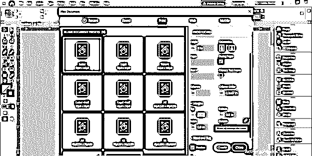

现在你可以看到我们在这份文件周围有粉红色和紫色的线，这就是所谓的空白。粉色线用于上边距和下边距，紫色线用于上边距和下边距。

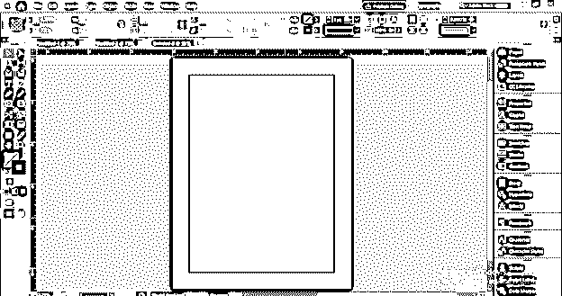

如果您想在已经打开的文档中留有页边距，或者想更改页边距，该怎么办？所以你可以用两种方法来做。首先，您可以进入该软件的属性面板，您可以在左侧面板部分或菜单栏的 Windows 菜单中找到该面板。

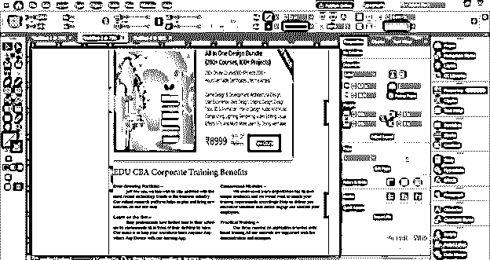

这是“边距值”框，您可以在其中更改其值或输入任何所需的值。

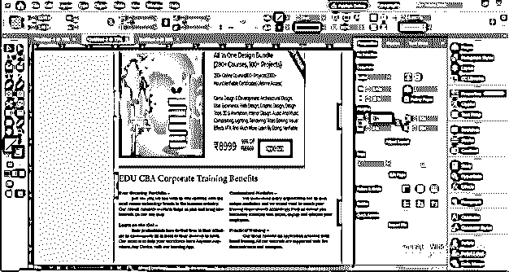

如果我将在值框中添加边距值，那么您可以在文档区域看到边距的预览。

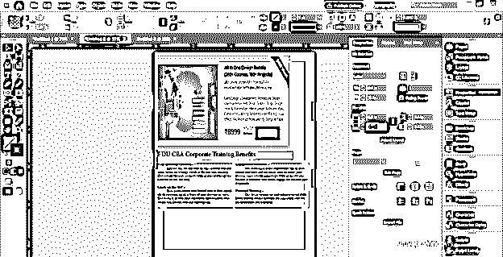

第二种方法是进入菜单栏的布局菜单并点击它。在它的下拉列表中，你会发现页边距和分栏选项。所以点击它。

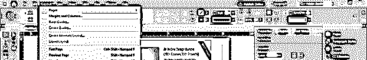

一旦你点击这个选项，你会看到一个页边距和分栏的对话框，在这个对话框中，我们可以像在属性面板中一样改变页边距值。你可以看到还有页边距的名称，即顶部、底部、内部和外部。

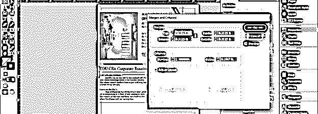

现在，我将移动我的文本，并将其与页边距对齐，以便在打印该布局时，打印不会干扰文本内容以及该设计的其他内容。

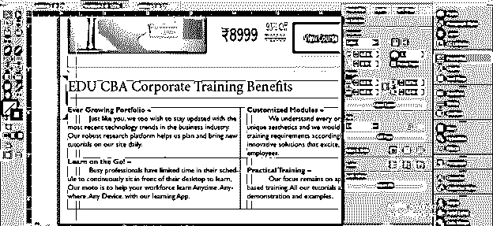

我将对文本和图像做同样的事情。你可以看到它现在是好看的设计布局。

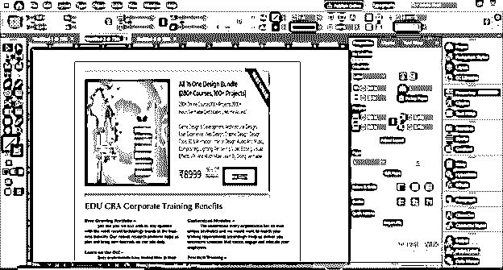

### 结论–InDesign 边距

因此，这种方式可以非常有助于你在设计布局设计的不同目的在这个软件和利润也给你一个想法，使你的布局打印没有丢失设计的内容。Thes 使用页边距的最大好处是对所有边使用相同的页边距没有限制。

### 推荐文章

这是 InDesign 页边距指南。在这里，我们将讨论如何在 InDesign 中使用边距，并通过对边距的分析来加深对边距的了解。你也可以看看下面的文章来了解更多

1.  [Indesign 版本](https://www.educba.com/indesign-version/)
2.  [Indesign 的替代方案](https://www.educba.com/alternative-to-indesign/)
3.  [InDesign 文档设置](https://www.educba.com/indesign-document-setup/)
4.  [什么是 Adobe InDesign](https://www.educba.com/what-is-adobe-indesign/)

