# InDesign 封装文字

> 原文：<https://www.educba.com/indesign-wrap-text/>

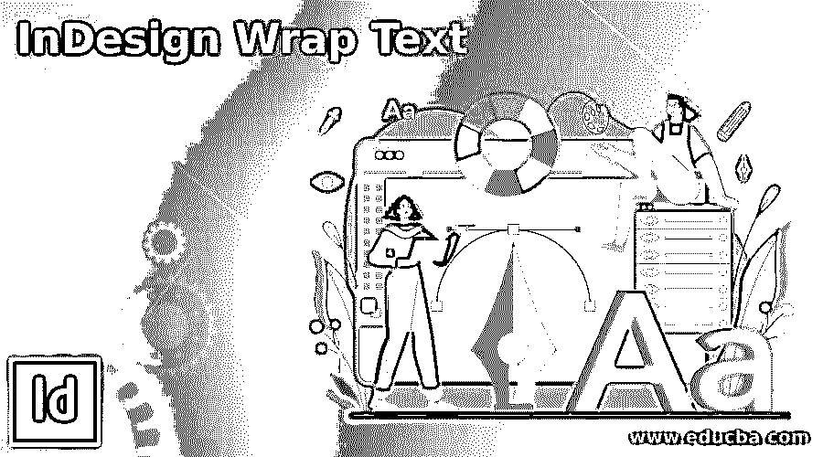

## InDesign 换行文本介绍

以下文章提供了 InDesign 自动换行文本的概述。在 Adobe InDesign 中，环绕文本是一项重要的功能，可以帮助用户管理和调整对象、框架、符号、图像和矢量形状周围的文本。设计师和创意艺术家在处理导入的图像、多个页面布局和程序中创建的对象时使用此功能。

### 如何在 InDesign 中换行？

*   Adobe InDesign 是一个非常规的程序，它融合了多种页面格式功能、文本格式、创建矢量对象、效果和布局格式，以及执行单个活动的多种方式。此外，为了管理和引导对象和图像周围的文本路线并调整文本和对象之间的间距，用户使用文本换行选项。
*   当对象被格式化为文本环绕时，这些对象被识别为环绕对象。此外，重要的是要注意，每当在对象周围创建文本换行时，文本边界和对象恰好变成相互链接和连接的。

### 如何在基本形状周围环绕文字？

当我们创建包含矢量对象、形状和文本的页面时，应该调整文本，使对象和文本一起清晰可见，并以适当的方式管理间距。要完成这项任务，需要使用文本换行。

<small>3D 动画、建模、仿真、游戏开发&其他</small>

以下是处理文字环绕和形状的步骤:

1.启动 Adobe InDesign。

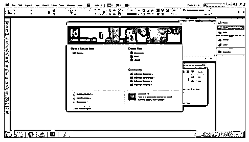

2.如下所示创建一个新文档。

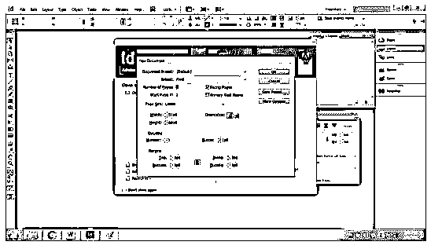

3.在页面上创建一个基本形状-圆形。

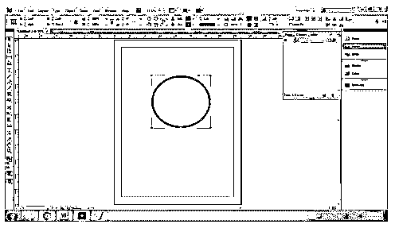

4.如下所示，使用文本工具编写一个示例文本。

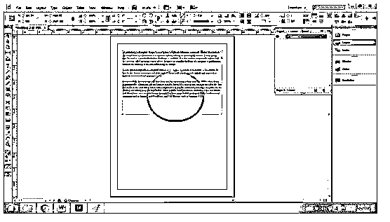

5.现在，为了让文字环绕圆圈，我们使用文字环绕选项。

6.转到窗口>文字环绕。点击选项。

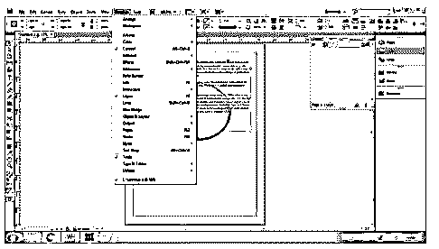

7.您将看到一个新的文本换行对话框。

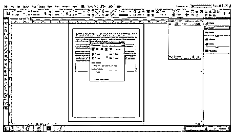

8.现在，选择文本和对象，并点击环绕对象形状，如下所示。

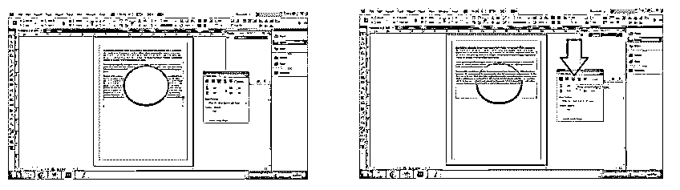

9.默认情况下，文本设置为不换行。

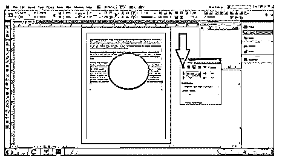

10.要更改设置，选择文本边界和对象，然后单击环绕边界框。这将在对象周围创建一个边界，并使文本环绕该框。

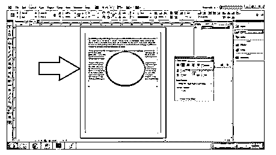

11.“跳转对象”和“跳转到列”用于在对象下方和旁边换行。

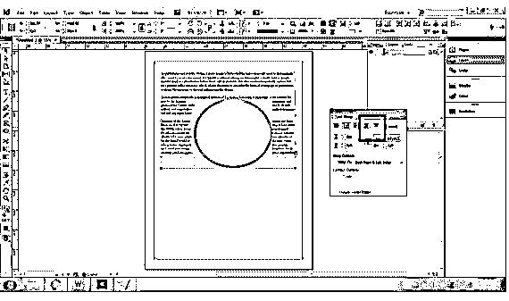

12.我们也可以使用反转选项将文本包裹在对象内部，如下所示。

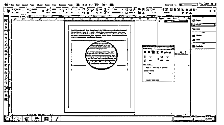

13.此外，该功能还帮助用户调整对象和文本之间的间距，如下所示。

同样，我们也可以使用直接选择工具或钢笔工具来改变对象的形状，并根据对象对文本进行换行。

### 如何让文字环绕图像？

在导入的图像周围环绕文本的过程与在对象周围环绕文本的过程非常相似。唯一的区别是我们可以改变图像的剪切路径或边界。

以下是创建换行文本的步骤:

1.启动 InDesign 并创建一个新文档。

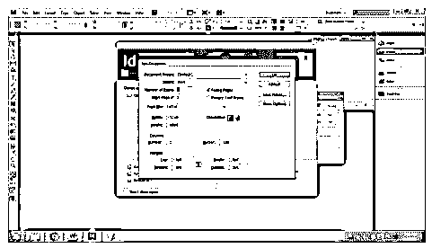

2.下载并放置(文件>放置)一个图像，如下所示。

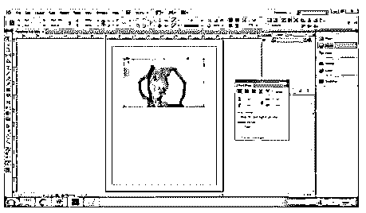

3.在文字工具的帮助下写一个示例文字，如下图所示。

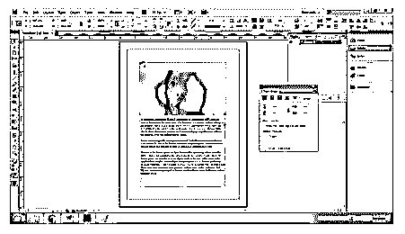

4.选择图像和文本，然后单击“文本环绕”对话框中的“文本环绕形状”。

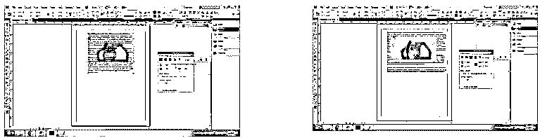

5.现在，在图像周围创建一个手动边界；转到对象>剪辑路径>选项。相应地调整容差和阈值。

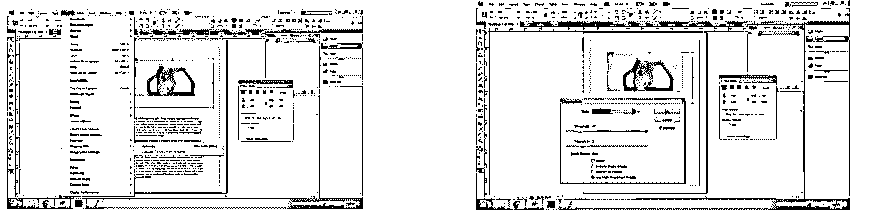

6.要根据剪裁路径环绕文本，请在轮廓的文本环绕选项中选择“与剪裁相同”。

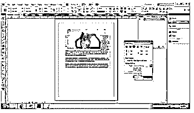

7.同样，选择“检测边缘”,在图像周围自动创建一个矩形边界框，并根据边缘环绕文本。

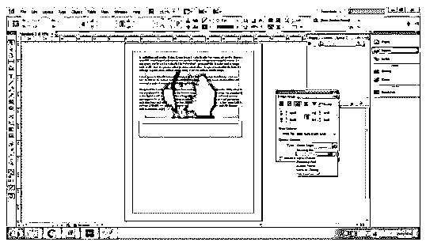

8.类似地，我们也可以在带有说明或标题的图像周围环绕文本。只需将图片和标题组合在一起，并以类似的过程在图片周围创建一个环绕文本。

### 用母版页环绕文本

要仅在母版页上的对象周围应用文字环绕，请转到 Windows 并选择文字环绕选项。现在，单击对话框右侧的三行并选择仅应用于母版页。使用此设置，文字环绕将仅应用于放置在母版页上的对象和文字。

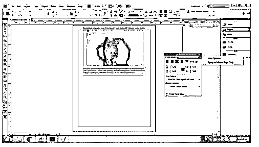

### 用隐藏层环绕/展开文本

当用户将文本环绕在特定层上的对象周围，然后隐藏该层时，文本框架碰巧环绕在其他层上的另一个对象周围。

因此，为了避免这种现象，我们使用隐藏图层时抑制文字换行的选项。双击图层并选择上面的选项来改变图层上文本的组成。

下面给出了相同的演示。

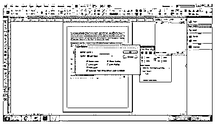

### 结论

总结本文，文字环绕是一个广泛的主题，但在学习在 Adobe InDesign 上创建页面和布局的基础知识时，它是一个重要的方面。用户必须学习文本格式和包装的基本原理，并通过实例来获得软件的正确知识，并创建创造性的设计和艺术作品。

### 推荐文章

这是 InDesign 自动换行文本指南。这里我们讨论如何在 InDesign 中围绕基本形状环绕文本&用隐藏层环绕/展开文本。您也可以看看以下文章，了解更多信息–

1.  [什么是 Adobe InDesign](https://www.educba.com/what-is-adobe-indesign/)
2.  [InDesign 段落样式](https://www.educba.com/indesign-paragraph-styles/)
3.  [InDesign 页边距](https://www.educba.com/indesign-margins/)
4.  [InDesign gap 工具](https://www.educba.com/indesign-gap-tool/)

