# ZBrush ZRemesher

> 原文：<https://www.educba.com/zbrush-zremesher/>

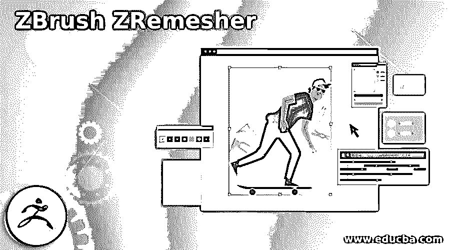

## ZBrush ZRemesher 简介

Zbrush ZRemesher 可以理解为安排以及计算多边形，用于在该软件中对所选子工具的可见部分进行重新布局。有了 ZRemesher，人们可以非常快速地进行重建，而不是手动进行。“重新多边形化”对于在子工具上拥有大量多边形是必要的，这样它就可以在动画过程中轻松地制作动画。在 Zbrush 中，我们也有一个 ZRemesher 笔刷，它可以帮助我们定位子工具部分，根据这些子工具部分，我们可以使用 ZRemesher 选项进行重新拓扑。

### ZRemesher 怎么用？

我们使用 ZRemesher 来最小化模型中所选子工具上的多边形。所以你如何使用 ZRemesher，让我们有一个模型。我们会去这个软件的灯箱，从列表中选择这个女头像。您可以使用自己的模型来了解这个主题。

<small>3D 动画、建模、仿真、游戏开发&其他</small>

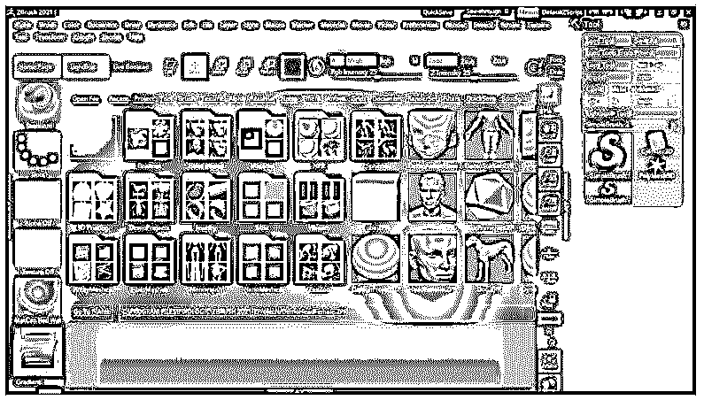

现在，我们将转到菜单栏的 transform 菜单，它位于工作屏幕的顶部，并启用 Polyframe 选项，以便我们可以在所选的子工具上看到多边形，或者您可以按键盘的 Shift + F 键作为快捷键。

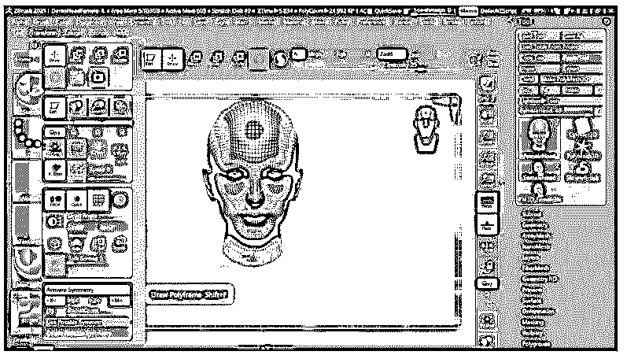

如果我们从该模型的“几何体”面板的“动态网格”选项中增加动态网格值，您可以看到有许多多边形不适合动画目的。

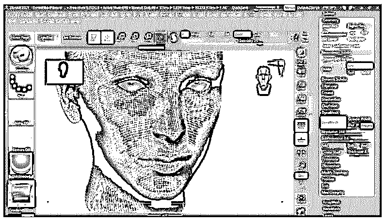

在你开始使用 ZRemesher 之前，复制你的子工具，因为 ZRemesher 会完全改变你的子工具的拓扑结构，但是尽可能的保持形状。

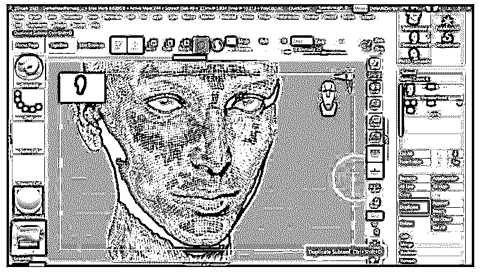

现在进入独奏模式，这样它就可以为选定的子工具做重新布局；否则，它将与模型的所有子工具啮合。您可以在“变换”菜单面板中通过单击按钮来启用“独奏”选项。

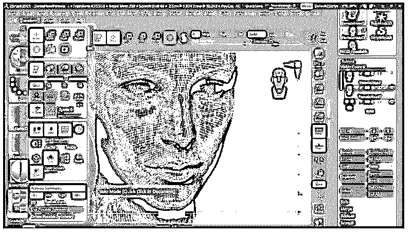

或者有一个快速的方法可以做到这一点，只需进入首选项菜单并点击它；在编辑选项中，启用“点击切换独奏模式”选项。

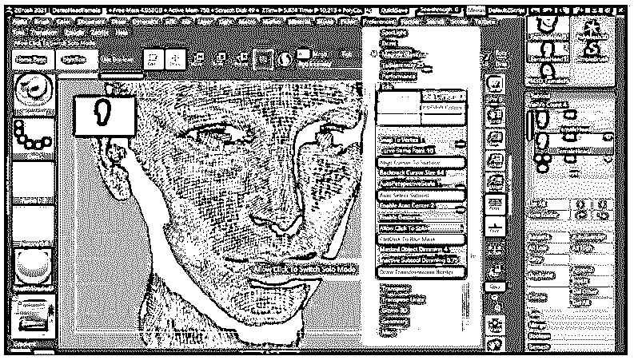

一旦你在地板上的任何地方点击它，它就会在单人模式和普通模式之间切换。

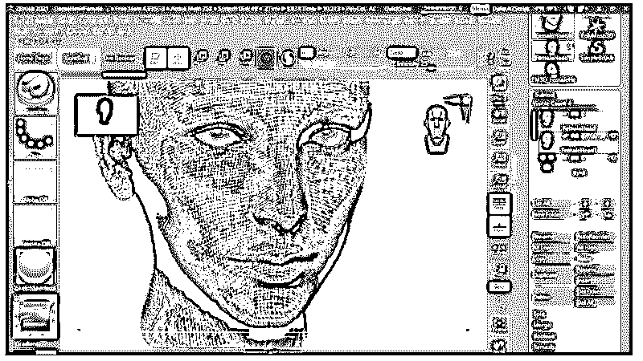

现在转到工具栏部分，它位于工作窗口的右侧，并单击几何面板。在这个面板中，您可以找到 ZRemesher 选项。

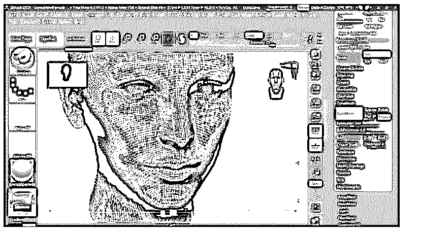

一旦你点击它，它的面板将被打开。在 ZRemesher 的面板中，主要选项是“目标多边形数”,它决定了所选子工具上将有多少多边形，并且您可以更改它的值以获得不同的变化。

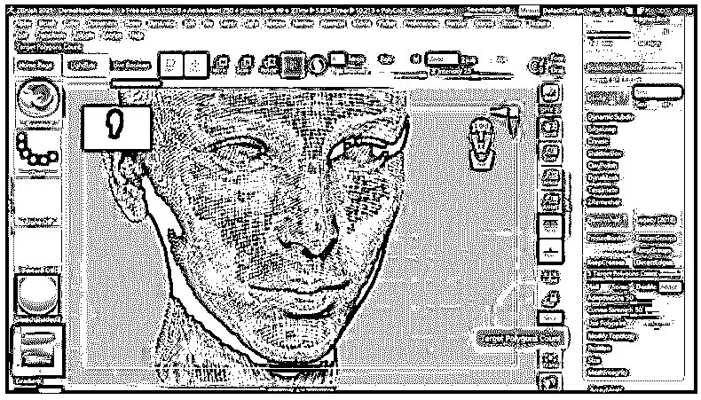

默认情况下，它的值是 5，但是您可以根据需要减小它。例如，我们将通过在此选项中输入 1 来将其值设为 1。

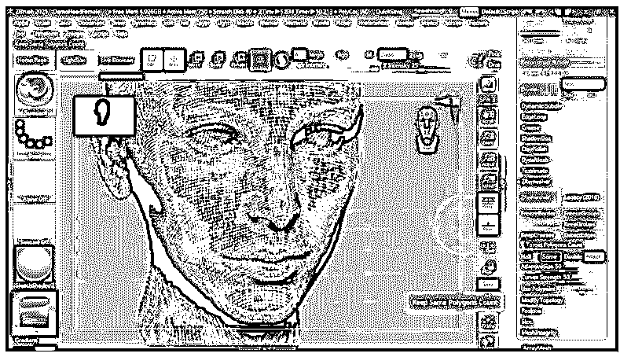

然后点击这个面板的 ZRemesher 按钮。

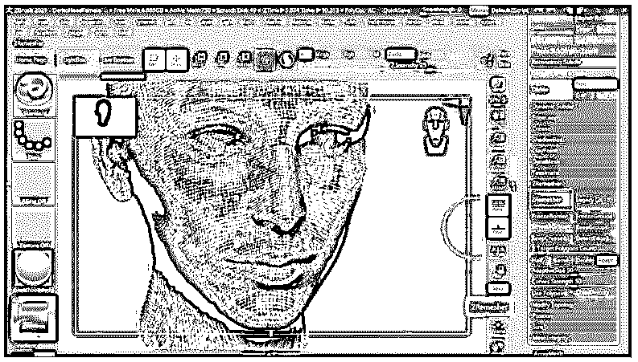

一旦你点击它，它将需要一些时间来处理和完成它们。

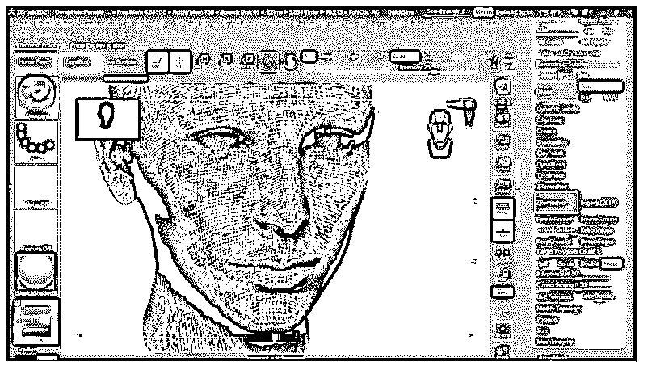

同样形状的多边形会更少。

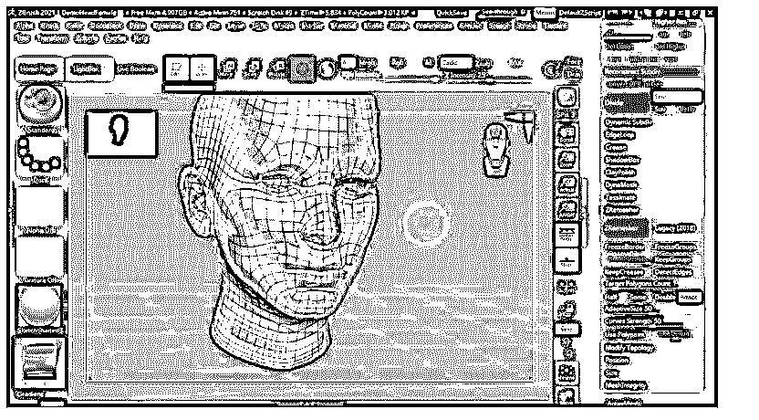

### ZRemesher 的方法

使用 ZRemesher，可以搭配一些方法；第一个是你可以使用对称模式，在你选择的子工具上给你对称的多边形。因此，如果您的子工具具有对称性，那么请确保您的对称模式是打开的。举例来说，当我的对称模式打开时，我们在 ZRemesher 过程中使用这个子工具，你可以看到面的两边有相等的多边形。

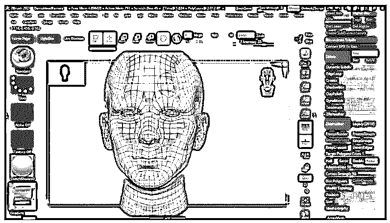

下一个方法是非对称模式，我们将按下键盘上的 X 键。

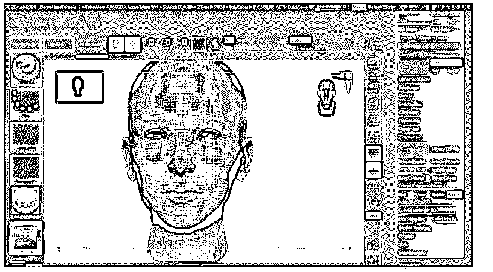

现在，当你按下 ZRemesher 面板的 ZRemesher 按钮时，你可以看到它会给你一个 sub 工具没有对称性的结果。所以你可以使用非对称子工具。

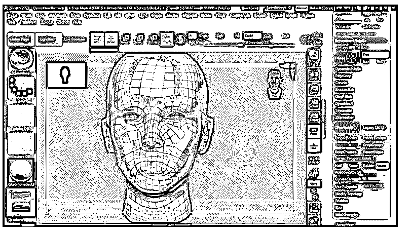

另一种方法，你可以用来不打扰你想要的领域。因此，我们把我们想要的区域分成几组。你可以为你的模型创建两个以上的多边形组，为了创建多边形组，我们将通过按住键盘上的 Ctrl 键来绘制蒙版笔刷。

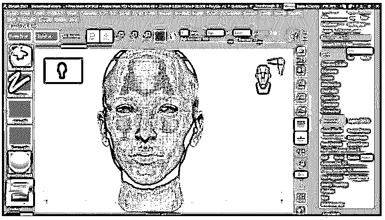

我们会遮住这个嘴部区域。

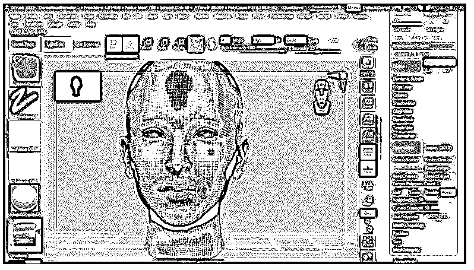

并按下键盘的 Ctrl + W 键，使这个蒙版区域成为多边形组。

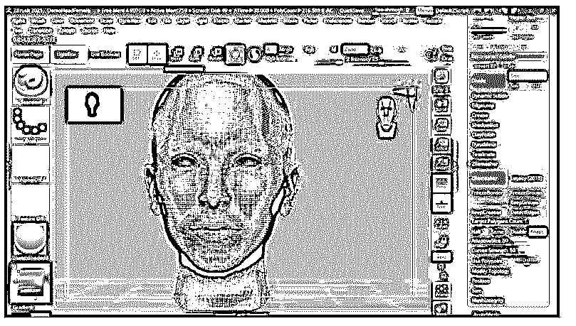

现在启用 ZRemesher 面板的“KeepGroups”选项。

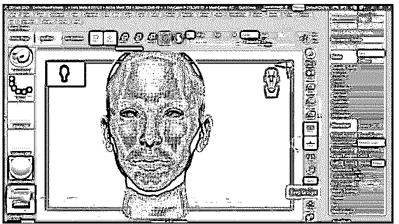

你可以在重组后看到。它非常精确地保持了嘴巴的边缘。

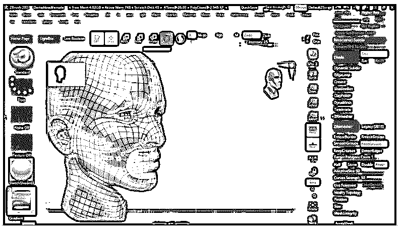

如果你愿意，你可以再次按下 ZRemesher 按钮来得到平滑的多边形。

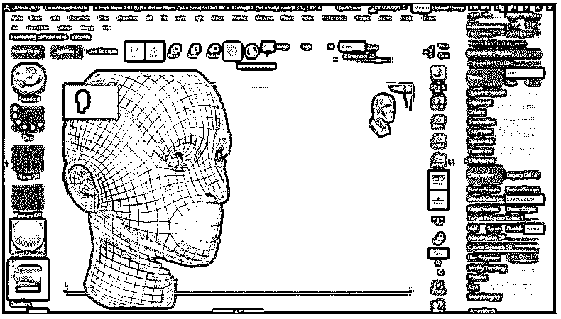

在笔刷面板中也有一个 ZRemesher 笔刷，你可以像使用蒙版笔刷一样使用它。使用 ZRemesher brush，我们可以为 ZRemesher 选项指定区域，以获得准确的结果。

转到画笔面板，按下键盘上的 Z 键，你就有了所有的画笔；那些名字都是以 Z 字母开头的。这里我们有一个 ZRemesher 画笔，所以点击它来选择它。

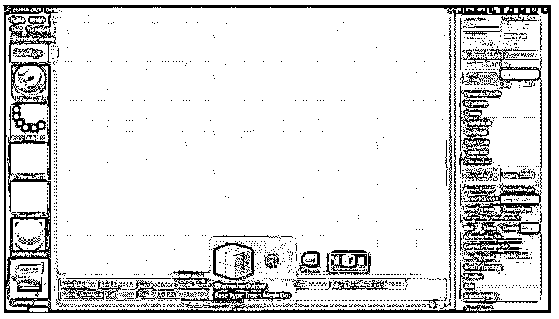

现在只需在你想要标记的区域周围移动鼠标光标。例如，我们将标记这个眼睛区域。我的对称模式是开着的，所以会自动标记对面的眼睛。

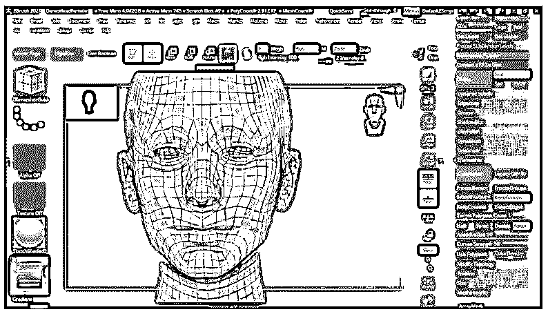

现在转到工具栏部分，再次点击 ZRemesher 按钮，它会给你这个子工具的重新布局平滑多边形。

您可以根据自己的需求使用任何一种方法来获得想要的结果。你只需要准确地维护参数。

### 结论 ZBrush ZRemesher

我们对这个软件的 ZRemesher 选项有很好的了解，现在我们对这个选项的几乎每个方面都有了了解。你也可以使用 ZRemesher 笔刷来平滑模型的可见子工具。现在我们建议你开始练习这种方法，以便对它有越来越多的掌握。

### 推荐文章

这是一个 ZBrush ZRemesher 指南。这里我们讨论一下入门，如何使用 ZRemesher？和更好理解的方法。您也可以看看以下文章，了解更多信息–

1.  [ZBrush 热键](https://www.educba.com/zbrush-hotkeys/)
2.  [ZBrush 雕刻](https://www.educba.com/zbrush-sculpting/)
3.  [ZBrush 工具](https://www.educba.com/zbrush-tools/)
4.  [ZBrush 插件](https://www.educba.com/zbrush-plugins/)

