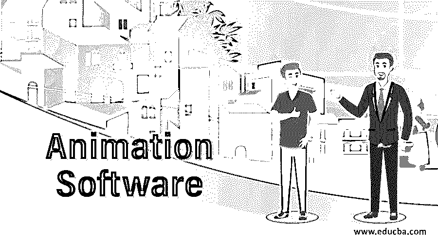
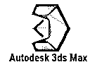
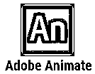

# 动画软件

> 原文：<https://www.educba.com/animation-software/>

## 动画软件介绍

如今，动画视频的普及程度与日俱增。动画在当今世界有着广泛的应用，从为你的品牌创造视觉内容，创造动画电影，或创造社会媒体内容，等等。你可以在各种动画软件的帮助下结合你的技能和创造力来创作动画。如果你对动画技术有所了解，你会很容易使用这个软件。即使你没有太多关于它们的信息，你也可以从跟随教程开始。现在重要的问题是去哪里找制作令人惊叹的动画视频的软件。

### 顶级动画软件

在这里，我们向您介绍各种可用的动画软件，它们是目前使用的最好的软件。

<small>3D 动画、建模、仿真、游戏开发&其他</small>

#### 1.按键快照

KeyShot 用于创建交互式的 3D 渲染、动画和视觉效果。这是一个实时光线跟踪工具，也带有全局照明设置。Keyshot 的架构是基于 CPU 的，允许实时进行真实感渲染。它可以在最低硬件配置的笔记本电脑中流畅运行。您没有必要投入巨资为您的系统购买单独的显卡。使用 Keyshot 的另一个优点是，它允许导入多种 3d 文件格式，这与任何其他可用的软件不同。它可以支持多达 20 种文件格式导入。KeyShot 的用户界面也非常直观和用户友好，通过拖放选项可以添加材质和环境预设、纹理、贴图、照明、动画等等。

#### 2.再说一遍

Powtoon 是最简单的动画软件之一，可用于即时创建专业和干净的视频和创意材料。任何人都可以使用 Powtoon，无需任何设计或技术技能。《财富》500 强中的大多数公司都在使用它，它拥有超过 2000 万的用户群。公司可以利用 Powtoon 吸引客户、增加收入、与员工进行令人兴奋的内部交流以及有效的品牌营销。Powtoon 成立于 2012 年，如今在世界各地都设有办事处。通过使用 Powtoon，你可以节省很多花在专业工作室的钱。您可以在几分钟内独自创建工作室质量的视频和动画。为了让事情变得非常简单，媒体库中提供了大量高质量的模板。它包含图形艺术、音轨、文本效果、图像和视频集合、道具和角色，以及添加您自己的媒体的选项。

#### 3\. Autodesk 3ds Max

Autodesk 3ds Max 是由 Autodesk 创建的一款高级 3d 计算机图形软件,用于创建 3D 动画、角色模型、游戏和效果。它运行在 Windows 操作系统平台上。3DX Max 使用户能够创建专业级输出。因此，它是 3D 动画专业人员创作电影、游戏和建筑可视化的首选程序。它还装载了一个灵活的插件架构。也可以使用 3ds Max 创建电影效果和预可视化元素。3ds Max 的最新版本具有高级工具，包括动态模拟、照明效果、光能传递、渲染和贴图、粒子系统、友好的用户界面、新鲜的图标等等。

#### 4.动物制造者

与 Powtoon 类似，Animaker 是另一个易于使用的在线 DIY 动画软件。它是世界上最大的动画资产库之一，使其遍布多个国家的 350 万用户能够创建令人惊叹的视觉效果和动画。您可以在几分钟内制作出与专业质量产品不相上下的视频。Animaker 还支持多语言集成，您无需任何广泛的培训或指导就可以使用它。组织使用 Animaker 将静态和枯燥的数据转化为吸引人的信息图表作品。这也是一个伟大的工具来解释产品细节与 2D 动画解说视频。用户还可以将角色预设整合到他们的视频中，使事情变得有趣和好玩。

#### 5\. Adobe Animate

Animate 由 Adobe 开发，是一款计算机动画和用于创建矢量图形和动画的多媒体软件。你可以在网站、视频、互联网应用、电视节目和游戏中使用你的作品。作为一个 Adobe 产品，它与其他应用程序有几个相似之处，如 [Adobe Illustrator](https://www.educba.com/what-is-adobe-illustrator/) 。例如，您可以使用手写笔或钢笔工具在绘制线条和笔画时创建矢量画笔。您可以通过学习在线教程和学习资源来掌握 Adobe Animate。无论您是学生、创意专业人士还是业余爱好者，如果您已经熟悉 Adobe creative suite，Animate 都是您的完美工具。

#### 6\. Autodesk Maya

Autodesk Maya 是最受欢迎的 [3D 动画软件](https://www.educba.com/3d-animation-software/)之一，用于在动画电影、工作室程序、广告和视频游戏中创建专业视频。它彻底改变了由传统 2D 和手绘技术主导的动画景观。世界各地的动画师更喜欢 Maya，因为它提供了大量的活动，如逼真的 3D 动画，创建 3D 环境，模型创建，视觉效果，等等。Maya 于 1998 年由 Alias Wavefront 发布，版本为 1.0。Autodesk 在 7 年后的 2005 年收购了 Maya，剩下的就是历史了。

### 结论

本文举例说明了目前用于制作动画视频和演示文稿的一些高质量的动画软件。其中一些被认为是行业黄金标准，被全球许多专业创作者使用。无论你是想推销你的品牌，或者如果你是一个动画世界的初学者，或者只是想探索创造视觉内容，上述文章中介绍的动画软件可以帮助你。

都说熟能生巧；这同样适用于掌握动画——你练习得越多，你就变得越熟练。大部分软件都很好用，完全靠自己就可以开始你在动画世界的旅程。然而，如果你偶然发现了什么，你可以参考互联网上成千上万的教程来帮助你。那么为什么还要等呢？下载最适合您需求的动画软件，并立即开始制作令人惊叹的视频和视觉效果。

### 推荐文章

这是一个动画软件指南。这里我们讨论一下简介，基本概念，以及排名前六的动画软件。你也可以浏览我们推荐的其他文章来了解更多信息-

1.  [Flash 中的动画](https://www.educba.com/animation-in-flash/)
2.  [动画原理](https://www.educba.com/principles-of-animation/)
3.  [玛雅动画](https://www.educba.com/maya-animation/)
4.  [后期效果中的动画](https://www.educba.com/animation-in-after-effects/)

