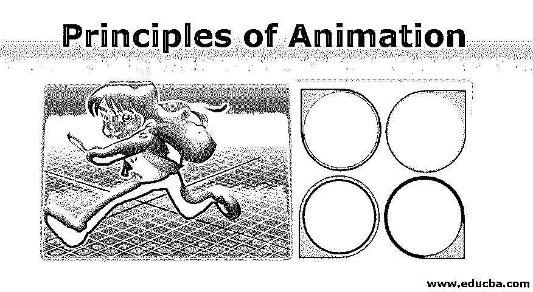

# 动画原理

> 原文：<https://www.educba.com/principles-of-animation/>

## 动画原理导论

人们做了很多努力来用计算机技术辅助动画制作，但是仍然有很多动画师发现很难在这个领域创作出引人入胜的作品。智能动画是关于最基本的东西。坚持物理定律是开始的方式，但更多的智力关注，如心理时机和角色吸引力呢？1981 年，迪士尼动画制作人奥利·约翰斯顿和弗兰克·托马斯推出了 12 项动画基本原则，以创作出更具逻辑性的作品。从那时起，这些原则已经被几乎每一个专业动画师所接受，并被一些人引用为动画的圣经。最初，它是为了注册传统和手绘动画；这些原则对现在的计算机动画仍然有很大的作用，可以在角色动画和用户体验设计中看到。

### 动画的基本原理

以下是动画的十二个基本原则:

<small>3D 动画、建模、仿真、游戏开发&其他</small>

#### 1.挤压和拉伸

被描述为最重要的原则，挤压和拉伸给你一种被画物体的体积和重量的感觉。最好用一个正在弹跳的球来表示，它在下落时似乎被拉长了，而在落地时又被击碎了。即使是在扩大和缩短动画对象上的一点夸张，也会给他们带来实用主义的感觉。考虑一个球撞击甲板，运动的力量水平地粉碎球，但是因为一个实体需要保持它的大小，它也在碰撞时变宽。挤压和拉伸塑造了角色的灵活性、体积和适应性。在面部动画中也很有价值。

#### 2.希望

这个动作使观察者为角色计划要做的主要动作做好准备。例如，开始跳跃、奔跑或冲刺。要跳起来，首先需要做的是深蹲，可以考虑是预判，也可以考虑是准备。在你多次使用它之后，幽默效果可以在没有预期或准备的情况下获得。从虚拟的意义上来说，所有的实际运动在相当大的程度上或边缘程度上都有预期或准备。

#### 3.脚手架

在拍摄一个片段的时候，相机的位置会是怎样的？演员应该搬到哪里去？你能指望他们做什么？所有这些选择的结合就是我们定义的阶段。这是未被注意到的原则之一。它将观察者的意识指向场景中最重要的部分，从而有效地推动故事的发展。阶段的本质是保留相关的基础，删除不重要的信息，并避免任何不确定性。

#### 4.直行动作和姿势对姿势

绘制动画草图的两种方法是直线动作和姿势到姿势。直线前进是一个原则，你可以在前进的过程中连续地勾画出一个动作的每一种形式。就姿势到姿势而言，您可以绘制最大限制，即动作的开始和结束草图，然后您移动到中心帧并开始加载中间的帧。

姿势到姿势让你对动作有更多的控制。你可以一开始就观察你的角色在创世纪和结尾会在哪里结束，而不是期望时间是正确的。通过首先完成重要的体式，它允许你尽早抓住任何关键的错误。它的问题是，有时它过于灵巧和完美。掌握这两种技术并融合它们是成为一名成功的动画师的最好方法，因为这样你就可以同时获得结构和活力。

#### 5.跟踪和重叠动作

当角色的重要身体停止时，所有其他部分都与角色的重要部分保持一致，如长发、手臂、衣服、服饰、松弛的耳朵等。没有什么是一次停止的。这被定义为跟进。重叠动作是指角色在头发或衣服向前移动时改变方向。角色朝不同的方向移动，几帧后他的衣服朝不同的方向移动。

#### 6.慢进慢出

该原理有时被称为缓入缓出，它认为几乎每个运动都需要时间来加速和减速。如果在动作的开始点和结束点附加更多的插图，突出显示测量的加速和减速以及中间的减速，你的动画会看起来更实用。

#### 7.弧

生活不是一成不变的，动画也应该如此。几乎所有的生物都沿着被称为弧线的圆形轨迹运动。弧线沿着一条圆形的路径工作，将生活的印象附加到冒险中的一个活泼的物体上。如果没有弧线，你创建的动画将会是僵硬的，没有生气的。

#### 8.次要行动

用次要的动作来辅助主要的动作，可以增加角色动画的比例，使场景更生动。阶段原则对于准确记录动作非常重要。确认次要行动突出了主要行动，而不是将注意力从主要行动上移开

#### 9.定时

引用所提供的动作的草图或帧的数量，准确的时间对于建立角色的思想、情绪和反应的框架是重要的。仅仅利用更多的帧来产生适度的动作，而利用更少的帧来产生更快的动作。

#### 10.夸张

迪士尼对夸张的典型描述是忠于现实，只是赋予它更激烈、更深远的形式。由于对现实的理想模仿在卡通中看起来是一成不变的和无趣的，夸张对于动画来说是最有帮助和鼓舞人心的。

#### 11.立体图

立体绘画就是要确保动画形状看起来像是在 3D 空间中。

#### 12.呼吁

人们不会忘记真实的、迷人的、吸引人的角色。动画角色应该吸引眼球，具有吸引人的特征，这甚至适用于故事中的对手。吸引力可能很难衡量，因为每个人都有不同的标准。

### 结论

这些原则建立了所有动画工作的基础，并且适用于许多不同的领域。最明显的用途是为角色制作动画，但是这些规则在其他部分也是不可或缺的指导者，例如，如果你想用一些 CSS 动画开始进入你的界面。

### 推荐文章

这是一本动画原理指南。这里我们讨论一个简介和动画的十二大基本原则。您也可以浏览我们的其他相关文章，了解更多信息-

1.  [可用的顶级动画软件](https://www.educba.com/animation-software/)
2.  [2D 最常见的动画软件](https://www.educba.com/2d-animation-software/)
3.  [3d 动画软件列表](https://www.educba.com/3d-animation-software/)
4.  [Flash 中的动画](https://www.educba.com/animation-in-flash/)

