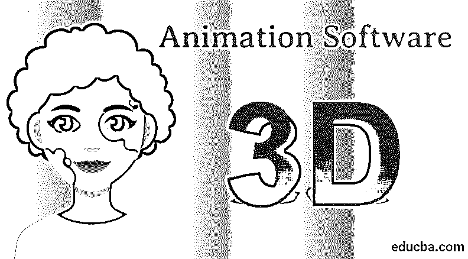
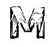
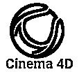

# 三维动画软件

> 原文：<https://www.educba.com/3d-animation-software/>

## 三维动画软件介绍

今天，3d 动画程序被认为需求量很大，非常受欢迎，对动画师和设计师都有帮助。市场上有的动画软件是免费的，有的是付费程序。我们周围的世界发展非常快，各行各业的发展速度超乎想象。3d 动画程序用于制作 3D 电影、视频效果、动画图形、VFX 以及动画视频。一些最常用和最受欢迎的动画程序是 Autodesk Maya、Autodesk 3Ds Max、Blender、Cinema 4D、ZBrush 和 LightWave 3D。使用操作系统和动画程序以数字方式创建动画序列，这使得创建动画电影的任务更加容易和简单。动画程序有丰富的工具和功能，这使得这些程序既有用又要求高。

### 三维动画软件列表

一些主要使用的动画程序如下-

<small>3D 动画、建模、仿真、游戏开发&其他</small>

#### 1.搅拌机

这是一个开源的免费程序，任何人都可以使用，而不需要支付任何回报。该计划有助于建模，索具，动画，组成，视频编辑，创建视频游戏和模拟。由于它是一个开放和免费的程序， [Blender 可以被初学者、个体动画师和学生、工作室艺术家、专业人士、游戏开发者甚至业余爱好者使用。](https://www.educba.com/what-is-blender/)

Blender 支持强大的工具集和良好的平台来执行复杂的功能，这有助于简化动画和建模过程。Blender 还支持默认的路径跟踪引擎，通常称为 Cycles。Cycles 有助于获得逼真的渲染输出、VR 渲染支持和 HDR 照明支持。总而言之，Blender 是一个动态动画程序，支持用户友好的界面。该软件配备了 3d 绘画工具，雕刻工具，以及脚本语言。Python 是一种脚本语言，可用于根据您自己的需求创建自定义库和效果。

#### 2\. Autodesk Maya

关于 Autodesk Maya 已经说了很多。使用该软件，用户可以贡献和创建 3d 项目、游戏、演示、电影和视频效果。该程序加载了交互式工具和功能，帮助用户轻松创建项目和演示。该计划是完美的建模，动画，纹理，照明，以及渲染。该程序有一个基于视频的编辑器，本质上是非破坏性和非线性的，可以帮助用户创建逼真的高质量动画。我们还可以使用 Autodesk Maya 执行具有精确结果和[输出的完美布料模拟。该计划定期更新，并载有新的和有趣的工具工作。程序的最新升级改进了软件的工作流程。Autodesk Maya 的最佳功能之一是可以轻松导出和导入 SVG 文件。虽然 Maya 是一个付费软件，但它值得购买并尝试使用该程序。](https://www.educba.com/what-is-maya/)

#### 3.4D 电影院

这个节目因拥有最好的动画工具和效果而广受欢迎。该程序是一个简单的程序，几乎所有的动画和 3d 工具。该软件被大多数 3D 艺术家和动画师使用。该计划提供快速和迅速的产出和结果。该计划有一个容易和简单的外观和界面，证明是有利于初学者和新生。4D 电影院也有一个巨大的社区，为初学者提供教程和插图，以便他们可以轻松掌握该程序。该程序支持高级渲染器，有助于获取逼真的图像。该程序还具有 MoGraph，这是运动图形、程序建模和动画目的所需要的[。该程序还可以让用户创建非常准确和高效的头发模拟。](https://www.educba.com/what-is-motion-graphics/)

#### 4.Daz 工作室

这是一个用于创建动画和项目的复杂程序。该程序可以在市场上免费获得，并且该程序也可以生成渲染。该程序要求在开始使用软件之前进行注册。该产品自带模型和场景，我们只需添加细节并操纵模型即可创建我们需要的模型。Daz Studios 是为那些对 3d 动画程序及其功能有丰富知识的有经验的设计师和艺术家创建的。

#### 5.布鲁什

这是一个更侧重于建模和纹理的程序，但也可以执行动画项目。ZBrush 还帮助用户在 2.5D 中创建模型，它已经加载了一些笔刷来满足这一需求。有了这个程序，我们既可以创作出令人惊叹的雕塑，也可以将它们导入到其他动画软件中。ZBrush 带有一个支持 ad 的渲染器，使用 HDRI 图像提供完整的 360°场景地图。该计划也有 Fibermesh 和 ZRemesher，帮助创建模型中的多边形纤维或创建植物和树木。ZBrush 最好的功能之一是它包含了 Polypaint 功能。这个 Polypaint 函数允许用户绘制对象，而无需首先将纹理贴图指定给对象。这是 ZBrush 的一个重要且有用的特性。

### 结论

市场上有各种各样的程序和动画软件。有些程序比较简单，有些比较复杂。有些是免费的，有些是付费的。虽然，这是用户的选择，为他们的目的和需要选择所需的程序来创建项目。每个程序都有一些其他程序无法替代的独特功能和工具。

### 推荐文章

这是一个三维动画软件指南。在这里，我们讨论的概念和不同类型的三维动画软件，用于动画的视频和图像。您也可以浏览我们推荐的其他文章，了解更多信息——

1.  [三维建模软件](https://www.educba.com/3d-modeling-software/)
2.  [2D 动画软件](https://www.educba.com/2d-animation-software/)
3.  [Adobe Flash 中的动画](https://www.educba.com/animation-in-adobe-flash/)
4.  [玛雅动画](https://www.educba.com/maya-animation/)

