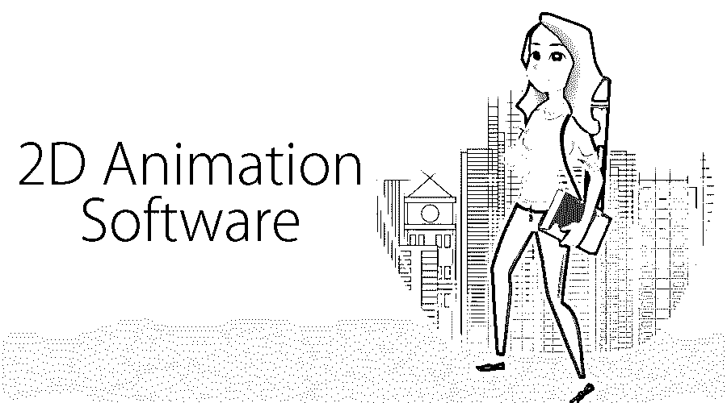
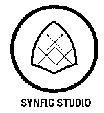

# 2D 动画软件

> 原文：<https://www.educba.com/2d-animation-software/>

## 二维动画软件介绍

下面的文章提供了 2D 动画软件的概要。动画是操纵图像使其看起来像移动的物体的过程。动画赋予静态图像以生命。在古代，图像是手工绘制的，并以胶卷的形式展示以制作动画。当今的新技术引入到动画中，CGI(计算机生成动画)是当今动画师常用的方法。电脑动画可以简单地分为两种类型，三维动画和 2D 动画。

3D 动画是制作三维动画，包括物体的高度、宽度和深度。最常见的是，3D 模型是通过渲染存储在计算机中的 2D 图像来制作的。物体的 2D 动画运动被限制在二维空间，这里位图和矢量图形被用来创建动画图像。今天我们将讨论一些当前行业中领先的 2D 动画软件。

<small>3D 动画、建模、仿真、游戏开发&其他</small>

### 2D 最常见的动画软件

以下是 2D 一些顶级的动画软件:

#### 1.Moho Pro

Moho 是一款基于矢量的 2D 动画软件，由 Smith Micro software 开发并拥有。它以前被称为动漫工作室。这个软件有两个版本，莫霍 pro 和莫霍出道。其中 Moho 处女作是为初学者设计的，而 pro 是为配备了高级功能和工具的高级用户设计的。Moho 在 Windows 和 Mac OS 上都有。

莫霍面的一些特征列举如下:

*   层可以在透视中制作动画
*   层排序的动画是可能的
*   遮罩功能可用
*   所有的 Windows 和 Mac
*   它支持几乎所有的文件格式

#### 2.显示树的和谐

Toon Boom Animation 是一款由加拿大软件公司 Toon Boom Animation Inc .开发的制作和故事板软件，成立于 1994 年，2012 年被 Corus Entertainments 收购。香椿景气是 130 多个国家的人们使用的一个普通软件。他们为电影、广告、电视等制作动画视频。香椿景气和谐是一个软件，汇集了香椿景气的所有动画应用。2D 动画是非常简单和强大的各种功能，如索具，动画，设计，粒子和效果。

该软件的一些功能包括:

*   刷式发动机
*   托盘和喷漆
*   无纸动画
*   2D 或 3D 集成
*   剪切动画
*   效果和合成

#### t13。卡通人物

Toonz 是一组 2D 动画软件。基础版本由 Dwango 开发，被称为 OpenToonz，它是开源软件。Toonz premium 是该软件的高级版本，为专业人士提供了高级功能。它是由数字视频公司开发和销售的

第一个版本 Toonz 3.0 是在 1993 年开发的。从那里，许多版本被发布，最新的是 Toonz 7.0。Toonz 是开源软件，正因为如此，我们可以自由地修改它的源代码。此外，它还配备了有助于满足现场需求的功能和特性。SDK 是该公司最近开发的一个插件，在它的帮助下，任何人都可以添加效果来打开 toonz。

#### 4.Synfig 工作室

Synfig 是一个开源的 2D 动画软件，它处理矢量图形。罗伯特·夸特鲍姆开发了 Synfig，后来阿德里安·本特利也做出了贡献。它是一个前端后端应用程序，允许在前端进行设计，稍后可以通过另一台计算机上的后端 Synfig 工具进行渲染。它的开发者的主要目标是用更少的人和资源创建一个制作故事片质量动画的应用程序。Synfig 的另一个功能是它允许替代手动推文，在这个功能的帮助下，动画师不必绘制所有的帧。

Synfig 软件可在 Windows、Linux 和 mac 上使用。该软件提供了 50 多个图层来创建任何复杂程度的动画。此外，它还具有一个骨骼系统，允许使用位图图像制作剪切动画。此外，Synfig 中还提供了许多其他高级工具和功能，使其更加用户友好和专业。

#### 5.铅笔 2D

铅笔 2D 是一个由 Matt Chang 开发的开源 2D 动画软件。它可以在 Linux、Windows 和 macOS 中使用。该软件使用矢量/位图图像来制作动画。最初这个软件是由 Pascal Naidon 和 Patrick Corrieri 在 2005 年发现的。它非常简单，用户友好，同时也是非常有效的软件。初学者和专业人士使用这个 2D 动画。

该软件的用户界面非常简洁，有助于用户专注于他们正在做的事情。此外，铅笔 2D 允许我们在光栅和矢量图形之间切换，允许我们素描，墨水和绘画。它的另一个优点是它是开源软件，可以免费获得。

### 结论

当我们结束这个话题时，我们知道动画已经对电影、电视节目、儿童节目等所有类型的娱乐产生了巨大的影响。其中，2D 动画是最基本的类型，更容易创作，同时也能提供更好的效果。通过 2D 动画，不仅娱乐，而且教育和信息的想法正在创造。此外，通过动画，将更容易向孩子们传达想法。

如果你有完美的软件，创作一部 2D 动画会非常容易。即使是初学者也可以使用这个软件制作动画。如果你心中有一个剧本或想法，上面列出的任何软件都可以帮助你将你的剧本形象化。市场上还有许多其他软件；这里只列出了几个。仔细检查细节，选择最适合你的。

### 推荐文章

这是一个二维动画软件的指南。在这里，我们讨论的概念和一些领先的 2D 动画软件在当前的行业。您也可以浏览我们推荐的其他文章，了解更多信息——

1.  [3D 动画职业](https://www.educba.com/careers-in-3d-animation/)
2.  [Flash 中的动画](https://www.educba.com/animation-in-flash/)
3.  [2D 特效动画后](https://www.educba.com/2d-after-effects-animation/)
4.  [动画原理](https://www.educba.com/principles-of-animation/)

