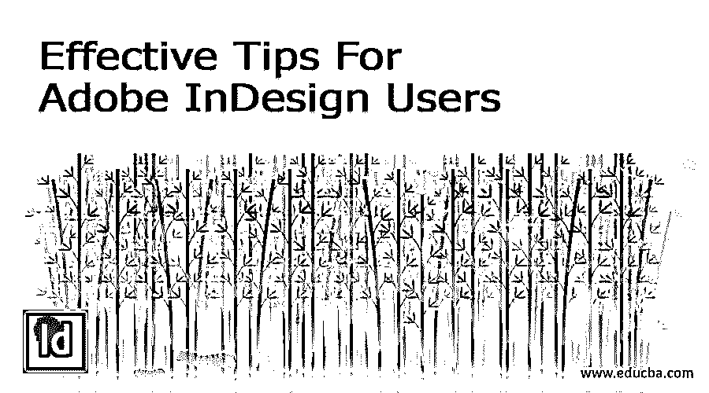
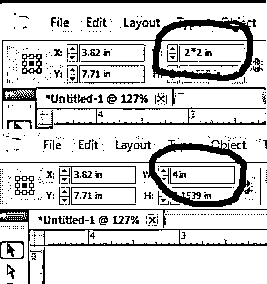
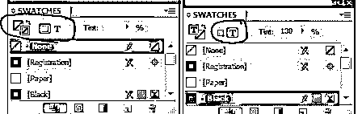
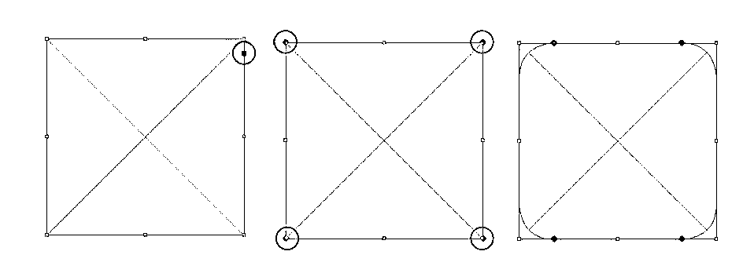
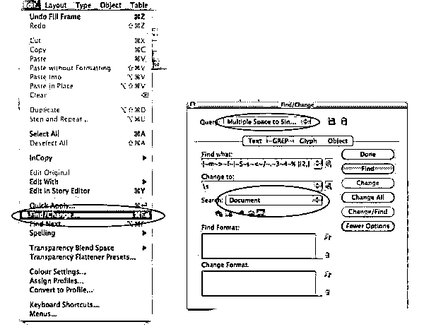
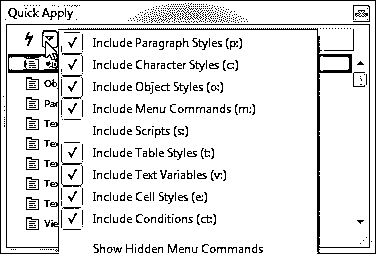
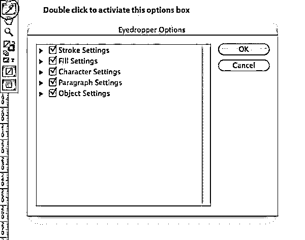
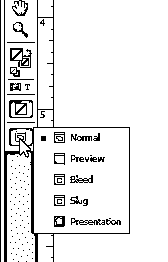

# 适用于 Adobe InDesign 用户的有效提示

> 原文：<https://www.educba.com/ten-quick-tips-adobe-indesign-users/>

## 适用于 Adobe InDesign 用户的有效提示

从 Adobe InDesign 软件提供的众多强大工具中，将少数功能评为最佳是一项艰巨的任务。尽管该软件及其工具的使用因行业而异，但有一些共同的特性可以满足几乎所有使用 InDesign 的人的需求。

我们将一组工具和特性集合在一起，编制了一个快速提示列表，方便用户使用。该列表将帮助您找到最常用和最有用的工具，并快速修复您的设计，无论您从事哪个行业。

<small>3D 动画、建模、仿真、游戏开发&其他</small>

### 适用于用户工作的 10 个 Adobe InDesign 提示和技巧

以下是用户工作的提示和技巧:

#### 1.实现精确调整大小的数学能力

你有多少次尝试手动调整这些图片和相框的大小？这是一项单调乏味的工作，无论你如何努力，当你试图用鼠标或 Wacom 平板电脑调整对象的大小时，你离完美还差得很远。

当谈到调整对象大小时，数学是拯救世界的最好方法。Adobe InDesign 应用数学计算来简化调整大小的任务，并按照您想要的大小精确定义版面和对象的尺寸。您可以在变换调板或控制调板中计算设计并调整其大小。

您可以在以下位置找到变换调板:窗口>对象和布局>变换

要找到控制面板，请遵循以下说明:窗口>控制

在这两种情况下，你都可以使用键盘上的数字；这就像工作时使用计算器一样简单。要将对象的大小增加两倍，请使用多个符号(*)并找到精确的结果。

**例如:**将一个帧的大小增加两倍。选择框架，在“宽度”和“高度”列中，使用原始尺寸* 2 并按 enter 键。很快，你会发现尺寸被精确地调整了。

不要忘记启用缩放选项的约束比例，以便在放大对象时获得成比例的宽度和高度尺寸。

#### 2.与文章编辑器同步您的文本

你还在坚持用老学校夸克把戏，在粘贴板上创建越来越多的文本框架来克服溢出的文本吗？告别令人厌倦的日子。是时候了解故事编辑器了，它是 Adobe InDesign 软件的主要功能之一，用于控制溢出的文本框架。

对于那些不了解溢出文本的用户，这里有一个简短的说明。它是放不进文本框的长文本。InDesign 会在文字框架右下角的红色+符号中指出这种溢出的文字内容。

红色+符号仅表示溢出文本框中的额外文本，由于文本框中缺少空间，这些额外文本不会显示。另一方面，文章编辑器工具可以向您显示隐藏的文本内容，因此您可以在布局的文本框架中计划更改。除此之外，Story Editor 可以帮助您轻松处理复杂的文本文档。

#### 3.使用“交换样本”面板在文本和框架之间切换

传统上，选择框架中的文本内容是一个过程。首先，您应该选择框架并双击框架以选择文本，然后进行所需的更改。

如果您想要选择和编辑文本框架，并可能应用描边或其他效果，该方法是很好的。但是，如果你想改变文本的颜色，你应该一次又一次地执行这个过程。有一个选项可以使用文字工具并选择整个文本来更改颜色。

对于 Adobe InDesign 用户，没有必要使用多种工具来完成工作。在“交换样本”工具的帮助下，在文本框架和文本之间切换变得非常简单，只需点击一下鼠标。按字母 J 在两个对象之间切换。

#### 4.圆角

还记得绘制圆角边缘是一项手工工作的痛苦日子吗？我们的设计师过去常常从其他软件中导入带圆角的矢量和对象。

但是，随着 Adobe InDesign 软件中 Live Corners 的引入，劳动的日子已经结束了。

将带有尖角或硬角的对象绘制为矩形或正方形。

你会发现物体上有一个黄色的盒子。要激活正方形所有边上的圆角框，请单击黄色正方形。

单击正方形并将其水平拖动到正方形的中心，以获得对象所有边缘的曲率。

如果您想要忽略任何角落，请先按住 shift 键，然后开始单击并拖动。

要查找更多用于添加边角效果的选项，请使用“对象”>“边角选项”。

#### 5.查找更改

我们知道 Adobe InDesign 文档有很多文本，从每个文档的大量字母中检查错误、空隙和错误是一项单调的工作。InDesign 找到了解决渴望问题的方法。随着经典的“查找修改”功能的引入，在将草稿转发给校对者之前检查草稿中的错误变得很容易。

在“查找修改”工具的帮助下，找出双倍空格、不需要的符号和打字错误。您也可以用想要的文本或符号替换符号或单词。

例如，将减号转换为连字符。或者一次性纠正整个文档中常见的拼写错误。

#### 6.Adobe InDesign 中的脚本优势

设计界的长期担忧是无法借助代码进行设计。大多数设计者不是脚本专家，但他们中的许多人会使用代码和标签。它提供了快速完成常规工作的优势，节省了更多的时间，并在相对较短的时间内完成了设计工作。

有了 Adobe InDesign，任何手动完成的事情都可以在代码上完成。最棒的是，使用 InDesign 代码编写脚本时，你不必是一个铁杆编码员。只需将脚本复制并粘贴到 InDesign 文件夹的相应文件夹中，设计人员就可以快速获得预期的效果。

默认情况下，InDesign 附带了大量已随软件安装的脚本。您可以通过窗口>实用程序>脚本命令访问脚本面板，并查看示例脚本。

#### 7.快速应用

设计是一项乏味的工作。你对它做得越多，它就越漂亮，就像其他艺术一样，收尾工作需要越来越多的时间。像对齐文本或对对象应用样式和颜色、调整大小这样的小型工作与设计布局花费的时间一样多，在许多情况下，它们可能比实际工作花费的时间更长。

InDesign 试图通过快速应用功能来最大限度地减少设计时间，并取得了成功。顾名思义，该功能可以快速访问菜单命令和应用样式。按 Ctrl + enter 或 cmd + enter 快速启动、应用并键入所需的菜单或样式。输入以将样式应用于对象。

#### 8.滴管复印机

现在，只需点击一下鼠标，就可以模仿一个对象的设置。吸管功能最初是在 Adobe Illustrator 中引入的，用于将颜色、填充和笔触从一个对象复制到另一个对象，该功能一夜之间获得了成功。Adobe InDesign 立即使用了相同的功能，这比前者更好地帮助了设计人员。

要将样式从一个父对象复制并应用到子对象，请执行以下操作。

选择要影响的子元素。

选择吸管工具并点击父对象。

您可以选择通过双击 InDesign 中的滴管工具来继续相同的过程。将出现一个选项框，其中包含各种选择和取消选择选项。

#### 9.堆叠框架

如果你的文档被大量的图片、文本、框架和各种各样的对象压得喘不过气来，那么在设计的时候管理它们肯定是一项艰巨的工作。借助堆叠框架功能，您可以一次一个地浏览整组对象。

要使用堆叠框架功能，请按住 ctrl/cmd，并单击您要开始选择的最上面的对象。按住鼠标底部，直到 Adobe InDesign 深入挖掘以选择您需要的最后一个对象。

#### 10.预览模式

当你看一下屏幕上的文档时，你会发现你的纸板上到处都是框架边缘、混乱和参考线。但是，这不是文件在最后阶段的样子。如果您想更好地查看文档而不浪费纸张，并按照流程创建 PDF 文件，InDesign 可以满足您的需求。

按下 W 键，InDesign 将带您进入预览模式，删除灰色的参考线、框架边缘和最终文档中不会出现的每个组件。

查看最终文档的另一种方法是按住工具栏中的预览图标。它显示多种预览模式，包括辅助信息、出血和新演示模式。

InDesign 是一个巨大的软件，有许多选项，可以方便来自不同行业的设计师和布局艺术家。本文旨在介绍一些最简单有效的工具，供尽可能多的专业人士使用。我们希望所讨论的功能集能让您探索 InDesign 的更多可能性。

### 推荐文章

这是 Adobe InDesign 的综合指南。在这里，我们讨论了 10 个 Adobe InDesign 提示和技巧。您也可以阅读以下文章，了解更多信息——

1.  [系统设计面试问题](https://www.educba.com/system-design/)
2.  [平面设计面试问题](https://www.educba.com/graphic-design-interview-questions/)
3.  [UI 设计师面试问题](https://www.educba.com/ui-designer-interview-questions/)
4.  [AutoCAD 面试问题](https://www.educba.com/autocad-interview-questions/)

