# 亲和照片画笔

> 原文：<https://www.educba.com/affinity-photo-brushes/>

## 亲和力照片笔刷简介

Affinity photo 笔刷可以理解为不同类型的笔画或特定的图案，我们可以借助 affinity photo 的笔刷工具在画布上进行绘制。这个软件有一个单独的画笔面板，参数设置可调。除了可调参数，我们还有一些笔刷预设，使我们的绘图和绘画或图像润饰工作变得容易。

### 相似性照片画笔概述

在我们讨论这个软件的免费笔刷之前，让我们先来看一下这个软件的笔刷工具和预设，这样我们就可以很容易地理解免费笔刷的工作。

<small>3D 动画、建模、仿真、游戏开发&其他</small>

为了理解画笔，让我们创建一个新的文档，并转到菜单栏的文件菜单并单击它。然后，从下拉列表中选择一个新选项。

在这个软件的工作界面的右边，我们有一个笔刷面板。它有一些预置和参数。

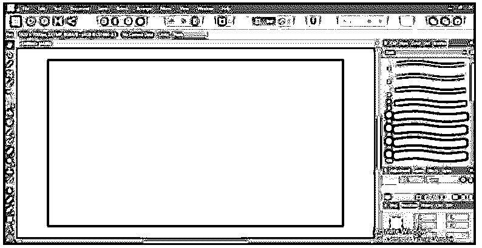

如果您的工作屏幕上没有画笔面板，您可以转到菜单栏的视图菜单。然后，在下拉列表中，转到工作室选项，在新的下拉列表中，您将有画笔选项。在它上面做一个勾号来启用它的面板。

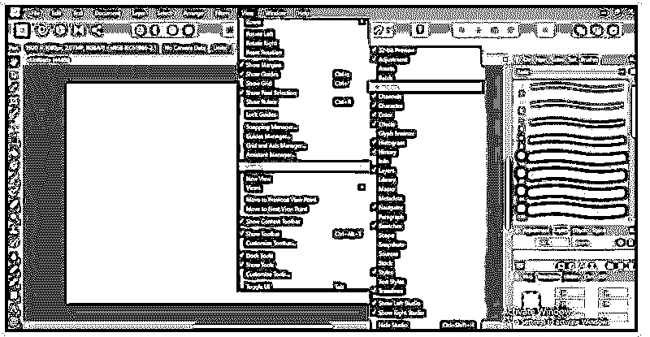

我们在笔刷面板中有几个预设的笔刷，你可以根据自己的需要来使用。

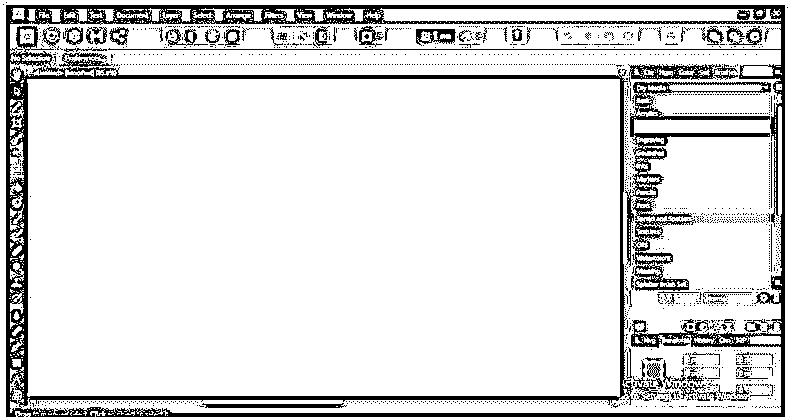

现在让我们转到工作屏幕左侧的工具栏部分。在这里你会发现这个图标的画笔工具。所以通过点击来选择它。

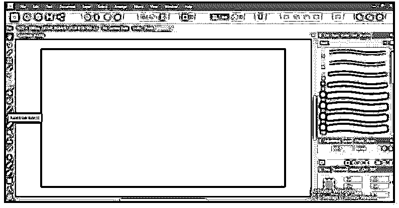

一旦您选择了它，您将在菜单栏部分下方的工作屏幕顶部看到它的所有可调设置。

现在让我们逐一了解它的所有设定。第一个选项是笔刷笔划的宽度。

有一个滑块，你可以通过它来增加或减少画笔笔尖的宽度。我们将使用较小的粗细来绘制它，您可以看到笔画的宽度较小。

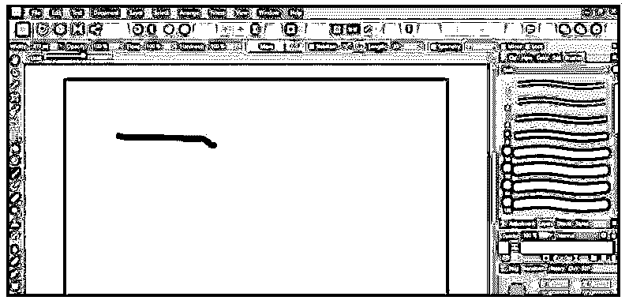

与此相同，如果我们用增加的值绘制，那么笔画的厚度会更多。

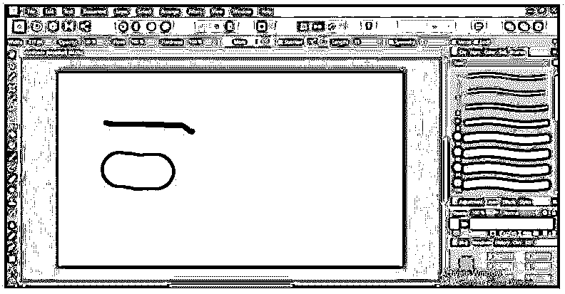

下一个选项是笔刷笔划的不透明度。

如果该值较小，可以通过笔刷笔划看到它的可见性。

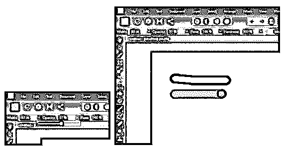

接下来是流动，它类似于不透明，但给出了不同的效果。

如果该值较小，则来自画笔笔尖的颜色量会较少。

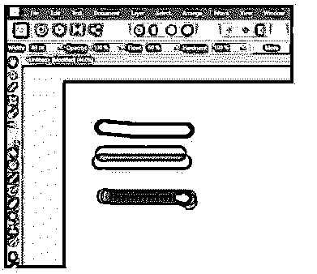

但是如果我们再次在相同的地方画相同的笔画，它会使笔刷笔画变得更暗。

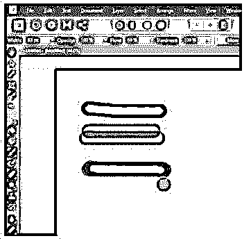

下一个选项是硬度。如果我们使用 100 %硬度值的画笔笔尖进行绘制，笔画将会非常清晰。

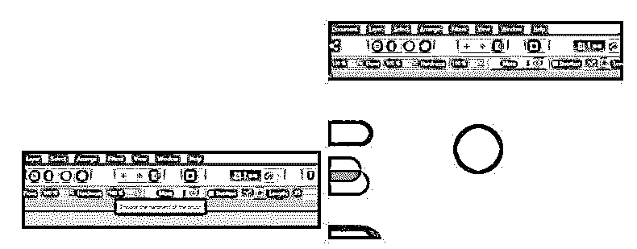

现在让我们降低硬度值并再次绘制。你可以看到画笔笔尖的外侧是模糊的。我们称之为软刷。

下一个选择是更多。一旦你点击它，你将会看到这个对话框，在这里我们可以对笔刷预设进行自定义的修改，比如这里的一些更多的特性，比如间距，笔尖的比例等等。同样，你会很快知道这些设置。

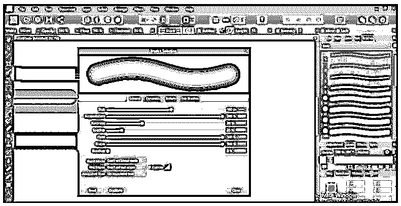

接下来是力压。当我们用笔设备代替鼠标工作时，此选项调整画笔笔尖的压力。

接下来，我们讨论笔刷参数的稳定选项。我们有两个选择。

让我们启用绳索模式选项，当你开始用它画图时，它会向你显示这种类型的锚点。

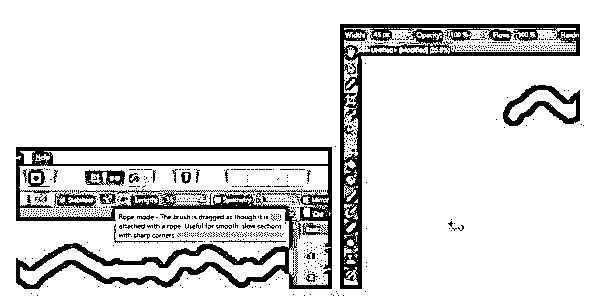

当你拖动这个锚点到它的最大长度时，画笔将开始绘制并跟随鼠标光标的路径。你可以用这支画笔画出好的艺术品。

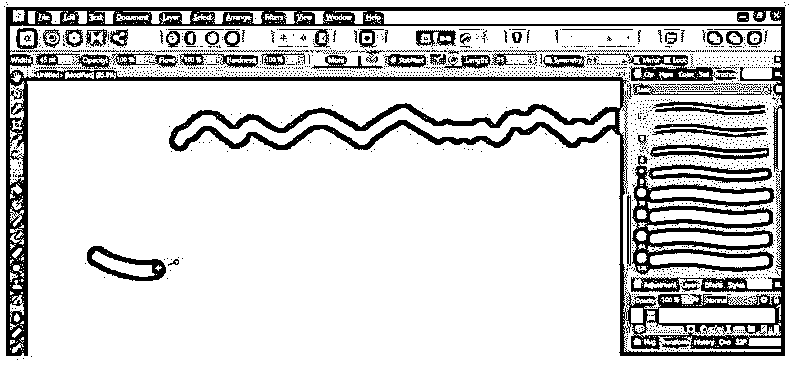

现在稳定器的下一个选项是窗口模式。单击鼠标按钮，它将立即开始绘制并跟随鼠标光标的路径。

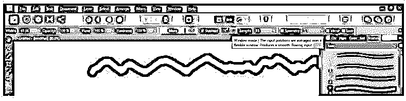

### 免费亲和照片刷

我们在这个软件中有几个笔刷预设，但有时我们需要在工作中使用一些外部笔刷，使我们的工作更有创意。

你可以通过几个步骤在这个软件中安装免费的笔刷。

转到网络浏览器，搜索免费画笔的亲和力照片下载免费画笔。然后，我们将去这个网站下载画笔文件。虽然这些笔刷是用于 Photoshop 的，但是我们也可以在 Affinity Photo 中使用它们。

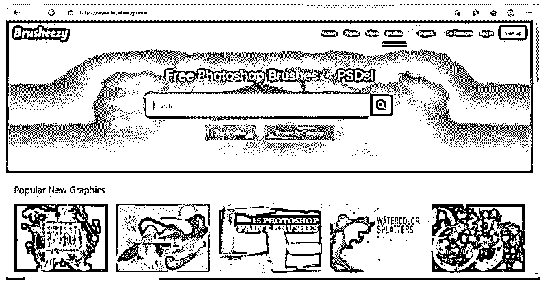

一旦你下载了它，你就会得到一个 zip 文件。所以进去，拉开拉链。

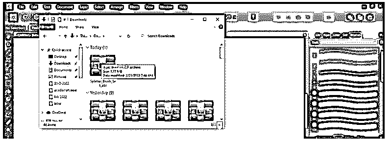

现在打开它的文件夹，打开带有亲和照片的笔刷文件。

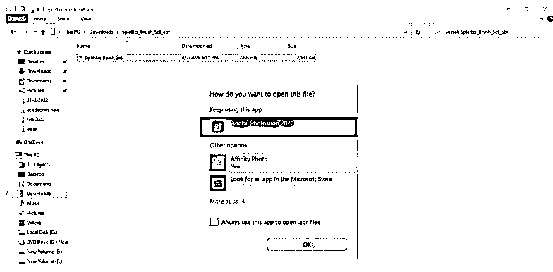

一旦你打开它，它会自动安装在 affinity photo 中，你会看到这样的消息，你的笔刷已经成功导入。按下这个盒子上的 Ok 按钮。

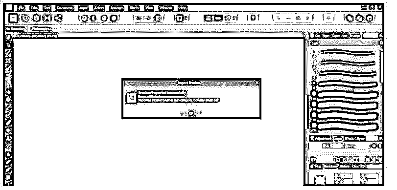

现在在底部的笔刷面板中，你可以找到你安装的免费笔刷。

你可以像我们使用这个软件的预装笔刷一样使用它。

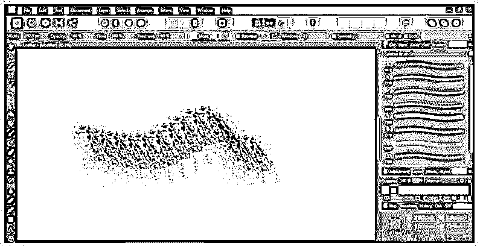

如果你愿意，你可以根据自己的选择，通过笔刷参数栏的更多选项，对已安装笔刷的参数做进一步的更改。

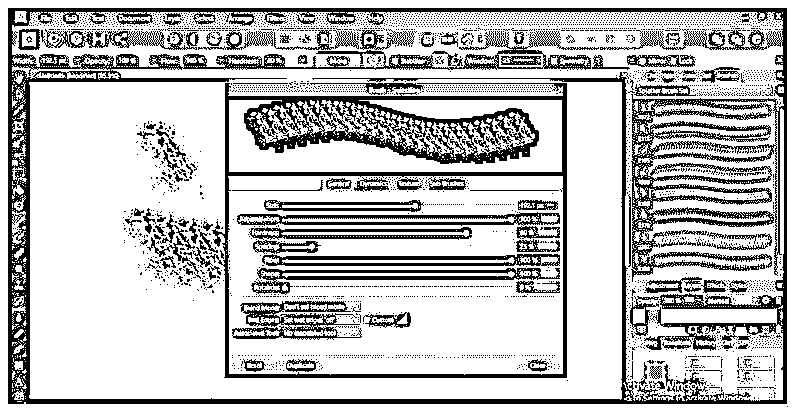

要开始使用笔刷，您必须知道 affinity photo 的笔刷的这些重要方面。

### 结论

在很好的理解了这个软件的笔刷工具及其参数设置之后，你就可以开始在你的工作中使用它来获得最好的输出了。现在你可以使用自定义笔刷设置来获得更多的变化。我们建议你试着改变特定笔刷的每一个参数，以获得良好的实践和有效的笔刷效果。

### 推荐文章

这是一个亲和照片刷指南。在这里，我们讨论介绍，概述，和免费的亲和力照片刷。您也可以看看以下文章，了解更多信息–

1.  [亲和力照片插件](https://www.educba.com/affinity-photo-plugin/)
2.  [Lightroom 快捷方式](https://www.educba.com/lightroom-shortcuts/)
3.  [Photoshop vs 亲和照](https://www.educba.com/photoshop-vs-affinity-photo/)
4.  [AutoCAD 简介](https://www.educba.com/course/autocad-course/)

