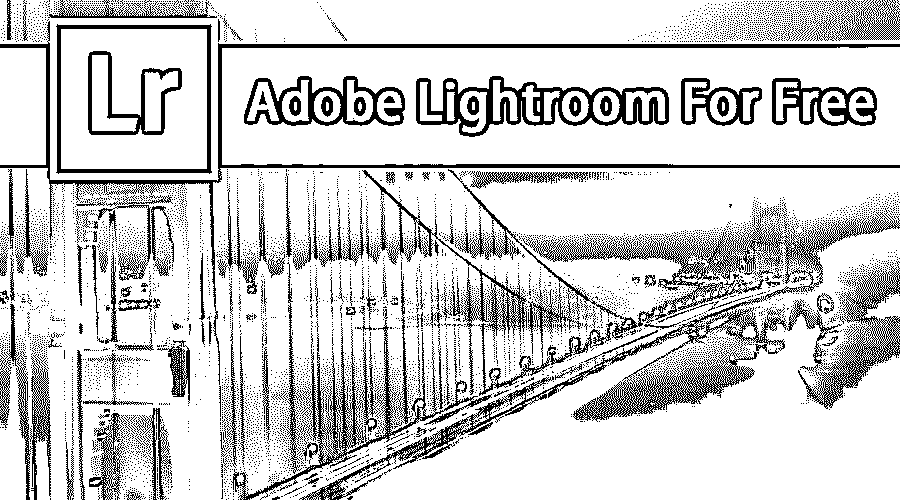
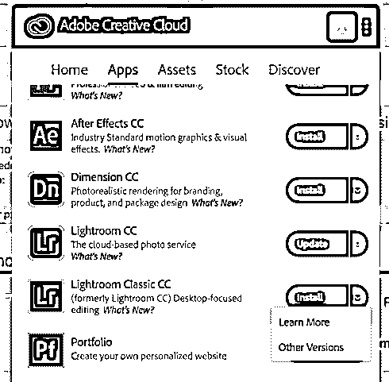
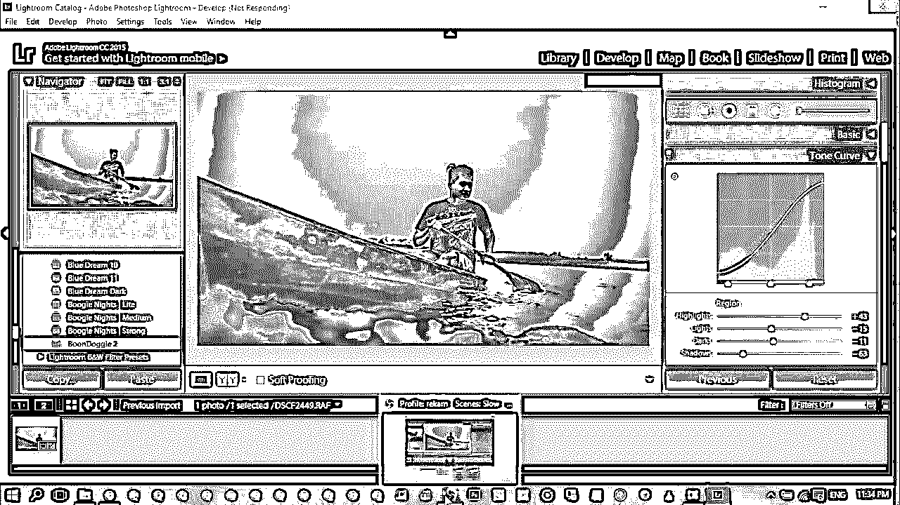

# 免费的 Adobe Lightroom

> 原文：<https://www.educba.com/adobe-lightroom-for-free/>

## 免费介绍 Adobe Lightroom

在本主题中，我们将免费了解 Adobe Lightroom。Lightroom 是一款 Adobe 产品，摄影师、出版商、动画师、平面设计师和网页设计师使用它来编辑图像，使读者和观众在视觉上感觉良好；该工具非常灵活，易于过滤，分类，排列，设置重要性，并对图像属性进行更改，如饱和度，遮罩，风格化，调整颜色等等。LightRoom 是 Adobe creative cloud app 在此之前，我们需要谈论一些基本的摄影作品，

光电循环有 3 个步骤:

<small>3D 动画、建模、仿真、游戏开发&其他</small>

1.  拍照
2.  编辑照片
3.  发布照片

Adobe Lightroom 在第 2 步中发挥了作用，用户可以精确地编辑照片。这增强了照片。

Photoshop 和 Adobe Lightroom 是有区别的，让我们这样描述它们:

编辑、增强、改变、合成、添加我们创建了许多图层，并制作出新的艺术作品。文件内容和大小随着图层和效果的增加而增加。我们可以根据需要在照片中添加对象。

**LightRoom:** 仅编辑拍摄的图片内的对象、属性。 [Adobe Lightroom](https://www.educba.com/what-is-adobe-lightroom/) 目录组织了所有拍摄的照片。可以在原始文件上进行预览，并添加细节和效果。参考原始图像保持安全，不复制它或不改变它的版本，我们可以对同一张图片进行 10 次不同的编辑，占用较少的空间，编辑后将创建文件的新虚拟副本。原始图片不会经过任何编辑，但是我们使用 Adobe Lightroom 工具效果和选项参照它创建了一个新文件。它可以通过在文件中稍微添加颜色来处理图片中的数据。一旦最佳输出准备好共享，我们就可以轻松地共享任何媒体。

下面的链接将您引导到 adobe 的 Lightroom 页面，在那里可以获得更多的详细信息和帮助。

[点击这里](https://helpx.adobe.com/support.html)

### Adobe Lightroom Pro 的免费版本是什么？

我们有 1 到 7 个版本的 Adobe Lightroom，其中第 5 版在少数门户网站上是免费的，但它可能不提供对应用程序和属性的全部权利的完全访问。它们还可能导致系统性能下降和不安全。

最好是购买 Adobe Lightroom 的授权版本。从下面的链接免费使用 trail Adobe Lightroom。

[点击下载](https://www.adobe.com/in/products/photoshop-lightroom/free-trial-download.html)

### 如何免费获得 Adobe Lightroom？

1.  免费下载 Adobe Lightroom 应用程序并将其安装在 PC 上。
2.  使用 Adobe 帐户登录和密码如果你没有登录，请点击新的注册并提供详细信息，或者甚至使用现有的脸书和谷歌帐户登录。

*   登录后，我们将打开一个 Adobe 目录，其中包含所有 Adobe 产品。

1.  输入您的电子邮件 id，然后单击继续。
2.  Adobe Lightroom 详细信息将打开选择类型到完全许可 149 美元购买。
3.  通过支付网关购买许可证；一旦付款完成，一个序列号将被发送到电子邮件。
4.  复制序列号并将其粘贴到已安装 Lightroom 的产品许可证页面。
5.  然后，Adobe Lightroom 的完整许可证将在 pc 上免费提供所有功能和访问。

    

### Adobe Lightroom 的使用

肖像图像的最佳编辑工具。保存在 PC 中多个位置的图片，当我们在 Adobe Lightroom 中看到它们时，我们可以根据标题“事件”对我们的照片进行分类，将所有 5 张事件照片归入单个类别“假日”8 张假日旅行照片归入单个类别，然后我们甚至可以对它们进行子分类，以便在一个位置获取所有餐厅照片，在一个位置获取所有海滩照片，这样做是因为照片中存在属性。

最好的事情是，如果我们曾经将图像导入 Adobe Lightroom，并删除照片硬盘的原始位置，将其从 pc 上卸载并保存在其他地方，我们仍然可以使用图片并在 Adobe Lightroom 中编辑它们。只有在导出时，我们才需要重新连接原始图片所在的硬盘，以应用效果并保存包含编辑内容的新文件。

可以使用星级、颜色等级、关键字、设置层次结构来组织照片，为网站、网络画廊、书籍导出照片，并从 Adobe LightRoom 创建和打印 PDF。它是整个企业的总部，可以在社交媒体平台上轻松分享照片视觉作品的最佳图像。

它在编辑图像处理方面的所有选项使它在出版、网页设计、摄影、名片、小册子制作、杂志制作、动画、平面设计师、标志设计等方面都很有用。

### 免费学习 Adobe Lightroom

有多个学习门户可以帮助您了解如何在专业和日常生活中使用 Lightroom，我们希望您能通过下面的链接页面来了解这些学习门户。

[点击这里](https://helpx.adobe.com/in/lightroom-classic/tutorials.html)

这是 Adobe Lightroom 的官方学习页面，为初学者和有经验者提供分步 Pdf 和教程。

### 系统需求

系统要求如下:它们具有配置的灵活性，这直接提高了应用程序的性能:-

*   支持 64 位的英特尔 i5 和 i7 或 AMD 处理器*
*   带 Service Pack 1 (64 位)的 Microsoft Windows 7、Windows1 (64 位)或 Windows 10 版本 1511 或更高版本(64 位)
*   4 GB 及更多内存(建议 12 GB)
*   1024 x 768 和更大的显示屏。

### **面向学生的 Adobe Lightroom**

Adobe 给学生一个特别的折扣来学习和熟悉它的应用程序。

对出版、网页设计、摄影、名片、小册子制作、杂志制作、动画、平面设计师、标志设计等课程感兴趣并正在学习这些课程的学生，以及处理图像即兴创作和促销视觉商品的学生，可以在购买学生许可证或拥有学生权利的情况下使用 Adobe Lightroom 应用程序。

下面的链接帮助学生学习和购买 Lightroom 的学生版的一些信息。

[点击这里](https://www.adobe.com/creativecloud/buy/students.html)

来自同一个门户网站的视频，介绍如何使用摄影和 Lightroom 来设置照片的细节

### 哪个网站是免费的？

获得免费云 Adobe Lightroom 的网站是:-

[https://lightroom.adobe.com/](https://lightroom.adobe.com/)

运筹学

下载安装程序并安装 Lightroom。

[点击下载](https://creativecloud.adobe.com/apps/download/lightroom-classic)

关于 Lightroom 及其详细信息的博客[阅读更多信息](https://blogs.adobe.com/photoshop/2013/06/lightroom-5-now-available.html)

Lightroom 快捷键[阅读更多信息](https://www.lightroomqueen.com/keyboard-shortcuts/lrcc6/)

图片来自 Lightroom 的 Twitter 页面和工作截图。
[点击这里](https://twitter.com/Lightroom)

### 推荐文章

这是免费的 Adobe Lightroom 指南。在这里，我们讨论了 Adobe Lightroom 的含义及其用途，学习 Adobe Lightroom，系统要求等。你也可以看看下面的文章来了解更多。

1.  [面向初学者的 Adobe Illustrator】](https://www.educba.com/adobe-illustrator-for-beginners/)
2.  [Adobe Photoshop Elements 工具](https://www.educba.com/adobe-photoshop-element-tools/)
3.  [Adobe Illustrator vs Adobe Photoshop](https://www.educba.com/adobe-illustrator-vs-adobe-photoshop/)
4.  [Photoshop vs Photoshop Elements](https://www.educba.com/photoshop-vs-photoshop-elements/)

