# Adobe After Effects 中的遮罩层

> 原文：<https://www.educba.com/masking-layers-in-adobe-after-effects/>

## Adobe After Effects 中遮罩层的介绍

Adobe After Effects 是一个独特的程序，内置大量工具和功能，用于视频编辑和在视频拍摄或制作后添加效果；简单来说，Adobe After Effects 多用于后期制作编辑和修改。Adobe After Effects 中的遮罩层主要由图形设计师、游戏艺术家、视频编辑以及电视和电影编辑使用。该程序最重要的用途是创作、动画和跟踪视频和作品。Adobe After Effects 中的遮罩层因其特性而在全球范围内广泛使用。这是一个非线性视频编辑程序，帮助用户弥补他们的困难和问题。

如前所述，Adobe After Effects 中的遮罩层是效果的发电站，其中一个可以称为效果的功能就是遮罩的使用。在 After Effects 中遮罩层比在其他视频编辑器中更容易、更简单。

<small>3D 动画、建模、仿真、游戏开发&其他</small>

### 如何在 After Effects 中遮罩图层

*   蒙版过程可能看起来很棘手，但一旦理解并实际执行，你可以获得许多关于借助蒙版创造惊人效果的知识。这个过程可以用两种不同的方法来实现。第一种方法使用简单的常规遮罩技术，而第二种方法涉及使用形状层遮罩。
*   这两者之间的区别是，如果我们在图层被选中时创建一个形状，它会在图层上创建一个普通的遮罩。然而，如果没有选择任何内容，并且我们在组合上创建了一个形状，则创建了一个形状图层蒙版。
*   这里更重要的标准是在掩蔽过程中使用不同的模式。我们至少有六种不同的模式，呈现不同的效果和结果。这些模式在使用图层创建蒙版时起着重要的作用。

### Adobe After Effects 中遮罩层的示例

以下是 After Effects 中遮罩层的三个示例:

#### 示例–1

1.特效后启动。

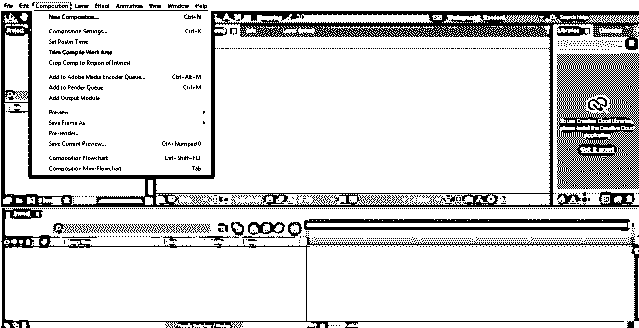

2.创建新项目和合成。

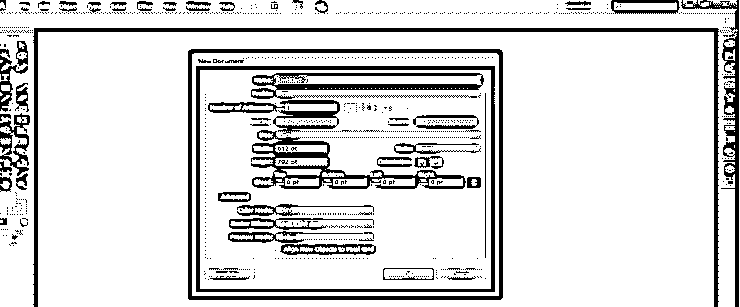

3.如下图所示导入图像

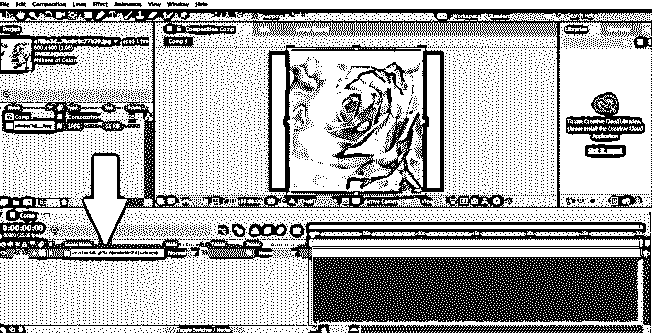

4.保持图像选中，点击形状工具，在图层上创建一个蒙版。

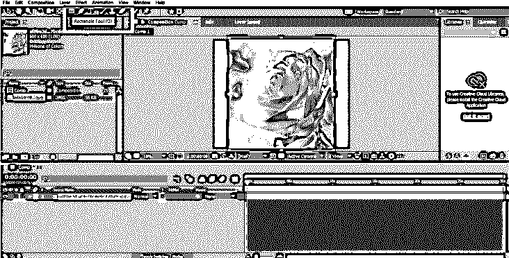

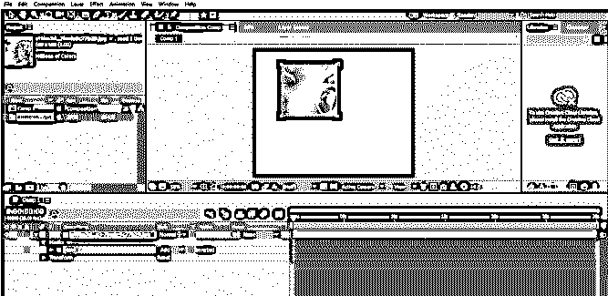

5.使用矩形工具创建另一个蒙版，如图所示:

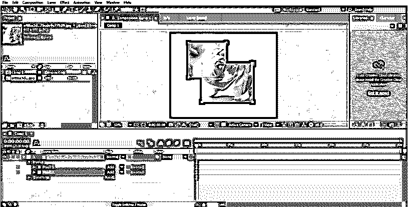

6.创建的遮罩将位于时间轴菜单中的图像选项内。我们可以在下拉菜单中看到时间轴上的遮罩路径。

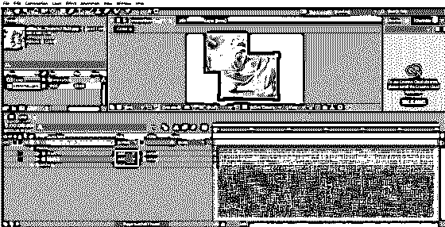

7.默认情况下，选择的模式总是添加，而我们可以在时间轴面板中更改并查看更改模式时发生的效果

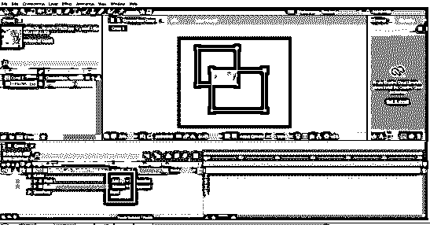

8.使用快捷键 V 或 M 编辑此路径，以修改遮罩属性。

9.同样，我们可以使用任何形状或路径在图层上创建蒙版。

#### 示例–2

1.创建新组合并检查组合的设置

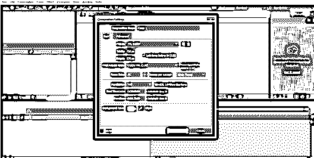

2.在时间轴菜单中导入图像，如图所示。

3.确保没有选择任何东西，点击形状工具，创建如图所示的矩形

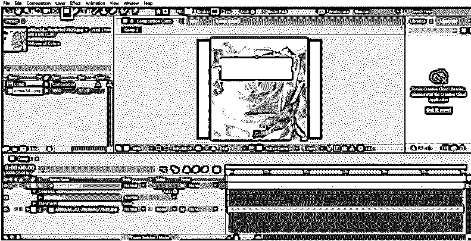

4.确保创建的形状位于要遮罩的图像层之上。

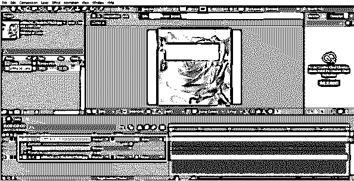

5.现在，要创建一个遮罩，请使用时间轴菜单中的“跟踪选项”中的“Alpha 遮罩”选项。

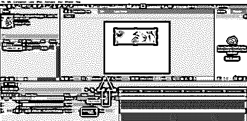

6.这种创建遮罩的方法也更容易，并且不需要使用上面示例中使用的模式。

#### 示例–3

此示例显示了如何使用图层的蒙版过程创建动画。在这个例子中，我们使用了常见的蒙版技术来展示如何同时蒙版文本和动画。

1.创建新组合并检查组合的设置。

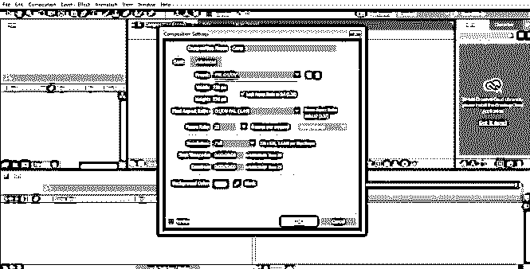

2.使用文本工具，在“合成”面板中书写文本

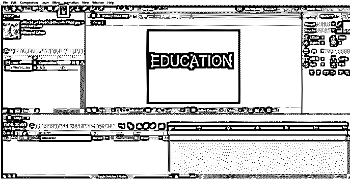

3.确保选中图层，创建如图所示的矩形；这将在文本上创建一个遮罩。

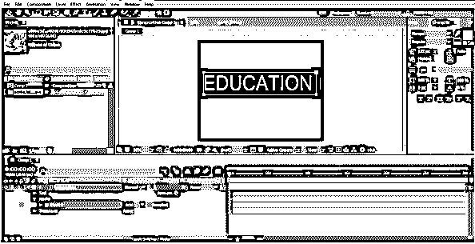

4.从时间线面板中，单击文本下拉菜单以查看遮罩路径选项。使用这个选项，我们将创建一个文本动画。

5.现在，选择遮罩并移动它，如图所示。

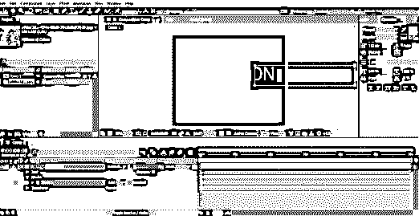

6.在时间轴的原点点击遮罩路径的关键点选项。

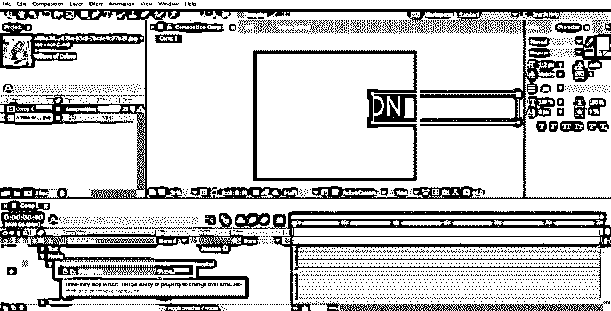

7.2:00 秒后，如图所示改变面罩的位置。

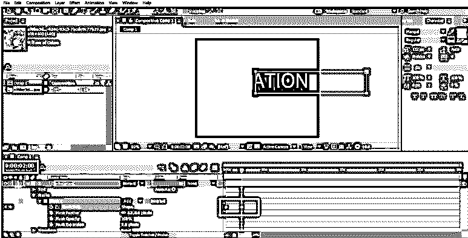

8.同样，在 2:00 秒后，改变面罩的位置

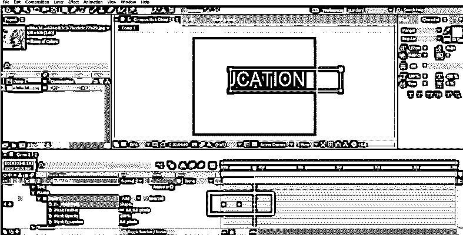

9.最后，改变位置，如图所示

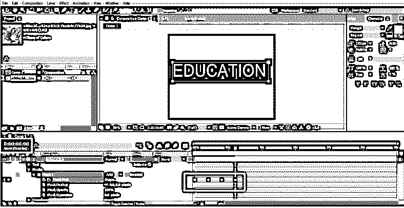

10.当您使用空格键播放动画时，您将看到使用遮罩过程创建的文本效果。

11.我们甚至可以改变模式，通过改变文本中的不同模式来看到想要的结果。

### **结论**

上面的课程告诉了我们很多关于图层蒙版和它们不同的技术和程序。以上示例显示了如何调整大小以及移动或旋转遮罩。这些技术对用户来说是容易和可理解的，并且将帮助他们执行各种遮罩功能和创建高级效果。虽然上面的例子中只使用了一些工具，但是我们可以使用更多的形状和钢笔工具来创建遮罩和路径。

### 推荐文章

这是一个在 Adobe After Effects 中蒙版图层的指南。在这里，我们讨论如何掩盖层后的效果与例子。您也可以浏览我们的其他相关文章，了解更多信息——

1.  [后效中的遮罩](https://www.educba.com/mask-in-after-effects/)
2.  [Adobe After Effects 插件](https://www.educba.com/adobe-after-effects-plugins/)
3.  [Adobe After Effects 插件](https://www.educba.com/adobe-after-effects-plugins/)
4.  [Adobe Premiere Pro vs After Effects](https://www.educba.com/adobe-premiere-pro-vs-after-effects/)

