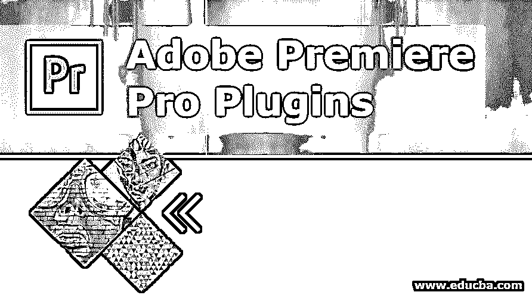

# Adobe Premiere Pro 插件

> 原文：<https://www.educba.com/adobe-premiere-pro-plugins/>

## **Adobe Premiere Pro 插件简介**

 **Adobe Premiere Pro 是一款基于时间轴的视频编辑工具，由 Adobe Systems 开发和维护。许多电视、电影、图形和动画工作室鼓励使用专业视频编辑工具来增强频道、工作室、剧院等中的视频。在 adobe premiere pro 中有许多元素可以工作。Adobe systems 鼓励第三方插件和工具通过应用程序为客户增加产品的可视化能力。今天我们将会看到一些基于项目用途和目的需求的第三方插件。

### **6 大 Adobe Premiere Pro 插件**

 **许多合法的第三方插件可以使用和官方娱乐。我们将讨论几个 adobe premiere pro 插件及其使用的重要性和对输出文件质量和视觉标准的影响。使用插件有很多好处；他们为用户节省时间和效率，以实现漂亮和引人注目的创意输出视频。

<small>3D 动画、建模、仿真、游戏开发&其他</small>

#### 1.电影冲击

Film impact 是一个用于获得高质量视频过渡的插件。适用于 Mac OS 和 Windows OS。其中有 2 个服务包。它有多种用途，如下所述。

*   ****Pack1:**** 这为视频过渡设置了一个新的视图和质量，以及对模糊、闪光、颜色、推拉冲击等效果的一些强大控制，以兼容地从一个帧切换到另一个帧。
*   ****Pack2:**** 随着十个过渡，它开始添加到我们的编辑工具栏，并提高 GPU 性能，以提供最佳性能，同时渲染并获得有效的输出。这可用于个人设置，也可用于专业设置，以最终提高视频质量的标准。

#### 2.绝对自由

这是一个有效的插件，可以清除和减少随机帧的噪声，改善纹理质量；它带有模拟干扰。它包含所有新的和旧的时间过滤器，以保持准确性和细节。原始文件保持安全，新的属性和编辑将被创建，因为该原始文件的相同内容的新副本将是安全的。这用于 YouTube 视频制作和电影电视后期制作项目。

#### 3.博因克斯

这是一个完整的内置 3D 滤镜预设设置，动画控制，具有广泛的灵活性，可以处理单个镜头。一个用户友好的插件可以在多种预设之间切换，这使得它成为最有用的插件。所有视频编辑人员和 Adobe Premiere Pro 用户必须在日常工作需求中尝试和使用它，并检查影响。

#### 4.创造性的不耐烦

在这里，我们将谈论属于这种创造性急躁类别的插件。

*   ****羽化裁剪:**** 这个插件在 Mac OS 和 Windows 的操作中使用都很灵活。这个插件允许裁剪图像，并增加了额外的功能，如框架，边界等；编辑可以在层内和层外执行。图形插件处理操作系统位值 32 位或 64 位，以处理用户界面和处理该区域的 RGB 和 YUC 颜色。
*   ****渐晕:**** 这个插件允许创建一个渐晕到具有多个矩形和椭圆形状以及不同效果的框架上。这可以用来显示过去或历史场景，以便视觉叙事获得感觉。颜色调整和浮躁将得到相应的照顾。我们可以使用多个图层和遮罩来应用更改。

#### 5\. CyberLink

此插件用于在拍摄时稳定视频镜头中的 VR。适合做 Premiere Pro 和 After Effects。稳定性的选择不会干扰画面，并允许镜头的制作者和观众专注于主题，并确切地知道导演或内容制作者制作该视频的概念试图解释什么。

#### 6.数字电影工具

这个插件是多个 filmy 工具的组合。现在让我们一个接一个地看。

*   **DFT 生胶片:**这是一套不同的滤镜，具有不同的颜色组合，而不是常规的刺激，只有少量附加组件，如摄影生胶片、电影生胶片、效果和历史摄影过程。它有一个扫描和录制选项，以及一个具有不同外观的巨大库。
*   **DFT 影印:**这是用来增强市场上新旧的照片和视频的亮度、色调、细节、颗粒感、色彩、纹理等属性；许多电影制作人已经在他们的项目中使用了这种方法。默认情况下，我们可以创建自己的 cam 属性配置文件，直到我们完成相同的项目，这样每一帧看起来都是唯一的。避免重复，处理时会注意自动刺激。
*   **DFT 射线:**这使我们可以根据环境添加合适的照明，如森林中狭窄、深邃的闪电，舞台表演场景的聚焦灯。灯光看起来像很少的日光、灯泡、基于位置的管状灯一样自然，光线调整也很容易。场景，如 drams，波兰，风格可以通过改变灯光的颜色和方向。雾，雨，雪和闪电的其他气候影响可以通过该工具处理。电影、电视、VFX 和摄影工作室更频繁地以此为乐，以推动他们的输出质量极限。

### 结论

[Adobe Premiere Pro](https://www.educba.com/install-adobe-premiere-pro/) 插件在视觉质量、计时、效果、属性等许多方面提高了视频或镜头的标准。许多专业人士有理由采用应用程序。效果和镜头到镜头可以匹配简单的插件和效果，如放大和缩小等等。初学者必须花很多时间练习尝试多个插件，直到习惯这个工具。在工作室、频道和其他多媒体中心和组织中，插件知识以及多种图形和艺术角色的工具有很大的机会。

### 推荐文章

这是 Adobe Premiere Pro 插件指南。在这里，我们讨论了简介以及对 6 大 adobe premiere pro 插件的简要说明。您也可以阅读以下文章，了解更多信息——

1.  [Adobe After Effects 插件](https://www.educba.com/adobe-after-effects-plugins/)
2.  [Adobe Premiere Pro 替代品](https://www.educba.com/adobe-premiere-pro-alternatives/)
3.  [Adobe 特快专递](https://www.educba.com/adobe-speedgrade/)
4.  [Illustrator 中的模糊](https://www.educba.com/blur-in-illustrator/)

****