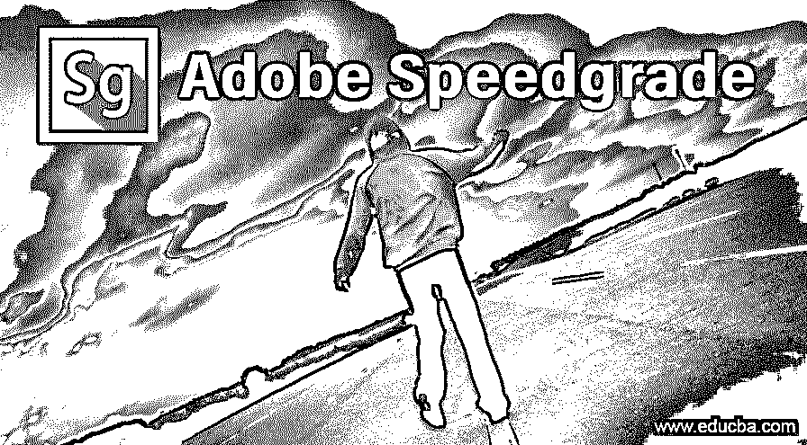

# adobe speedstep 动态节能技术

> 原文：<https://www.educba.com/adobe-speedgrade/>

## Adobe Speedgrade 简介

Adobe Speedgrade 软件是 adobe systems 的 Adobe creative cloud 软件包的一部分，用于视频素材的颜色校正和分级。Adobe Creative Cloud 是由 adobe systems 提供的用于图形设计、视频编辑、摄影编辑等的[不同类型 adobe](https://www.educba.com/types-of-adobe/) 软件的包。Adobe Speed Grade 软件通常在我们项目工作的开始和结束时使用，以便在其中进行专业的色彩校正。在这里，我将在本文中向您概述 Adobe Speed grade 软件，以便您可以轻松理解该软件的用途并熟悉其功能。

### 什么是 Adobe Speed Grade 软件？

什么是 Adobe Speed Grade 软件对你来说是个大问题吗？它的用途是什么？以及如何使用？由谁使用？你心里有很多疑问，对吗？

<small>3D 动画、建模、仿真、游戏开发&其他</small>

那就别担心，这篇有趣的文章之后不会再有问题给你了，就呆在这篇文章里吧；我将以一种非常容易和简单的方式告诉你 Adobe Speed Grade 软件，以便你容易理解，并且你将对该软件有很好的了解。

*   顾名思义,“等级”意味着提升某物以增强其属性。是的，你想得对；它是用于为您的任何视频编辑工作分级颜色的软件，并且与 Microsoft Windows 操作软件和 macOS 兼容。该软件由 Adobe Systems 开发和维护。
*   该软件通常由电影制作人、视频编辑和其他与视频编辑领域相关的专业团体使用，以获得其项目的高水平结果。它通常兼容所有类型的文件格式。

### Adobe Speedgrade 软件的功能

Adobe Speed grade 软件充满了许多令人兴奋的功能，有助于对您的视频图形项目素材进行不一致的颜色分级。因此，让我们来看看它的特点，以增强我们对它的了解:

*   这个软件有一个先进水平的工具，颜色校正和分级功能，保持您的项目，使其非常现实的观众。
*   它与 raw 文件格式兼容，这使它与众不同。
*   它工作在分层系统，这使得它的用户得心应手。在图层上工作可以让你的工作区域更加顺畅和自由。
*   它有不同的颜色格式，如 RGB 游行，向量范围，等等；你可以选择其中任何一个，适合你拍摄的视频片段。
*   当您在直接链接模式下使用该软件时，adobe Speed grade 软件将自动支持 [Adobe Premiere Pro 软件](https://www.educba.com/install-adobe-premiere-pro/)的文件格式。
*   Adobe Speed grade 软件支持这些具有直接链接功能的相机:Apple ProRes 64bit、Sony XAVC long GOP、Phantom Cine 等。
*   在 adobe speed grade 软件的新版本中，您可以使用一个遮罩创建多个遮罩，没有任何问题。看文件。在早期版本中，这是不可能的。在这里，您只能在单个放坡图层上创建一个遮罩。
*   有一个“链接”或“取消当前层链接”按钮选项，它有助于在项目的多个层之间共享遮罩。
*   Speed Looks 是 adobe speed grade 软件的一个非常有用的功能，它为您在不同相机拍摄的镜头中保持非常高的分级一致性提供了自由。

看到 adobe speed grade 软件的功能后，你会好奇与这个软件相关的一个问题:如何在电脑上安装 Adobe Speed grade 软件？所以也不用担心这个问题；你会在这篇文章中找到解决办法；只需按照以下步骤在您的计算机上安装 adobe speed grade 软件。

### 如何安装 Adobe Speedgrade 软件？

以下几点说明了如何安装 Adobe Speed Grade 软件:

1.  要在您的电脑上安装 speed grade，只需从 Adobe systems 的官方网站下载 Creative cloud package 应用程序:[https://www.adobe.com/](https://www.adobe.com/)——复制此链接并粘贴到您浏览器的 URL 上。adobe 系统的网站将打开；要安装 Creative cloud，首先，你必须在 adobe 网站上创建一个 Adobe 用户帐户。要创建 adobe 用户帐户，您需要有一个电子邮件帐户。现在，只需按照网站指导的步骤，使用您的电子邮件帐户创建 adobe 用户帐户，并在创建 adobe 用户帐户后登录。
2.  登录后会自动打开一个桌面创意云包 app，里面有所有的 adobe 设计、[编辑软件](https://www.educba.com/best-editing-software/)。
3.  现在从这里搜索 Adobe Speed Grade 软件，点击下载按钮；这将是一个试用版，如果你不购买它；您可以在试用版期间检查 Adobe Speed Grade 软件的所有功能，无论它对您的视频素材是否有效。只需按照支付流程的一些简单步骤，就可以从官网购买速度等级软件；它会给你几个购买该软件许可证的包，从这里选择你想要的计划，然后购买适合你的计划。
4.  如果你购买了这个软件的许可证，你可以在两台电脑上同时访问它，如果你想在第三台电脑上访问这个购买的软件，你必须从上一台停用它，然后在第三台上安装它。

### 结论

现在你可以明白什么是 Adobe Speed Grade 软件了。以及如何在电脑上安装。如果你想给它一个专业的外观，你可以很容易地处理你的项目。阅读完本文后，您还可以将 Adobe Speed Grade 软件与其他类似软件进行比较，从而了解最适合您工作的软件。

### 推荐文章

这是 Adobe Speedgrade 的指南。在这里，我们讨论什么是 Adobe Speedgrade，它的功能，以及如何在您的计算机上安装 Adobe Speedgrade。您也可以浏览我们的其他相关文章，了解更多信息——

1.  [安装 Adobe Photoshop 的步骤](https://www.educba.com/install-adobe-photoshop/)
2.  [如何安装 Adobe Illustrator？](https://www.educba.com/install-adobe-illustrator/)
3.  [Adobe Illustrator For Windows 的特点](https://www.educba.com/adobe-illustrator-for-windows/)
4.  [安装 Adobe Creative Cloud](https://www.educba.com/install-adobe-creative-cloud/)

