# 安装 Adobe Premiere Pro

> 原文：<https://www.educba.com/install-adobe-premiere-pro/>

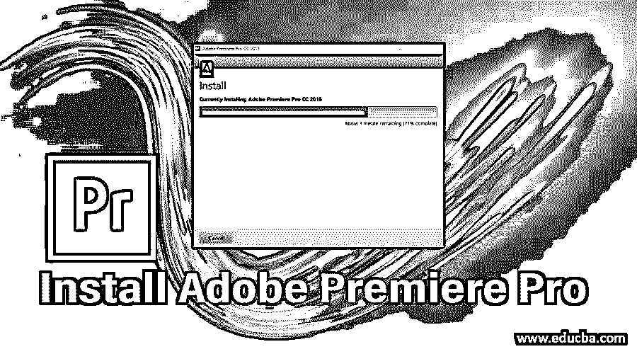

## 什么是 Adobe Premiere Pro？

Adobe Premiere Pro 软件是一款视频编辑软件，专业图形设计师使用它来制作高质量的作品。它最初由 Adobe systems 于 2003 年 9 月发布，现在是 Adobe Systems 推出的 Adobe Creative Cloud packed 的一部分。它的最新版本是 Adobe Premiere Pro CC 2018，兼容 Windows 7 或更高版本的微软 Windows 和 Mac OS X 或其更高版本。这里我们就来看看如何在我们的 PC 或笔记本电脑上安装 Adobe Premiere Pro？你可以登录 Adobe Premiere Pro 软件的官方网站[www.adobe.com](https://www.adobe.com/)。

### 安装 Adobe Premiere Pro 的步骤

在这里，我们将看到在我们的 PC 或笔记本电脑上一步一步地安装 Adobe Premiere Pro。那么就让我们从 Adobe Premiere Pro 安装的学习开始我们的文章吧。

<small>3D 动画、建模、仿真、游戏开发&其他</small>

【Adobe Premiere Pro 的系统要求

在开始安装之前，让我们看看 Adobe Premiere Pro 软件的系统要求。

#### 1.Windows 操作系统

对于我们需要的 Windows 操作系统，

*   我们至少需要第 6 代英特尔处理器或推荐的第 7 代 T2 处理器。
*   推荐的操作系统是 64 位的 Microsoft Windows 10。
*   Ram 必须为 8 GB。
*   我们必须有一个图形卡。
*   显示器分辨率至少应为 1280 x 800，建议为 1920 x 1080 或更高。
*   在注册和激活软件时，互联网连接是必要的。

#### 2.马科斯

对于 macOS，我们要求:

*   我们至少需要第 6 代英特尔处理器或第 6 代 T2 处理器。
*   推荐的操作系统是 macOS v10.13 或更高版本，最低要求的操作系统是 macOS v10.12 或更高版本。
*   Ram 必须为 8 GB。
*   显示器分辨率至少应为 1280 x 800，建议为 1920 x 1080 或更高。
*   在注册和激活软件时，互联网连接是必要的。

现在我们将讨论 Adobe Premiere Pro 软件的安装过程。

**第一步:**首先去 adobe 和 adobe 系统的官网。

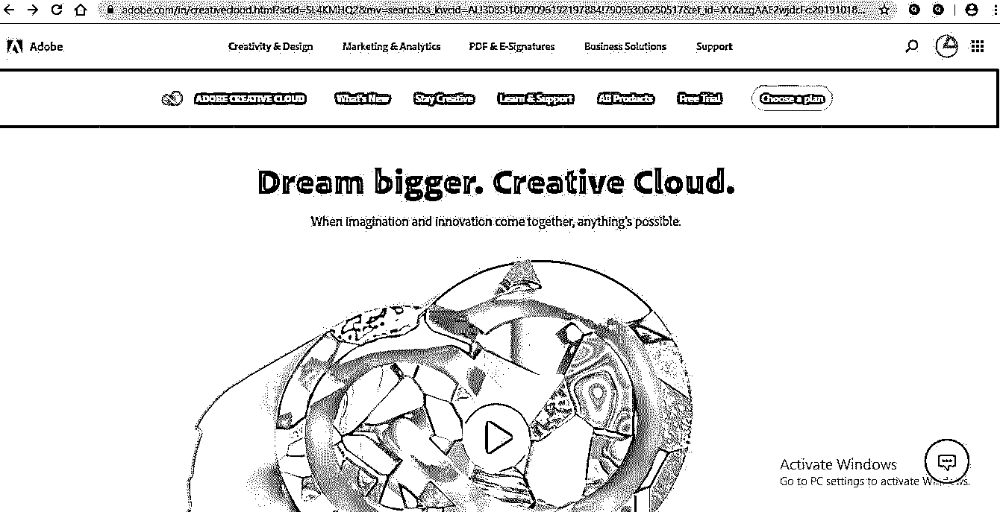

**步骤 2:** 对于我们的产品，请转到位于该网页屏幕顶部的“所有产品”选项按钮，然后单击它。

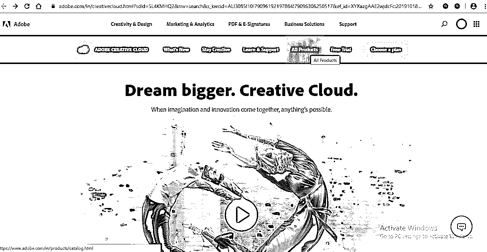

**第三步:**将打开一个新的网页屏幕，向下滚动或在搜索框中搜索 Adobe Premiere Pro 软件。

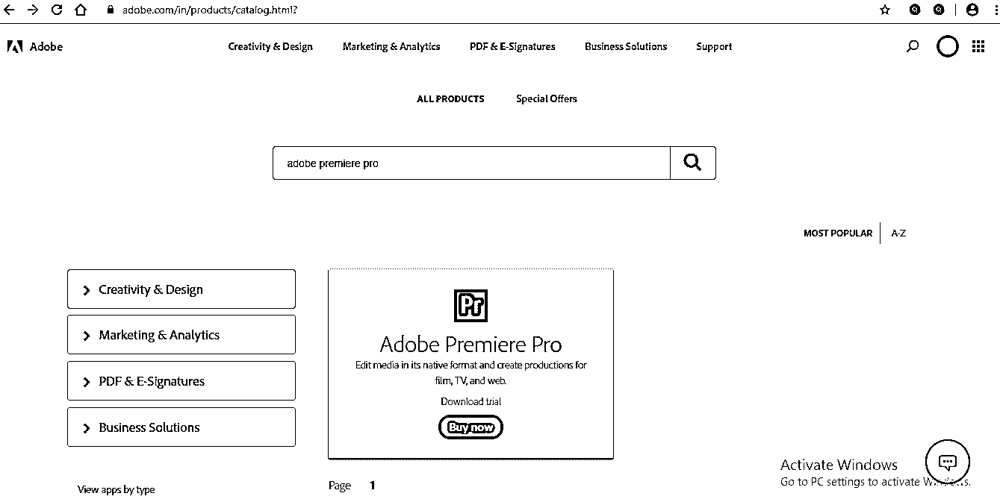

或者您可以点击免费试用选项按钮，该按钮位于该网页屏幕的顶部；点击它。

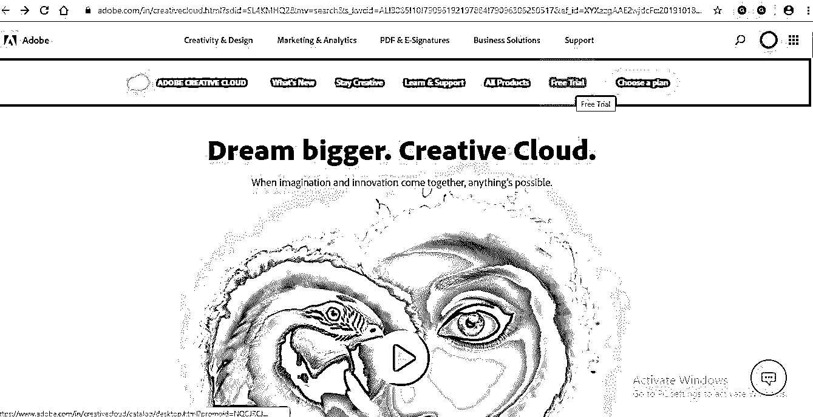

**第四步:**新网页画面将打开；向下滚动，在此搜索 Adobe Premiere Pro 软件。

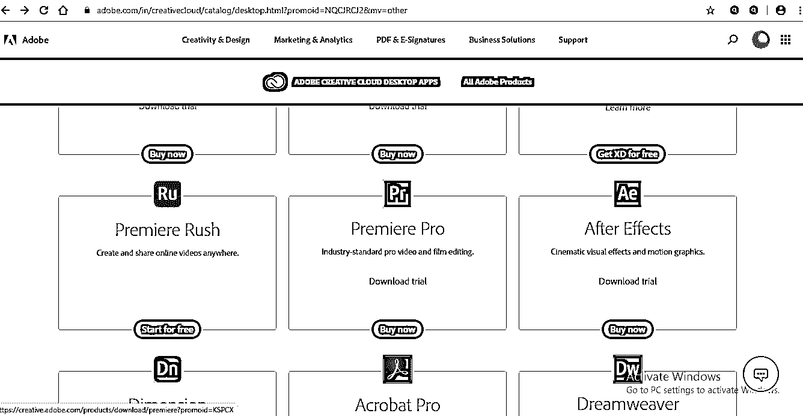

或者，如果您想购买任何产品，您可以直接转到此处的“选择计划”选项，该选项位于此网页屏幕的顶部，然后单击它。

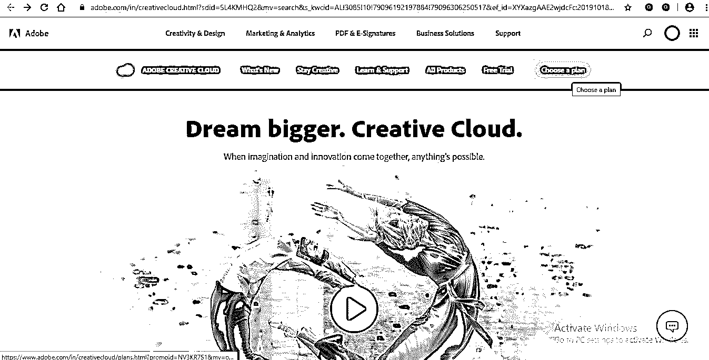

**第五步:**不同的计划套餐将在新的网页屏幕中打开，在单个应用程序下拉选项中选择您的产品名称。

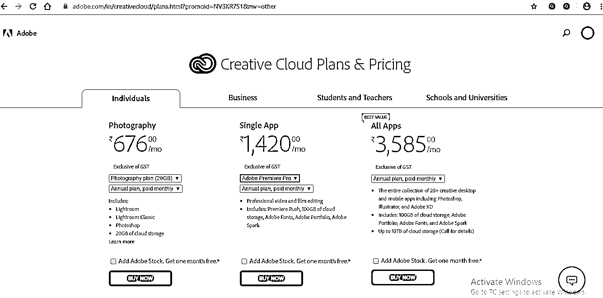

**第六步:**现在，这些是在 adobe systems 官网上查找 adobe premiere pro 软件的方法；我会选择免费试用，从这里下载我的 adobe premiere pro 软件。

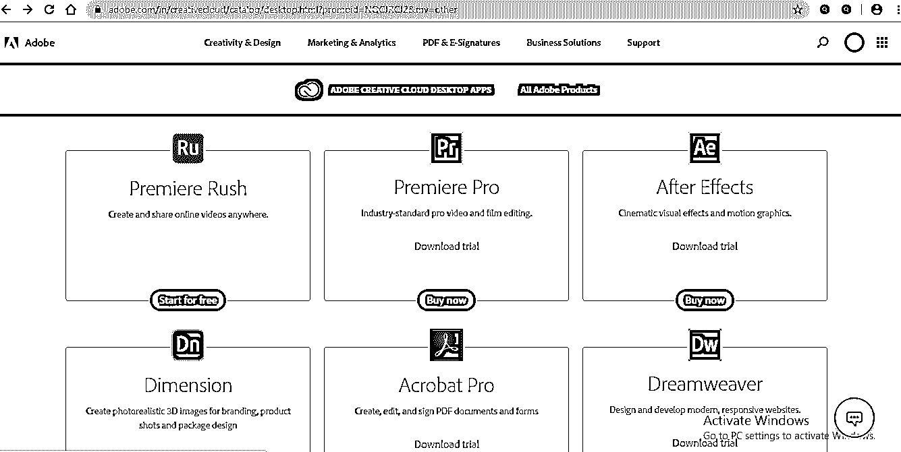

或者在这里，您可以选择下载试用选项来下载 adobe premiere pro 软件的试用版，或者单击“购买”来购买该软件。

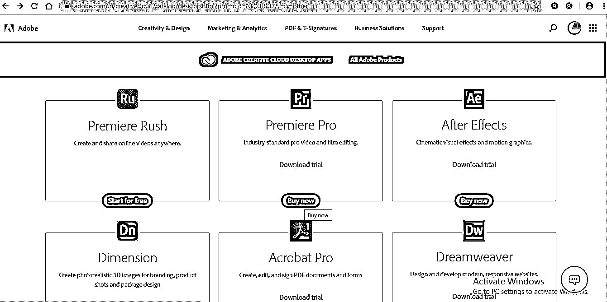

**步骤 7:** 我将点击下载试用选项，一个新的网页屏幕将打开，它将询问您关于 adobe Premiere Pro 软件的技能，无论是初级、中级还是高级水平。根据您的 adobe Premiere Pro 技能水平选择级别。

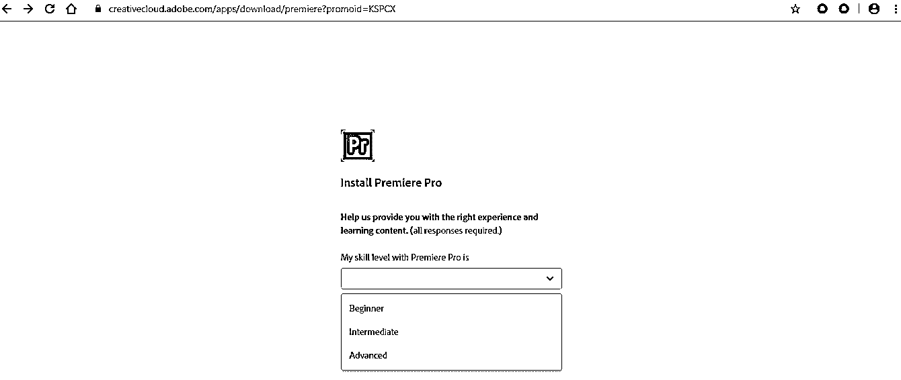

**第八步:**现在它会问你一个问题“打开 Creative Cloud 桌面应用吗？”在您的电脑上安装 adobe premiere pro 软件。

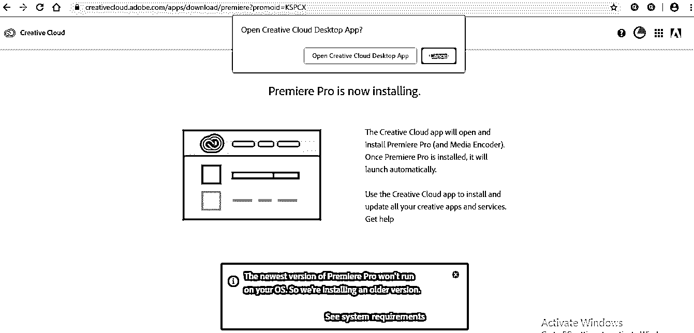

**第九步:**点击‘打开创意云桌面 App’按钮，打开 App；一旦打开，你会发现 adobe 系统的所有应用程序都在那里；adobe premiere pro 软件的下载将自动在您的 pc 上开始，您可以在此部分看到下载。

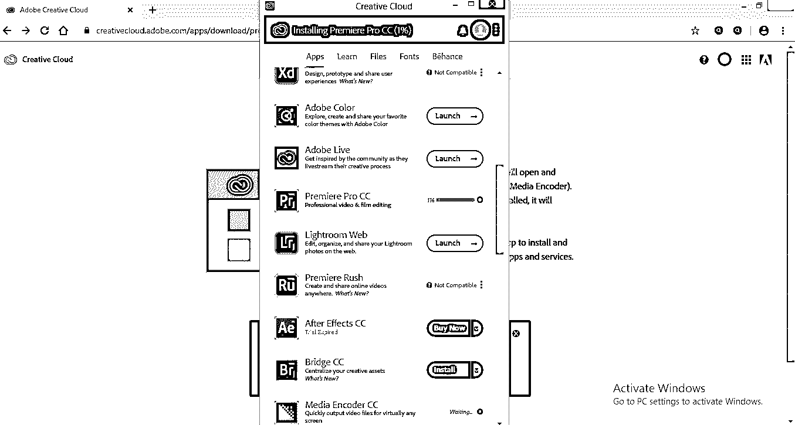

**第十步:**下载软件的速度将取决于你的网速。在这个框的顶部，你可以看到你的软件被下载的百分比。

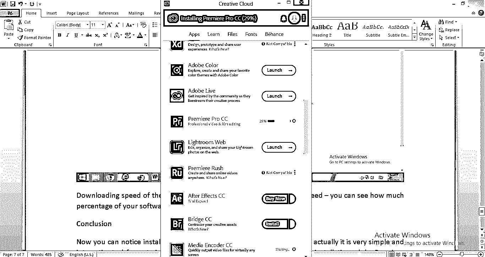

**第十一步:**下载 adobe premiere pro 软件需要一段时间；软件下载完成后，会自动安装到您的 PC 或笔记本电脑上。这是 adobe premiere pro 软件的用户界面；现在，你可以开始在上面练习了。

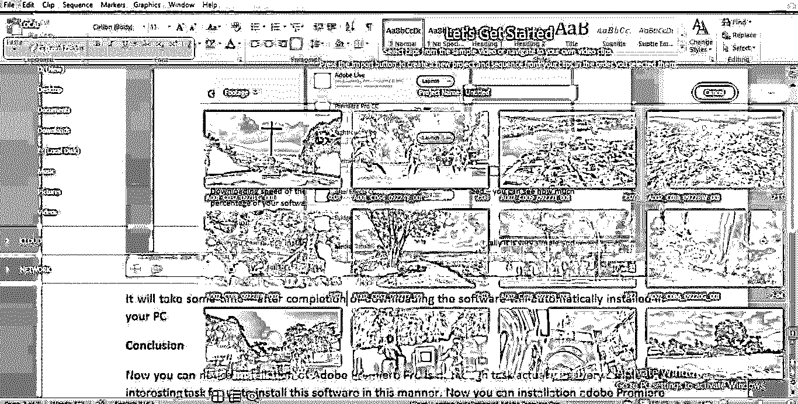

这样，您就可以在 pc 或笔记本电脑上安装 adobe premiere pro 软件。首先，你应该安装试用版，以检查它是否是用户友好的；然后，你可以去完整版免费欣赏。

*   我们在 adobe premiere pro 软件中有很好的功能，那就是我们有不同类型的运动图形模板；我们这里有不同的预先设计的效果，我们这里有使我们的工作流畅的库，它支持多种文件格式，这使它不同于其他视频编辑软件。
*   它的特点是支持所有级别的企业:小型企业，中型企业，大型企业。

Adobe premiere pro 软件功能增强了您的图形设计技能，使您在生活中获得成功。

### 结论

现在你可以注意到 Adobe Premiere Pro 的安装并不是一项艰巨的任务；实际上，以这种方式安装这个软件对我们来说是一个非常简单而有趣的任务。现在你可以在你的电脑上安装 Adobe Premiere Pro，只需按照我在本文中给出的一些简单步骤。

### 推荐文章

这是安装 Adobe Premiere Pro 的指南。在这里，我们讨论了安装 adobe premiere pro 及其系统要求的概述和步骤。您也可以阅读以下文章，了解更多信息——

1.  [Adobe Premiere Pro 替代品](https://www.educba.com/adobe-premiere-pro-alternatives/)
2.  [Adobe Premiere Pro vs After Effects](https://www.educba.com/adobe-premiere-pro-vs-after-effects/)
3.  [Adobe Flash 设置概述](https://www.educba.com/adobe-flash-settings/)
4.  [安装 Adobe Illustrator 的步骤](https://www.educba.com/install-adobe-illustrator/)

