# Adobe InDesign 模板

> 原文：<https://www.educba.com/adobe-indesign-templates/>

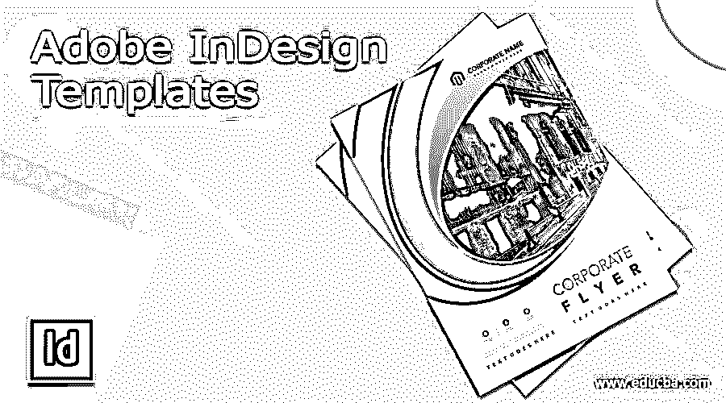

## Adobe InDesign 模板简介

Adobe InDesign 模板可以理解 InDesign 为不同类型的文档设计预先设计的布局。Adobe 为我们提供了许多模板，这些模板是由技术高超的专业人员在该软件中设计的。此外，Adobe 提供的许多模板都是免费使用的，这意味着您可以通过订阅计划访问它们(无需付费)。除此之外，有些是有偿的，所以你必须为拥有它们而付费。

### 概述 Adobe InDesign 模板

在这里，我们将了解如何使用 InDesign 模板，但在深入了解这一背景之前，让我们先看一下 InDesign 模板的概述。模板是为不同文档预先设计的布局，帮助我们在设计它们时简化工作。在 InDesign 中，您可以通过 Adobe 网站搜索任何符合您要求的模板。

<small>3D 动画、建模、仿真、游戏开发&其他</small>

### 如何使用 Adobe InDesign 模板？

启动 InDesign 后，您将看到这个欢迎屏幕。因此，单击这个欢迎屏幕上的 Create New 按钮，或者按键盘上的 Ctrl + N 按钮作为新文档的快捷键。

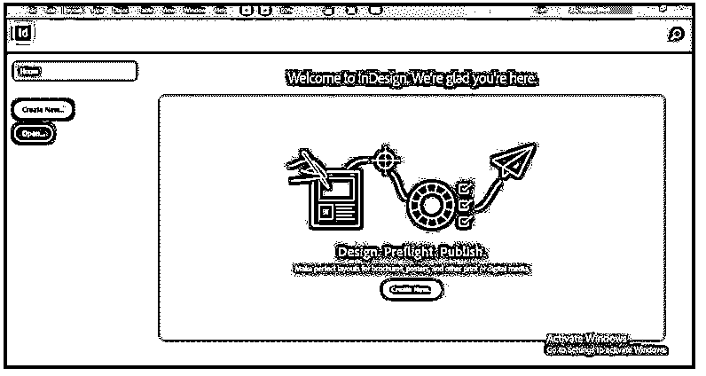

单击此按钮后，将打开一个新文档对话框。在此对话框中，单击任何文档预设类别，如打印、Web 或移动。例如，在下面，您将有模板预设到文档预设。我选择了打印类别。

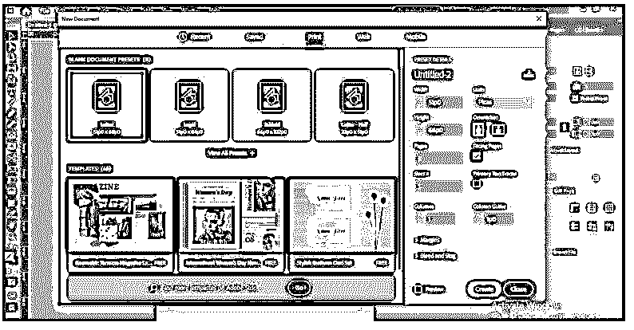

如果您向下滚动到模板部分，您将有更多的预置。你可以看到它们是免费的，因为在它们的右下角，我们有“免费”的标签。

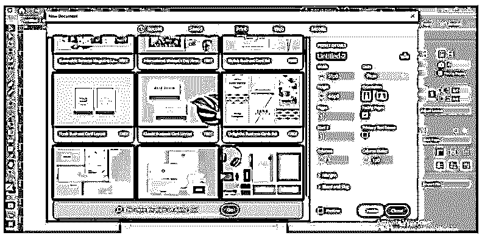

单击您想要的模板，在此对话框的右侧会有该模板的详细部分。这一部分包含了模板名称、设计者姓名以及其他一些重要内容的详细信息。在开始使用任何模板之前，您可以先浏览这些细节。

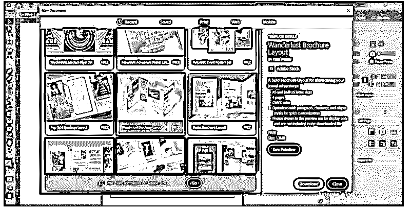

要预览您选择的模板，请单击详细信息部分末尾的查看预览按钮。

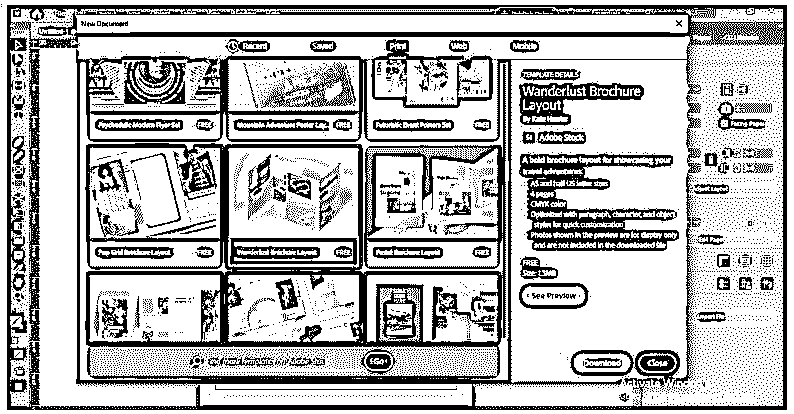

一旦你点击这个按钮，它会显示你所选择的模板预览；一旦您对任何模板满意，单击此对话框的下载按钮。如果对您选择的模板不满意，您可以通过关闭此预览模板来尝试其他模板。

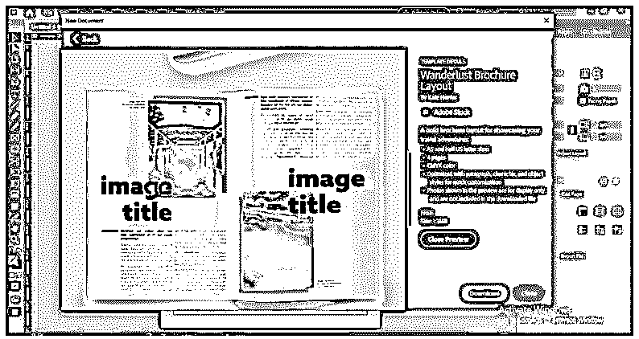

如果您想浏览其他类别，请转到此对话框的搜索框，在此处键入您想要的类别，然后单击“go”按钮。

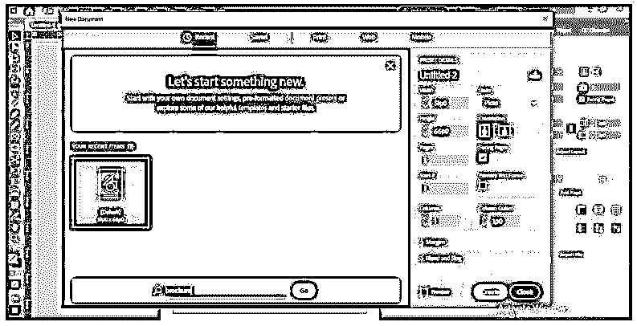

单击搜索框的“Go”按钮后，您将进入 Adobe 网站的 InDesign 模板页面。

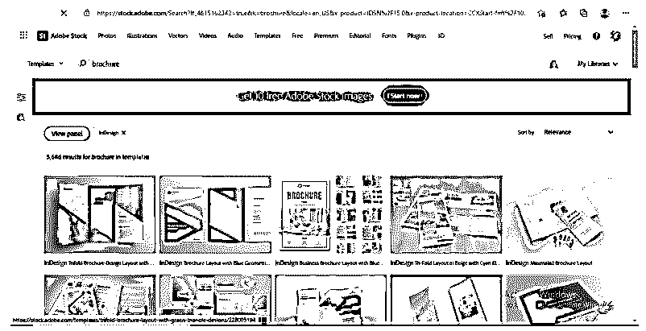

在这里，您可以根据您需要的类别浏览几个模板。这里有些是免费使用的，有些是付费的。根据你的要求，你可以和任何人一起去。

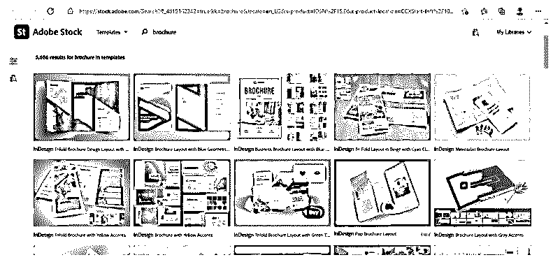

你会发现一个带有许可标签的免费模板和一个带有购买标签的付费模板。我会选择这个免费的。单击一个许可证的免费按钮来下载它。

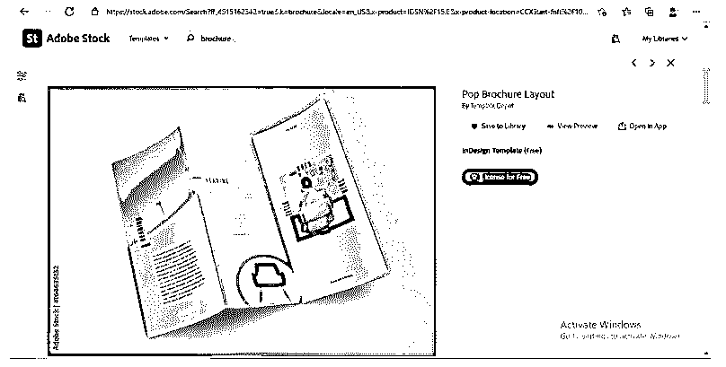

它将下载并显示一条消息，“保存到默认库。”

单击“保存到库”按钮，将其保存到 InDesign 库中。

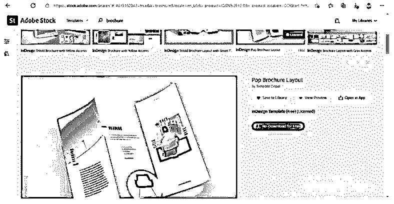

转到 InDesign 软件的“库”部分查看下载的模板。您可以在工作屏幕的右侧找到库。现在制作，点击你想要的下载模板打开它。一旦你打开它，一个消息框会告诉你丢失的字体。您可以在 Adobe 中找到这种字体，因为几乎每种字体都来自 Adobe 字体集。对于该字体，请单击该对话框的“查找字体”按钮。

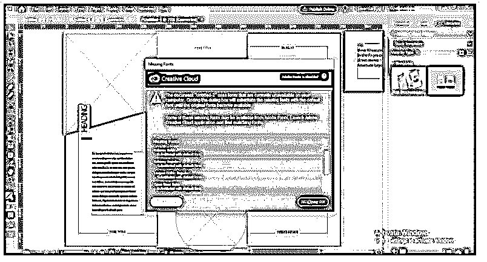

如果缺少的字体来自 Adobe 系列，您可以激活它们。

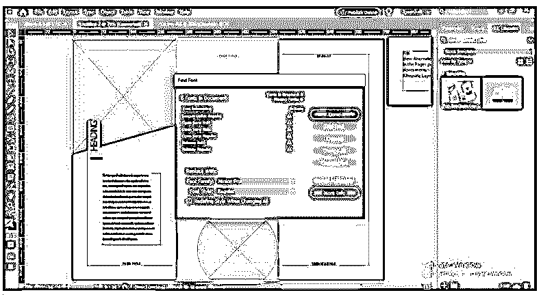

### 免费使用 InDesign 模板

该模板将像这样打开。你可以在这个软件的不同部分看到这个模板的细节，比如页面设置，段落样式等等。

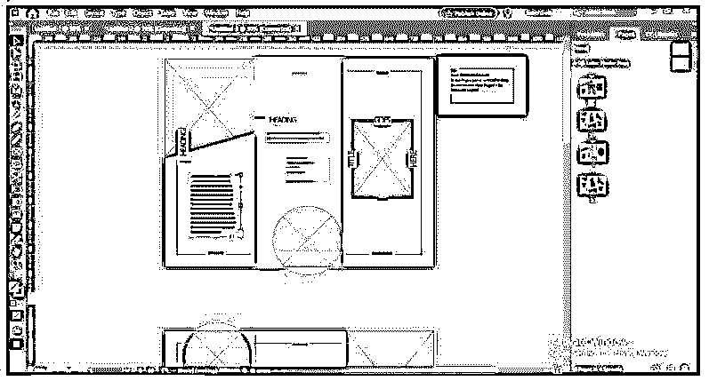

您可以更改此模板中使用的字体，然后转到“字符”面板。您可以从“窗口”菜单的“文字和表格”选项中打开此面板，也可以按 Ctrl + I 按钮作为快捷键。

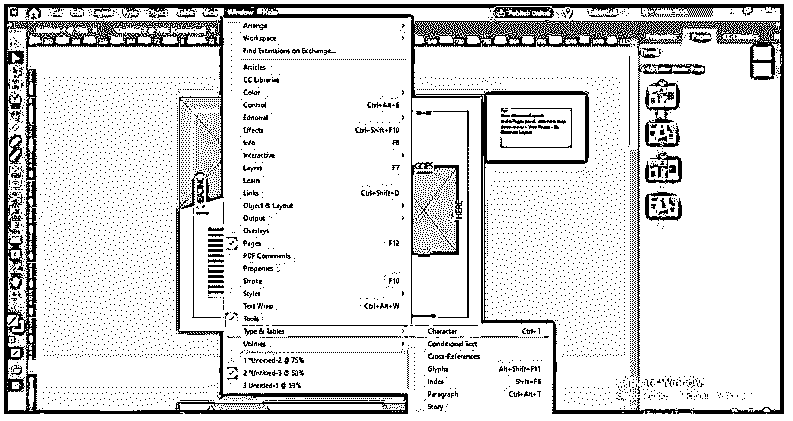

现在选择您想要更改的模板内容，并从“字符”面板中选择您想要的字体和其他设置。

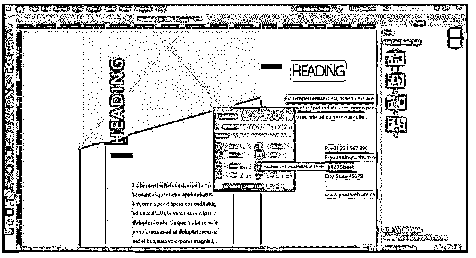

现在我想在这里放置一个图像。

所以要放置图像，去菜单栏的文件菜单，点击这个菜单下拉列表的放置选项，或者你可以按键盘上的 Ctrl + D 键作为它的快捷键。

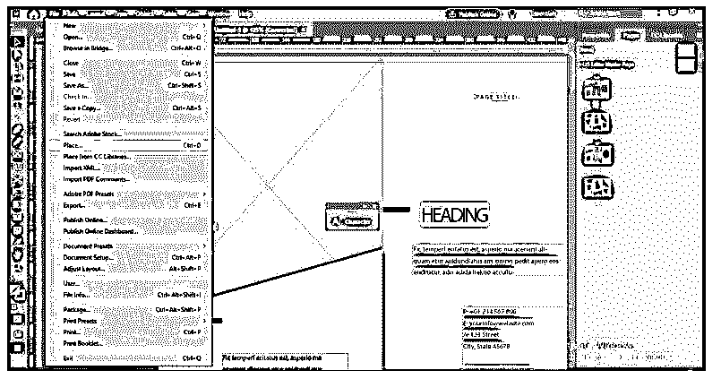

点击所选区域，将您选择的图像放在此处。

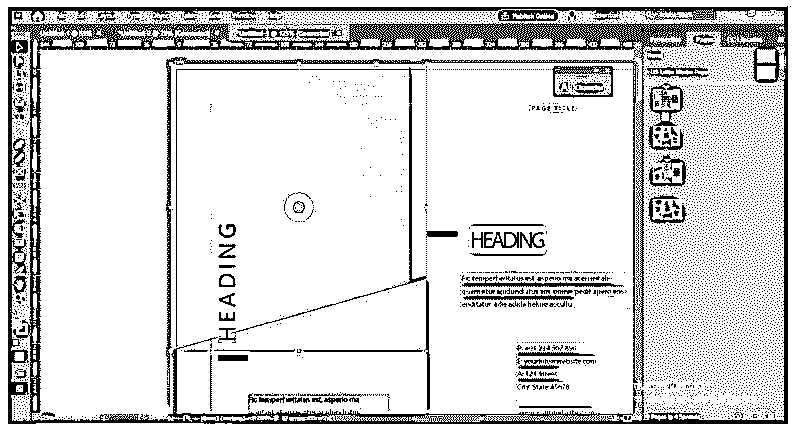

如果您选择的图像不合适，您可以将其放入框架中，为此，右键单击它，转到“适合”选项，然后选择“使内容适合框架”选项。

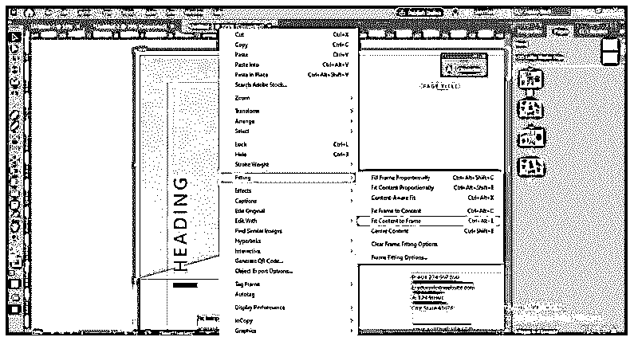

我会把它放在这里，然后像这样调整大小。你也可以改变颜色。所以要改变颜色，选择你想要改变的元素，打开颜色框，选择你想要的颜色。您也可以从“色板”面板中选择一种颜色。

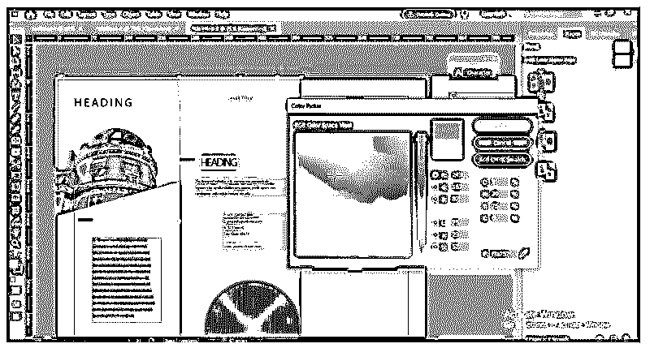

您可以根据自己的选择对下载的模板进行越来越多的更改，用您的创造力赋予它全新的外观。

### 结论

Adobe InDesign 模板的一些重要方面和设置会让您对它们有一个很好的了解。现在，您可以从 Adobe collection 中获得您想要的模板，并使用它们来创建包含您想法的文档。我建议您单独尝试其中的一些，以便很好地了解它们的功能，从而获得最佳输出。

### 推荐文章

这是 Adobe InDesign 模板指南。这里我们讨论一下入门，怎么用？并免费使用 InDesign 模板。您也可以看看以下文章，了解更多信息–

1.  [Adobe Flash 设置](https://www.educba.com/adobe-flash-settings/)
2.  [安装 Adobe Illustrator](https://www.educba.com/install-adobe-illustrator/)
3.  [Adobe Photoshop 替代品](https://www.educba.com/adobe-photoshop-alternatives/)
4.  [Adobe 编辑软件](https://www.educba.com/adobe-editing-softwares/)

