# InDesign 背景色

> 原文：<https://www.educba.com/indesign-background-color/>

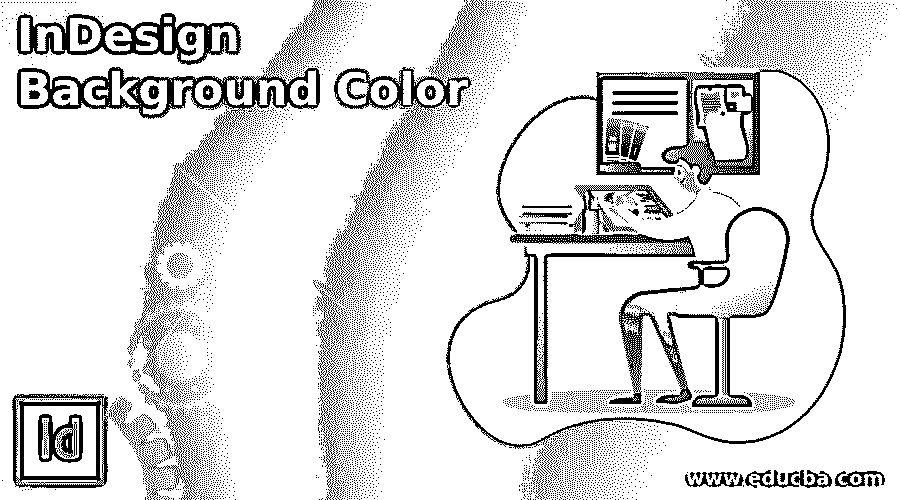

## InDesign 背景色简介

InDesign 背景色非常有用，是非常好的功能，可以非常有效地进行布局设计，或者使其与布局背后的设计主题或目的相关。在这个软件中，我们可以用两种方式解释背景色，第一种方式是设置背景色仅用于视觉外观，这意味着我们只能通过我们的设计来了解在相同类型的彩色纸上打印时是如何决定外观的。第二个是设置可以打印设计的背景颜色，不管你想打印什么颜色的纸。

现在我们将讨论这两种方法并理解它们的目的。

<small>3D 动画、建模、仿真、游戏开发&其他</small>

### 如何在 InDesign 中创建和使用背景色？

我将首先从这个软件的新文档对话框中取出一个信纸大小的文档页，我将为文档页的所有四边设置边距和出血。

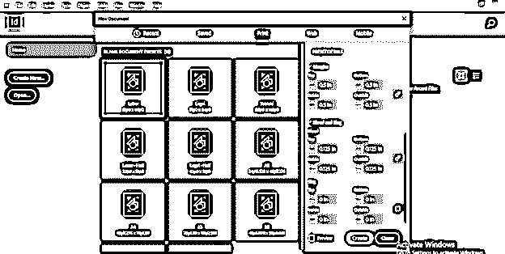

我已经创建了一个布局设计，我们将为此设置背景颜色。

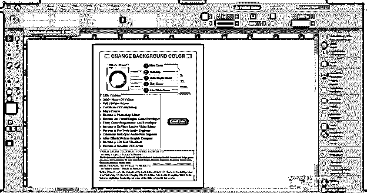

首先，我们将设置背景颜色，这将只为视觉目的，它不会打印在纸上打印布局。我们设置这种类型的背景色只是为了了解我们的设计如果打印在特定的彩色页面上会是什么样子。所以它起着非常重要的作用，因为任何版面设计的出现都会随着背景色主题的变化而变化。

为此，我们必须打开色板面板，您可以在不同面板部分的工作屏幕右侧找到它。

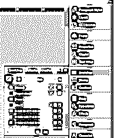

如果您的工作屏幕上没有这样的面板，那么您可以转到菜单栏的窗口菜单，然后转到下拉列表的颜色选项，在新的颜色下拉列表中，您将找到色板面板选项，或者您可以简单地按键盘的 F5 功能键。

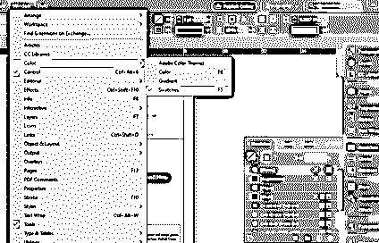

在这个样本面板中，我们有纸层，所以双击它。

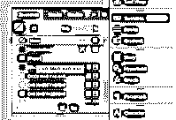

一旦我们双击它，我们有一个这样的样本对话框，在这个框中，我们有 CMYK 模式的颜色滑块比例。

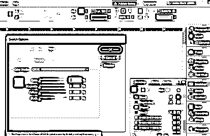

我将更改青色的值，您可以看到文档页面的背景颜色也随之改变。它不会影响设计元素以及设计布局的内容。

不仅浅色阴影，我们也可以改变为深色阴影。这完全取决于我们的设计布局外观。

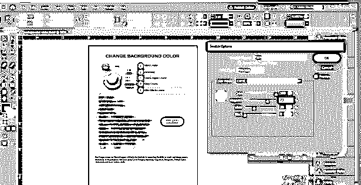

我将为我的设计布局设置背景色为浅色，然后转到文件菜单将其保存为 PDF，之后让我们看看我的设计布局会发生什么。因此，点击该菜单下拉列表中的导出选项。

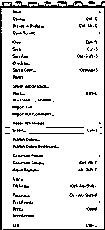

在导出对话框中，根据您的选择命名您的设计。我将它命名为背景色 1，然后点击这个对话框的保存按钮。

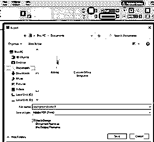

点击保存按钮后，将打开一个导出设置对话框，根据您的要求为您的设计设置 PDF 格式。这一次，我不会干扰这个对话框的任何参数，使用默认设置。

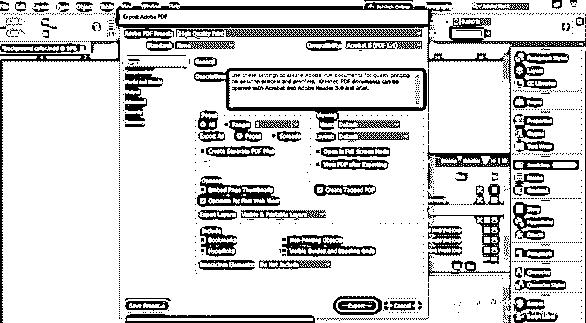

现在，当我们打开我们保存的 PDF 设计，你可以看到没有背景颜色，我们已经采取了在保存它。原因是我们使用“从色板面板中更改纸张颜色”的方法，这种方法只在 InDesign 软件中为视觉目的显示颜色，保存后我不会进行设计。

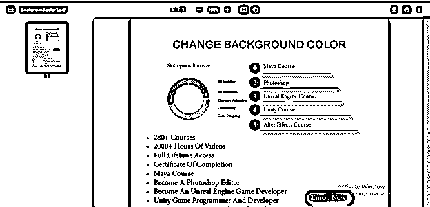

现在是将打开色板对话框的纸张和使 CMYK 值为零。

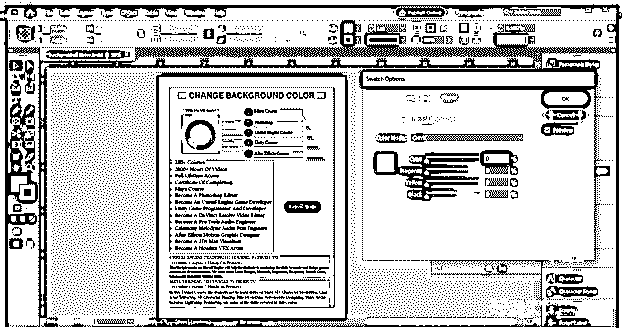

现在我将从工具面板中选择矩形工具，或者你可以按 M 作为快捷键。

我将创建一个像这样的矩形。在创建矩形的过程中，请记住以下几点，即创建一个比出血区域更大的矩形，因为当您将其放入打印机进行打印时，文档页面的边缘将不会出现较小的白线。

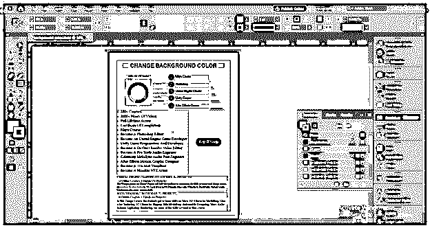

‘

一旦我创建了这个矩形，它将覆盖我的布局设计的所有元素和内容。你可以看到我创建的矩形比出血区域要大。您可以用红色矩形线来标识出血区域。

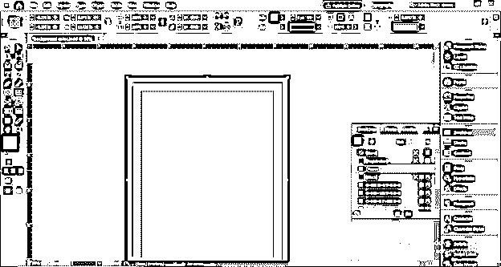

现在我将改变这个矩形的颜色，为此我将双击工具面板中颜色框的填充框。

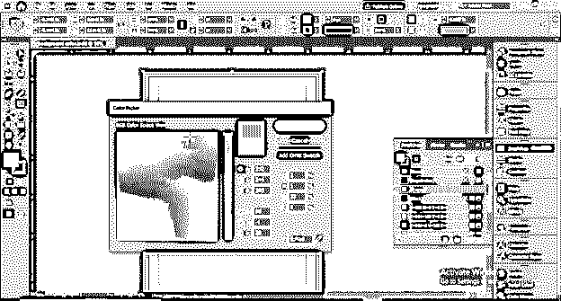

在矩形上有了我想要的颜色后，我将右键单击它，然后会打开一个向下滚动的列表。转到此列表的排列选项，并单击它的“放在最后”选项，或者您可以简单地按 Ctrl + Shift + [将所选元素放回文档页面的所有内容。

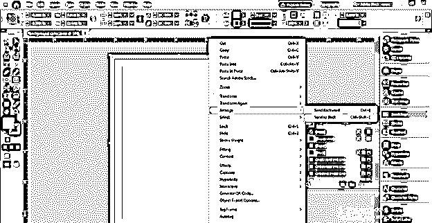

我们选择的矩形将位于所有内容的后面。现在你可以看到我们的文档页面有了彩色背景。

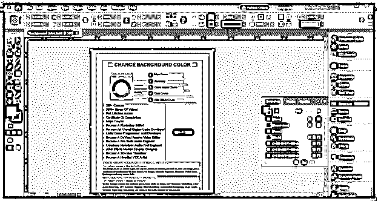

在这里，您可以看到超出文档页面区域的矩形的多余部分。

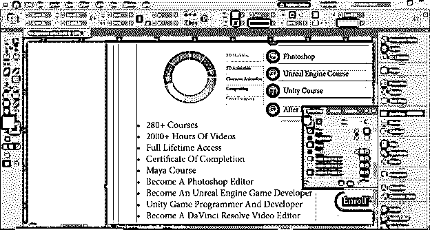

你不需要担心它，只需点击预览按钮，看看你的设计将如何在最终输出。您也可以按 W 键进入预览模式。

因此，这是最终输出，为您提供了一个安全的印刷设计布局。

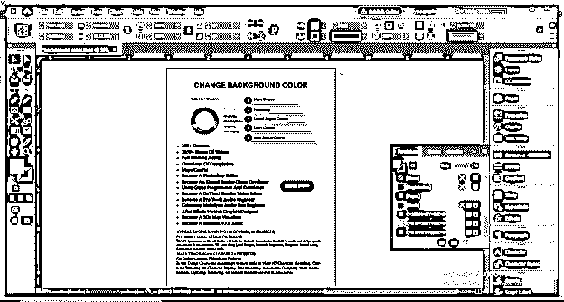

现在让我们把它保存为 PDF 格式，这次我把它命名为背景色 2。

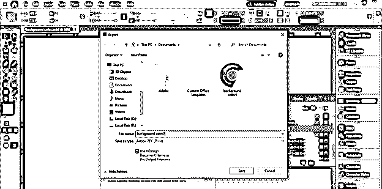

我将使用默认的导出设置。

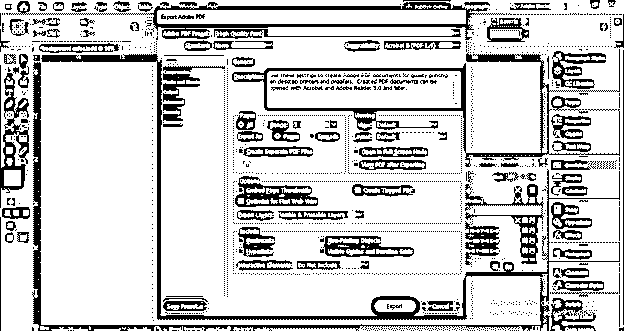

现在，当我打开我保存的 PDF 布局设计，你可以看到它现在有背景颜色。

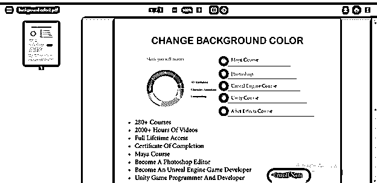

### 结论

现在，我相信你能理解什么时候你用纸色的方法来设置背景色，什么时候你用形状色的方法。这完全取决于你设计的布局的最终用途，所以你可以在这两个方面进行实践，并对它们有更深入的了解。

### 推荐文章

这是 InDesign 背景色指南。在这里，我们将讨论如何在 InDesign 中创建和使用背景色及其步骤。您也可以看看以下文章，了解更多信息–

1.  [Indesign 的替代方案](https://www.educba.com/alternative-to-indesign/)
2.  [InDesign 文档设置](https://www.educba.com/indesign-document-setup/)
3.  [InDesign CS6](https://www.educba.com/indesign-cs6-top-ten-new-features/)
4.  [什么是 Adobe InDesign](https://www.educba.com/what-is-adobe-indesign/)

