# 什么是 Adobe Muse

> 原文：<https://www.educba.com/what-is-adobe-muse/>

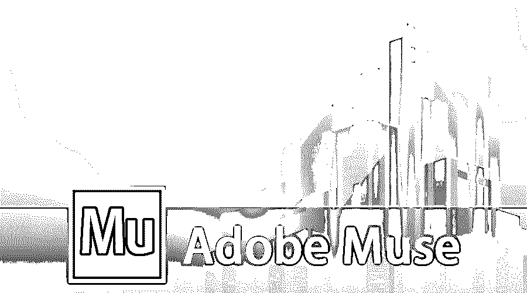

## 什么是 Adobe Muse？

Adobe Muse 是一个应用程序，网页设计师喜欢用它来创建一个网站，而不需要你学习如何编码；Adobe Creative Suite 创造了这一点。基本上，有许多应用程序可以从头开始设计网站，但 Adobe Muse 因其网站规划和沿着母版页设置页面而在网页设计师的优先级上排名第一，layouting 非常容易和人性化。应用程序菜单会自动更新网站最佳关系页面的美丽结构，让您的客户对网站的动态用户体验印象深刻。它通过更新新的和合适的 HTML 代码、语法和适合网站的图片以及创建有趣的博客来节省时间。一旦网站准备就绪，立即发布最新修改的网站进行网站托管。

### 软件方面的创新和不同

Adobe Muse 是 Adobe 公司最好、最快捷的设计应用程序。adobe muse 的最新版本是 18.1，发布于 2018 年 3 月；一些新的更新和东西使得这个应用程序可以被网页设计者使用

<small>3D 动画、建模、仿真、游戏开发&其他</small>

1.用户友好的界面一切尽在指尖每项修改都可以通过选择、拖放来完成，无需编码。

2.设计者可以从一个网站页面复制属性到新开发的站点，或者在一个页面内通过右击并选择复制属性并粘贴到需要的地方

*   字符样式
*   段落样式
*   项目符号样式
*   链接样式

3.编辑时显示部件。

4.可以使用 Adobe Muse cloud 登录保存和打开正在进行的设计网站。

5.新的开始屏幕界面可以选择回顾以前的网站，学习如何制作网站和连接帮助。

6.文件转换后备份文件的创建。

7.更多。

### Adobe Muse 工具

网站开发程序与良好的视觉布局方便编码。

*   当 Adobe muse 打开时，应用程序默认屏幕是这样通知的。

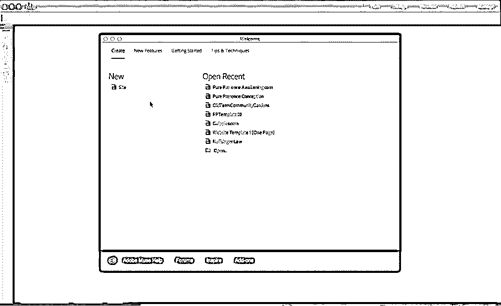

*   要创建新站点，请转到“新建”并单击“站点”。然后，网站大小和网页的细节可以根据手机、平板电脑到桌面的网站目的来设置，然后页面宽度和高度、栏来平等地框住内容，填充和边距设置它们的像素值。将分辨率设置为与许多操作兼容的标准，并计算哪个网站加载速度快，哪个速度慢。人们可能会因为加载速度慢而离开页面。

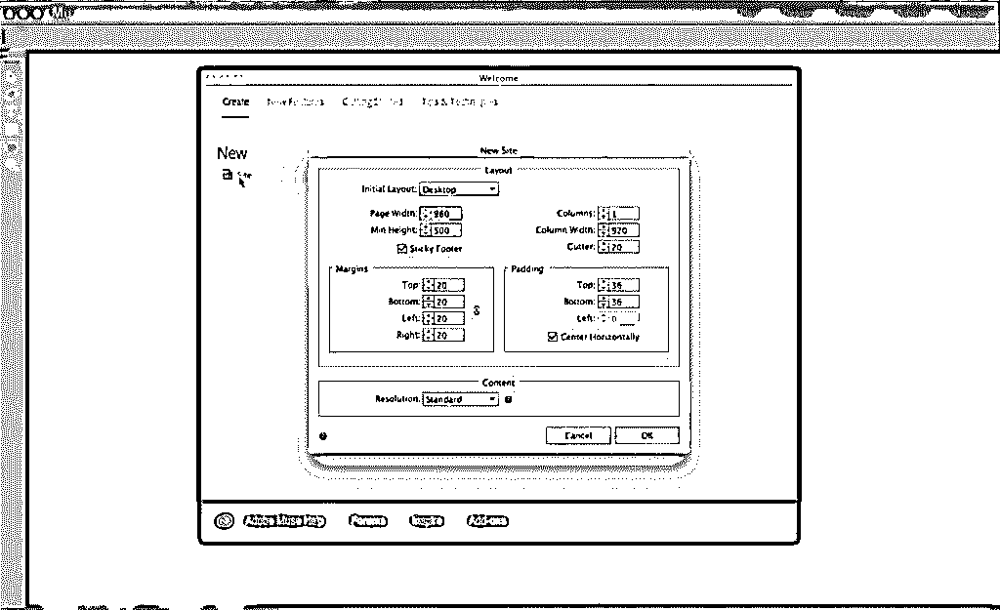

*   一旦网站打开，我们可以看到一个主页和母版页，称为母版页。

除了主页，添加页面真的很简单；我们有一个“+”按钮；通过点击它，一个新的页面被添加。

*   添加子页面可以通过点击页面底部的“+”来完成。

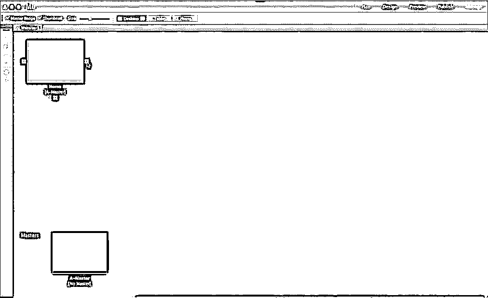

*   我们有几个元素在网站的所有页面上是不变的，如背景色、徽标、联系信息等。为此，编辑 A-Master 页面，这样编辑将应用于其中的所有页面。
*   要创建其他母版页，请点击 A-Master 页旁边的“ **+** ”。
*   要将页面从 A 母版页更改为 B 母版页，请右键选择页面并选择母版页，然后从那里选择您希望页面成为的母版页。

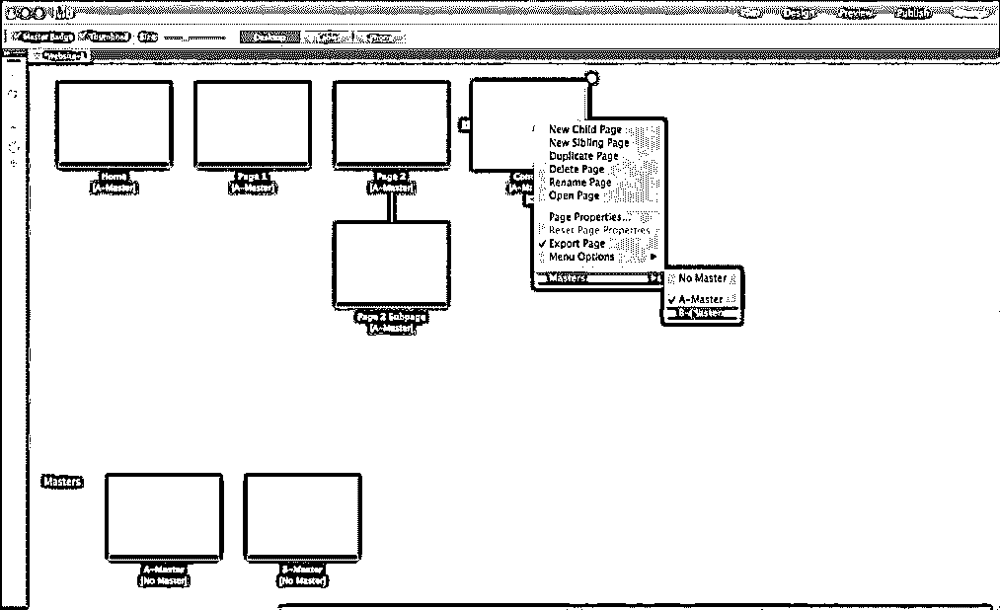

让我们从双击母版的工具开始；这个按钮是**工具栏**，它包含了选择工具、裁剪工具、文本工具、矩形工具、手形工具和放大工具。

### 刀杆

*   **选择工具:**选择网页中的多个组件，如文本、图像、日志、图形等。，并修改它们。

*   **裁剪工具:**根据设计将网页图片和网站裁剪到所需的文章大小。

*   **文字工具:**给网站添加文字。

*   **矩形工具:**在网站中选择或创建方形或矩形的列和行

*   **手形工具:**在网页内平移。

*   **放大工具:**放大和缩小网页。右侧工具箱中有 9 个工具。

*   **Text:** 它有助于更改网页中的字体、大小和文本设置。

*   **Colour:** 对静止或新的矩形活页纸进行彩色擦拭。

*   **色板:**默认颜色随自带。

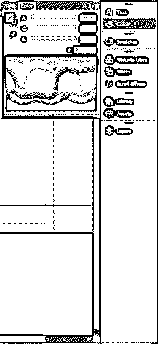

*   **Widgets 库:**许多工具可以通过拖放到网页上来使用。

*   **States:** 如果我们想要有状态、翻转和正常状态，它帮助用户知道他们可以点击并获得更多信息。

*   **滚动效果:**网站滚动和互动网站带来更多乐趣。

*   **库:**从源中获取更多的图像和额外的楔形。

*   **Asserts:** 当我们将图像应用到网站时，图像路径会自动更新，图像存储在 Asserts 文件夹中。发布网站很容易，因为图片已经腐烂了。

*   **图层:**在 Adobe Muse 中，图层与我们在 [Photoshop 和 Illustrator](https://www.educba.com/adobe-illustrator-vs-adobe-photoshop/) 中设置和处理页面设计的不同图层的方式相同。双击该层将其重命名。页面将通过添加内容自动更新。

### 页面设计工具

以下是设计工具:

*   **浏览器填充:**帮助设置完整的浏览器，下图中为绿色纯色。

*   **页面填充:**帮助填充网页，以下面图片中的紫色为例。

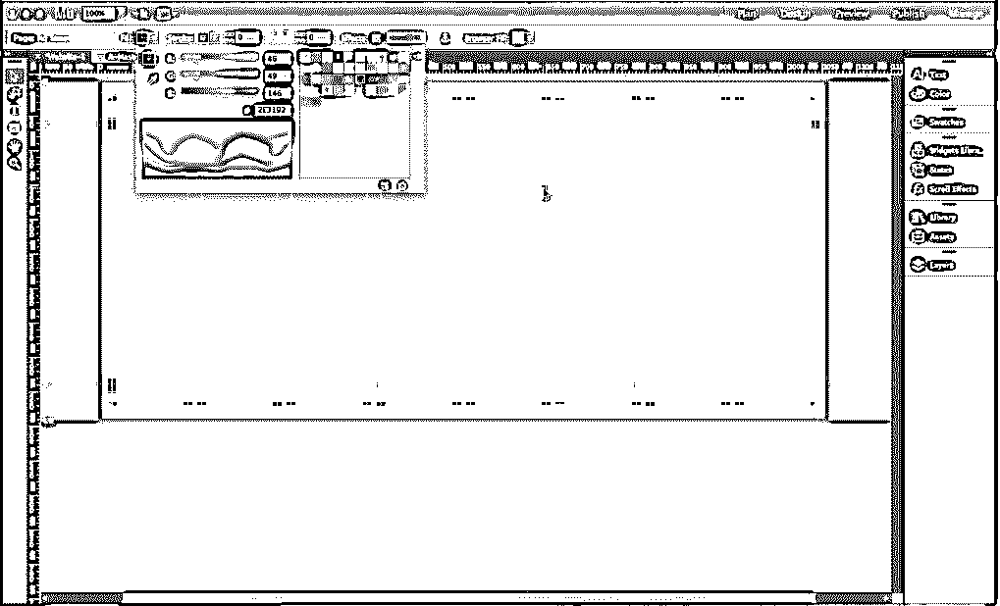

*   要为网页设置背景图像，请单击浏览图像并选择添加图像，然后选择要设置为页面背景的图像。

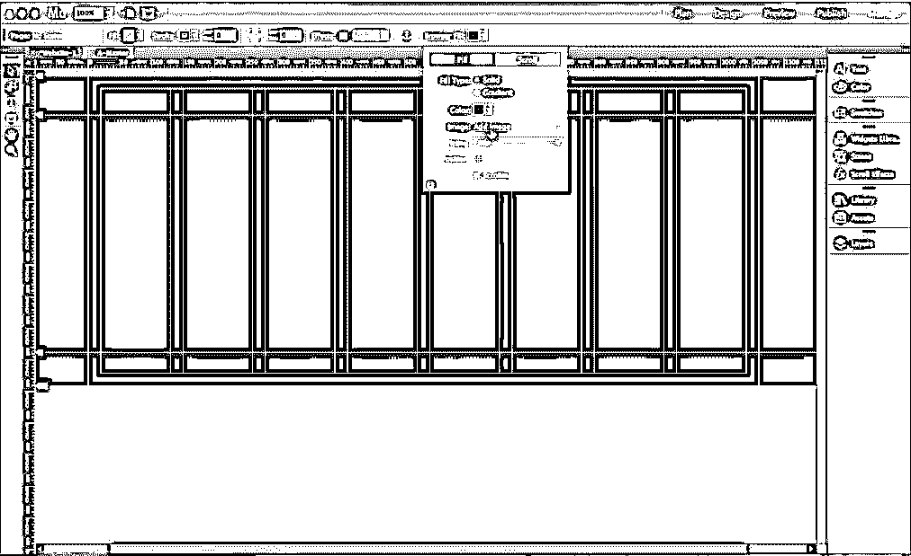

*   上传图像后，将启用适合和位置选项，通过这些选项，可以根据需要通过缩放或定向来设置背景图像。
*   要检查背景是否适合浏览器，我们可以通过以下方式在浏览器中预览它
*   单击文件并在浏览器中选择预览站点，默认浏览器将打开该站点进行查看。

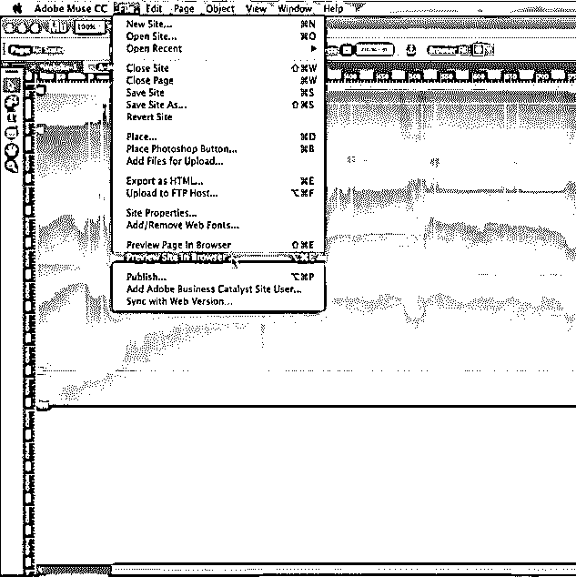

*   选择矩形工具，并选择给出信息的部分
*   单击“效果”,可以为选定的矩形部分添加效果
*   阴影，不透明度，角度距离和模糊和一些更多的药水，使部分看起来很好。

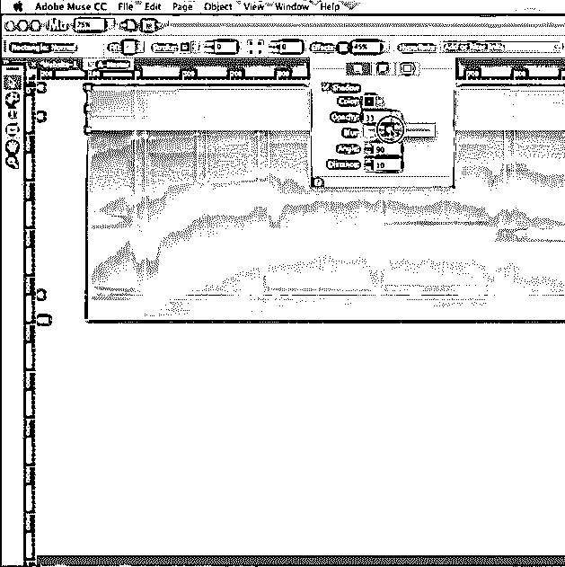

*   选择文件并选择位置，然后将图片上传到文章页面。

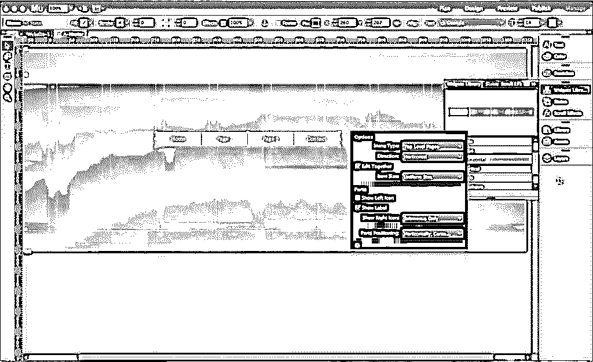

*   要添加、主页和所有菜单按钮，请转到 widgets 并选择 menu sample，然后将其拖到页面上，根据需要进行编辑。

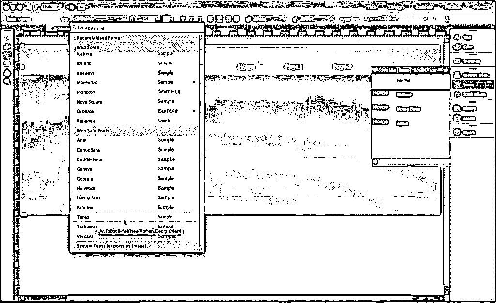

*   通过使用状态，可以将键入的文本编辑成所需的字体大小等等。
*   选择查看并启用智能参考线，以便该工具将图像和文本与最近的参考线区域对齐。
*   要通过添加内容使网站比预期的更大，请右键单击页面并禁用页脚项。

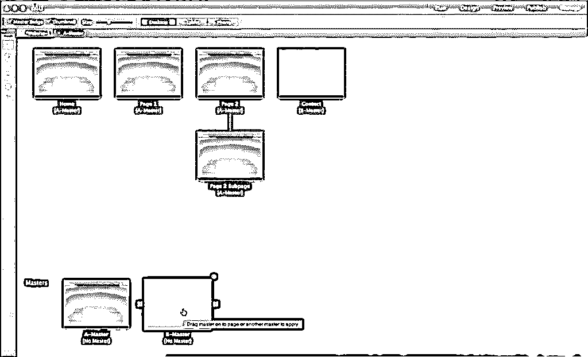

由于我们已经编辑了 A 母版页，所有与母版页链接的页面都收到了类似的内容，如上图所示。

### 在 Adobe Muse 中创建简单的项目/插图

让我们在 Adobe Muse 上设计新网站

1.  选择一个合适的网上可用的网站模板，确实节省了准备网站基础架构的时间。
2.  根据模板中的新要求更改文本和内容。
3.  如果需要，将背景、文本、图像和徽标更改为所需的颜色。
4.  使用向导添加新选项或编辑现有选项。
5.  要增加和调整内容，请在选择后拖动每个内容的边角光标。
6.  在页面底部添加联系人、地图和社交媒体定向链接。
7.  检查完整的网页并定稿。
8.  在浏览器上打开它，检查它的外观。

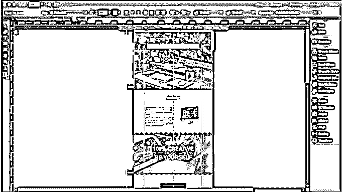

### 推荐文章

这是一个知道什么是 Adobe Muse 的指南。这里我们已经讨论了 Adobe Muse 工具的基本概念和特征。你也可以看看下面的文章:

1.  [什么是 Adobe InDesign](https://www.educba.com/what-is-adobe-indesign/)
2.  [什么是 Adobe Premiere Pro](https://www.educba.com/what-is-adobe-premiere-pro/)
3.  [Adobe Premiere Pro 插件](https://www.educba.com/adobe-premiere-pro-plugins/)
4.  [安装 Adobe Premiere Pro](https://www.educba.com/install-adobe-premiere-pro/)

