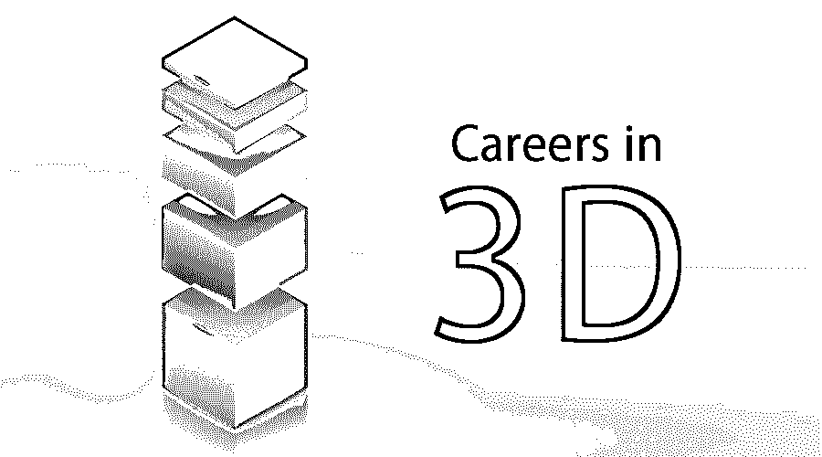

# 3D 职业生涯

> 原文：<https://www.educba.com/careers-in-3d/>

## 3D 职业介绍

电脑生成的 3D 艺术是一件复杂的事情。人们可以在游戏、电影和电视中一直看到它，但就整体而言，对于 3D 艺术家来说，这可能有点令人生畏。3D 艺术分为三个独立的元素:建模(几何)、渲染和动画。建模和几何图形是对对象及其所占空间的描述，建模是 3D 的第一步，因为没有几何图形和对象，就没有任何东西可以渲染或制作动画。渲染只不过是在屏幕上使用灯光和材质将几何体转化为像素，没有这些，你根本看不到几何体。动画为 3D 艺术增加了第四维度，即时间。事物的价值会随着时间的推移而变化，动画师通过在特定位置设置关键帧来管理这些变化。

3D 艺术家的角色是解码问题，但这是在设计过程之后。获得设计技能的 3D 艺术家通过他/她以设计为指导解决认知和抽象概念的能力，为生产带来更多价值。他/她应该了解什么是设计，它将如何，以及它将如何有益于你的工作。动画工作室寻找有传统设计背景的 3D 专业人士，所以扩展你的技能，加强你的工作，提升你的专业价值是明智的。

<small>3D 动画、建模、仿真、游戏开发&其他</small>

### 3D 职业生涯所需的教育。

3D 艺术家的工作通常涉及使用计算机软件来创建 3D 视觉图像。学位课程适用于 3D 设计师，如大专和学士学位。

以下是基于 3D 领域的教育要求:

*   3D 动画师/建模师:计算机图形(动画)学士学位
*   3D 平面设计师:平面设计学士学位。
*   网页设计师:网页设计学士学位。
*   **3D 游戏开发:**游戏学士学位。
*   **3D 打印:**学士学位(机械)工程最重要，除此之外还有工业设计、建筑、在线和文凭课程。

### 3D 职业道路

3D 设计是一个非常广阔的领域，用于各种项目。3D 领域可能的职业选择包括:

#### 3D 动画/建模

1988 年是电影《谁陷害了兔子罗杰》？上映了，动画领域爆炸了。然后是 1992 年迪斯尼发行的《美女与野兽》，引起了市场轰动。从那以后，动画事业蒸蒸日上。3D 动画师使用 Maya、3D Studio Max 和 Houdini 等计算机程序为各种行业创建 3D 图形、视觉效果和动画。3D 动画领域的工作人员为电影、电视、视频游戏和其他电子媒体制作视觉效果和动画角色。

#### 3D 平面设计

平面设计师为公司制作产品插图、标志、名片、信头、海报。简而言之，他们创造了一个公司或客户需要的完整品牌。像 Adobe Photoshop、Adobe Illustrator 和 Cinema 4D 这样的计算机程序被用来产生传达信息的视觉概念。

#### 网页设计师(网页开发者)

网页设计师关注设计和功能。他们知道如何创建网站和术语，如 SEO(搜索引擎优化)，HTML 5，CMS(内容管理系统)。一个网站不仅仅是视觉上的，还受到用户体验设计的驱动，一个好的网站由一个网页设计师设计，包括一个有计划的信息架构，用户友好的界面和简单的导航。

#### 3D 游戏开发

现在是考虑从事游戏开发的时候了，因为视频游戏行业的年收入比电影和音乐行业高。目前，电脑游戏行业正处于尖端技术中令人兴奋的职业的最前沿。3D 游戏产业已经实现了巨大的普及，并且已经成为创收业务的焦点。人们可以将 3D 视频游戏开发视为一种职业或爱好。

#### 三维打印

3D 打印已经在全球范围内被建筑、航空航天、医疗和汽车行业所采用。它取得了快速的进步，在各个行业掀起了波澜，其应用变得多才多艺，因此需求越来越大，需要能够理解、操作和通过 3D 打印机和 3D 建模概念实现创新的人。传统组织正在意识到 3D 打印机的潜力，并成为就业增长和行业需求爆发的关键驱动力。

### 3D 职业的职位

3D 有不同的应用领域需要考虑，例如动画、图形设计、网页设计、3D 打印和 3D 游戏。3D 动画师使用计算机和专门设计的软件[如 Maya 和 Houdini](https://www.educba.com/maya-vs-houdini/) 给物体和角色添加运动。3D 平面设计师也使用专门的软件，如 4D 影院，来构建逼真的图像。这些图像被用来鼓励品牌和产品，说明杂志和书籍。网页设计师将 3D 表现整合到网页内容中，以增加价值和吸引力。其他应用领域包括工程、广播、科学和医学成像。

**其他工作岗位:**

*   3D 打印专家
*   3D 定制和原型制作
*   3D 游戏开发商

### 薪水

目前，3D 设计师的平均工资是 48，980 美元/年。考虑到各个领域，以下是工资:

*   3D 动画制作人:$ 64297/年
*   3D 平面设计师:$ 48834/年
*   **3D 打印:**26727 美元/年

### 职业前景

3D 设计是一个非常广阔的领域，人们可以考虑不同领域的职业，如动画，平面设计，3D 打印，3D 游戏开发和网页设计师。对于一个动画师来说，从现在到 2024 年，需求预计增长 6%。3D 打印的兴起及其对制造过程的影响，为那些既有创造力又有机械倾向的人创造了许多有益的新工作角色。小型公司可以成为 3D 游戏开发者的一个很好的就业来源。从现在到 2024 年，对平面设计师的需求预计将增长 1%。

### 结论

在现代科技世界中，人们越来越多地使用手机，他们希望在电脑和智能手机上看到逼真的计算机图形。3D 职业为那些擅长创建 3D 动画游戏和图形并在移动设备上运行良好的人提供了机会。3D 动画师很适合在电影或电视行业工作。图形或网页设计似乎是两个相似的职业，可能会吸引那些受过动画培训和有经验的人。对 3D 设计软件和打印机操作的熟练程度会为制造、定制、销售、原型制作、教育等带来新的工作机会。

### 推荐文章

这是一份 3D 职业指南。在这里，我们讨论了介绍，教育，3D 职业道路，工作职位，工资，3D 职业前景等。您也可以阅读以下文章，了解更多信息——

1.  [游戏开发职业](https://www.educba.com/Careers-in-Game-Development/)
2.  [3D 打印职业](https://www.educba.com/careers-in-3d-printing/)
3.  [3D 动画职业](https://www.educba.com/Careers-in-3D-Animation/)
4.  [Photoshop 职业](https://www.educba.com/career-in-photoshop/)

