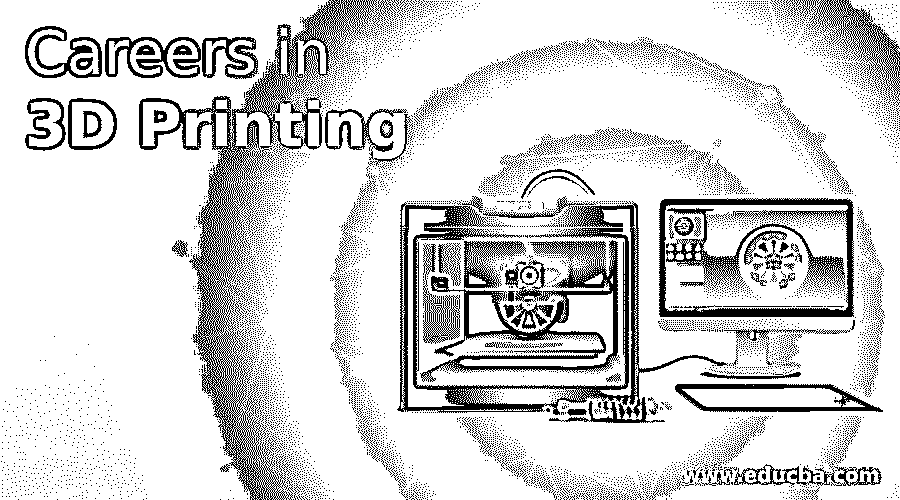

# 3D 打印职业

> 原文：<https://www.educba.com/careers-in-3d-printing/>

## 3D 打印职业介绍

在本主题中，我们将了解 3D 打印职业。在 3D 打印或伴随制造中，从数字文件或使用数字形式的数据制作三维实体或产品。那些行业习惯于通过 3D 打印的方式进行切割或挖掘；我们还将与铜、金、银等金属的减法制造进行竞争。此外，它将主要用于塑料工业与铣床的场合。每一个制造业都生产了大量复杂的形状，3D 将有助于创造比通用制造方法更少的材料。这是一种不同的方式来生产零件相比，受欢迎的减法机器命名为数控加工或注塑成型机器；在这些技术中，3D 打印对制造商来说是必不可少的。

### 3D 打印职业生涯所需的技能。

在每一个工作领域，我们都有一些知识，特别是机械方面的，有着有害的影响而没有技能。我们不会根据沟通我们产品的工作经验来创造产品，无论是需求还是销售，在技术人员的 3D 打印的相同方面，这些技术人员将完成相关领域的学士学位或文凭，如工程、美术、研究生学位的计算机知识。这将有助于技术人员在计算机的帮助下操作机器来制造产品。在这种情况下，技术人员具有逻辑思考的软技能和人际交往技能以及解决问题的技能。无论工作需要什么，喜欢心胸开阔，不同的创造性新想法，良好的 3D 软件操作知识和设计知识。

<small>3D 动画、建模、仿真、游戏开发&其他</small>

### 职业道路

每个人的职业生涯都可以很容易地激发他们童年时的技能和兴趣，因为兴趣+参与可以使完美的人成为有成就的人。该应用程序已经变得非常有才华，也符合人们的发展需求以及不断增长的需求，他们可以轻松理解、操作和轻松处理具有更新理念(如 3D 技术的建模概念)的 3D 打印机，工程师可以实现 3D 打印并将制造补充到公司流程中。接受现有行业的挑战和机遇，稳定并革新业务。这将有助于你提高技能，并增加你对 3D 行业的了解。

### 职业的工作职位

这个软件将包含建模对象的基本工具，我们可以很容易地修改我们的设计:开源、免费的 3D 建模软件。在 UI 上拿起了免费的三维建模软件的整体。它适合初学者快速而疯狂地掌握程序。我们可以很好地组织命令行的屏幕，以遵循工作流程。3D 打印行业将需要更多的设计师、工程师、建筑、医学、产品设计、电视和电影特效、人类学、汽车、创业努力等。，3D 打印电子自动化软件开发人员，制造商和硬件实习，更具创新性的 3D 打印技术，航空航天聚合物增材制造工程专家，机器人以及机械工程师，3D 打印助理，技术开发人员。对于 3D 打印开发人员来说，上述职位是非常熟悉的工作选项，他们可以申请这些工作，以便轻松地与正确的候选人一起进入正确的职位。

### 收入(工资)

除了其他行业，3D 打印的工资或收入对于处理这些技术将是有价值的，因为随着基于技能的设计师有更多的想法，创造性思维，理解上级官员的期望，收入将定期增加。在最初阶段，一名技术人员每月每印度币将获得 10，000 卢比以上，而不是其他费用的津贴。在国外，他们的员工按小时计酬，每小时多得 15 美元。一年后每六个月评估一次，工资持续增长，公司提供的其他住宿如家、食、行等也会增加。

### 3D 打印的职业前景

在多个行业都是靠这种帮助流传的，一些例子是；

*   **工程—**3D 打印用于打印设计和可视化产品。
*   **电子-**印刷外壳的印刷电路板。
*   **航空航天—**高效构建复杂物理学。
*   **建筑—**帮助 3D 打印立面图的建筑平台，缩放设计方面的模型。
*   **假肢—**在医疗行业，有新的发明阻止人们从这方面入手，3D 打印的作用就是，为残疾人打印出机械功能的假肢手。
*   **机器人—**在这一代人中，3D 打印等机器人技术的巨大发展将有助于组装真人大小的机器人部件。
*   **几何图形—**打印二维码等复杂几何图形。,
*   **商店或市场的展示品—**打印深色灯丝，让娃娃发光，以吸引顾客。
*   **产品设计—**在进入生产阶段之前，推进产品设计的实体模型。
*   **礼品—**在精美的礼品中，透明薄瓷按照创意艺术雕刻图案。
*   **杂项–**互联网的使用带来了大量的印刷品。

### 结论

我们讨论了 3D 打印来提高打印质量；3d 打印零件可能需要进行后处理。这些类型的打印选项，如对患者的化学治疗、支持产品授权、绘画等。对于将选择 3D 打印技术领域职业的设计师来说，这是许多机会。大多数基于技能的 3D 打印候选人都有资格雇佣 3D 打印公司和企业。

除了常规的工作之外，知识渊博的设计师也可以作为自由职业者在家工作。在研发领域，借助 3D 打印技术，将会有巨大的人力需求机会。如今，这些类型的 3D 打印将更多地与时尚相关的公司，如珠宝设计公司和时尚相关的公司，它们可以采用 3D 打印的先进技术。在建筑领域，3D 打印的作用对于获得建造房屋或任何其他建筑的想法更为重要。在一项对印度设计行业的调查中，该行业在过去五年中增长了 14 %,在未来几年中这一比例还会增加。

### 推荐文章

这是 3D 打印职业的指南。这里我们讨论了简介、所需技能、职业道路、工作职位、薪水、职业前景等。您也可以阅读以下文章，了解更多信息——

1.  [3D 建模职业](https://www.educba.com/careers-in-3d-modeling/)
2.  [游戏开发职业](https://www.educba.com/careers-in-game-development/)
3.  [3D 动画职业](https://www.educba.com/careers-in-3d-animation/)
4.  [三维建模软件](https://www.educba.com/3d-modeling-software/)

