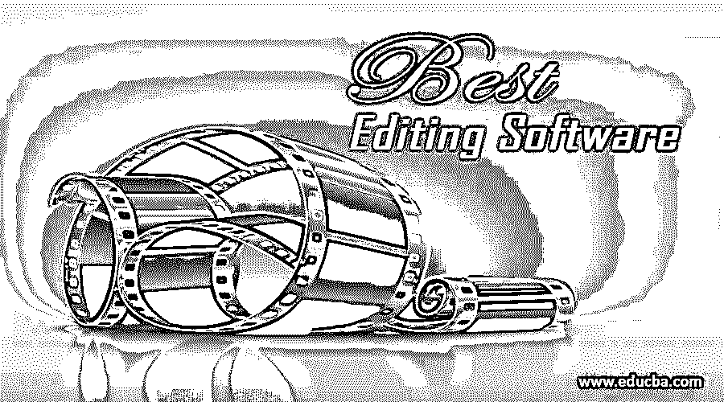

# 最佳编辑软件

> 原文：<https://www.educba.com/best-editing-software/>

## 编辑软件介绍

编辑是一个术语，用来为不同的目的对我们的工作进行一些改进和改变。视频编辑软件只是用于同样的工作。我们使用该软件对我们的视频图形进行了不同类型的更改和改进，以使我们的视频图形在现实世界中越来越有效地工作。视频编辑软件为我们提供了广泛的自由度，让我们的工作更加真实，让它与我们自己的想法相兼容。在这篇文章中，我们将找到一些最好的视频编辑软件，这些软件将对我们的视频图形编辑工作非常有帮助。

### 最佳视频编辑软件

最佳视频剪辑软件？对你来说是不是一个很困惑的问题，那就不用担心那个；你现在在正确的地方。在这篇文章中，你可以很容易地找到你的问题的最佳答案。因此，让我们来看看你的答案，以便你更好地理解这个问题。

<small>3D 动画、建模、仿真、游戏开发&其他</small>

目前，我们在数字市场上有许多不同类型的视频编辑软件，它们具有许多令人兴奋的功能，但在本文中，我们将只讨论一些最好的视频编辑软件。

#### 1.Adobe Premiere Pro CC 软件

它是一个专业的视频编辑软件，而不是一个消费者营销软件，最初于 2003 年推出，作为 1991 年推出的 Adobe Premiere 的继任者。Adobe Systems 维护和开发该视频编辑软件，并作为 Adobe creative cloud 桌面应用程序的一部分提供。Adobe Premiere Pro CC 软件兼容 Windows 7、Windows 10 操作软件及其更高版本 Mac OS X，你可以从 Adobe Systems 的官方网站下载这个软件是[www.adobe.com](//www.adobe.com/)。只需登录该网站，在该网站的搜索框中搜索 Adobe Premiere pro cc。您可以下载该软件的试用版，也可以从该网站购买完整版。

该软件通常用于电影和视频编辑行业，因为它具有编辑高清视频的最常用功能。它支持编辑高达 10，240 x 8，192 分辨率的高分辨率视频，并允许一些插件在该软件中添加不同类型的其他功能，使编辑工作更加简单有效。所以，一旦你对这个软件有了很好的了解，你就可以在这个软件里越来越完美的做视频剪辑了。

#### 2.Final Cut Pro X 软件

Final Cut Pro X 软件最初于 2011 年发布，目前由苹果公司维护。您可以在 Pro Apps 的一部分找到该软件，并从苹果公司的官方网站下载。www.apple.com。Final Cut Pro X 与 macOS 兼容，是 Final Cut Pro 软件的下一个版本。你可以把这个 app 看作是视频编辑作品的非线性视频编辑软件。

这个软件包含了令人兴奋的功能；其中之一是磁性时间线。这种磁性时间轴功能允许用户的视频剪辑与前一个视频剪辑保持连接，没有任何问题。在这个软件中，在一帧中处理不同的视频和音频轨道是非常容易的，因为它通过使用其时间代码、音频波和一些其他功能，自动同步在一帧中不同记录的视频和音频轨道。

#### 3.Adobe Premiere Elements 软件

这是一个很好的视频编辑软件，由 Adobe Systems 开发和维护。它最初于 2004 年 9 月发布，与操作系统 Windows 7 及其更高版本、Mac OS X 及更高版本兼容。Adobe Premiere Elements 软件有多种语言版本，如法语、英语、德语、意大利语、日语等。你可以从 adobe systems 的官方网站上找到这个软件是[www.adobe.com](https://www.adobe.com/)。只要上这个网站，在这个软件的搜索框里搜索 Adobe Premiere Elements 就行了。您可以下载该软件的试用版，也可以从该网站购买完整版。

这个软件有许多好的特性，这使得它能够处理无限的视频剪辑和音频轨道。它可以轻松地处理多个关键帧效果，并方便其用户使用不同类型的插件在他们的项目作品中添加附加功能。它还有一个更令人兴奋的功能:实时视频重新渲染，这使得它可以在快速预览后对他们的作品进行即时修改。熟练掌握后，你会发现它在你的视频编辑工作中非常有用。

#### 4.Adobe Premiere Rush 软件

它也是 adobe systems 的 Creative Cloud desktop 应用程序的一部分，由 Adobe Systems 开发。兼容安卓操作系统和 iOS。你可以从 adobe systems 的官方网站上找到这个软件是[www.adobe.com](https://www.adobe.com/)。只要上这个网站，在这个软件的搜索框里搜索 Adobe Premiere Rush 就行了。您可以下载该软件的试用版，也可以从该网站购买完整版。

Adobe Premiere Rush 软件是最好的视频编辑软件之一，它允许您即时导出和导入作品。它还包含了其他一些重要而有用的特性，一旦你对这个软件有了很好的了解，你就会熟悉这些特性了。掌握了这个软件之后，你就可以在你的视频编辑工作中享受它了。

### 结论——最佳编辑软件

在这篇文章之后，你可以很容易地理解哪种视频编辑软件最适合你的视频编辑工作，并帮助你制作逼真的视频图形。了解不同类型的视频编辑软件后，您可以使用每种软件，并将它们的功能与您的项目参考进行比较。

### 推荐文章

这是最佳编辑软件指南。在这里，我们讨论编辑软件的介绍和前 4 名最好的视频编辑软件及其功能。您也可以浏览我们的其他相关文章，了解更多信息——

1.  [VFX 软件](https://www.educba.com/vfx-softwares/)
2.  [视频编辑应用](https://www.educba.com/video-editing-application/)
3.  [Photoshop 中的油彩滤镜](https://www.educba.com/oil-paint-filter-in-photoshop/)
4.  [Adobe 编辑软件](https://www.educba.com/adobe-editing-softwares/)

