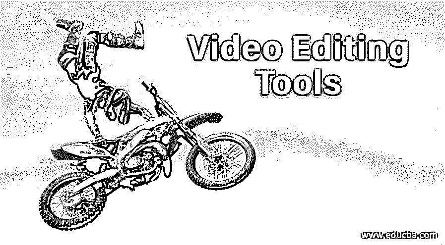

# 视频编辑工具

> 原文：<https://www.educba.com/video-editing-tools/>

## 什么是视频剪辑？

视频编辑是当今数字媒体平台的基本组成部分。视频编辑意味着改变或操纵任何预先制作的视频产品，以在您的项目中获得想要的结果。对于视频编辑，我们使用了不同类型的视频编辑工具。这些工具有助于视频编辑的不同后期制作工作，如根据环境着色、添加和移除声音、为视频添加效果等。在本文中，我们将看到一些顶级的视频编辑工具或软件，如 Nero Vision、Corel Video Studio 视频编辑软件、Power Direction 视频编辑软件、Adobe Premiere Elements 视频编辑软件、Final Cut Pro X 视频编辑软件和许多其他视频编辑软件。

### 顶级视频编辑工具

在这里，我们将以一种非常简单和有吸引力的方式熟悉市场上一些顶级的视频编辑工具。视频编辑工具是简单有趣的视频编辑工具；一旦你很好地掌握了它们，它们就会变得非常有用。所以让我们以一种非常有趣的方式用这些工具开始我们的文章。

<small>3D 动画、建模、仿真、游戏开发&其他</small>

#### 1.尼禄视觉

在 2011 年 10 月 15 日之前，它是 Nero Vision，但现在它被称为 Nero Video，是一款视频编辑软件。它由 Nero AD 于 2010 年 4 月开发，用于简单的视频编辑以及高级视频编辑工作。其最新版本为 Nero Video 2016，于 2015 年发布，兼容 Windows 10 操作软件、Windows 7 操作软件、Windows 8 操作软件、Windows 8.1 操作软件。这个软件有多种语言版本。你可以在 www.nero.com 网站上找到这个软件。它会以一种非常有效的方式帮助你进行视频编辑。它有助于改变播放速度和修改饱和度等。

你可以使用这个视频编辑软件作为你项目的视频编辑工具，因为它为你的用户提供了一个用户友好的工作空间。

#### 2.Corel 视频工作室

它是由 Ulead Systems (Corel)开发的，用于视频编辑目的，工作表现非常出色。最新版本是 Video Studio Pro 2018，也兼容微软 Windows。该软件允许您使用不同的功能进行视频编辑，并为您提供了广泛的编辑方式。通过访问 Corel 视频工作室的官网，可以找到这款软件。在 Corel 视频工作室软件产生的视频可以导出到 HD-DVD，AVI 格式，DVD 等。并为剪辑提供 3d 过渡效果。

使用 Corel Video Studio editor 软件进行视频编辑提供了多种编辑技术，一旦掌握了相关知识，熟悉它并不困难。

#### 3.电力主管

这款视频编辑软件由 Cyber Link 开发，兼容 Windows 10 和 Windows 7 操作软件。建议使用这些 windows 软件的 64 位版本。[www.cyberlink.com](https://www.cyberlink.com/index_en_US.html?r=1)是 Power Director Studio 软件的官方网站。你可以在这个网站上访问这个软件。其最新版本于 2019 年 9 月发布，提供不同语言版本。

这款视频软件为我们提供了一个非常有趣的学习环境，简单易懂，很容易就能让我们熟悉。使用它的视频编辑技术非常简单，任何人都可以掌握它。

#### 4.iMovie

它是由苹果公司为 macOS 和 iOS 设备开发的，是 Apply Inc. iMovie 的优秀视频编辑软件之一，1999 年首次发布，最新版本于 2019 年 10 月发布。访问 www.apple.com 的 iMovie 软件。它的特点是增强颜色设置，增强视频过渡，管理视频剪辑的速度等。它可以处理高清视频和压缩视频，也有令人兴奋的功能。它产生效果；用图像或剪辑等替换背景。

#### 5.Adobe Premiere 元素

Adobe Systems 于 2004 年 9 月开发了 adobe Premiere Elements，其最新版本于 2018 年 10 月发布。它兼容 64 位 windows-windows 7 及其更高版本，Mac OS X 及其更高版本。它也有许多不同的语言版本。它是很好的视频编辑软件，你可以从 Adobe Systems 的 Creative Cloud Suit 中获得它。它可以处理分配给无限视频和音频轨道上的每个剪辑的多个关键帧。它还为许多其他附加功能提供了第三方插件。

#### 6.Final Cut Pro X

它是苹果公司 Pro Apps 系列的视频编辑软件，于 2011 年 6 月发布。最近它在 2019 年 3 月发布，用可可计算机语言编写。你可以使用 macOS 作为它的操作系统，并通过访问 www.apple.com 网站找到它。它的特点是自动分析内容，帮助同步剪辑，给出复合剪辑，并提供多摄像头多方向编辑。它还有一个先进的颜色分级系统。

这篇文章将有关于不同类型的视频编辑软件的知识，你现在可以编辑你的视频剪辑用于视频编辑的目的。

### 结论

这样，现在你对视频编辑工具视频编辑有了很好的了解。现在，您可以选择任何一个适合您的项目，使您的工作容易不同的目的。该软件为您提供了广泛的视频编辑技术和工作领域，使您的项目用户友好。

### 推荐文章

这是一个视频编辑工具指南。在这里，我们讨论不同类型的视频编辑软件，将帮助我们编辑我们的视频剪辑。您也可以浏览我们的其他相关文章，了解更多信息——

1.  [视频编辑应用简介](https://www.educba.com/video-editing-application/)
2.  [各种 AutoCAD 工具](https://www.educba.com/autocad-tools/)
3.  [特效工具教程](https://www.educba.com/after-effects-tools/)
4.  [在 Illustrator 中使用宽度工具的步骤](https://www.educba.com/width-tool-in-illustrator/)

