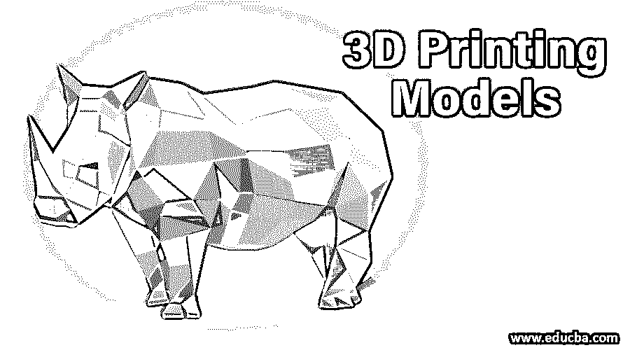
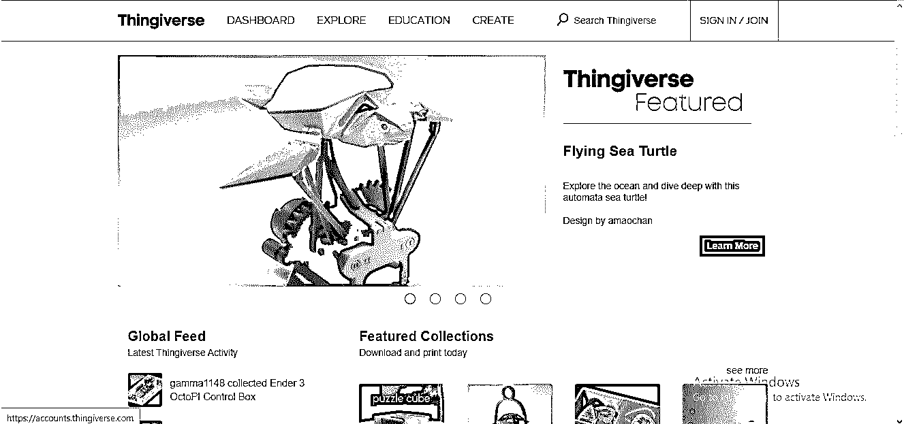
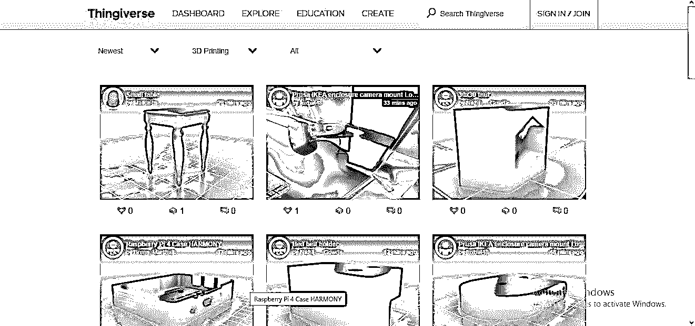
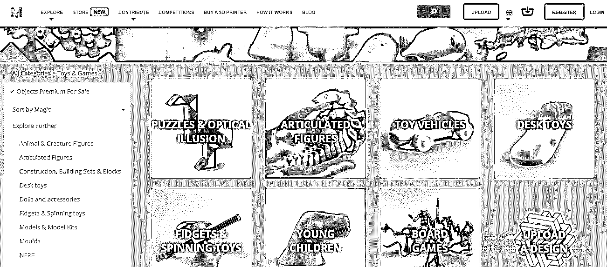
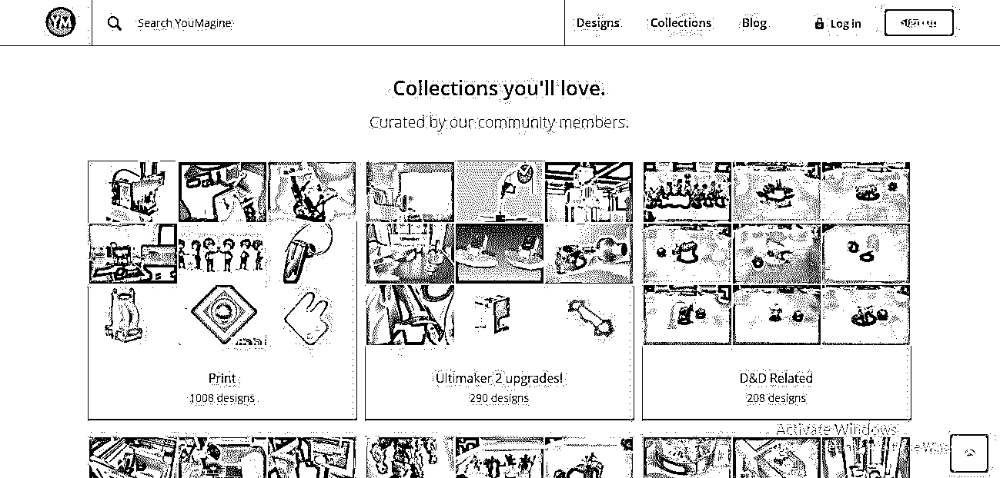
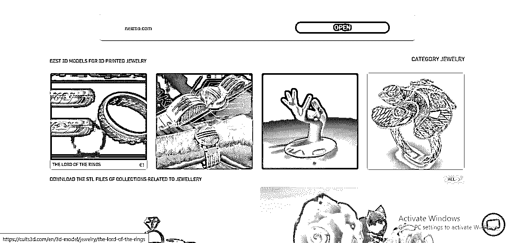
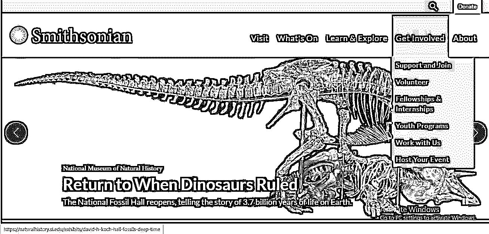
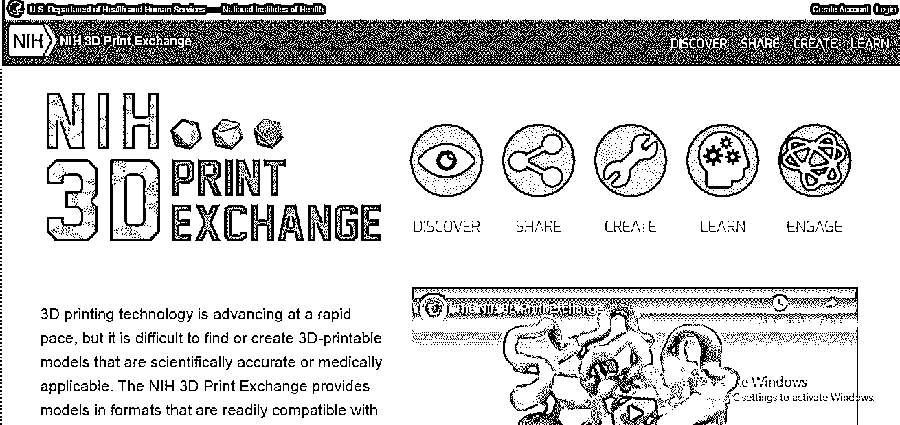

# 3D 打印模型

> 原文：<https://www.educba.com/3d-printing-models/>

## 3D 打印模型简介

在我们讨论 3D 打印模型之前，我们必须了解 3D 打印及其配件，以便更好地理解 3D 模型。这篇文章将告诉你 3d 打印的一些方面，并对它有很大的了解。3D 打印，顾名思义，是与三维物体有关的东西。3d 打印是建模的未来形式。通过 3d 打印，我们可以打印我们的 3d 模型，这是我们在任何 3d 软件上设计的。我们使用不同类型的模型进行 3D 打印，我们将在这里进行讨论。

### 什么是 3D 打印模型？

看完这篇文章后，这个问题对你来说并不复杂。它是图形设计的重要组成部分。当你在任何 3d 软件上为你的模型设计任何 3d 物体时，你必须考虑它的真实输出。真实世界的输出意味着当你设计的对象应用到它的实际目的时，它看起来会是什么样子，包括原材料和其他建模的东西。

<small>3D 动画、建模、仿真、游戏开发&其他</small>

3d 模型是任何 3d 软件上的任何 3d 对象的原型。这种模型让你可以自由地用自己的想法设计任何项目，这些模型的 3d 打印让你了解它们的真实输出。所以很简单，3d 打印中的模型是用原材料制作任何 3d 物体的基本结构。3d 模型的 3d 打印在层上工作，这意味着当你用 3d 打印机打印这些模型来制作 3d 模型时，它将被逐层创建。

### 创建不同的 3D 打印模型

对于 3d 模型的想法，我会告诉你为你的设计作品免费提供最好的 3d 模型的顶级网站。你可以为你的作品选择任何模型，或者从这些模型中获得一个想法，用你自己的想法制作不同的模型。

*   第一个是 Thingiverse 网站:在 Google.com 上键入这个名字，你会找到 Thingiverse 网站，并使用它，或者你可以通过在你的浏览器的 URL 上键入它来直接访问下面来源中提到的网站 URL。

您可以根据自己的需求在这里找到 3d 打印模型，并在您的项目工作中免费使用。

你也可以在你的关卡中修改你选择的模型。

*   下一个是 MyMiniFactory 网站:只需在 Google.com 上搜索 MyMiniFactory，或者你可以在浏览器的 URL 上输入下面来源中提到的网站 URL。

3d 模型有不同的类别；你可以根据自己选择其中任何一个。你可以选择玩具和游戏模型，建筑结构等。你也可以在这里用美术模型。

*   这一系列中的下一个是 YouMagine 网站:只需在 Google.com 上搜索 YouMagine，或者在浏览器的 URL 上键入下面来源中提到的网站 URL。

在这里，你可以将电子产品作为 3d 打印模型。

*   接下来是 Cults3d 网站。只需在 Google.com 上搜索 Cults3d，或者在浏览器的网址上输入下面来源中提到的网址。

如果你是珠宝设计师，你可以从这里拿一个珠宝模型，或者你可以在其他设计作品中使用这个想法。这里还有其他不同的模型。只需在此搜索您感兴趣的内容。

*   3d 打印模型的下一个网站是史密森尼网站。在 Google.com 上搜索这个网站，或者在浏览器的 URL 上输入下面来源中提到的网址。

您可以在此搜索不同类型的打印模型。只要访问这个网站，并从这里找到模型，这给你的项目一个现实的看法。

*   下一个是 6-NIH 3d Print Exchange 网站:在 Google.com 上搜索 6-NIH 3d Print Exchange，或者在浏览器的 URL 上键入下面来源中提到的网站 URL。

*   要从这些网站获取 3d 打印模型，只需点击特定打印模型的下载按钮即可。在这些网站上有一些免费的打印模型，但是你必须为下载一些特定的打印模型支付一些费用。你可以从这些网站下载打印模型来选择其中的任何一个。
*   这个网站指的是他们网站的不同打印模型的不同条款和条件，比如他们允许你使用一些打印模型用于商业目的，另一方面，他们允许一些打印模型仅用于个人或教育用途。因此，请确保条款和条件与您的使用兼容，然后享受他们的打印模型。
*   您可以使用您的注册电子邮件 Id 注册这些网站，以供将来使用，并不时获得这些网站的更新。

这些是给你一个理想概述的一些方面。一旦你知道了这些打印模型，你必须看看 3d 打印机，3d 打印机类型，以及 3d 打印机的一些其他重要功能，以完美地应对 3d 打印，并提高你的工作效率。

### 结论

读完这篇文章后，你可以很容易地理解什么是 3d 打印模型，并且可以用你的 3d 建模作品来欣赏它。了解 3d 打印机和 3d 模型后，您的设计工作将获得加分，因为使用 3d 打印模型，您可以轻松了解项目在现实世界中的输出，并在没有太大损失的情况下进行更改。

### 推荐文章

这是 3D 打印模型的指南。在这里，我们讨论 3D 打印模型的介绍，以及使用各种网站创建不同的模型。您也可以阅读以下文章，了解更多信息——

1.  [3D 打印职业前景](https://www.educba.com/careers-in-3d-printing/)
2.  [ZBrush 排名前 6 的插件](https://www.educba.com/zbrush-plugins/)
3.  [3D 打印的各种优势](https://www.educba.com/advantages-of-3d-printing/)
4.  [3d 图形八大软件](https://www.educba.com/3d-graphics-software/)

