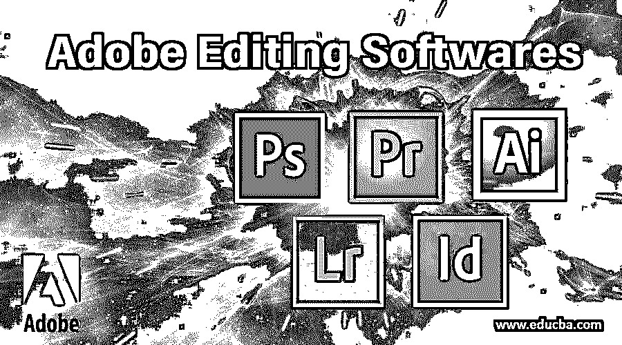

# Adobe 编辑软件

> 原文：<https://www.educba.com/adobe-editing-softwares/>

## 什么是土坯？

Adobe 是美国的一家跨国公司，它是一家软件公司，生产多媒体和创意软件；这家公司成立于 1982 年 12 月；史蒂夫·乔布斯试图以 500 万美元收购这家公司，但 adobe 的所有者没有接受这一出价，2003 年，所有 Adobe 创意软件聚集在一起，成立了一个新的团队，名为 Adobe Creative suits，简称为 CS，每个软件名称都以 CS 结尾。2011 年，adobe 的所有创意应用都被放在一个名为 [Adobe Creative Cloud](https://www.educba.com/what-is-adobe-creative-cloud/) 的群组中；这是一个桌面应用程序，如果我们需要[下载 Adobe 软件的 Creative cloud](https://www.educba.com/install-adobe-creative-cloud/) 是唯一的选择。

### Adobe 编辑软件列表

以下是 Adobe 行业中的一些顶级编辑软件:

<small>3D 动画、建模、仿真、游戏开发&其他</small>

#### 1.Adobe Photoshop 中

*   Adobe Photoshop 是由 adobe inc .开发的领先的用于照片编辑的图形软件。托马斯和约翰·诺尔创造了它；它是为 Windows 和 Mac 操作系统开发的，慢慢地，photoshop 成了 T2 印刷业和数码业的标准照片编辑软件。
*   Photoshop 最初发布于 29 年前的 1999 年 2 月 19 日；在开始阶段，它被发现用于光栅图像编辑器，后来它被用于 victor，digital graphics photoshop 开发了各种版本，当世界开始使用该软件时，该公司根据该软件进行了开发，现在它有 26 种语言，该软件最初是为 Windows x86-64 位开发的，现在它可用于所有比特率 32 和 64 直到 windows 10。
*   在 photoshop 中，每个版本都有不同的名称从 2002 年 10 月开始 photoshop 的每个版本都以 CS 结尾，八个版本后有一个数字第九个版本名称是 photoshop CS2 和 CS3，CS6 是两个不同的标准版本，在 Adobe creative cloud 品牌化之后从 2013 年 6 月开始，photoshop 的版本从 CS 更改为 CC，CC 表示 creative cloud。
*   Adobe Photoshop 有一个链接软件叫 image ready 在工具栏的末尾，我们可以找到一个跳转到 image ready 的按钮，在那里我们可以直接导出并打开我们的 photoshop 文件到 image ready，我们可以制作一些 gif 动画和 web 格式文件，并可以从 image ready 导出为 HTLM 文件。Photoshop 的主要文件格式是 PSD、PNG、JPEG、Targa 和 tiffPSD 是 photoshop 默认的文件格式；如果我们将 PSD 文件导入任何编辑软件，如 premiere pro，我们可以在 photoshop 中保存所有单独的图层。

#### 2.Adobe Premiere Pro

*   Premier 是第一个基于计算机的专业非线性编辑应用程序，其基于时间轴的软件，premier 于 1991 年首次推出，基于 mac，他们在 premier 6.0 版本中离开了 mac，他们再次带着 premiere pro 2.0 CS2 来到 Mac。
*   Premier 在 2003 年将其名称更新为 Premier pro，版本为由 Adobe creative suits 开发的 CS，后来它更改为由 Creative cloud 开发的 Premiere Pro CC，早期的 Premier 仅用于支持 DV 格式，这是该[应用程序的最大缺点，后来的 Premier pro](https://www.educba.com/install-adobe-premiere-pro/) 开发为支持高清视频编辑，从 CS3 Premier pro 可以编辑高清格式， 当 Premier pro CS3 的高清版本出现时，人们又开始使用 Premier pro，许多广播公司开始使用这个应用程序。
*   Premier pro 用于广播；专业视频，如婚礼、广告片、企业片等。还有一些像死侍，终结者黑暗命运的电影是在 premiere pro 里剪辑的；我们可以导出不同格式的视频，如 AVI，Mp4 (H.264)，快速时间。mov)等。，快速时间格式(。mov)是 mac 支持格式，当我们在 windows 中使用 Premiere Pro 时，我们需要安装 Quick time player，然后只有 premier 会支持 Quick time 格式。

#### 3.Adobe Illustrator 中

*   Adobe Illustrator 是来自 adobe creative cloud 的应用程序之一；它是一个基于矢量的图形编辑器；该应用程序由 Adobe 公司开发和销售；该软件自 1985 年开始工作，并于 1987 年正式发布 [Adobe illustrator 早期主要用于创建徽标](https://www.educba.com/logo-design-in-illustrator/)，后来用于杂志、商业广告和用于创建卡通人物，illustrator 的第一个版本是 1988 年的 1.7，引入了许多新工具。
*   2003 年 10 月，illustrator CS 从版本 11 开始推出；在这个版本中第一次引入了三维，我们可以创建三维形状；在 illustrator 的这个版本中，我们可以进行以下操作:绘制、切割和切片符号、打字、绘画和整形，illustrator 中有三个最强大的工具画笔工具、钢笔工具和铅笔工具。

#### 4.Adobe Lightroom

*   Adobe Lightroom 就像 Photoshop 一样；也叫[Photoshop lightroom](https://www.educba.com/photoshop-vs-lightroom/)；它于 2007 年 2 月 19 日发布，其中有 Lightroom cc 和 Lightroom classic cc，我们可以在其中查看、编辑、发布和标记 Lightroom；这个应用程序是为 Windows，Mac 和移动版本如 Android 和 iOS 开发的，我们也可以在移动中使用这个应用程序。
*   然而，我们可以在 lightroom 中编辑，我们不能像 Photoshop 那样执行有一些限制；在 lightroom 中，我们编辑的任何内容都不会影响原始图像，保存的图像将被重命名为另一个 Photoshop 文件，我们可以使用 lightroom 播放多张照片的幻灯片，还可以在幻灯片中添加音乐，我们还可以使用 LightRoom 4 创建相册，在 LightRoom 中，我们有几个 web 模板和布局来创建 web 布局。
*   在 Adobe Lightroom 3.0 中，他们引入了一个新的选项，称为色度降噪、水印和锐化工具；2016 年，lightroom 在 Apple TV 上推出，Apple TV 在 Apple TV 上放映 Lightroom 的大图像，Adobe Lightroom Classic CC 和 Lightroom CC 于 2019 年 11 月 4 日发布。

### 结论–Adobe 编辑软件

这里我们看到了 Adobe Creative Suite 和 Creative cloud 编辑应用；在本次会议中，我们将讨论 4 种用于图像和视频编辑的应用；我们了解它发布时是谁介绍了它，以及该应用程序在 Adobe 中的用途。

### 推荐文章

这是一个 Adobe 编辑软件的指南。在这里，我们讨论一个关于 Adobe 的解释，一个 Adobe 创意应用程序的列表，以及 Adobe 行业中一些顶级的编辑软件。您也可以阅读以下文章，了解更多信息——

1.  [如何安装 Adobe Creative Cloud？](https://www.educba.com/install-adobe-creative-cloud/)
2.  [什么是 Adobe Creative Cloud？](https://www.educba.com/what-is-adobe-creative-cloud/)
3.  [安装 Adobe Premiere Pro 的系统要求](https://www.educba.com/install-adobe-premiere-pro/)
4.  [什么是 Adobe Speed Grade 软件？](https://www.educba.com/adobe-speedgrade/)

