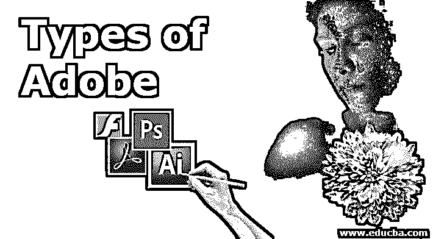
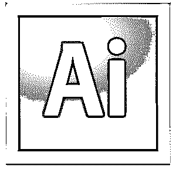

# 土坯的类型

> 原文：<https://www.educba.com/types-of-adobe/>

## 什么是 Adobe 软件？

Adobe 是与数字媒体市场相关的专业人士所熟知的名字。Adobe 公司是 20 年代成立的计算机软件开发公司。它现在最著名的名字是 Adobe Systems，总部设在加利福尼亚州圣何塞。随着时间的推移，adobe 在不同领域开发了许多类型的软件，如计算机生态系统软件、图像编辑软件、便携式阅读软件等。我们将讨论 Adobe systems 根据数字媒体市场的需求不时开发的许多不同类型的 Adobe。这些类型包括 Adobe Photoshop(光栅图像编辑器)、Adobe illustrator(矢量图形编辑器)、Acrobat Reader(文档编辑器)以及许多其他软件。

### 不同类型的土坯

在本文中，我们将以一种非常有趣的方式关注不同类型的 Adobe，并分析该软件的所有重要方面。Adobe 公司开发了许多类型的软件，几乎涵盖了数字媒体的每个领域，你会发现每一种类型的软件在你的数字媒体工作中都非常有用。因此，让我们开始讨论土坯的类型，以便更好地理解这些类型

<small>3D 动画、建模、仿真、游戏开发&其他</small>

#### 1.Adobe Flash

adobe 最可能知道的第一种类型是 Adobe Flash。它是用于支持计算机系统上不同类型任务的软件。它作为一个插件在浏览器上执行音频或视频，以及在计算机系统上执行离线多媒体。它最初是由 adobe systems 在 1996 年发布的，你可以从 Adobe systems 的官方网站 www.adobe.com 下载。这个软件有我的不同语言版本:英语、中文、法语、日语、波兰语、西班牙语和许多其他语言，并且兼容 Windows、macOS、Linux、平板电脑操作系统和 Android。这是用 C++计算机语言编写的软件，支持三维图形、矢量图形、光栅图形等音频、视频格式。Adobe flash player 在运行时执行 SWF 文件提供的内容，它没有其他内置系统来对 SWF 文件进行任何类型的修改。在任何硬件设备与计算机系统连接时，它也作为一个前提机构工作。Adobe Systems 在 2017 年 7 月宣布，将在 2020 年底之前用 HTML 5 取代 flash player。

#### 2.Adobe Illustrator 中

这是一个图形设计软件，致力于开发和编辑矢量图形原理。图形设计师广泛使用 adobe Illustrator 来开发专业项目，并对结果产生非常好的影响。该软件最初由 Adobe 公司于 1987 年 3 月重新封装，目前由 Adobe Systems 开发和维护。你可以从 adobe systems 的官方网站上找到这个软件，网址是 [www.adobe.](https://www.adobe.com/) Systems，它也是 adobe systems 的 Creative Cloud desktop app 的一部分。您也可以访问该软件的应用程序。Adobe Illustrator 采用 C++计算机语言编写，兼容 Windows 10 及更高版本、macOS 及其更高版本。它被用来制作不同类型的插画，公司的标志，商业公司的名片和许多其他编辑工作也可以在这里完成。它还为用户提供了一个非常友好的界面，允许他们使用各种工具来实现自己的想法。

#### 3.使用计算机软件对…进行处理

它是数字媒体市场上最需要的光栅软件，最初由 adobe 公司于 29 年前的 1990 年发布。现在由 Adobe systems 维护，兼容 Windows 10 和 MacOs 及其以后的版本。它有许多不同的语言版本，如俄语、英语、荷兰语、土耳其语等等。如果你想在你的个人电脑或笔记本电脑上使用这个光栅图形编辑器，只需登录 adobe 的官方网站，即[www.adobe.com](https://www.adobe.com/)，搜索这个软件。Photoshop 软件的工作原理是编辑高分辨率图像以获得更好的效果。您可以在这里编辑图像，以制作与数字媒体相关的不同类型的项目。它还允许用户为制作任何类型的广告作品制作动画光栅图像。总之，Photoshop 的工作领域非常广泛。你可以在 Photoshop CC、Photoshop CS6 和许多其他版本中找到它的版本。

#### 4.Acrobat Reader

Acrobat reader 是为管理 PDF 格式的可移植文档而开发的软件。它最初由 Adobe 公司于 1993 年发布，与 Windows、macOS、Linux 和许多其他操作系统兼容。你可以从 acrobat 或 adobe is acrobat.adobe.com 的官方网站下载这个软件。它最初被命名为 Acrobat Reader，但后来它变成了 Reader only。Adobe 提供该软件的免费版本，但您必须为使用该软件的高级服务支付一定的费用。在高级服务中，你会发现这个软件的许多高级编辑工具，使你的工作比前一个更容易。Acrobat Reader 允许用户创建可移植文档格式、操作可移植文档、管理打印以及使用不同类型的可移植文件。这些是 Adobe 的一些主要类型，它们可以帮助您处理与数字媒体相关的工作。

### 结论

通过这篇文章，你已经了解了土坯及其类型。现在，您可以轻松确定 adobe 的类型，并将其用于您的专业目的。一旦你很好的掌握了这个软件，管理图形设计工作，操作不同类型的音频视频，以及修改任何类型的文档工作对你来说都变得很容易。

### 推荐文章

这是一个土坯类型的指南。在这里，我们讨论什么是 Adobe 和不同类型的 Adobe 软件。您也可以阅读以下文章，了解更多信息——

1.  [各种类型的 Adobe Photoshop 工具](https://www.educba.com/adobe-photoshop-tools/)
2.  [Adobe Illustrator 工具有哪些？](https://www.educba.com/adobe-illustrator-tool/)
3.  [什么是 Adobe Lightroom？](https://www.educba.com/what-is-adobe-lightroom/)
4.  安装 Adobe Illustrator 的流程[。](https://www.educba.com/install-adobe-illustrator/)

