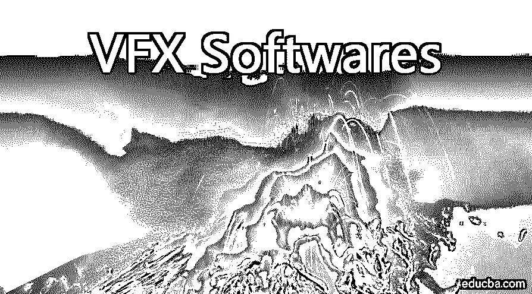
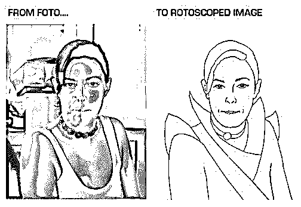
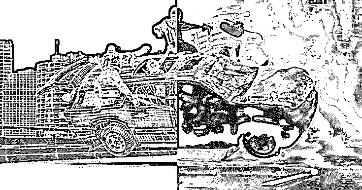
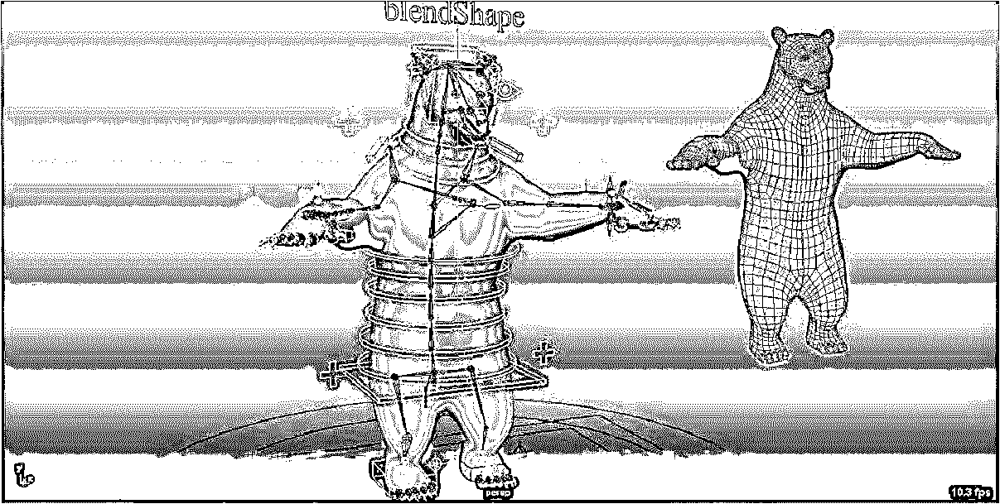
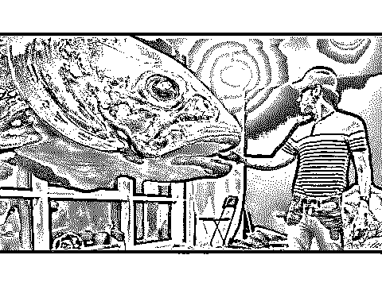
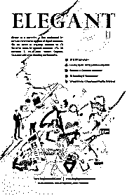

# VFX 软件公司

> 原文：<https://www.educba.com/vfx-softwares/>

## VFX 软件介绍

VFX 代表视觉效果。视觉效果是在计算机生成的图像的帮助下，以数字格式创建的想象的特殊效果。这些效果在现实世界中很难产生。这有助于电影制作人创造环境，即在现实世界中很难生成的无生命物体。各种软件包都可以产生这些效果，让人们创造不真实的运动和图像。该软件帮助[创建 3d 模型](https://www.educba.com/careers-in-3d-modeling/)以及角色和物体的动画。它们被用于电视、电影、建筑领域和游戏开发。这些软件帮助用户通过使用他/她的创造性思维来创建实时氛围。这个软件只会帮助我们引导我们的创造力形成美妙的图像和动作。

### 创造视觉效果的 5 种技巧

为了提高 VFX 的质量，有一些常用的技术。

<small>3D 动画、建模、仿真、游戏开发&其他</small>

#### 1.旋转镜检查

在这种技术中，动画师/图形设计师跟踪实时图像，并在他们的电影中使用它们。这个完整的过程被称为旋转镜检查。

#### 2.混合

在这种技术中，两个或更多的图像被组合成一个单一的图像，以创造一种它们都是一个场景的一部分的错觉。

#### 3.哑光画

这位艺术家画出了在现实世界中难以创造的场景。根据场景的要求来营造环境，就要看文笔了。

#### 4.装备

在这项技术中，我们开发了场景中角色的 3D 模型。这一过程在所有的动画电影中都有使用，以开发类似原著的角色。

#### 5.动作捕捉/匹配移动

在这里，我们捕捉人类的运动，并尝试用 3D 格式来描绘它。匹配移动用于电影院、电影中，以相对于拍摄图像的正确位置、比例、方向和运动将计算机图形插入到实时场景中。

### VFX 软件的优势

视觉效果是那些只是错觉，但为了吸引人眼而创造和模拟的特效，人类感觉是真实的。它们是讲述故事的强大工具，几乎应用于所有制造运动或图像的行业。它们为故事提供了一种氛围，也阐明了故事背后的思想。如果视觉效果被恰当地运用到你的概念中，那么它会吸引更多的观众来观看你的概念。

VFX 软件的主要优势是:

**1。在产品开发之前给产品打上品牌并展示产品:**几乎所有的产品行业都使用 VFX 软件来展示其产品特性和外观。这给了公司快速销售产品的优势。

**2。视觉图像比文字更容易记忆:**是人类捕捉图像比文字快 6000 倍的研究。这就是为什么你可以在小一点的孩子的教科书里找到更多的图片。

**3。借助清理和错误删除软件来优化您的视频:**如今，电影制作人使用这些软件来优化他们在前期制作和制作期间拍摄的视频。该软件还用于在后期制作期间增加更多的视觉吸引力。

### 15 大 VFX 软件

下面提到的是大多数行业使用的顶级 VFX 软件。

1.  **Autodesk Max:** 它是最强大的三维建模和动画工具之一。它具有样条线工具的高级功能，有助于创建复杂的几何图形。这样，我们可以在材质编辑器中从简单的数学节点创建 OSL 贴图来形成程序纹理。在这个工具的帮助下，我们可以创建真实的液体行为。
2.  **Autodesk Maya:** 它是动画和 3D 建模领域的领先工具之一。Maya 也越来越广泛地用于视频游戏行业，为《使命召唤》和《光环》等游戏创建视觉效果。场景装配和加速建模工作流不仅可以最大限度地提高生产力，还有助于简化设计体验。
3.  **Adobe After Effects:**[Adobe After Effects](https://www.educba.com/after-effects-tools/)是 Adobe 开发的一个应用程序，用于创建运动图形、数字视觉效果和堆肥。用于电影制作和电视制作的后期制作。2019 年，该计划获得了奥斯卡科学技术成就奖。
4.  **Dx Studio:** DX Studio 是与其他用于 3D 视频游戏创作的软件一起使用的集成开发。
5.  意式冰淇淋:它是 NVidia 开发的强大渲染工具之一。
6.  **LightWave 3D:** 它是 NewTek 开发的 [3D 计算机图形](https://www.educba.com/3d-graphics-software/)程序之一。该软件用于渲染 3D 图像，包括动画和静态图像。3D 建模功能支持多边形建模和细分曲面。
7.  **Nuke:** NUKE 是数字域开发的基于节点的应用软件。它在电视和电影后期制作中提供视觉效果。
8.  **MicroStation:**MicroStation 是 Bentley Systems 开发的用于二维和三维设计和绘图的 [CAD 软件](https://www.educba.com/autocad-tools/)。它主要用于建筑和工程行业。它生成 2D/3D 矢量图形对象和元素，并包括建筑信息建模(BIM)功能。
9.  **Blender:** 是用来制作动画电影的开源软件，[【UV 展开】](https://www.educba.com/uv-unwrapping-in-blender/)，并提供纹理。它还用于各种类型的模拟，如流体，烟雾，粒子和柔体模拟。
10.  **RealFlow** :是西班牙马德里 Next Limit Technologies 公司开发的流体和动力学仿真软件。它可以与其他软件结合使用，以显示流体运动。
11.  **摩卡 Pro:** 该软件是奥斯卡获奖工具，用于在电影院后期制作期间提供优质的视觉效果。它有一个先进的 GPU 支持的跟踪和对象删除工具。它还拥有高级工具，如 roto with edge snapping，image stabilization，3D camera solver 和 stereo 360/VR 支持。
12.  V- Ray: 它是一个插件，用来给现有程序增加额外的功能。Vray 的功能提供了世界级的照片级逼真图像，具有创建这些渲染图像的良好速度。它计算光的分布以及任何材料的物理属性。
13.  **4D 电影院:**4D 电影院是由 MAXON 开发的 3D 建模、动画、运动图形和渲染软件。在这个软件的帮助下，我们可以进行程序性和多边形/subd 建模、动画、照明、纹理和渲染。
14.  **Wings 3D:** Wings 3D 用于中低端多边形模型的建模。它不支持渲染和动画。但是它的模型可以被导出到很多其他的渲染软件中，比如 blender。
15.  **城市引擎:**是由苏黎士 Esri R & D 中心开发的 3D 建模软件。它主要用于创建 3D 城市环境和城市模型。它在基于规则的系统和类似于 GIS 的数据集的帮助下改进了形状生成。

还有更多……

### 结论

早些时候，人们习惯于只在 2D 的三维空间里画他们的创意。他们没有所有这些工具。但是如果你看到那些有创意的图画，你就能判断出我们的上一代是多么的勤劳和有创造力。他们用尽心思去画哪怕是一只小小的铅笔。这个软件，在所有方面，帮助设计师展示他们的潜力。但这也降低了大脑的创造力。所以我们应该有限地使用这个软件。

### 推荐文章

这是 VFX 软件指南。在这里，我们讨论 5 大技术创造 VFX 效应，VFX 软件的优势，和 15 大 VFX 软件。您也可以浏览我们的文章，了解更多信息——

1.  什么是 VFX？
2.  [什么是玛雅？](https://www.educba.com/what-is-maya/)
3.  [什么是 Blender 软件](https://www.educba.com/what-is-blender/)
4.  [4D 电影院 vs V-Ray](https://www.educba.com/cinema-4d-vs-vray/)

