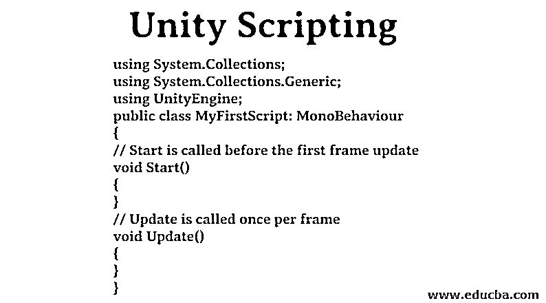
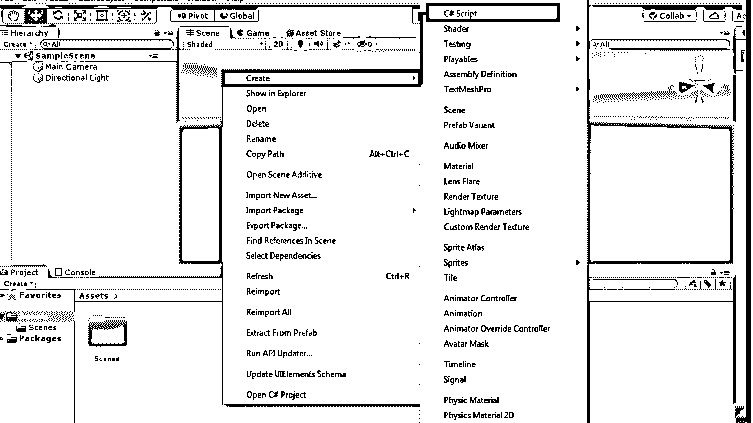
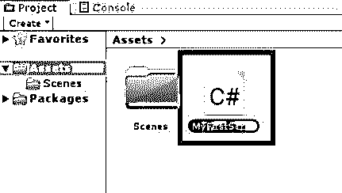
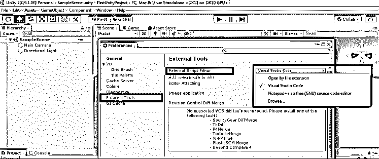
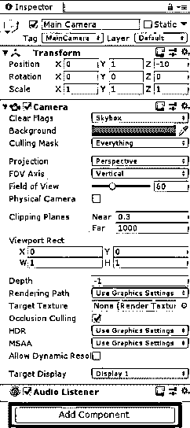
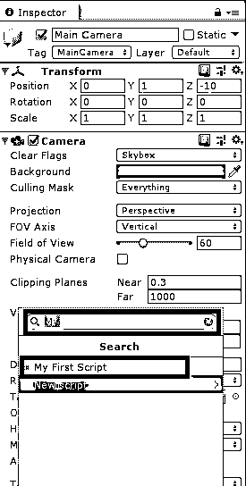
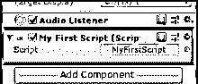

# Unity 脚本

> 原文：<https://www.educba.com/unity-scripting/>

## Unity 脚本简介

为了赋予项目中的资产生命，我们需要脚本。这是您希望使用 Unity 脚本构建的应用程序的最基本部分。脚本用于编写游戏对象在应用程序中应该如何表现的逻辑。可用于创建不同的 AR、VR 系统、图形效果、动画控制、物理控制、自定义 AI 系统等。所以总的来说，脚本是应用程序的核心和灵魂。

### 如何使用 Unity 脚本？

Unity 3D 在其脚本中使用 Mono 行为来继承。它原生支持 C#。它是 unity 中使用最广泛的脚本语言。然而，我们可以用许多其他语言编写脚本。NET 语言，如果他们能编译兼容的 DLL。因此，现在，我们将坚持使用 C#方式编写脚本。

<small>3D 动画、建模、仿真、游戏开发&其他</small>

### 创建 Unity 脚本的步骤

让我们学习创建和使用脚本的步骤。

#### 1.创建脚本

*   导航到项目，右键单击“创建”>“C#脚本”。
*   另一种方法是从主菜单中选择“资源”>“创建”>“C#脚本”。

*   将创建一个新脚本，它将提示我们输入新名称。
*   给脚本起一个合适的名字，然后按回车键。我们的第一个脚本创建成功。

#### 2.选择脚本编辑器

*   Unity 使用 Visual Studio 作为默认的脚本编辑器。
*   要更改脚本编辑器，请转到编辑>首选项>外部工具。
*   浏览脚本编辑器的文件位置。

#### 3.脚本剖析

*   Unity 中的不同特性可以控制被称为组件的游戏对象行为。
*   除了这些组件，如果我们需要任何特定的功能，我们可以通过使用脚本来实现它。
*   当我们双击脚本时，脚本编辑器将会打开。
*   脚本的结构如下所示。

**代码:**

`using System.Collections;
using System.Collections.Generic;
using UnityEngine;
public class MyFirstScript: MonoBehaviour
{
// Start is called before the first frame update
void Start()
{
}
// Update is called once per frame
void Update()
{
}
}`

*   我们在 unity 中编写的所有脚本都将源自名为 Mono behaviour 的内置类。
*   它就像一个新的自定义组件的蓝图，可以改变游戏对象的行为。
*   每当它创建一个新的脚本对象实例时，您就将它作为一个组件附加到游戏对象上。
*   脚本的类名将从我们创建脚本时给出的文件名中选取。
*   要将脚本附加到游戏对象，请确保类名和文件名相同。否则它会给我们一个编译错误，我们将不能把这个脚本附加到游戏对象上。
*   这里我们可以看到有两个默认创建的函数。它们是开始和更新。
*   start 函数用于在我们使用它们之前初始化脚本中的东西。
*   如果脚本在游戏对象的检查器窗口中启用，则在游戏开始时调用开始功能。每次执行脚本时只调用一次。
*   每一帧都会调用更新函数。基本上，如果要在每一帧中处理一些东西，这是需要的。它可以是移动、接受用户输入、触发动作等。
*   我们可以编写自己的自定义函数，类似于启动和更新函数的编写方式。

#### 4.将脚本附加到游戏对象

*   选择需要附加脚本的游戏对象。
*   第一种方式是直接将脚本拖放到游戏对象的检查器窗口。在这里，我们将它连接到主摄像头。
*   第二种方法是单击 Add 组件，开始键入脚本名，然后选择脚本。

   

*   它将被附加到游戏对象上，就像我们在检查器窗口中看到的那样。

#### 5.这些变量、函数和类是什么？

*   **变量:**变量就像容器一样保存对象的值或引用。根据约定，变量名将以小写字母开头。
*   **函数**:函数是使用变量和附加逻辑来改变对象行为的代码片段。他们也可以修改这些变量。函数以大写字母开始。将我们的代码组织在一个函数中以增加可读性是一个很好的实践。
*   **类:**类是变量和函数的集合，用于创建定义对象属性的模板。类名取自我们在创建脚本时给出的文件名。通常，它从大写字母开始。

#### 6.向检查员提供参考

*   在类中被声明为 public 的变量将向 inspector 公开，我们可以给它们分配任何引用或值。
*   考虑下面的代码:

**代码:**

`public class MyFirstScript : MonoBehaviour
{
public GameObject cameraObject;
// Start is called before the first frame update
void Start()
{`

}
}

*   这里，camera 对象是需要引用的公共变量。转到 unity 编辑器。选择对象，如果我们查看脚本组件，我们可以看到一个空白空间(无(游戏对象))，如下图所示，用于指定从层次中选择游戏对象并拖放到相机对象框中。

#### 7.访问组件

*   有些情况下，我们需要访问游戏对象的不同组件。
*   让我们以访问游戏对象的相机组件为例。
*   获取组件；我们将买这种型号的照相机。

**代码:**

`void Start ()
{
Camera cameraObject = GetComponent<Camera>();
Debug.Log("Camera Object is: " + cameraObj);
}`

#### 8.修改组件值

*   修改组件值是上述示例的下一步。
*   下面的代码解释了我们如何修改相机的视野。
*   在编辑器中点击播放按钮后，我们可以看到摄像机的视野在摄像机的检查菜单中从默认值 60°变为 90°。

**代码:**

`public GameObject cameraObject;
private int cameraFOV = 90;
void Start ()
{
Camera cameraObj = GetComponent<Camera>();
cameraObj.fieldOfView = cameraFOV;
}`

### 结论

在本文中，我们已经了解了 Unity 脚本，脚本的需求，一步一步地创建脚本和不同的脚本组件，通过脚本访问组件并修改它们。

### 推荐文章

This has been a guide to Unity Scripting. Here we discuss the introduction and steps to create a Script with examples for better understanding. You can also go through our other suggested articles to learn more –

1.  [外壳脚本命令](https://www.educba.com/shell-scripting-commands/)
2.  [什么是 Shell 脚本？](https://www.educba.com/what-is-shell-scripting/)
3.  什么是跨站点脚本？
4.  [如何安装 Unity？](https://www.educba.com/install-unity/)

