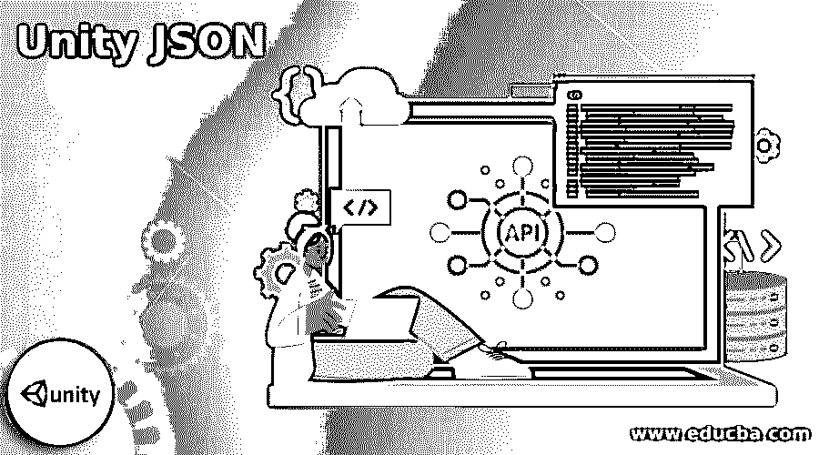

# Unity JSON

> 原文：<https://www.educba.com/unity-json/>




## Unity JSON 简介

Unity JSON 可以理解为将数据转换成人类可读格式的编码语言。在 unity 中，你可以找到 JsonUtility 类和静态方法来处理 JSON。我们可以用它序列化和反序列化成基于 C#中简单数据结构的 JSON 或 JSON。JsonUtility 的工作方式与二进制格式化程序相同，因为它与其他类(如写文件和读文件)结合在一起。您可能会面临同样的警告，如“用户系统上的文件”此错误说明该文件来自用户或系统，可以由任何进程编辑，因此不安全。

### JSON 是什么？

JSON 代表 JavaScript 对象表示法，可以理解为标准的开放文件格式和数据交换格式。它用于创建人类可读的文本，该文本存储和传输与属性值和数组对相关联的对象的数据。

<small>网页开发、编程语言、软件测试&其他</small>

### 如何使用 Parse Unity JSON？

通过在 Unity 中使用 Json.Net·牛顿软件，你可以快速解析 JSON。 如果想不使用第三方插件，可以按照以下步骤进行。

**第一步:** 首先准备好你的 JSON 样本，也就是托管或者本地存储。这里是 sample.json 文件，我们将使用它进行解析。

**代码:**

```
{"Values":[{
"Text":"aii"
},
{
"Text":"bii"
},
{
"Text":"cii"
},
{
"Text":"dii"
},
{
"Text":"eii"
}]
}
```

第二步:下一步是创建依赖于 JSON 的数据模型类以及这些类的序列化。

下面是上述 JSON 的类。

**代码:**

```
[Serializable]
public class ListItem {
public Values[] Values;
}[Serializable]
public class Values
{
public string Text;
}
```

这里，变量的名字应该和我们在 JSON 中使用的一样。例如，“Values”是 JSON 中的键，因此变量的名称也应该与我们在“ListItem”类中使用的名称相同。如果您没有记住这条规则，您将无法解析 JSON。

**第三步:** 现在，让我们看看下一步。使用 route 类开始解析 JSON。在这个例子中，列表项是我们的根类，我们用它来解析 JSONUtility。一旦字符串变量中有了 JSON，就开始解析 JSONUtility。你可以通过下载 JSON 来放置这个字符串变量。

下面是需要的语法:

**语法:**

```
"JsonUtility.FromJson<RootClass>(smapleJSONstringVariable)"
ListItem items = JsonUtility.FromJson<ListItem>(json);
Debug.Log(items.Values,Length);
For(int I = 0;i<items.Values.Length;i++)
{
Debug.Log(items.Values.Lenght;i++)
}
```

### Unity JSON 导出

为了将场景导出为 JSON 文件格式，我们使用 UnityToJSON exporter。目前，它导出了以下可以轻松处理的 JSON 文件:

*   节点
*   光
*   网状物
*   着色器
*   口感
*   光照贴图
*   成分
*   骨骼网格
*   材料
*   动画剪辑
*   物理学
*   摄像机
*   地带

**举例:**

**代码:**

```
"name": "EmptyScene",
"resources": {
"textures": [],
"lightmaps": [],
"shaders": [],
"materials": [],
"meshes": []
},
"hierarchy": [
{
 "name": "Main Camera",
 "components": [
 {
  "localPosition": [
   0.0,
   1.0,
   -10.0
  ],
 "localRotation": [
  0.0,
  0.0,
  0.0,
  1.0
],
"localScale": [
1.0,
1.0,
1.0
],
"name": null,
"parentName": null,
 "type": "Transform"
 },
{
"type": "Camera"
}
],
"children": []
},
{
"name": "Directional Light",
"components": [
{
 "localPosition": [
 0.0,
 3.0,
 0.0
 ],
"localRotation": [
0.408217937,
-0.234569728,
0.109381676,
0.875426054
],
"localScale": [
 1.0,
 1.0,
 1.0
 ],
 "name": null,
 "parentName": null,
 "type": "Transform"
},
{
"color": [
1.0,
0.956862748,
0.8392157,
1.0
],
 "range": 10.0,
 "lightType": "Point",
 "castsShadows": true,
 "realtime": false,
 "type": "Light"
  }
 ],
  "children": []
 }
 ]
}
```

### Unity JSON 文本文件

现在让我们来看看 json 的文本文件。C#类文件可以帮助你访问文件，而不用担心是在本地还是远程。C#为我们提供了两种方法来处理它们，它们将成为 File 类的一部分:ReadAllText()和 WriteAllText()。人们应该注意到这个系统。IO 是名称空间，我们的文件是它的一部分。它是类的集合，是连接输入(“I”)和输出(“O”)的方法。当我们在 unity 中创建新的脚本组件时，我们需要名称空间。

#### 1.Unity 中的 JSON 文件位置

当我们开始运行 unity 项目时，您会发现一个名为 application be . persistent ATA path 的字段，可以用当前的“持久”目录进行设置。您可以将该套件理解为我们仅用于在 Unity 内初始化系统的一部分。这将显示一条消息，比如 Awake()或 Star()方法，它将位于脚本组件中。

#### 2。文本文件(读写)

当我们开始处理文件时，第一步是打开相关文件，然后处理它。完成后，关闭它以便进一步处理。因此，我们使用方法 ReadAllText()和 WriteAllText()。因此，该文件可以被读取或写入，并在内部基础上进行打开或关闭操作。

**代码:**

```
// Add System.IO to work with files!
using System.IO;
using System.Collections;
using System.Collections.Generic;
using UnityEngine;
public class GameDataManager : MonoBehaviour
{
  // Create a field for the save file.
  string saveFile;
  void Awake()
  {
  // Update the path once the persistent path exists.
  saveFile = Application.persistentDataPath + "https://cdn.educba.com/gamedata.json";
  }
  public void readFile()
{
  // Does the file exist?
  if (File.Exists(saveFile))
  {
  // Read the entire file and save its contents.
  string fileContents = File.ReadAllText(saveFile);
  // Work with JSON
 }
}
public void writeFile()
{
  // Work with JSON
  // Write JSON to file.
  File.WriteAllText(saveFile, jsonString);
}
```

### Unity JSON 数据序列化

JSON 序列化用于帮助将 unity 对象转换为 JSON 的 JsonUtility 类，JSON 序列化等 JSON 可以用来与 web 服务进行交互。不仅如此，您还可以打包和解包基于文本的数据。JSON 序列化使用“结构化”JSON 的概念。在这里，可以根据 JSON 数据中存储的变量创建一个类或结构。

**举例:**

**代码:**

```
[Serializable]
public class MyClass
{
  public int level;
  public float timeElapsed;
  public string playerName;
}
```

在这里，您可以理解普通 C#类包含三个变量，如 level、timeElasped 和 playerName，并且它标记有一个 serializable 属性，以便它可以与 JSON 序列化程序一起工作。

**举例:**

**代码:**

```
MyClass myObject = new MyClass();
myObject.level = 1;
myObject.timeElapsed = 47.5f;
myObject.playerName = "Dr Charles Francis";
Then go with JsonUtility.ToJson method to serialize it to the JSON format:
string json = JsonUtility.ToJson(myObject);
// json now contains: '{"level":1,"timeElapsed":47.5,"playerName":"Dr Charles Francis"}'
You can also convert the JSON back into object by using JsonUtility.FromJson:
myObject = JsonUtility.FromJson<MyClass>(json);
```

### 结论

我们看到了 unity JSON 所有可能的方面以及它是如何工作的。在这里，你只需要理解 JSON 的术语，然后通过一个接一个地使用它的代码，就可以很容易地开始使用它。所以用你开发的 unity 游戏的脚本试试吧。

### 推荐文章

这是 Unity JSON 的指南。这里我们讨论一下入门，以及如何使用 parse unity JSON？导出、文本文件和数据序列化。您也可以看看以下文章，了解更多信息–

1.  【JSON 的 XPath】
2.  [Avro 到 JSON](https://www.educba.com/avro-to-json/)
3.  [拉勒维尔 JSON](https://www.educba.com/laravel-json/)
4.  [TypeScript JSON](https://www.educba.com/typescript-json/)


