# Unity webGL

> 原文：<https://www.educba.com/unity-webgl/>

## Unity webGL 简介

Unity WebGL 构建 Unity 游戏内容，并将其发布为 javascript 程序。该 javascript 使用 HTML5 技术和 webgl 渲染 API，在您想要的 web 浏览器中运行 unity 游戏内容。它支持几乎所有的主流桌面浏览器，但是不同浏览器的支持程度和性能可能会有所不同。值得注意的是，目前移动设备不支持 WebGL 的内容，因为它仍然适用于高端设备。但是，这些设备有足够的内存来支持 Unity WebGl 内容。在这篇文章中，我将告诉你如何在 unity 中创建 webgl build 并一步一步地玩它。

### 什么是 Unity webGL？

Unity webgl 可以是一个发布者，将 Unity 内容发布为 JavaScript 程序。这些程序使用带有 HTML5 技术的 webgl 渲染 API，在 web 平台上运行 unity 内容。要运行你的 WebGL 构建，点击构建播放器窗口的构建&运行选项。首先，让我们讨论如何创建一个 unity WebGl 版本。

<small>3D 动画、建模、仿真、游戏开发&其他</small>

### 如何创建一个 unity WebGL 版本？

今天在这篇文章中，我将告诉你如何使用 Unity Asset Store 上的资产场景来创建 unity WebGl。您可以选择自己的产品，或者如果您想从 Unity Asset store 购买，请前往 Unity Asset Store 选择您想要的产品。我将选择这个天空之城建兴，并点击添加到我的资产按钮。

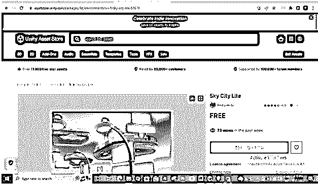

您可以通过“窗口”菜单，然后搜索，然后资产存储来获得相同的表单。

现在打开包管理器，并在其列表中，选择我的资产。因此，请查看您的附加资产。

在这里点击选择你想要的资产。

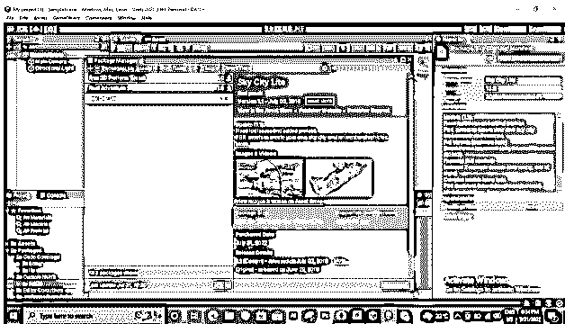

点击下载按钮下载。

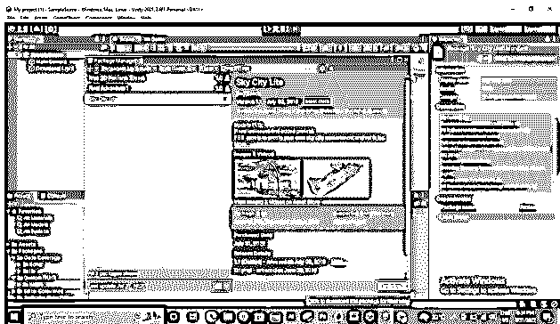

下载完成后，将启用导入按钮来导入该资产。单击下载按钮旁边的导入按钮。

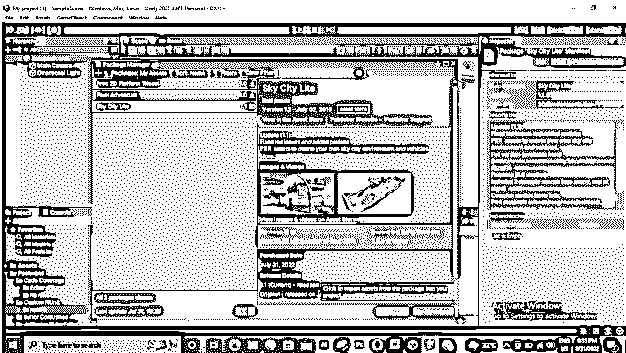

一旦您单击这个导入按钮，资产列表将会像这样打开。

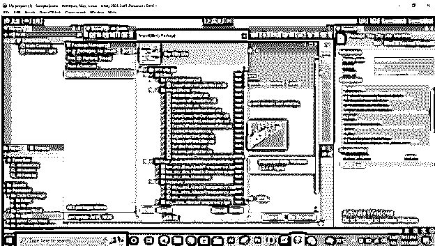

您可以导入所有文件夹，也可以选择一些要导入的文件夹。

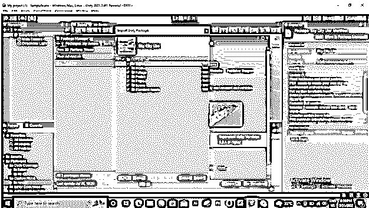

现在转到 Asset 部分，这是工作窗口的左下角，并选择您导入的资产。

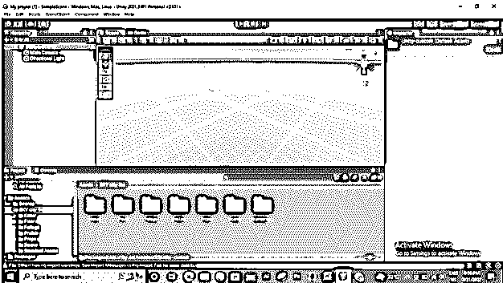

现在打开资产场景。

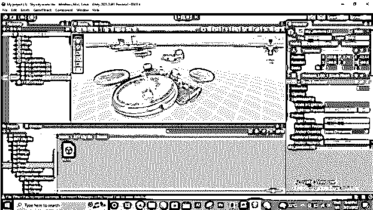

现在让我们切换到 WebGL 模式，为此，请转到菜单栏的文件菜单并单击它。单击后，将会打开一个下拉列表。选择构建设置选项。

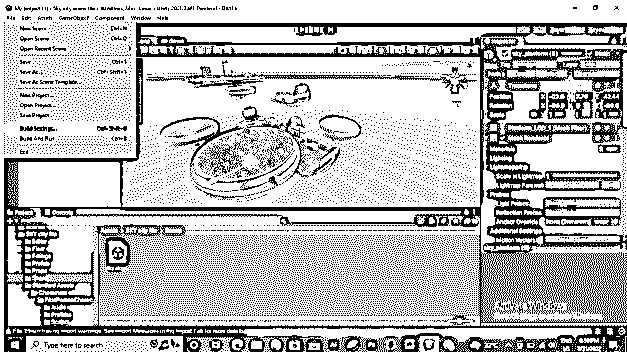

一旦选择了构建设置选项，将会打开一个对话框。在这里，从列表中选择 WebGL 选项，并单击该对话框底部的切换平台按钮。

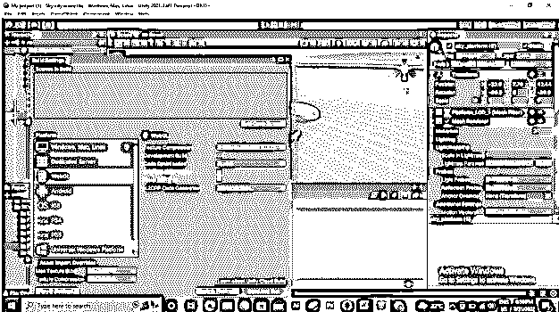

单击此按钮后，您将看到“构建”和“构建并运行”按钮。单击 Build 按钮构建内容的 WebGL 版本，或者如果您也想运行该版本，请单击另一个按钮。

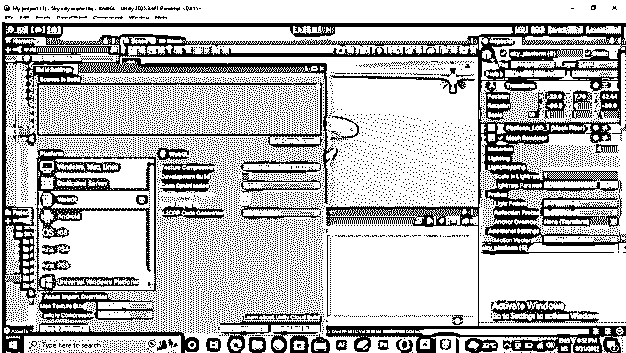

一旦你点击这个选项，你会看到项目设置框。在此填写贵公司的名称和其他必要的详细信息。

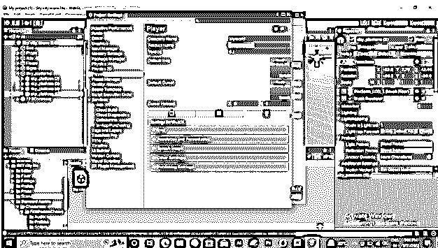

您可以为发布的内容选择图标。

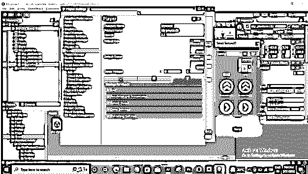

您还可以通过分辨率和演示选项设置发布内容的分辨率。

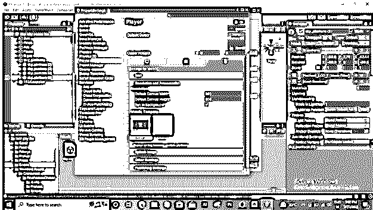

照明有两种选择，一种是伽玛，另一种是线性。根据场景环境，它会发生变化。

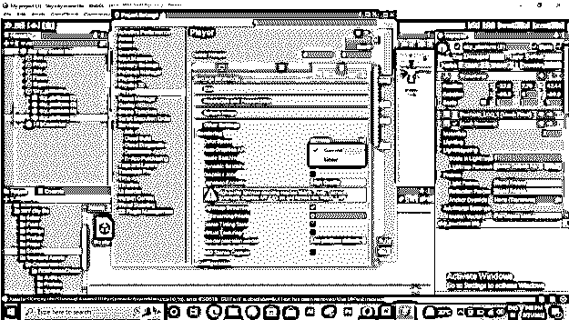

所以如果你选择线性选项，那么就需要一些时间。

你可以看到这里的不同。

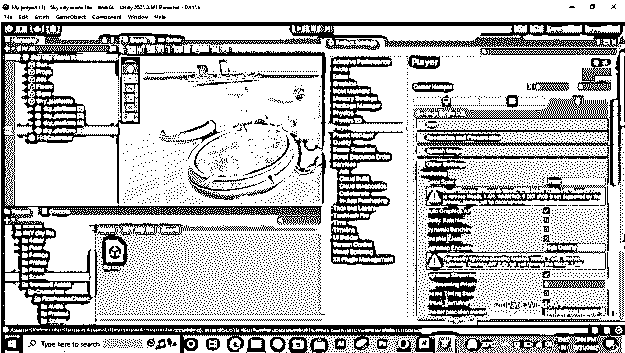

现在禁用自动图形 API 选项来处理 WebGL。

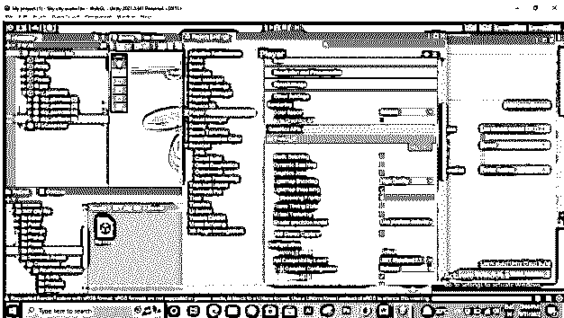

完成所需设置后，单击此对话框的“构建”按钮。

单击此按钮后，将会打开一个对话框，选择保存构建文件的位置。

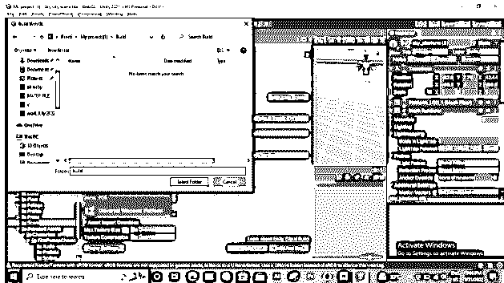

现在你可以玩你发布的版本了。但有时，您可能会面临播放问题，因此要解决这些问题，请遵循以下方法。

### Unity WebGL 播放

要玩你的 WebGL 版本，请访问 itch.io 网站，点击注册按钮创建你的帐户。如果你已经有一个帐户，那么你可以登录。

一旦您打开您的帐户，请转到仪表板区域中您的个人资料名称的下拉按钮。在这里选择上传新项目选项。

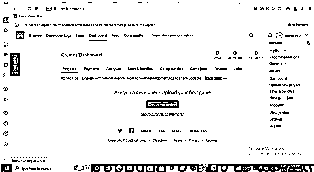

选择此选项后，将会打开一个新页面来填写所需的相关信息。所以填满它。

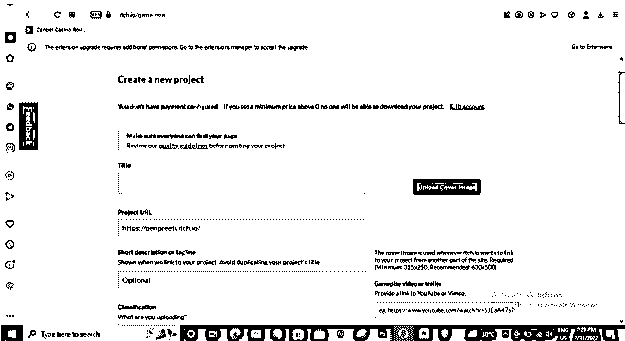

然后点击上传文件来上传您的 WebGl 构建 zip 文件。

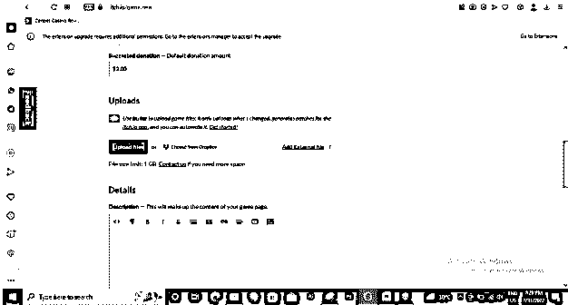

准备好您的文件需要一些时间，一旦准备好，您就可以播放和运行它了。

### Unity WebGL 构建

在经历了如何创建 WebGL 构建模块的步骤之后。你一定有一些关于它的问题，所以你必须记住，在你开始使用 WebGL 之前，你必须检查一些重要的术语，比如是否安装了构建支持模块。为此，请遵循以下步骤:

*   前往 Unity Hub。
*   确定 Unity 版本与您的版本兼容。
*   如果已经安装了 WebGL 构建支持，将会出现一个 WebGL 图标。

接下来，检查包裹详情:

*   在 Unity Editor 中打开您想要发布的项目。
*   进入菜单栏的窗口菜单，选择软件包管理器选项将其打开。
*   在打开的窗口中，进入过滤器菜单的下拉列表，选择项目包选项。
*   现在通过搜索检查 WebGL Publisher 是否已安装。如果不是，请安装或更新它。

在您通过 WebGL build 完成 unity 内容的构建过程之前，这是非常重要的信息。

### 结论

现在你已经有了足够的关于你的 Unity 内容的 WebGL 构建的信息，你可以用它来构建你的游戏内容。如果在呈现 WebGL 内容的过程中出现问题，您也可以使用在线托管平台来完美地播放 WebGL 内容。我建议你为你的内容尝试它，看看它的结果，它会帮助你建立你的项目内容。

### 推荐文章

这是 Unity webGL 的指南。这里我们讨论一下简介，什么是 Unity Webgl，如何创建 unity WebGL build，以及 Unity WebGL build。您也可以看看以下文章，了解更多信息–

1.  [WebGL vs Canvas](https://www.educba.com/webgl-vs-canvas/)
2.  [WebGL vs OpenGL](https://www.educba.com/webgl-vs-opengl/)
3.  [闪存卸载程序](https://www.educba.com/flash-uninstaller/)
4.  [Android 中的 OpenGL](https://www.educba.com/opengl-in-android/)

