# 团结 2D

> 原文：<https://www.educba.com/unity-2d/>

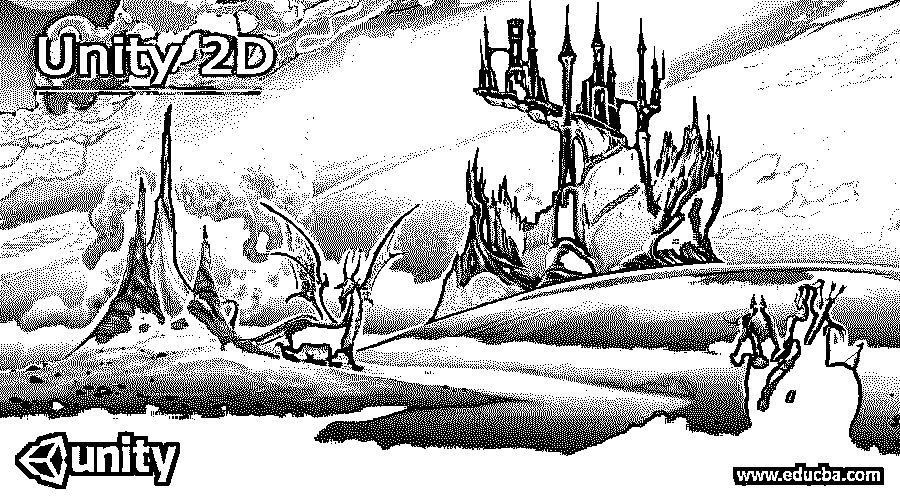

## 统一 2D 概述

Unity 2d 可以理解为 Unity 中的 2d 游戏创作和开发。2d 游戏是二维游戏，这意味着它们在两个方向上有其对象的变量，例如 X 和 Y 平面。此外，可以在两个方向上动画设计的玩家和游戏的其他资产，给他们适当的移动、跳跃和其他身体活动。Unity 有其独立的 2D 界面，旨在使 2d 游戏创作和开发变得容易。你必须在创建新项目时选择一个 2D 界面，或者你可以在游戏创建的任何时候点击 2d 按钮切换到 2d 界面。

### 统一 2D 简介

Unity 2D 游戏是 Unity 软件的一部分，这意味着 Unity game 不仅以 3D 游戏闻名，我们还可以在其中创建 2D 游戏。当我们开始在 Unity 中创建游戏时，它让我们在 2D 或 3D 模式下创建游戏。在 2D 游戏中，精灵是处理图形图像的简单对象，在 Unity 中处理 2D 游戏时，我们必须选择 2D 界面。我们可以在 Unity 中管理几件事情来开发我们的 2D 游戏，例如将图形对象制作成胶状的盒子，将对象制作成刚体来制作动画，等等。

<small>3D 动画、建模、仿真、游戏开发&其他</small>

现在让我们开始讨论如何一步一步地在 Unity 中创建 2D 游戏。首先，当您启动 Unity 时，您将看到这个用户界面，要创建一个新项目，请单击“新建项目”按钮，它位于欢迎窗口的右侧。

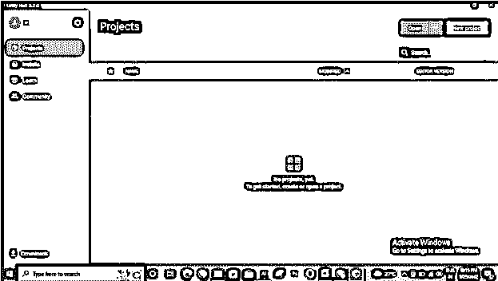

在创建新项目对话框中，通过点击 2D 选项选择接口为 2D。现在点击右下角的创建项目按钮。

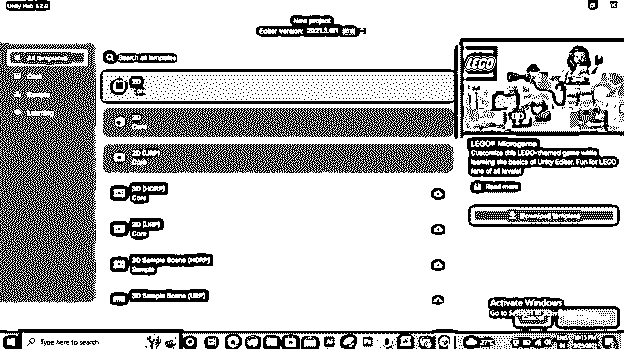

一旦你点击创建按钮，这个 2D 界面将被打开。

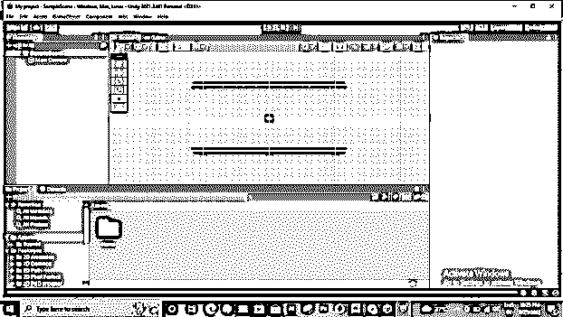

如果你在游戏界面，你将看不到摄像头。

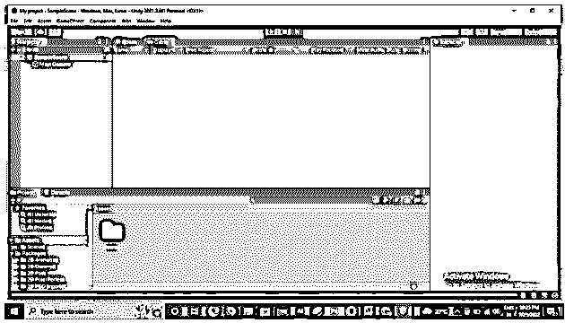

如果 2D 界面被禁用，那么它将变成 3D 模式，这将为你创建 2D 游戏带来问题，所以请确保你处于 2D 模式。

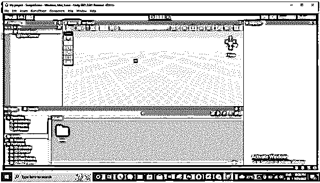

在开始创建 2D 游戏之前，请转到用户界面左下角的 Assets 文件夹。右键单击它并创建一个新文件夹。

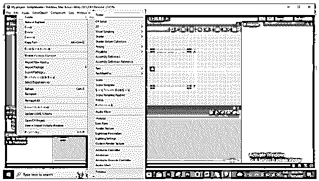

我将命名这个文件夹级别。

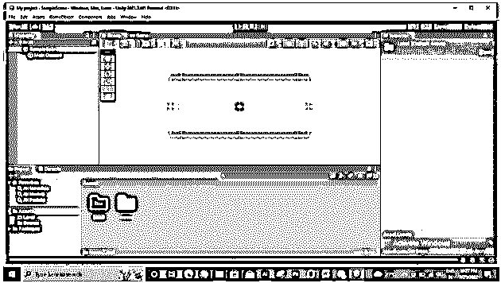

同样，你可以创建更多的文件夹来更好地管理你的 2D 游戏。

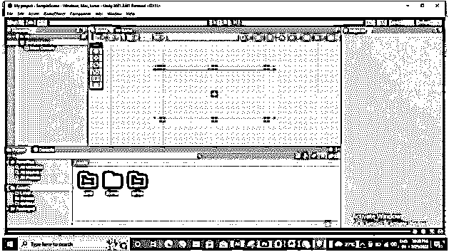

现在转到该软件的层次结构部分的创建按钮并单击它，或者您可以在层次结构部分右键单击。在下拉列表中，转到 2D 对象，然后精灵，然后为您的精灵对象选择所需的形状。这一次，我会选择正方形。

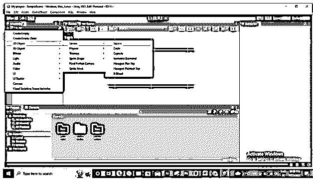

一旦我们选择了它，这个方格的玩家将进入等级区。现在我把它命名为 Player。

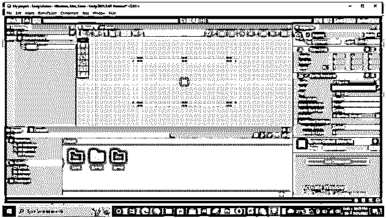

现在点击这个玩家对象的精灵选项的单选按钮。您将在“检查器”部分找到此选项。单击后，将会打开“选择精灵”对话框。点击你想要的形状，从这里选择你想要的形状。

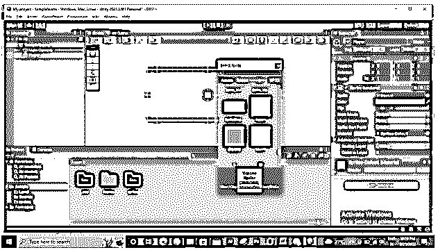

你也可以在这里你的外部图形。因此，为了有一个图形资产，我将从它保存的文件夹中选择这个图像。为此，您可以使用您想要的图像。

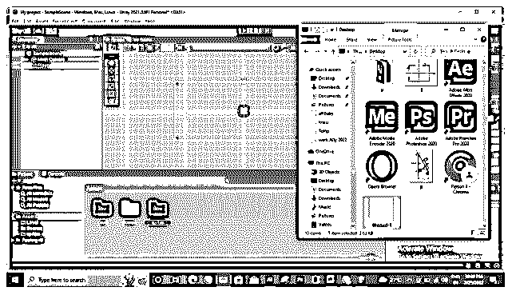

现在，您可以将导入的图像分配给播放器对象。

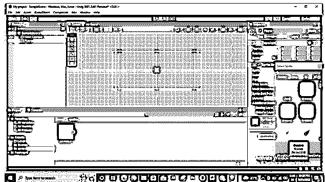

如果您看不到它，请缩放该区域以查看您的对象。

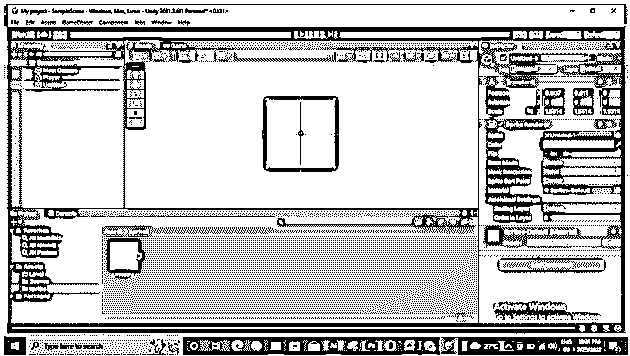

您可以通过选定对象的“变换”部分中的“缩放”选项，根据需要对其进行缩放。比如，如果我改变它的 X 值，它会像这样变化。

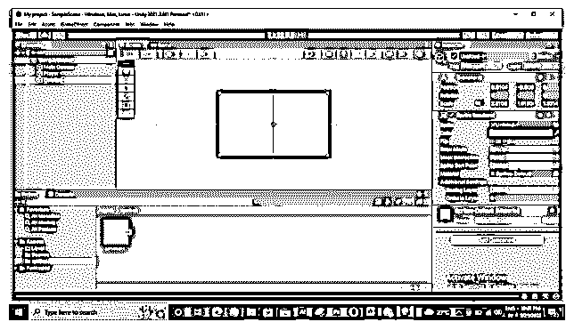

如果你愿意，你可以通过这个软件的游戏标签来检查你选择的物体在你创建的游戏场景中的外观。

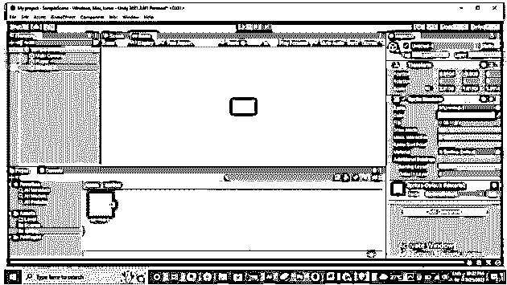

现在我将去层次部分，并选择球员层，然后按 Ctrl + D，使它的副本，并命名为地板。

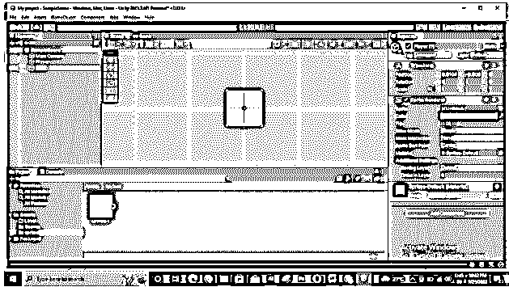

在这里，我将在 X 方向上缩放它，为玩家创建这种类型的地板区域。

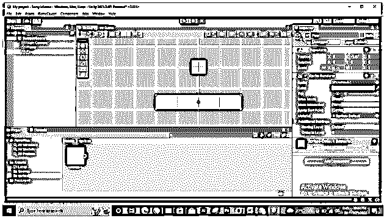

现在添加一个 2D 变量到对象中，选择对象，进入检查器部分，点击添加组件按钮。现在搜索二维碰撞盒。

现在用同样的方法对地板物体做同样的操作。

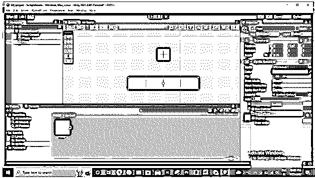

为了给我们的玩家对象添加动画，在选择玩家层后，在同一个添加组件按钮中搜索刚体 2d。

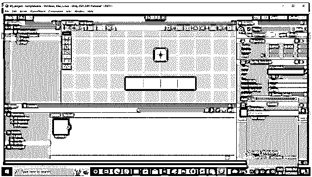

你可以通过播放动画来看看会发生什么。单击播放按钮来观看动画，并确保再次单击播放按钮来停止动画；否则，动画将不会保存。同样的，你可以添加更多的动画功能到播放器中。这是关于如何在 Unity 中创建 2d 游戏的基本信息。

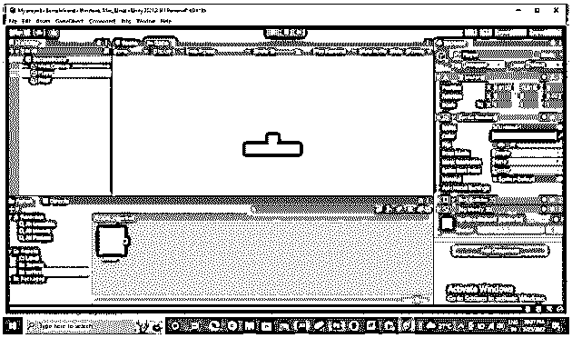

### 统一 2D 平台

现在让我告诉你什么是 Unity 中的 2D 平台。首先，Unity 提供了一个资产商店来简化我们的 2D 游戏开发。通过资产商店，我们可以导入许多预先设计的 2D 游戏资产。

对于资产，商店转到菜单栏的窗口菜单，然后选择搜索选项，然后单击下拉列表中的资产商店选项。

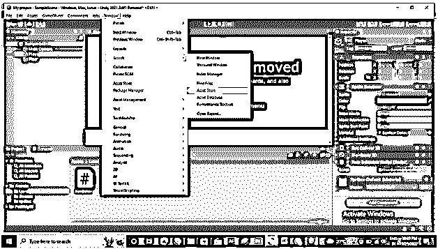

一旦您选择了此选项，资产商店将像这样打开。在搜索框中，您可以搜索您想要的资产，如 2D 平台资产；在这里搜索 20 世纪 60 年代的 2D 平台

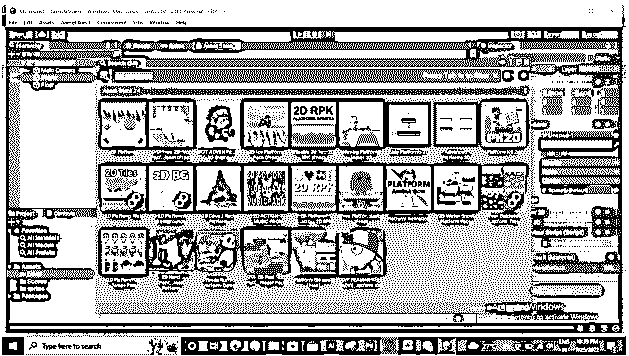

它会根据你的搜索给你结果。在这里你会发现付费和免费的资产。因此，根据您的要求，您可以通过对您的结果应用过滤器来与任何人合作。您可以通过点击模板来选择您想要的 2D 平台资产。点击后，它会将您重定向到 Unity 网站的资产商店页面。

在这里，您可以单击“添加到我的资产”选项来添加您想要的资产。

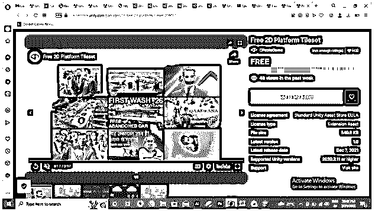

添加后，您可以在 Unity 中打开或转到“我的资产”选项并使用它。

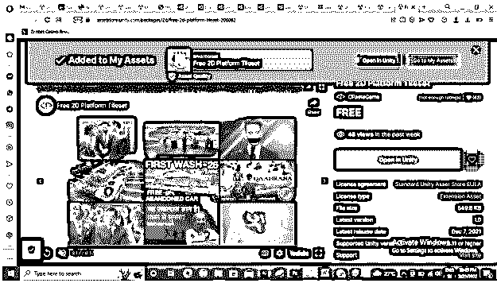

这些是关于 Unity 软件中 2d 游戏创作和开发的一些重要事实。

### 结论

阅读完这篇文章后，你对 2d Unity 游戏有了很好的了解，并对如何在其中创建 2d 游戏有了想法。您可以使用资产商店来预置 2d 游戏平台，使您的 2d 游戏开发变得简单。有一个免费的 2d 平台，所以你可以在去付费之前免费试用。

### 推荐文章

这是统一 2D 的指南。在这里，我们将分别讨论简介、概述、Unity 2D 平台以及如何创建 Unity 平台。您也可以看看以下文章，了解更多信息–

1.  [Keras conv2D](https://www.educba.com/keras-conv2d/)
2.  [SketchUp 2D](https://www.educba.com/sketchup-2d/)
3.  [PyTorch MaxPool2d](https://www.educba.com/pytorch-maxpool2d/)
4.  [Java 中的 2D 数组排序](https://www.educba.com/2d-array-sorting-in-java/)

